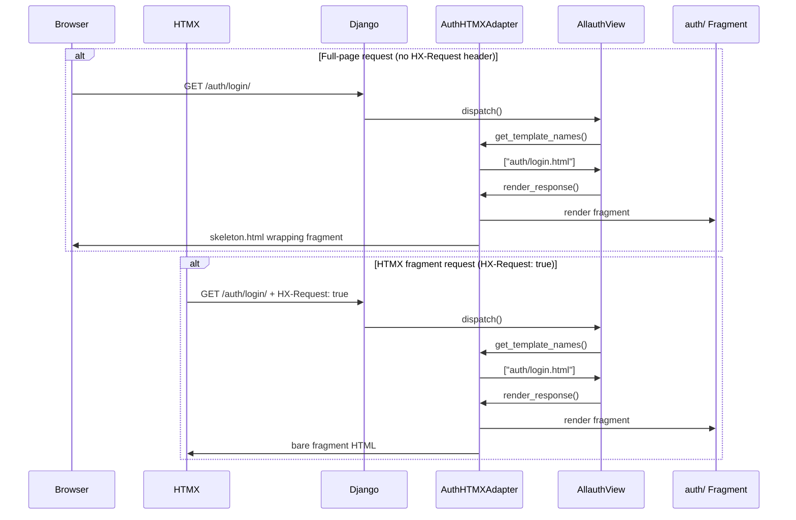
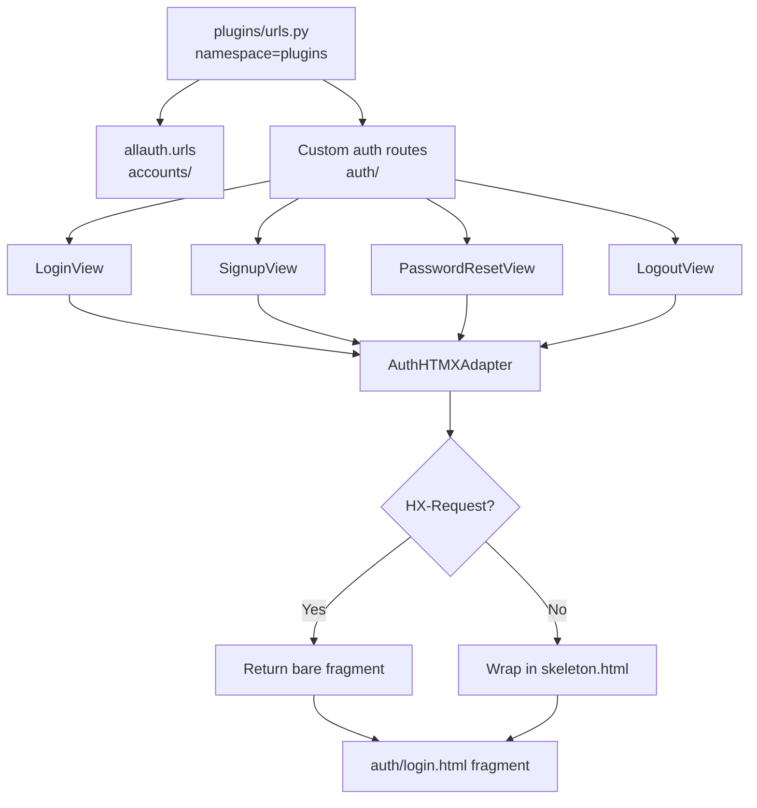

# Design Document: allauth-htmx-auth-pages

## Overview

This design covers the full integration of django-allauth with the existing HTMX + SSE fragment-based auth UI on ctc-research.com. The goal is a single, coherent auth system where:

- All auth pages are pure fragment templates under `templates/auth/` — no `` at the top level.
- A custom allauth adapter wraps fragments in `auth/skeleton.html` for full-page (non-HTMX) requests.
- HTMX requests receive bare fragments for in-place swapping.
- The URL namespace is unified under `plugins` (replacing the legacy `pipelines` namespace).
- Social login (Google + Facebook) is fully wired via allauth's `socialaccount` app.
- Logout is immediate (`ACCOUNT_LOGOUT_ON_GET = True`) with a Django messages notification on the redirect page.
- Every allauth view has a styled, BEM-consistent template — no unstyled fallbacks.

### Key Design Decisions

**Fragment-only templates with adapter-based skeleton injection** — Rather than having each template extend `auth/skeleton.html`, templates are pure fragments. The adapter detects whether the request is HTMX and either returns the fragment directly or wraps it in the skeleton. This keeps templates reusable for both HTMX swaps and full-page loads without duplication.

**Single URL namespace `plugins`** — The legacy `pipelines` namespace was a transitional shim. Merging into `plugins` removes the indirection and aligns with the rest of the plugin architecture.

**Social buttons use standard `<a>`/`<form>` elements, not `hx-post`** — OAuth flows require browser-level redirects. HTMX intercepts form submissions and replaces them with XHR, which cannot follow OAuth redirects. Social buttons must bypass HTMX entirely.

**`ACCOUNT_LOGOUT_ON_GET = True`** — Eliminates the confirmation page. The logout notification is delivered via Django's messages framework, rendered on the redirect landing page.

---

## Architecture

### Request Flow



### Component Relationships



### URL Structure

| URL Path | View | Template |
|---|---|---|
| `/auth/login/` | `LoginView` | `auth/login.html` |
| `/auth/logout/` | `LogoutView` | — (immediate, no template) |
| `/auth/register/` | `SignupView` | `auth/register.html` |
| `/auth/password/forgot/` | `PasswordResetView` | `auth/forgot_page.html` |
| `/accounts/password/reset/key/<uidb36>-<key>/` | `PasswordResetFromKeyView` | `auth/reset_password.html` |
| `/accounts/password/reset/key/done/` | `PasswordResetFromKeyDoneView` | `auth/password_reset_key_done.html` |
| `/accounts/password/reset/done/` | `PasswordResetDoneView` | `auth/password_reset_done.html` |
| `/accounts/confirm-email/<key>/` | `EmailVerificationSentView` | `auth/verification_link.html` |
| `/accounts/password/change/` | `PasswordChangeView` | `auth/password_change.html` |
| `/accounts/password/set/` | `PasswordSetView` | `auth/password_set.html` |
| `/accounts/email/` | `EmailView` | `auth/email_manage.html` |
| `/accounts/signup/closed/` | `SignupClosedView` | `auth/signup_closed.html` |
| `/accounts/social/signup/` | `SocialSignupView` | `auth/social_signup.html` |
| `/accounts/social/connections/` | `SocialConnectionsView` | `auth/social_connections.html` |

---

## Components and Interfaces

### 1. `AuthHTMXAdapter` — `plugins/accounts/adapters.py`

The central piece of the design. Subclasses allauth's `DefaultAccountAdapter` and overrides template resolution and response rendering.

```python
class AuthHTMXAdapter(DefaultAccountAdapter):
    """
    Custom allauth adapter that:
    - Maps allauth view names to auth/ fragment templates
    - Wraps fragments in auth/skeleton.html for non-HTMX requests
    - Returns bare fragments for HTMX requests
    - Handles logout notification via Django messages
    """

    # Template name mapping: allauth internal name → auth/ fragment path
    TEMPLATE_MAP: dict[str, str] = {
        "account/login.html": "auth/login.html",
        "account/signup.html": "auth/register.html",
        "account/password_reset.html": "auth/forgot_page.html",
        "account/password_reset_from_key.html": "auth/reset_password.html",
        "account/password_reset_from_key_done.html": "auth/password_reset_key_done.html",
        "account/password_reset_done.html": "auth/password_reset_done.html",
        "account/email_confirm.html": "auth/verification_link.html",
        "account/password_change.html": "auth/password_change.html",
        "account/password_set.html": "auth/password_set.html",
        "account/email.html": "auth/email_manage.html",
        "account/signup_closed.html": "auth/signup_closed.html",
        "socialaccount/signup.html": "auth/social_signup.html",
        "socialaccount/connections.html": "auth/social_connections.html",
    }

    SKELETON_TEMPLATE = "layout/auth/skeleton.html"

    def get_template_names(self, view_name: str) -> list[str]:
        """Return the auth/ fragment template for the given allauth view name."""
        ...

    def render_response(self, request, template_name, context, status=None):
        """
        Render the fragment. For non-HTMX requests, wrap in skeleton.
        For HTMX requests, return the bare fragment.
        """
        ...

    def get_logout_redirect_url(self, request) -> str:
        """Return the URL to redirect to after logout."""
        ...

    def logout(self, request):
        """Perform logout and add a success message for the redirect page."""
        ...
```

**Settings registration:**
```python
# settings.py
ACCOUNT_ADAPTER = "plugins.accounts.adapters.AuthHTMXAdapter"
SOCIALACCOUNT_ADAPTER = "plugins.accounts.adapters.AuthHTMXSocialAccountAdapter"
```

### 2. Merged URL Configuration — `plugins/urls.py`

The `pipelines_urls.py` file is merged into `plugins/urls.py`. The `pipelines` namespace is replaced by `plugins`.

```python
# plugins/urls.py
app_name = "plugins"

urlpatterns = [
    path("accounts/", include("allauth.urls")),
    path("auth/", include([
        path("login/", LoginView.as_view(), name="login"),
        path("logout/", LogoutView.as_view(), name="logout"),
        path("register/", SignupView.as_view(), name="register"),
        path("password/forgot/", PasswordResetView.as_view(), name="password_forgot"),
        path("privacy-modal/", TemplateView.as_view(...), name="privacy_modal"),
        path("newsletter/subscribe/", NewsletterSubscribeView.as_view(), name="subscribe_newsletter"),
    ])),
]
```

The mount point `/auth/` is preserved so all existing URL paths remain unchanged.

### 3. Fragment Templates — `templates/auth/`

All templates follow this structure:

```html
{# Template: auth/example.html #}
{# Context fields: form, request #}
{# Placeholders: none #}

<section class="fragment--form">
  <section class="auth__card card card--form">
    <header class="auth__form-header">
      <h2 class="auth__form-title"></h2>
      <p class="auth__form-subtitle mb-4"></p>
    </header>
    <form class="auth__form"
          hx-post=""
          hx-target=".auth__form"
          hx-swap="innerHTML"
          hx-indicator="#spinner">
      
      <input type="hidden" name="strategy"
             value="htmxdocument">
      <input type="hidden" name="supports_sse"
             value="{{ request.supports_sse|yesno:'true,false' }}">
      {# form fields #}
    </form>
    <footer class="auth__footer">...</footer>
  </section>
</section>
```

**Templates to create (new):**

| Template | Purpose | Key context |
|---|---|---|
| `auth/password_change.html` | Logged-in password change | `form` |
| `auth/password_set.html` | Social user sets first password | `form` |
| `auth/email_manage.html` | Manage email addresses | `form`, `emailaddresses` |
| `auth/password_reset_done.html` | Reset email sent confirmation | — |
| `auth/password_reset_key_done.html` | Password reset success | — |
| `auth/signup_closed.html` | Registration disabled | — |
| `auth/social_signup.html` | Social signup completion | `form` |
| `auth/social_connections.html` | Manage social connections | `form`, `connected_accounts`, `disconnectable_accounts` |

**Templates to fix (existing):**

| Template | Fix required |
|---|---|
| `auth/reset_password.html` | Extract inline `<style>` block; update URL from `pipelines:login` to `plugins:login`; wrap in `<section class="fragment--form">` |
| `auth/verification_link.html` | Replace `` with ``; add outer `<section class="fragment--form">` wrapper |
| `auth/login.html` | Update `pipelines:*` → `plugins:*`; uncomment social buttons using `<a>` elements |
| `auth/register.html` | Update `pipelines:*` → `plugins:*`; uncomment social buttons using `<a>` elements |
| `auth/forgot_page.html` | Update `pipelines:*` → `plugins:*` |

**Templates to delete:**

- `templates/account/login.html`
- `templates/account/signup.html`
- `templates/account/password_reset.html`
- `templates/account/email_confirm.html`
- `templates/auth/forgot_password.html` (old style, wrong CSS classes)

### 4. Social Login Buttons

Social buttons use standard HTML elements to avoid HTMX interception. The `` tag from `allauth.socialaccount.templatetags.socialaccount` drives conditional rendering.

```html



<div class="auth__divider position-relative my-4">
  <hr>
  <span class="small position-absolute top-50 start-50 translate-middle px-3">
    
  </span>
</div>
<div class="auth__social row">
  
    
    <div class="col-xxl-6 d-grid">
      <a href=""
         class="btn btn--social bg-google mb-2 mb-xxl-0">
        <i class="fab fa-google me-2"></i>
        
      </a>
    </div>
    
    
    <div class="col-xxl-6 d-grid">
      <a href=""
         class="btn btn--social bg-facebook mb-0">
        <i class="fab fa-facebook-f me-2"></i>
        
      </a>
    </div>
    
  
</div>

```

Note: `` is the correct allauth tag (from `allauth.socialaccount.templatetags.socialaccount`). It generates the correct redirect URL including the `next` parameter.

### 5. Logout Notification

With `ACCOUNT_LOGOUT_ON_GET = True`, the adapter's `logout()` method adds a Django message before the redirect:

```python
def logout(self, request):
    from django.contrib import messages
    messages.success(request, _("You have been signed out successfully."))
    super().logout(request)
```

The redirect landing page renders messages using the `auth__message alert-success` pattern. Since the landing page is typically the home page (not an auth fragment), the messages block is rendered in the base template's messages area, not inside the auth skeleton.

### 6. `SOCIAL_LOGIN_SETUP.md`

A documentation file at `docs/ctc-research.com/integrations/SOCIAL_LOGIN_SETUP.md` covering:
- Required `INSTALLED_APPS` entries (`allauth.socialaccount`, `allauth.socialaccount.providers.google`, `allauth.socialaccount.providers.facebook`)
- `SOCIALACCOUNT_PROVIDERS` settings structure with client ID / secret placeholders
- Django admin setup for `SocialApp` objects
- OAuth app creation steps for Google Cloud Console and Facebook Developer Portal
- Callback URL configuration (`/accounts/google/login/callback/`, `/accounts/facebook/login/callback/`)

---

## Data Models

No new database models are introduced. The feature relies on existing allauth models:

- `allauth.account.models.EmailAddress` — email verification state
- `allauth.socialaccount.models.SocialAccount` — linked social accounts
- `allauth.socialaccount.models.SocialApp` — OAuth app credentials (configured via Django admin)
- `allauth.socialaccount.models.SocialToken` — OAuth tokens

### Settings Changes

```python
# Required settings additions/changes

# Adapter registration
ACCOUNT_ADAPTER = "plugins.accounts.adapters.AuthHTMXAdapter"
SOCIALACCOUNT_ADAPTER = "plugins.accounts.adapters.AuthHTMXSocialAccountAdapter"

# Immediate logout (no confirmation page)
ACCOUNT_LOGOUT_ON_GET = True

# Redirect after logout (e.g. home page or login page)
ACCOUNT_LOGOUT_REDIRECT_URL = "/"

# Email verification (allauth standard)
ACCOUNT_EMAIL_VERIFICATION = "mandatory"  # or "optional"

# Social account providers (populated with real credentials)
SOCIALACCOUNT_PROVIDERS = {
    "google": {
        "APP": {
            "client_id": env("GOOGLE_CLIENT_ID", default=""),
            "secret": env("GOOGLE_CLIENT_SECRET", default=""),
        },
        "SCOPE": ["profile", "email"],
        "AUTH_PARAMS": {"access_type": "online"},
    },
    "facebook": {
        "APP": {
            "client_id": env("FACEBOOK_APP_ID", default=""),
            "secret": env("FACEBOOK_APP_SECRET", default=""),
        },
        "METHOD": "oauth2",
        "SCOPE": ["email", "public_profile"],
    },
}
```

---

## Correctness Properties

*A property is a characteristic or behavior that should hold true across all valid executions of a system — essentially, a formal statement about what the system should do. Properties serve as the bridge between human-readable specifications and machine-verifiable correctness guarantees.*

This feature involves template rendering, URL resolution, and HTTP request/response behavior. Property-based testing is applicable for the universal behavioral properties (HTMX detection, fragment structure, form field presence, social button wiring) where input variation across the set of auth templates and URLs reveals correctness issues that example-based tests would miss.

### Property 1: All auth/ templates are pure fragments

*For any* file in `templates/auth/`, the file content SHALL NOT contain `` as a top-level directive. The outermost rendered element SHALL be `<section class="fragment--form">`.

**Validates: Requirements 2.2**

### Property 2: HTMX requests receive bare fragments

*For any* auth URL in the system, when the request carries the `HX-Request: true` header, the response body SHALL contain `<section class="fragment--form">` and SHALL NOT contain the skeleton wrapper markers (e.g. `<main class="auth-container"`).

**Validates: Requirements 2.4, 8.1**

### Property 3: Non-HTMX requests receive the full skeleton

*For any* auth URL in the system, when the request does NOT carry the `HX-Request: true` header, the response body SHALL contain both `<main class="auth-container"` (skeleton marker) and `<section class="fragment--form">` (fragment content).

**Validates: Requirements 2.5, 8.2**

### Property 4: All auth forms contain the required hidden inputs

*For any* auth form template in `templates/auth/` that contains a `<form>` element, the template SHALL contain a hidden input named `strategy` and a hidden input named `supports_sse`.

**Validates: Requirements 8.3**

### Property 5: Strategy field round-trip

*For any* strategy value (`"htmx"` or `"document"`), submitting an auth form with that value in the `strategy` field and reading the `strategy` field from the submitted POST data SHALL return the same value unchanged.

**Validates: Requirements 8.4**

### Property 6: Invalid HTMX form submissions return fragments, not redirects

*For any* auth form URL, when an invalid form is submitted with the `HX-Request: true` header, the response SHALL have a 2xx status code (not a 3xx redirect) and the response body SHALL contain `<section class="fragment--form">` with validation error markup.

**Validates: Requirements 8.5**

### Property 7: Social buttons use standard elements, not hx-post

*For any* social login button element in any auth template, the element SHALL be an `<a>` tag with an `href` attribute or a `<form>` tag with an `action` attribute pointing to a `socialaccount_login` URL. The element SHALL NOT have an `hx-post` attribute.

**Validates: Requirements 6.2**

### Property 8: Configured providers render their buttons

*For any* provider ID present in `SOCIALACCOUNT_PROVIDERS`, the rendered `auth/login.html` template SHALL contain a button or link element whose URL resolves to that provider's login URL.

**Validates: Requirements 6.8**

### Property 9: No pipelines: URL references remain in templates

*For any* file in `templates/auth/`, the file content SHALL NOT contain the string `pipelines:` in any `` tag, `hx-get`, `hx-post`, `hx-push-url`, `href`, or `action` attribute.

**Validates: Requirements 1.6, 1.7**

---

## Error Handling

### Template Not Found

If a template is missing, the adapter falls back to allauth's default template resolution rather than raising a `TemplateDoesNotExist` error. During development, a missing template will surface as a Django debug page. In production (`DEBUG=False`), it will return a 500 error. The requirement to have all templates in place (Requirement 4) prevents this in practice.

### OAuth Errors

When a social login fails or is cancelled, allauth redirects back to the login page with an error message in the query string or session. The `auth/login.html` template renders Django messages using the `auth__message alert-danger` pattern. No custom error handling is needed beyond ensuring the messages block is present in the template.

### Invalid/Expired Password Reset Keys

allauth's `PasswordResetFromKeyView` passes an `invalid_key_form` context variable when the key is invalid or expired. The `auth/reset_password.html` template checks for this and displays a styled error with a link back to the forgot-password page.

### Logout Race Conditions

`ACCOUNT_LOGOUT_ON_GET = True` means any GET to the logout URL signs the user out. The Django messages framework persists the success message across the redirect, so the notification is displayed even if the redirect page is a different view.

### HTMX Form Errors

When an auth form is submitted via HTMX and validation fails, the adapter returns the fragment with `hx-target=".auth__form"` and `hx-swap="innerHTML"`, replacing only the form content. The `<section class="fragment--form">` wrapper is preserved in the DOM. Error messages are rendered inline within the form using the `alert alert-danger` pattern.

---

## Testing Strategy

### Unit Tests

Unit tests cover specific examples, edge cases, and error conditions:

- **Adapter template mapping**: For each entry in `AuthHTMXAdapter.TEMPLATE_MAP`, assert `get_template_names(view_name)` returns the correct `auth/` path.
- **Adapter HTMX detection**: Assert `render_response()` returns a bare fragment when `HX-Request: true` is present, and a skeleton-wrapped response when it is absent.
- **URL resolution**: For each URL name in the `plugins` namespace, assert `reverse()` returns the expected path.
- **Logout message**: Assert that after logout, the Django messages queue contains a success message with the correct text.
- **Social button rendering**: Assert that with Google configured, the login template renders a Google button; with no providers configured, no social section is rendered.
- **Verification URL fix**: Assert `auth/verification_link.html` contains no reference to `send-verification`.
- **No account/ templates**: Assert none of the four deleted `account/` template files exist.
- **No pipelines: references**: Assert no `auth/` template file contains `pipelines:`.

### Property-Based Tests

Property-based tests use [Hypothesis](https://hypothesis.readthedocs.io/) (Python) to verify universal properties across generated inputs.

Each property test runs a minimum of 100 iterations. Tests are tagged with the feature and property number for traceability.

**Configuration:**
```python
# conftest.py or test settings
from hypothesis import settings
settings.register_profile("ci", max_examples=100)
settings.load_profile("ci")
```

**Property test structure:**
```python
# Tag format: Feature: allauth-htmx-auth-pages, Property N: <property_text>
@given(...)
@settings(max_examples=100)
def test_property_N_description(self, ...):
    # Feature: allauth-htmx-auth-pages, Property N: <property_text>
    ...
```

**Property 1 — Fragment purity**: Parameterize over all files in `templates/auth/`. For each, read the file content and assert it does not start with `` and that the first non-whitespace/non-tag content is `<section class="fragment--form">`.

**Property 2 — HTMX returns fragment**: Use `hypothesis` to generate auth URL paths from the known set. For each, make a test client request with `HTTP_HX_REQUEST="true"` and assert the response contains `fragment--form` but not `auth-container`.

**Property 3 — Non-HTMX returns skeleton**: Same URL generation, without the HTMX header. Assert response contains both `auth-container` and `fragment--form`.

**Property 4 — Hidden inputs present**: Parameterize over all `auth/` template files containing `<form`. For each, assert the template source contains `name="strategy"` and `name="supports_sse"`.

**Property 5 — Strategy round-trip**: Generate strategy values from `st.sampled_from(["htmx", "document"])`. Submit a login form POST with that strategy value and assert the form's `strategy` field in the response context equals the submitted value.

**Property 6 — Invalid HTMX returns fragment**: Generate invalid form data (empty email, short password) for each auth form URL. Submit via HTMX and assert 2xx response with `fragment--form` in body.

**Property 7 — Social buttons use standard elements**: Parameterize over `auth/login.html` and `auth/register.html`. Parse the HTML and find all elements with `class` containing `btn--social`. Assert none have `hx-post` attribute.

**Property 8 — Configured providers render buttons**: Generate provider subsets from `{"google", "facebook"}`. For each non-empty subset, configure `SOCIALACCOUNT_PROVIDERS` with those providers and render `auth/login.html`. Assert each provider's button is present.

**Property 9 — No pipelines: references**: Parameterize over all files in `templates/auth/`. For each, read the file content and assert it does not contain the string `pipelines:`.

### Integration Tests

Integration tests verify end-to-end flows with the full Django test client:

- **Login flow**: POST valid credentials → assert redirect to dashboard.
- **Signup flow**: POST valid registration data → assert user created, verification email queued.
- **Password reset flow**: POST email → assert reset email queued → GET reset key URL → POST new password → assert redirect.
- **Social login redirect**: GET `/accounts/google/login/` → assert redirect to Google OAuth URL (mocked).
- **Logout flow**: GET `/auth/logout/` as authenticated user → assert session cleared, redirect to home, success message present.
- **Email verification flow**: GET confirmation URL with valid key → assert email marked verified.

### CSS Class Audit

A dedicated test scans all `auth/` template files and asserts that all CSS class values match the allowed namespaces: `auth__*`, `form__*`, `btn--*`, Bootstrap utilities (`d-*`, `mb-*`, `mt-*`, `p-*`, `text-*`, `bg-*`, `alert-*`, `input-group*`, `form-control`, `form-check*`, `rounded*`, `border*`, `flex*`, `gap-*`, `w-*`, `h-*`, `position-*`, `top-*`, `start-*`, `translate-*`, `small`, `fw-*`, `fs-*`, `opacity-*`), Font Awesome (`fas`, `fab`, `fa-*`), Bootstrap component classes (`spinner-border*`, `htmx-indicator`, `progress*`, `badge`, `card*`, `alert*`, `list-unstyled`), and `fragment--form`.
