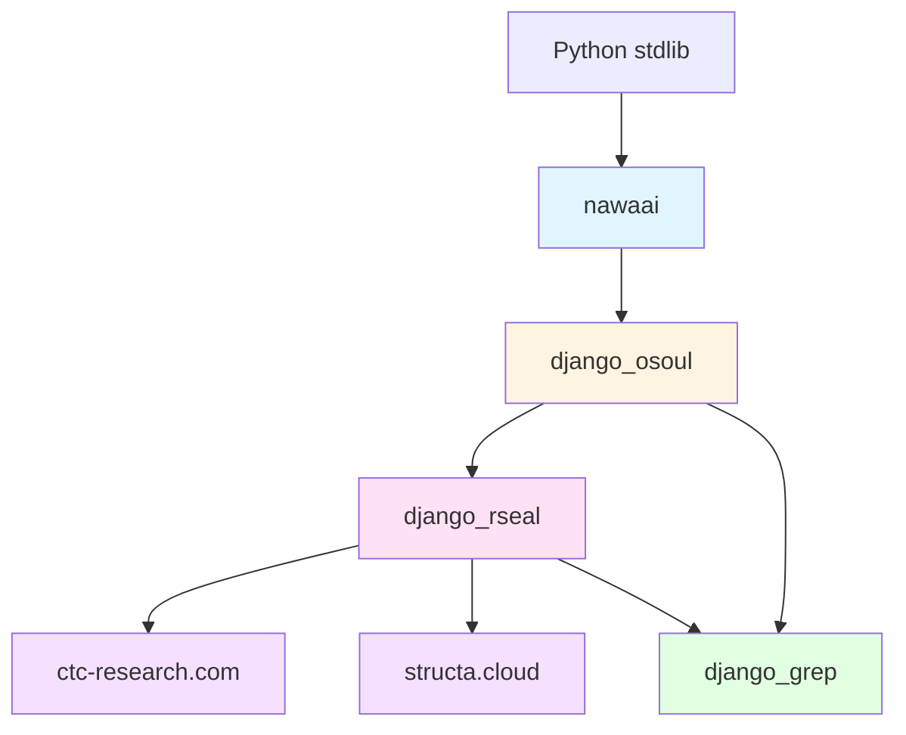

# Design Document: Ecosystem-Wide Architectural Refactoring

## Overview

This design establishes a comprehensive ecosystem-wide architectural refactoring to achieve a clean, modular, domain-driven architecture with strict package boundaries, zero duplication, and maximum reusability across the entire codebase.

**Scope**: All Django projects (ctc-research.com, structa.cloud) and shared packages (django_osoul, django_rseal, django_grep, nawaai)

**Goals**:
- Single source of truth for all business logic
- Domain-driven module organization with clear boundaries
- Strict package dependency enforcement via import-linter
- Unified testing infrastructure via django_grep
- Comprehensive documentation and spec completion
- Zero code duplication across the ecosystem
- Thin project layers that delegate to shared packages

**Non-Goals**:
- Changing public HTTP APIs of websites
- Altering database schemas beyond app renames
- Introducing new product features
- Modifying template rendering behavior

**Foundation**: Builds upon completed specs (finalize-refactor, phase-3-production-deployment, ctc-research-deployment-verification, django-refactoring) and in-progress core-logic-consolidation spec.


## Architecture

### Package Dependency Graph

```
stdlib
  └── nawaai (AI/MCP toolkit — pure Python, zero Django imports)
        └── django_osoul (foundation — models, mixins, utils, comp, contrib)
              └── django_rseal (automation — pipelines, services, workflows, email, signals, admin, cache, commands)
                    ├── ctc-research.com (website — thin layer)
                    └── structa.cloud (website — thin layer)

django_grep (testing framework — depends on osoul + rseal, test-only, never in production)
```

**Boundary Rules** (enforced by import-linter in CI):
1. `nawaai` MUST NOT import any Django modules
2. `django_osoul` MUST NOT import wagtail, celery, or django_rseal
3. `django_rseal` MUST NOT import project-specific code
4. `django_grep` MUST NOT be imported by production code (test-only)
5. Projects MAY import from any package but MUST NOT be imported by packages

**Wagtail Component Placement**:
- **django_osoul**: Pure Django/Python only - NO Wagtail imports
  - Models: Pure Django models only (no Page, StreamField, etc.)
  - Forms: Pure Django forms only (no Wagtail form widgets)
  - Mixins: Pure Django mixins (UserMixin, GroupMixin, etc.) - no Wagtail page mixins
  - Managers: User/Group managers, generic managers - no Wagtail managers
  - Services: User/Group services - no Wagtail dependencies
  - Backends: Custom authentication backends, storage backends
  - Adapters: Auth adapters (django-allauth, social auth)
  - comp/: Pure Django widgets, payloads, non-Wagtail UI components

- **django_rseal**: All Wagtail-related components + admin customizations
  - Wagtail models (Page subclasses, Snippets)
  - Wagtail blocks (StructBlock, StreamBlock, etc.) in comp/
  - Wagtail hooks (wagtail_hooks.py)
  - Wagtail admin customizations
  - Unfold admin customizations (in contrib/admin_site/)
  - Wagtail form widgets and panels

### Domain Organization

All business logic is organized by domain with consistent structure:

```
<package>/
  accounts/          # User management, authentication, roles, permissions
  content/           # CMS content, pages, blog posts
  lms/               # Learning management (ctc-research.com)
  alliance/          # Learning management (structa.cloud)
  messaging/         # Internal messaging, notifications
  cart/              # Shopping cart, checkout, orders
  forms/             # Form submissions and processing
```

Each domain follows standard sub-module layout:
```
<domain>/
  ├── __init__.py
  ├── admin/         # Django admin configuration
  ├── filters/       # Form validators and filters
  ├── forms/         # Django forms
  ├── managers/      # Custom model managers
  ├── middleware/    # Request/response middleware
  ├── migrations/    # Database migrations
  ├── models/        # Django models
  ├── services/      # Business logic services
  ├── views/         # HTTP views
  └── wagtail_hooks.py  # Wagtail hooks (if applicable)
```

### High-Level Component Map

```
django_osoul/
  models/           # Foundation models (Person, Certificate, Message) - NO Wagtail models
  managers/         # RoleHierarchyManager, GroupAccessControl, UserManager, GroupManager - NO Wagtail
  mixins/           # Model mixins, view mixins, UserMixin, GroupMixin - NO Wagtail mixins
  utils/            # Utility functions - pure Django/Python only
  comp/             # UI components (pure Django widgets, payloads) - NO Wagtail blocks
  contrib/          # Enums, choices, context, schemas, responses
  middlewares/      # ErrorTrackerMiddleware
  filters/          # UniqueFieldValidator, SlugFieldValidator
  forms/            # Base form classes - pure Django forms only
  backends/         # Custom authentication backends, storage backends
  adapters/         # Auth adapters (allauth, social auth)
  services/         # User services, Group services - NO Wagtail dependencies

django_rseal/
  pipelines/
    models/         # Pipeline-specific models (can use Wagtail)
    services/       # CartServiceBase, PersonServiceBase, MessageServiceBase, FormSubmissionService
    views/          # Pipeline views
    forms/          # Pipeline forms
    signals/        # Django signals
    snippets/       # Wagtail snippets
  comp/             # Wagtail-specific UI components (Wagtail blocks, StreamField blocks)
  email/            # RoleBasedEmailTemplateSelector, EmailTemplateRegistry
  workflows/        # Orchestrator CLI
  contrib/
    debug_tools/    # Debug utilities
    admin_site/     # Unfold admin customizations, Wagtail admin customizations
    cache/          # Cache utilities
    email_config/   # Email configuration
    privacy/        # Privacy consent middleware
    signals/        # Django signals
    snippets/       # Wagtail snippets

django_grep/
  seeder/           # Database seeding
  tests/
    base/           # BaseTestCase, Hypothesis helpers (st_email, st_slug, st_uuid)
    assertions/     # Custom assertions
    factories/      # Factory classes
    fixtures/        # Test fixtures
    mixins/         # Test mixins
    selenium_base/  # Selenium test infrastructure
    pytest_plugin/  # pytest plugin registration
  health/           # Health check system
    views/          # Health check views (health, assets, media, database)
    urls/           # Health check URL patterns
  management/
    commands/       # backup_db, backup_media, load_fixtures

nawaai/
  crafts_ai/
    ai/             # AI utilities
    chat/           # Chat functionality
    mcp/            # MCP integration
    orchestrator/   # Orchestration logic
    seeder/         # AI seeding

Projects (ctc-research.com, structa.cloud):
  apps/
    accounts/       # Thin subclasses of osoul/rseal services
    content/        # Project-specific content models
    lms/alliance/   # Project-specific LMS models
    blog/           # Blog functionality
  templates/        # Django/Wagtail templates (MUST stay in projects)
  static/           # Static files
  configs/           # Settings, URLs
```


## Components and Interfaces

### 1. Codebase Analysis System

**Purpose**: Detect and catalog all code duplication across the ecosystem

#### 1.1 Duplication Detection Algorithm

**Module**: `scripts/analyze_duplication.py`

```python
class DuplicationAnalyzer:
    """
    Scans all Python modules for code similarity and duplication.
    Uses AST-based comparison for semantic similarity.
    """

    def __init__(self, threshold: float = 0.70):
        self.threshold = threshold  # 70% similarity threshold
        self.results: list[DuplicationResult] = []

    def scan_directories(self, paths: list[str]) -> list[DuplicationResult]:
        """Scan multiple directories for duplicated code."""
        ...

    def compare_modules(self, module_a: str, module_b: str) -> float:
        """
        Compare two modules and return similarity score (0.0 to 1.0).
        Uses AST normalization to ignore formatting differences.
        """
        ...

    def categorize_duplication(self, result: DuplicationResult) -> str:
        """
        Categorize duplication as:
        - extract-to-osoul: Foundation logic
        - extract-to-rseal: Automation logic
        - extract-to-grep: Testing infrastructure
        - already-extracted: Already in correct package
        - project-specific: Should remain in project
        """
        ...

    def detect_boundary_violations(self) -> list[BoundaryViolation]:
        """Detect imports that violate package boundary rules."""
        ...

    def generate_report(self) -> DuplicationReport:
        """Generate comprehensive duplication report."""
        ...

@dataclass
class DuplicationResult:
    file_a: str
    file_b: str
    similarity: float
    duplicated_lines: list[tuple[int, int]]
    category: str
    target_package: str

@dataclass
class BoundaryViolation:
    source_file: str
    import_statement: str
    violation_type: str
    rule_violated: str
```

**Algorithm**:
1. Parse all Python files into AST
2. Normalize AST (remove comments, docstrings, whitespace)
3. Compare AST nodes using tree edit distance
4. Calculate similarity score: `1 - (edit_distance / max_tree_size)`
5. Flag pairs with similarity ≥ 70%
6. Categorize based on import patterns and location

#### 1.2 Boundary Violation Detection

**Module**: `scripts/check_boundaries.py`

```python
class BoundaryChecker:
    """
    Enforces package boundary rules via static analysis.
    Integrates with import-linter for CI enforcement.
    """

    RULES = {
        "nawaai-no-django": {
            "source": "nawaai",
            "forbidden": ["django", "wagtail", "celery"],
            "message": "nawaai must be pure Python with zero Django imports"
        },
        "osoul-no-wagtail": {
            "source": "django_osoul",
            "forbidden": ["wagtail", "celery", "django_rseal"],
            "message": "django_osoul must not import wagtail, celery, or django_rseal"
        },
        "rseal-no-projects": {
            "source": "django_rseal",
            "forbidden": ["apps.", "ctc-research", "structa"],
            "message": "django_rseal must not import project-specific code"
        },
        "grep-test-only": {
            "source": ["django_osoul", "django_rseal", "apps"],
            "forbidden": ["django_grep"],
            "message": "django_grep is test-only and must not be imported by production code"
        }
    }

    def check_all_rules(self) -> list[BoundaryViolation]:
        """Check all boundary rules across the codebase."""
        ...

    def check_file(self, filepath: str) -> list[BoundaryViolation]:
        """Check a single file for boundary violations."""
        ...

    def generate_importlinter_config(self) -> str:
        """Generate .importlinter config from RULES."""
        ...
```

#### 1.3 Duplication Report Format

**Output**: `DUPLICATION_REPORT.md`

```markdown
# Duplication Report

Generated: 2024-01-15 10:30:00

## Summary

- Total files scanned: 1,247
- Duplicated pairs found: 89
- Total duplicated lines: 12,456
- Categories:
  - extract-to-osoul: 34 pairs
  - extract-to-rseal: 28 pairs
  - extract-to-grep: 12 pairs
  - already-extracted: 8 pairs
  - project-specific: 7 pairs

## Duplication Details

### 1. RoleHierarchyManager (extract-to-osoul)

**Similarity**: 94.2%

**Locations**:
- `ctc-research.com/apps/handlers/managers/role_hierarchy.py` (lines 15-89)
- `structa.cloud/apps/handlers/managers/role_hierarchy.py` (lines 15-89)

**Target**: `django_osoul/managers/role_hierarchy.py`

**Duplicated Code**:
```python
class RoleHierarchyManager:
    ROLE_HIERARCHY = {...}
    ROLE_PERMISSIONS = {...}

    def get_all_permissions_for_role(self, role: str) -> set[str]:
        ...
```

**Cross-References**:
- Related to core-logic-consolidation spec (Requirement 2.1)
- Already addressed in finalize-refactor spec (Task 10.5)

---

### 2. CartServiceBase (extract-to-rseal)

**Similarity**: 87.3%

**Locations**:
- `ctc-research.com/apps/LMS/services/cart.py` (lines 20-156)
- `structa.cloud/apps/LMS/services/cart.py` (lines 20-156)

**Target**: `django_rseal/pipelines/services/cart.py`

**Duplicated Code**:
```python
class CartService:
    @classmethod
    def add_to_cart(cls, user, item, quantity: int, ...):
        ...
```

**Cross-References**:
- Related to core-logic-consolidation spec (Requirement 4.3)

---

[... continues for all 89 pairs ...]
```

### 2. Domain Restructuring System

**Purpose**: Reorganize code by domain with clear responsibilities

#### 2.1 Domain Identification Algorithm

**Module**: `scripts/identify_domains.py`

```python
class DomainIdentifier:
    """
    Analyzes code to identify domain boundaries and responsibilities.
    """

    DOMAIN_KEYWORDS = {
        "accounts": ["user", "auth", "login", "signup", "role", "permission", "group"],
        "content": ["page", "post", "article", "cms", "wagtail", "blog"],
        "lms": ["course", "lesson", "enrollment", "progress", "certificate"],
        "alliance": ["course", "lesson", "enrollment", "progress", "certificate"],
        "messaging": ["message", "notification", "email", "chat"],
        "cart": ["cart", "checkout", "order", "payment", "purchase"],
        "forms": ["form", "submission", "field", "validation"]
    }

    def identify_domain(self, module_path: str) -> str:
        """Identify which domain a module belongs to."""
        ...

    def detect_cross_domain_leakage(self) -> list[CrossDomainLeak]:
        """Detect modules that mix multiple domains."""
        ...

    def suggest_split(self, module_path: str) -> list[SplitSuggestion]:
        """Suggest how to split a multi-domain module."""
        ...

@dataclass
class CrossDomainLeak:
    module_path: str
    primary_domain: str
    leaked_domains: list[str]
    leaked_symbols: list[str]

@dataclass
class SplitSuggestion:
    original_module: str
    target_domain: str
    symbols_to_move: list[str]
    new_module_path: str
```

#### 2.2 Circular Dependency Detection

**Module**: `scripts/detect_cycles.py`

```python
class CircularDependencyDetector:
    """
    Detects circular dependencies between modules.
    """

    def build_dependency_graph(self) -> nx.DiGraph:
        """Build directed graph of module dependencies."""
        ...

    def find_cycles(self) -> list[list[str]]:
        """Find all circular dependency cycles."""
        ...

    def suggest_cycle_break(self, cycle: list[str]) -> CycleBreakSuggestion:
        """Suggest how to break a circular dependency."""
        ...

@dataclass
class CycleBreakSuggestion:
    cycle: list[str]
    break_point: tuple[str, str]  # (from_module, to_module)
    strategy: str  # "extract-interface", "dependency-injection", "event-based"
    rationale: str
```

### 3. Package Consolidation System

**Purpose**: Move all shared logic to correct packages with strict boundaries

#### 3.1 Extraction Strategy

**Module**: `scripts/extract_to_package.py`

```python
class PackageExtractor:
    """
    Extracts code from projects to shared packages.
    """

    def extract_module(
        self,
        source_path: str,
        target_package: str,
        target_module: str
    ) -> ExtractionResult:
        """
        Extract a module to a shared package.

        Steps:
        1. Copy module to target package
        2. Update imports in target package
        3. Update all imports across ecosystem to new location
        4. Delete original file after verification
        5. Verify tests still pass
        """
        ...

    def update_imports(self, old_path: str, new_path: str) -> list[str]:
        """
        Update all imports across the ecosystem.
        Returns list of files modified.
        """
        ...

    def verify_extraction(self, extraction: ExtractionResult) -> bool:
        """
        Verify extraction was successful:
        1. Target module exists and is importable
        2. All tests pass
        3. No import errors
        4. Boundary rules still satisfied
        5. Original file deleted
        """
        ...

@dataclass
class ExtractionResult:
    source_path: str
    target_path: str
    files_modified: list[str]
    tests_passed: bool
    boundary_violations: list[BoundaryViolation]
    original_deleted: bool
```

### 4. Project Simplification System

**Purpose**: Convert projects to thin layers that delegate to packages

#### 4.1 Thin Layer Pattern

**Pattern**: Projects contain only:
1. Settings and configuration
2. URL routing
3. Project-specific models (that extend package models)
4. Templates and static files
5. Thin service subclasses (that override package defaults)

**Anti-Pattern**: Projects MUST NOT contain:
1. Business logic (belongs in packages)
2. Reusable managers (belongs in django_osoul)
3. Reusable mixins (belongs in django_osoul)
4. Reusable forms (belongs in django_osoul)
5. Reusable middleware (belongs in django_osoul or django_rseal)

#### 4.2 Service Subclass Pattern

**Example**: Project-specific certificate service

```python
# django_rseal/pipelines/services/cart.py (base class)
class CartServiceBase:
    cart_model: type  # injected by subclass

    @classmethod
    def add_to_cart(cls, user, item, quantity: int, **kwargs):
        """Add item to cart. Override in subclass for custom behavior."""
        ...

# ctc-research.com/apps/lms/services.py (thin subclass)
from django_rseal.pipelines.services import CartServiceBase
from apps.lms.models import Cart

class CartService(CartServiceBase):
    """
    CTC Research cart service.
    Delegates to django_rseal.pipelines.services.CartServiceBase.
    """
    cart_model = Cart

    # Override only if project-specific behavior needed
    @classmethod
    def add_to_cart(cls, user, item, quantity: int, **kwargs):
        # Add project-specific validation
        if not cls._validate_ctc_requirements(user, item):
            return (False, "CTC requirements not met", None)

        # Delegate to base class
        return super().add_to_cart(user, item, quantity, **kwargs)

    @classmethod
    def _validate_ctc_requirements(cls, user, item) -> bool:
        """Project-specific validation logic."""
        ...
```

### 5. Cross-Project Consistency System

**Purpose**: Enforce identical structure and naming across projects

#### 5.1 Consistency Checker

**Module**: `scripts/check_consistency.py`

```python
class ConsistencyChecker:
    """
    Verifies structural consistency across projects.
    """

    def check_app_structure(self) -> list[ConsistencyViolation]:
        """
        Verify both projects have identical app structure:
        - accounts/ (both)
        - content/ (both)
        - lms/ (ctc-research.com)
        - alliance/ (structa.cloud)
        - blog/ (both)
        """
        ...

    def check_naming_conventions(self) -> list[NamingViolation]:
        """
        Verify naming conventions:
        - snake_case for modules, functions, variables
        - PascalCase for classes
        - UPPER_CASE for constants
        """
        ...

    def check_settings_structure(self) -> list[SettingsViolation]:
        """
        Verify settings structure is identical:
        - Same base settings pattern
        - Same environment overrides
        - Same middleware order
        """
        ...

    def check_url_patterns(self) -> list[URLViolation]:
        """
        Verify URL routing patterns are consistent:
        - Same URL structure
        - Same view patterns
        - Same namespace conventions
        """
        ...

@dataclass
class ConsistencyViolation:
    project: str
    violation_type: str
    expected: str
    actual: str
    fix_suggestion: str
```

#### 5.2 Naming Convention Enforcer

**Module**: `scripts/enforce_naming.py`

```python
class NamingEnforcer:
    """
    Enforces naming conventions across the codebase.
    """

    def check_module_names(self) -> list[NamingViolation]:
        """Verify all modules use snake_case."""
        ...

    def check_class_names(self) -> list[NamingViolation]:
        """Verify all classes use PascalCase."""
        ...

    def check_function_names(self) -> list[NamingViolation]:
        """Verify all functions use snake_case."""
        ...

    def rename_symbol(self, old_name: str, new_name: str, scope: str) -> RenameResult:
        """
        Rename a symbol across the codebase.
        Uses AST-based refactoring to ensure correctness.
        """
        ...

@dataclass
class NamingViolation:
    file_path: str
    symbol_name: str
    symbol_type: str  # "module", "class", "function", "variable"
    expected_pattern: str
    suggested_name: str
```


### 6. Testing Standardization System

**Purpose**: Unify all testing infrastructure via django_grep

#### 6.1 Test Migration Strategy

**Module**: `scripts/migrate_tests.py`

```python
class TestMigrator:
    """
    Migrates tests to use django_grep infrastructure.
    """

    def migrate_test_file(self, filepath: str) -> MigrationResult:
        """
        Migrate a single test file:
        1. Replace TestCase imports with django_grep.tests.base.BaseTestCase
        2. Replace factory_boy patterns with django_grep.tests.factories
        3. Replace custom assertions with django_grep.tests.assertions
        4. Update Hypothesis imports to use django_grep.tests.base helpers
        5. Verify tests still pass
        """
        ...

    def detect_test_infrastructure(self, filepath: str) -> TestInfrastructure:
        """
        Detect what test infrastructure a file uses:
        - Base test class
        - Factory patterns
        - Assertion helpers
        - Hypothesis strategies
        """
        ...

    def generate_migration_plan(self) -> list[TestMigrationPlan]:
        """Generate migration plan for all test files."""
        ...

@dataclass
class TestInfrastructure:
    base_class: str
    factories_used: list[str]
    assertions_used: list[str]
    hypothesis_strategies: list[str]

@dataclass
class TestMigrationPlan:
    test_file: str
    current_infrastructure: TestInfrastructure
    target_infrastructure: TestInfrastructure
    migration_steps: list[str]
    estimated_effort: str  # "low", "medium", "high"
```

#### 6.2 Hypothesis Strategy Helpers

**Module**: `django_grep/tests/base.py` (additions)

```python
from hypothesis import strategies as st

def st_email() -> st.SearchStrategy[str]:
    """
    Hypothesis strategy for valid email addresses.

    Generates emails like:
    - user@example.com
    - test.user+tag@domain.co.uk
    - admin@subdomain.example.org
    """
    local_part = st.text(
        alphabet=st.characters(whitelist_categories=("Lu", "Ll", "Nd"), whitelist_characters=".-_+"),
        min_size=1,
        max_size=64
    )
    domain = st.text(
        alphabet=st.characters(whitelist_categories=("Lu", "Ll", "Nd"), whitelist_characters=".-"),
        min_size=1,
        max_size=255
    )
    tld = st.sampled_from(["com", "org", "net", "edu", "gov", "co.uk", "io"])

    return st.builds(
        lambda l, d, t: f"{l}@{d}.{t}",
        l=local_part,
        d=domain,
        t=tld
    )

def st_slug() -> st.SearchStrategy[str]:
    """
    Hypothesis strategy for valid Django slug strings.

    Generates slugs like:
    - my-slug
    - test-123
    - hello-world-2024
    """
    return st.text(
        alphabet=st.characters(whitelist_categories=("Ll", "Nd"), whitelist_characters="-"),
        min_size=1,
        max_size=50
    ).filter(lambda s: s and not s.startswith("-") and not s.endswith("-"))

def st_uuid() -> st.SearchStrategy[str]:
    """
    Hypothesis strategy for UUID4 strings.

    Generates UUIDs like:
    - 550e8400-e29b-41d4-a716-446655440000
    """
    return st.uuids().map(str)
```

#### 6.3 Test Organization Rules

**Package Tests** (in `venv/libs/<package>/tests/`):
- Test package-level functionality
- Use package imports only
- No project-specific logic
- Run independently of projects

**Project Tests** (in `<project>/tests/`):
- Test project-specific integration
- Test thin layer delegation
- Test template rendering
- Test URL routing
- Use both package and project imports

**Integration Tests** (in `<project>/tests/integration/`):
- Test cross-package integration
- Test database operations
- Test external service mocking
- Test end-to-end workflows

**Selenium Tests** (in `<project>/tests/selenium/`):
- Test browser interactions
- Test JavaScript functionality
- Test responsive design
- Use django_grep.tests.selenium_base

#### 6.4 Health Check System

**Purpose**: Provide unified health check endpoints for monitoring and validation

**Module**: `django_grep/health/`

```python
# django_grep/health/views.py
from django.http import JsonResponse
from django.views import View
from django.conf import settings
from django.db import connection
import os

class HealthCheckView(View):
    """
    Basic health check endpoint.
    Returns 200 if application is running.
    """
    def get(self, request):
        return JsonResponse({
            "status": "healthy",
            "service": getattr(settings, 'SERVICE_NAME', 'django-app'),
            "version": getattr(settings, 'VERSION', '1.0.0')
        })

class DatabaseHealthView(View):
    """
    Database health check endpoint.
    Returns 200 if database connection is working.
    """
    def get(self, request):
        try:
            with connection.cursor() as cursor:
                cursor.execute("SELECT 1")
            return JsonResponse({
                "status": "healthy",
                "database": "connected"
            })
        except Exception as e:
            return JsonResponse({
                "status": "unhealthy",
                "database": "disconnected",
                "error": str(e)
            }, status=503)

class AssetsHealthView(View):
    """
    Static assets health check endpoint.
    Returns 200 if static files are accessible.
    """
    def get(self, request):
        static_root = getattr(settings, 'STATIC_ROOT', None)
        if static_root and os.path.exists(static_root):
            return JsonResponse({
                "status": "healthy",
                "static_root": static_root,
                "exists": True
            })
        return JsonResponse({
            "status": "unhealthy",
            "static_root": static_root,
            "exists": False
        }, status=503)

class MediaHealthView(View):
    """
    Media files health check endpoint.
    Returns 200 if media directory is accessible.
    """
    def get(self, request):
        media_root = getattr(settings, 'MEDIA_ROOT', None)
        if media_root and os.path.exists(media_root):
            return JsonResponse({
                "status": "healthy",
                "media_root": media_root,
                "exists": True
            })
        return JsonResponse({
            "status": "unhealthy",
            "media_root": media_root,
            "exists": False
        }, status=503)

# django_grep/health/urls.py
from django.urls import path
from .views import (
    HealthCheckView,
    DatabaseHealthView,
    AssetsHealthView,
    MediaHealthView
)

app_name = 'health'

urlpatterns = [
    path('', HealthCheckView.as_view(), name='health'),
    path('database/', DatabaseHealthView.as_view(), name='database'),
    path('assets/', AssetsHealthView.as_view(), name='assets'),
    path('media/', MediaHealthView.as_view(), name='media'),
]
```

**Project Integration**:

Projects include health check URLs in their root URL configuration:

```python
# ctc-research.com/configs/urls.py or structa.cloud/configs/urls.py
from django.urls import path, include

urlpatterns = [
    # ... other patterns ...
    path('health/', include('django_grep.health.urls')),
]
```

**Usage**:
- `GET /health/` - Basic health check
- `GET /health/database/` - Database connectivity check
- `GET /health/assets/` - Static files check
- `GET /health/media/` - Media files check

**Docker Health Check**:
```yaml
healthcheck:
  test: ["CMD-SHELL", "curl -sf http://127.0.0.1:${PORT}/health/ || exit 1"]
  interval: 30s
  timeout: 10s
  retries: 3
  start_period: 60s
```

### 7. Documentation System

**Purpose**: Organize and complete all documentation and specs

#### 7.1 Spec Organization

**Structure**:
```
.kiro/specs/
├── completed/
│   ├── finalize-refactor/
│   ├── phase-3-production-deployment/
│   ├── ctc-research-deployment-verification/
│   └── django-refactoring/
├── in-progress/
│   ├── core-logic-consolidation-and-app-restructure/
│   └── ecosystem-architectural-refactoring/
└── not-started/
    └── phase-2-website-sync/
```

**Spec Status Tracker**:

**Module**: `scripts/track_spec_status.py`

```python
class SpecStatusTracker:
    """
    Tracks status of all specs and their tasks.
    """

    def scan_specs(self) -> list[SpecStatus]:
        """Scan all specs and determine status."""
        ...

    def verify_spec_complete(self, spec_path: str) -> SpecCompleteness:
        """
        Verify a spec is complete:
        1. Has requirements.md
        2. Has design.md
        3. Has tasks.md
        4. All tasks marked [x]
        5. All acceptance criteria met
        """
        ...

    def find_incomplete_tasks(self) -> list[IncompleteTask]:
        """Find all incomplete tasks across all specs."""
        ...

    def generate_master_task_list(self) -> str:
        """Generate master task list for all incomplete work."""
        ...

@dataclass
class SpecStatus:
    name: str
    path: str
    status: str  # "completed", "in-progress", "not-started"
    has_requirements: bool
    has_design: bool
    has_tasks: bool
    total_tasks: int
    completed_tasks: int
    incomplete_tasks: list[str]

@dataclass
class SpecCompleteness:
    spec_name: str
    is_complete: bool
    missing_files: list[str]
    incomplete_tasks: list[str]
    unmet_criteria: list[str]
```

#### 7.2 Documentation Generator

**Module**: `scripts/generate_docs.py`

```python
class DocumentationGenerator:
    """
    Generates comprehensive documentation for packages and projects.
    """

    def generate_package_readme(self, package_path: str) -> str:
        """
        Generate README.md for a package:
        1. Package purpose and overview
        2. Installation instructions
        3. Public API reference (auto-generated from docstrings)
        4. Usage examples
        5. Architectural decisions
        6. Dependencies
        7. Contribution guidelines
        """
        ...

    def generate_architecture_doc(self) -> str:
        """
        Generate ARCHITECTURE.md:
        1. Package dependency graph (Mermaid diagram)
        2. Package responsibilities
        3. Boundary rules
        4. Domain organization
        5. Design patterns used
        """
        ...

    def generate_migration_guide(self) -> str:
        """
        Generate MIGRATION_GUIDE.md:
        1. All changed import paths
        2. Deprecated APIs
        3. Breaking changes
        4. Migration examples
        5. Troubleshooting
        """
        ...

    def extract_api_from_docstrings(self, package_path: str) -> list[APIEntry]:
        """Extract public API from module docstrings."""
        ...

@dataclass
class APIEntry:
    module: str
    symbol: str
    type: str  # "class", "function", "constant"
    signature: str
    docstring: str
    examples: list[str]
```

### 8. Code Recovery System

**Purpose**: Recover and reintegrate deleted or moved code

#### 8.1 Recovery Strategy

**Module**: `scripts/recover_code.py`

```python
class CodeRecoverySystem:
    """
    Recovers deleted or moved code from git history.
    """

    def scan_git_history(self, since: str = "6 months ago") -> list[DeletedFile]:
        """
        Scan git history for deleted files:
        1. Find all deleted Python files
        2. Check if still referenced in current code
        3. Identify recovery candidates
        """
        ...

    def find_references(self, deleted_file: str) -> list[str]:
        """
        Find references to deleted file in current codebase:
        1. Grep for import statements
        2. Grep for string references
        3. Check migration files
        4. Check test files
        """
        ...

    def recover_file(self, deleted_file: str, target_path: str) -> RecoveryResult:
        """
        Recover a deleted file:
        1. Extract from git history
        2. Place in target location
        3. Update imports
        4. Add tests
        5. Verify functionality
        """
        ...

    def generate_recovery_report(self) -> str:
        """
        Generate RECOVERY_REPORT.md:
        1. List of recovered files
        2. Original location
        3. New location
        4. Recovery date
        5. Verification status
        """
        ...

@dataclass
class DeletedFile:
    path: str
    deleted_commit: str
    deleted_date: str
    references_found: list[str]
    recovery_priority: str  # "high", "medium", "low"

@dataclass
class RecoveryResult:
    original_path: str
    new_path: str
    recovered_from_commit: str
    tests_added: bool
    verification_passed: bool
```

### 9. Task Reprocessing System

**Purpose**: Execute all incomplete tasks and manage rollbacks

#### 9.1 Task Execution Engine

**Module**: `scripts/execute_tasks.py`

```python
class TaskExecutionEngine:
    """
    Executes incomplete tasks from specs.
    """

    def build_execution_plan(self) -> ExecutionPlan:
        """
        Build execution plan:
        1. Find all incomplete tasks
        2. Analyze dependencies
        3. Order by dependency (topological sort)
        4. Group into phases
        5. Define validation checkpoints
        """
        ...

    def execute_task(self, task: Task) -> TaskResult:
        """
        Execute a single task:
        1. Create rollback point
        2. Execute task steps
        3. Verify acceptance criteria
        4. Run tests
        5. Commit or rollback
        """
        ...

    def verify_acceptance_criteria(self, task: Task) -> list[str]:
        """
        Verify task acceptance criteria:
        Returns list of unmet criteria (empty if all met)
        """
        ...

    def rollback_task(self, task: Task, reason: str) -> None:
        """
        Rollback a failed task:
        1. Revert git changes
        2. Restore database backup
        3. Log rollback reason
        4. Mark task for retry
        """
        ...

@dataclass
class ExecutionPlan:
    phases: list[ExecutionPhase]
    total_tasks: int
    estimated_duration: str

@dataclass
class ExecutionPhase:
    name: str
    tasks: list[Task]
    dependencies: list[str]
    validation_checkpoint: str

@dataclass
class TaskResult:
    task: Task
    success: bool
    execution_time: float
    unmet_criteria: list[str]
    tests_passed: bool
    rollback_performed: bool
```

#### 9.2 Rollback Management

**Module**: `scripts/manage_rollbacks.py`

```python
class RollbackManager:
    """
    Manages rollbacks and retry logic.
    """

    def create_rollback_point(self, name: str) -> RollbackPoint:
        """
        Create a rollback point:
        1. Create git tag
        2. Backup database
        3. Backup media files
        4. Record system state
        """
        ...

    def rollback_to_point(self, point: RollbackPoint) -> None:
        """
        Rollback to a specific point:
        1. Reset git to tag
        2. Restore database
        3. Restore media files
        4. Verify system state
        """
        ...

    def log_rollback(self, task: Task, reason: str) -> None:
        """
        Log rollback to ROLLBACK_LOG.md:
        - Task name
        - Rollback reason
        - Timestamp
        - System state before/after
        - Retry plan
        """
        ...

@dataclass
class RollbackPoint:
    name: str
    git_tag: str
    database_backup: str
    media_backup: str
    timestamp: str
    system_state: dict
```

### 10. Dependency Management System

**Purpose**: Unify dependencies across all projects and packages

#### 10.1 Dependency Analyzer

**Module**: `scripts/analyze_dependencies.py`

```python
class DependencyAnalyzer:
    """
    Analyzes and unifies dependencies across the ecosystem.
    """

    def scan_all_pyproject_files(self) -> list[PyProjectFile]:
        """Scan all pyproject.toml files."""
        ...

    def find_version_conflicts(self) -> list[VersionConflict]:
        """
        Find version conflicts:
        - Same package with different versions
        - Incompatible version constraints
        - Missing dependencies
        """
        ...

    def find_unused_dependencies(self) -> list[UnusedDependency]:
        """
        Find unused dependencies:
        1. Parse all imports
        2. Compare with declared dependencies
        3. Identify unused packages
        """
        ...

    def unify_versions(self) -> UnificationResult:
        """
        Unify dependency versions:
        1. Choose highest compatible version
        2. Update all pyproject.toml files
        3. Update uv.lock files
        4. Run tests to verify compatibility
        """
        ...

@dataclass
class VersionConflict:
    package: str
    versions: dict[str, str]  # {project/package: version}
    recommended_version: str

@dataclass
class UnusedDependency:
    package: str
    declared_in: str
    reason: str
```

### 11. Template Management System

**Purpose**: Ensure templates remain in projects only

#### 11.1 Template Validator

**Module**: `scripts/validate_templates.py`

```python
class TemplateValidator:
    """
    Validates template organization and references.
    """

    def check_no_package_templates(self) -> list[str]:
        """
        Verify no templates in venv/libs/ packages.
        Returns list of violating template files.
        """
        ...

    def check_template_structure(self) -> list[StructureViolation]:
        """
        Verify both projects have consistent template structure:
        - Same directory layout
        - Same naming conventions
        - Same template inheritance patterns
        """
        ...

    def update_template_references(self, old_path: str, new_path: str) -> list[str]:
        """
        Update template references after refactoring:
        1. Update  tags
        2. Update  tags
        3. Update  tags
        4. Update view render() calls
        Returns list of files modified.
        """
        ...

    def verify_template_resolution(self) -> list[TemplateError]:
        """
        Verify all templates resolve correctly:
        1. Check all  references exist
        2. Check all  references exist
        3. Check all  tags resolve
        4. Check all static file references exist
        """
        ...

@dataclass
class TemplateError:
    template_file: str
    error_type: str  # "missing_include", "missing_extends", "missing_load", "missing_static"
    reference: str
    line_number: int
```

### 12. Branch Reconciliation System

**Purpose**: Merge improvements from feature branches

#### 12.1 Branch Analyzer

**Module**: `scripts/analyze_branches.py`

```python
class BranchAnalyzer:
    """
    Analyzes feature branches for valuable improvements.
    """

    def list_recent_branches(self, since: str = "3 months ago") -> list[Branch]:
        """List all feature branches created since date."""
        ...

    def compare_with_main(self, branch: str) -> BranchComparison:
        """
        Compare branch with main:
        1. Find commits unique to branch
        2. Find files changed
        3. Analyze functionality differences
        4. Identify improvements
        5. Detect conflicts
        """
        ...

    def identify_improvements(self, comparison: BranchComparison) -> list[Improvement]:
        """
        Identify improvements in branch:
        - New features
        - Bug fixes
        - Performance improvements
        - Code quality improvements
        - Documentation improvements
        """
        ...

    def generate_merge_plan(self, branch: str) -> MergePlan:
        """
        Generate merge plan:
        1. List improvements to merge
        2. Identify conflicts
        3. Suggest resolution strategy
        4. Define validation steps
        """
        ...

@dataclass
class BranchComparison:
    branch: str
    unique_commits: list[str]
    files_changed: list[str]
    functionality_diff: dict
    conflicts: list[str]

@dataclass
class Improvement:
    type: str  # "feature", "bugfix", "performance", "quality", "docs"
    description: str
    files_affected: list[str]
    merge_priority: str  # "high", "medium", "low"

@dataclass
class MergePlan:
    branch: str
    improvements: list[Improvement]
    conflicts: list[str]
    resolution_strategy: str
    validation_steps: list[str]
```

### 13. Intelligent Merge System

**Purpose**: Merge improvements while preserving quality

#### 13.1 Quality-Preserving Merger

**Module**: `scripts/intelligent_merge.py`

```python
class IntelligentMerger:
    """
    Merges branches while preserving code quality and architecture.
    """

    def evaluate_merge_quality(self, branch: str) -> QualityMetrics:
        """
        Evaluate quality before and after merge:
        - Code duplication
        - Boundary violations
        - Test coverage
        - Cyclomatic complexity
        - Documentation coverage
        """
        ...

    def merge_with_validation(self, branch: str) -> MergeResult:
        """
        Merge with validation:
        1. Create rollback point
        2. Perform merge
        3. Check for duplication
        4. Check boundary rules
        5. Run tests
        6. Verify quality metrics
        7. Commit or rollback
        """
        ...

    def reject_merge(self, branch: str, reason: str) -> None:
        """
        Reject merge and document reason:
        - Introduces duplication
        - Violates boundaries
        - Reduces test coverage
        - Breaks architecture
        """
        ...

@dataclass
class QualityMetrics:
    duplication_score: float
    boundary_violations: int
    test_coverage: float
    complexity_score: float
    documentation_coverage: float

@dataclass
class MergeResult:
    branch: str
    success: bool
    quality_before: QualityMetrics
    quality_after: QualityMetrics
    tests_passed: bool
    rollback_performed: bool
```


### 14. Implementation Planning System

**Purpose**: Create and execute incremental implementation plan

#### 14.1 Implementation Planner

**Module**: `scripts/plan_implementation.py`

```python
class ImplementationPlanner:
    """
    Creates comprehensive implementation plan from all specs and requirements.
    """

    def build_complete_plan(self) -> ImplementationPlan:
        """
        Build complete implementation plan:
        1. Gather all incomplete tasks from all specs
        2. Analyze dependencies between tasks
        3. Order tasks by dependency (foundation → automation → projects)
        4. Group into phases with validation checkpoints
        5. Estimate effort and duration
        """
        ...

    def analyze_task_dependencies(self, tasks: list[Task]) -> nx.DiGraph:
        """
        Analyze dependencies between tasks:
        - Package tasks before project tasks
        - Foundation (osoul) before automation (rseal)
        - Extraction before import updates
        - Import updates before original file deletion
        """
        ...

    def define_validation_checkpoints(self) -> list[ValidationCheckpoint]:
        """
        Define validation checkpoints:
        - After each major phase
        - Before and after migrations
        - After boundary changes
        - After test migrations
        """
        ...

    def estimate_effort(self, task: Task) -> EffortEstimate:
        """
        Estimate task effort:
        - Lines of code affected
        - Number of files affected
        - Complexity of changes
        - Test coverage required
        """
        ...

@dataclass
class ImplementationPlan:
    phases: list[ImplementationPhase]
    total_tasks: int
    total_effort_hours: float
    estimated_duration_days: int
    validation_checkpoints: list[ValidationCheckpoint]

@dataclass
class ImplementationPhase:
    name: str
    description: str
    tasks: list[Task]
    dependencies: list[str]
    validation_checkpoint: ValidationCheckpoint
    estimated_effort_hours: float

@dataclass
class ValidationCheckpoint:
    name: str
    checks: list[str]
    success_criteria: list[str]
    rollback_plan: str

@dataclass
class EffortEstimate:
    task: Task
    lines_affected: int
    files_affected: int
    complexity: str  # "low", "medium", "high"
    estimated_hours: float
```

#### 14.2 Incremental Executor

**Module**: `scripts/execute_incrementally.py`

```python
class IncrementalExecutor:
    """
    Executes implementation plan incrementally with validation.
    """

    def execute_phase(self, phase: ImplementationPhase) -> PhaseResult:
        """
        Execute a single phase:
        1. Create rollback point
        2. Execute all tasks in phase
        3. Run validation checkpoint
        4. Verify system remains runnable
        5. Run tests
        6. Commit or rollback
        """
        ...

    def verify_system_runnable(self) -> bool:
        """
        Verify system remains runnable:
        1. No import errors
        2. Django check passes
        3. Migrations apply successfully
        4. Health endpoints return 200
        5. Basic smoke tests pass
        """
        ...

    def log_progress(self, phase: ImplementationPhase, result: PhaseResult) -> None:
        """
        Log progress to PROGRESS_LOG.md:
        - Phase name
        - Tasks completed
        - Validation results
        - Tests passed
        - Issues encountered
        - Next steps
        """
        ...

@dataclass
class PhaseResult:
    phase: ImplementationPhase
    success: bool
    tasks_completed: int
    tasks_failed: int
    validation_passed: bool
    tests_passed: bool
    system_runnable: bool
    issues: list[str]
```

### 15. Documentation Enhancement System

**Purpose**: Create high-quality README files for all projects and packages

#### 15.1 README Generator

**Module**: `scripts/generate_readmes.py`

```python
class READMEGenerator:
    """
    Generates comprehensive README files.
    """

    def generate_package_readme(self, package_path: str) -> str:
        """
        Generate package README.md:

        ## Structure:
        1. Package name and tagline
        2. Overview and purpose
        3. Installation
        4. Quick start
        5. Public API reference
        6. Usage examples
        7. Architecture and design patterns
        8. Dependencies
        9. Testing
        10. Contributing
        11. License
        """
        ...

    def generate_project_readme(self, project_path: str) -> str:
        """
        Generate project README.md:

        ## Structure:
        1. Project name and description
        2. Features
        3. Prerequisites
        4. Installation
        5. Configuration
        6. Running locally
        7. Running in Docker
        8. Testing
        9. Deployment
        10. Project structure
        11. Contributing
        12. License
        """
        ...

    def extract_api_examples(self, package_path: str) -> list[APIExample]:
        """
        Extract API examples from docstrings and tests:
        1. Parse docstrings for usage examples
        2. Extract examples from test files
        3. Format as code blocks
        """
        ...

@dataclass
class APIExample:
    module: str
    symbol: str
    description: str
    code: str
    output: str
```

#### 15.2 README Template

**Package README Template**:

```markdown
# {package_name}

{tagline}

## Overview

{overview_paragraph}

## Installation

```bash
# From workspace root
cd venv/libs/{package_name}
uv pip install -e .
```

## Quick Start

```python
from {package_name} import {main_class}

# Basic usage
{quick_start_example}
```

## Public API

### {module_name}

#### {ClassName}

{class_description}

**Usage:**
```python
{usage_example}
```

**Methods:**
- `{method_name}({params})` - {method_description}

## Architecture

{architecture_description}

**Design Patterns:**
- {pattern_1}
- {pattern_2}

**Boundary Rules:**
- {rule_1}
- {rule_2}

## Dependencies

- {dependency_1} - {purpose}
- {dependency_2} - {purpose}

## Testing

```bash
# Run tests
uv run pytest tests/ -v

# Run with coverage
uv run pytest tests/ --cov={package_name} --cov-report=html
```

## Contributing

{contribution_guidelines}

## License

{license_info}
```

### 16. Backup System

**Purpose**: Create automatic backups before major changes

#### 16.1 Backup Manager

**Module**: `scripts/backup_system.py`

```python
class BackupManager:
    """
    Manages backups for database, media, and code.
    """

    def create_database_backup(self, name: str = None) -> BackupResult:
        """
        Create database backup:
        1. Generate backup name: db_YYYYMMDD_HHMMSS_{name}.json
        2. Run dumpdata for all apps
        3. Compress with gzip
        4. Store in BACKUP_DIR
        5. Verify backup integrity
        """
        ...

    def create_media_backup(self, name: str = None) -> BackupResult:
        """
        Create media files backup:
        1. Generate backup name: media_YYYYMMDD_HHMMSS_{name}.tar.gz
        2. Create tarball of media directory
        3. Store in BACKUP_DIR
        4. Verify backup integrity
        """
        ...

    def create_git_tag(self, name: str, message: str) -> str:
        """
        Create git tag for recovery point:
        1. Create annotated tag
        2. Push to remote
        3. Return tag name
        """
        ...

    def verify_backup_integrity(self, backup_path: str) -> bool:
        """
        Verify backup integrity:
        1. Check file exists
        2. Check file size > 0
        3. Verify compression (if applicable)
        4. Test restore (dry run)
        """
        ...

    def restore_database(self, backup_path: str) -> RestoreResult:
        """
        Restore database from backup:
        1. Verify backup integrity
        2. Flush current database
        3. Load backup data
        4. Verify data integrity
        """
        ...

    def restore_media(self, backup_path: str) -> RestoreResult:
        """
        Restore media files from backup:
        1. Verify backup integrity
        2. Clear current media directory
        3. Extract tarball
        4. Verify file count
        """
        ...

    def log_backup(self, backup: BackupResult) -> None:
        """
        Log backup to BACKUP_LOG.md:
        - Backup name
        - Backup type
        - Timestamp
        - File size
        - Location
        - Verification status
        """
        ...

@dataclass
class BackupResult:
    name: str
    type: str  # "database", "media", "git"
    path: str
    size_bytes: int
    timestamp: str
    verified: bool

@dataclass
class RestoreResult:
    backup_path: str
    success: bool
    records_restored: int
    errors: list[str]
```

#### 16.2 Restore Procedures

**Database Restore**:
```bash
# List available backups
ls -lh backups/db_*.json.gz

# Restore specific backup
python scripts/restore_database.py backups/db_20240115_103000.json.gz

# Verify restore
python manage.py check
python manage.py showmigrations
```

**Media Restore**:
```bash
# List available backups
ls -lh backups/media_*.tar.gz

# Restore specific backup
python scripts/restore_media.py backups/media_20240115_103000.tar.gz

# Verify restore
ls -lR media/
```

**Git Restore**:
```bash
# List available tags
git tag -l "rollback-*"

# Restore to tag
git reset --hard rollback-phase-2-start
git clean -fd

# Verify restore
git status
python manage.py check
```

### 17. Final Validation System

**Purpose**: Comprehensive validation of completed refactoring

#### 17.1 System Validator

**Module**: `scripts/validate_system.py`

```python
class SystemValidator:
    """
    Validates the entire system after refactoring.
    """

    def validate_all(self) -> ValidationReport:
        """
        Run all validation checks:
        1. Zero duplication
        2. Correct package placement
        3. Boundary enforcement
        4. All tests passing
        5. All specs complete
        6. Documentation complete
        7. Docker health
        8. Import resolution
        9. Migration status
        10. Dependency unification
        11. Template organization
        12. Naming conventions
        """
        ...

    def check_zero_duplication(self) -> DuplicationCheck:
        """
        Verify zero code duplication:
        1. Run duplication analyzer
        2. Verify similarity < 70% for all pairs
        3. Report any remaining duplication
        """
        ...

    def check_package_placement(self) -> PlacementCheck:
        """
        Verify all shared logic in correct package:
        1. Foundation logic in django_osoul
        2. Automation logic in django_rseal
        3. Testing infrastructure in django_grep
        4. AI logic in nawaai
        5. No business logic in projects
        """
        ...

    def check_boundary_enforcement(self) -> BoundaryCheck:
        """
        Verify boundary rules enforced:
        1. Run import-linter
        2. Verify zero violations
        3. Check CI configuration
        """
        ...

    def check_all_tests_passing(self) -> TestCheck:
        """
        Verify all tests passing:
        1. Package tests
        2. Project tests
        3. Integration tests
        4. Selenium tests
        """
        ...

    def check_specs_complete(self) -> SpecCheck:
        """
        Verify all specs complete:
        1. All tasks marked [x]
        2. All acceptance criteria met
        3. All documentation present
        """
        ...

    def check_docker_health(self) -> DockerCheck:
        """
        Verify Docker health:
        1. Both projects build successfully
        2. Both projects start successfully
        3. Health endpoints return 200
        4. No errors in logs
        """
        ...

    def generate_completion_report(self) -> str:
        """
        Generate COMPLETION_REPORT.md:
        1. Summary of all changes
        2. Validation results
        3. Metrics before/after
        4. Known issues
        5. Next steps
        """
        ...

@dataclass
class ValidationReport:
    duplication_check: DuplicationCheck
    placement_check: PlacementCheck
    boundary_check: BoundaryCheck
    test_check: TestCheck
    spec_check: SpecCheck
    docker_check: DockerCheck
    all_passed: bool

@dataclass
class DuplicationCheck:
    passed: bool
    duplicated_pairs: int
    max_similarity: float
    violations: list[str]

@dataclass
class PlacementCheck:
    passed: bool
    misplaced_modules: list[str]

@dataclass
class BoundaryCheck:
    passed: bool
    violations: list[BoundaryViolation]

@dataclass
class TestCheck:
    passed: bool
    total_tests: int
    passed_tests: int
    failed_tests: list[str]

@dataclass
class SpecCheck:
    passed: bool
    incomplete_specs: list[str]
    incomplete_tasks: list[str]

@dataclass
class DockerCheck:
    passed: bool
    build_errors: list[str]
    runtime_errors: list[str]
    health_status: dict[str, int]
```

### 18. Parser and Serializer Testing

**Purpose**: Ensure all parsers and serializers have round-trip testing

#### 18.1 Parser/Serializer Detector

**Module**: `scripts/detect_parsers.py`

```python
class ParserDetector:
    """
    Detects all parsers and serializers in the codebase.
    """

    def find_all_parsers(self) -> list[ParserInfo]:
        """
        Find all parsers:
        1. Search for classes with "Parser" in name
        2. Search for functions with "parse" in name
        3. Analyze to determine if it's a parser
        """
        ...

    def find_all_serializers(self) -> list[SerializerInfo]:
        """
        Find all serializers:
        1. Search for classes with "Serializer" in name
        2. Search for to_dict/to_json methods
        3. Search for functions with "serialize" in name
        """
        ...

    def find_pretty_printer(self, parser: ParserInfo) -> str | None:
        """
        Find corresponding pretty printer for a parser:
        1. Look for "print", "format", "render" functions
        2. Check if output type matches parser input type
        """
        ...

    def verify_round_trip_test(self, parser: ParserInfo) -> bool:
        """
        Verify parser has round-trip test:
        1. Find test file
        2. Search for round-trip test pattern
        3. Verify test uses property-based testing
        """
        ...

@dataclass
class ParserInfo:
    module: str
    name: str
    input_type: str
    output_type: str
    has_pretty_printer: bool
    pretty_printer_name: str
    has_round_trip_test: bool
    test_file: str

@dataclass
class SerializerInfo:
    module: str
    name: str
    input_type: str
    output_format: str  # "json", "xml", "yaml", etc.
    has_deserializer: bool
    deserializer_name: str
    has_round_trip_test: bool
    test_file: str
```

### 19. CI/CD System

**Purpose**: Automated validation of architecture rules

#### 19.1 CI Configuration

**File**: `.github/workflows/architecture-validation.yml`

```yaml
name: Architecture Validation

on:
  push:
    branches: [main, develop]
  pull_request:
    branches: [main, develop]

jobs:
  boundary-check:
    runs-on: ubuntu-latest
    steps:
      - uses: actions/checkout@v3
      - name: Set up Python
        uses: actions/setup-python@v4
        with:
          python-version: '3.11'
      - name: Install dependencies
        run: |
          pip install import-linter
      - name: Check boundaries
        run: |
          import-linter --config .importlinter

  duplication-check:
    runs-on: ubuntu-latest
    steps:
      - uses: actions/checkout@v3
      - name: Check for duplication
        run: |
          python scripts/analyze_duplication.py --threshold 0.70 --fail-on-violation

  test-all-packages:
    runs-on: ubuntu-latest
    strategy:
      matrix:
        package: [django-osoul, django-rseal, django-grep, nawaai]
    steps:
      - uses: actions/checkout@v3
      - name: Set up Python
        uses: actions/setup-python@v4
        with:
          python-version: '3.11'
      - name: Install uv
        run: pip install uv
      - name: Run tests
        run: |
          cd venv/libs/${{ matrix.package }}
          uv run pytest tests/ -v

  test-projects:
    runs-on: ubuntu-latest
    strategy:
      matrix:
        project: [ctc-research.com, structa.cloud]
    steps:
      - uses: actions/checkout@v3
      - name: Set up Python
        uses: actions/setup-python@v4
        with:
          python-version: '3.11'
      - name: Install uv
        run: pip install uv
      - name: Run tests
        run: |
          cd ${{ matrix.project }}
          uv run pytest tests/ -v --ignore=tests/selenium

  import-check:
    runs-on: ubuntu-latest
    steps:
      - uses: actions/checkout@v3
      - name: Check imports
        run: |
          python scripts/check_imports.py --fail-on-error
```

#### 19.2 Import Linter Configuration

**File**: `.importlinter`

```ini
[importlinter]
root_package = .

[importlinter:contract:nawaai-no-django]
name = nawaai must not import Django
type = forbidden
source_modules =
    nawaai
forbidden_modules =
    django
    wagtail
    celery

[importlinter:contract:osoul-no-wagtail]
name = django_osoul must not import wagtail, celery, or django_rseal
type = forbidden
source_modules =
    django_osoul
forbidden_modules =
    wagtail
    celery
    django_rseal

[importlinter:contract:rseal-no-projects]
name = django_rseal must not import project code
type = forbidden
source_modules =
    django_rseal
forbidden_modules =
    apps
    ctc-research
    structa

[importlinter:contract:grep-test-only]
name = django_grep is test-only
type = forbidden
source_modules =
    django_osoul
    django_rseal
    apps
forbidden_modules =
    django_grep

[importlinter:contract:dependency-direction]
name = Enforce dependency direction
type = layers
layers =
    nawaai
    django_osoul
    django_rseal
    apps
```

### 20. Migration Safety System

**Purpose**: Ensure all database migrations are reversible

#### 20.1 Migration Validator

**Module**: `scripts/validate_migrations.py`

```python
class MigrationValidator:
    """
    Validates database migrations for safety and reversibility.
    """

    def check_all_migrations(self) -> list[MigrationIssue]:
        """
        Check all migrations:
        1. Verify reverse operations exist
        2. Test reversal (migrate app zero)
        3. Check for data loss operations
        4. Verify ContentType updates for app renames
        """
        ...

    def test_migration_reversal(self, app: str, migration: str) -> ReversalResult:
        """
        Test migration reversal:
        1. Apply migration
        2. Reverse migration (migrate app zero)
        3. Verify database state
        4. Re-apply migration
        5. Verify data integrity
        """
        ...

    def check_app_rename_migration(self, migration_path: str) -> AppRenameCheck:
        """
        Check app rename migration:
        1. Verify AlterModelTable operations preserve table names
        2. Verify ContentType updates
        3. Verify ForeignKey references updated
        4. Verify no data loss
        """
        ...

    def verify_docker_migrations(self) -> DockerMigrationCheck:
        """
        Verify migrations run in Docker:
        1. Build Docker image
        2. Run migrations
        3. Check for errors
        4. Verify database state
        """
        ...

@dataclass
class MigrationIssue:
    app: str
    migration: str
    issue_type: str  # "no_reverse", "data_loss", "missing_contentype_update"
    description: str
    fix_suggestion: str

@dataclass
class ReversalResult:
    app: str
    migration: str
    reversal_successful: bool
    errors: list[str]
    data_integrity_verified: bool

@dataclass
class AppRenameCheck:
    migration_path: str
    preserves_table_names: bool
    updates_contenttypes: bool
    updates_foreign_keys: bool
    issues: list[str]

@dataclass
class DockerMigrationCheck:
    project: str
    migrations_applied: bool
    errors: list[str]
    database_state_valid: bool
```


## Data Models

### Duplication Analysis Models

```python
@dataclass
class DuplicationResult:
    """Result of duplication analysis between two files."""
    file_a: str
    file_b: str
    similarity: float  # 0.0 to 1.0
    duplicated_lines: list[tuple[int, int]]  # [(start_a, end_a), (start_b, end_b)]
    category: str  # "extract-to-osoul", "extract-to-rseal", "extract-to-grep", "already-extracted", "project-specific"
    target_package: str
    target_module: str

@dataclass
class BoundaryViolation:
    """Boundary rule violation."""
    source_file: str
    line_number: int
    import_statement: str
    violation_type: str  # "nawaai-no-django", "osoul-no-wagtail", "rseal-no-projects", "grep-test-only"
    rule_violated: str
    fix_suggestion: str
```

### Domain Organization Models

```python
@dataclass
class CrossDomainLeak:
    """Module that mixes multiple domains."""
    module_path: str
    primary_domain: str
    leaked_domains: list[str]
    leaked_symbols: list[str]
    split_suggestions: list[SplitSuggestion]

@dataclass
class SplitSuggestion:
    """Suggestion for splitting a multi-domain module."""
    original_module: str
    target_domain: str
    symbols_to_move: list[str]
    new_module_path: str
    rationale: str
```

### Extraction Models

```python
@dataclass
class ExtractionResult:
    """Result of extracting code to a package."""
    source_path: str
    target_path: str
    files_modified: list[str]
    tests_passed: bool
    boundary_violations: list[BoundaryViolation]
    original_deleted: bool
    rollback_point: str
```

### Task Execution Models

```python
@dataclass
class Task:
    """A task from a spec."""
    spec_name: str
    task_id: str
    description: str
    acceptance_criteria: list[str]
    dependencies: list[str]
    estimated_effort_hours: float

@dataclass
class ExecutionPlan:
    """Complete execution plan for all tasks."""
    phases: list[ExecutionPhase]
    total_tasks: int
    total_effort_hours: float
    estimated_duration_days: int
    validation_checkpoints: list[ValidationCheckpoint]

@dataclass
class ExecutionPhase:
    """A phase of execution."""
    name: str
    description: str
    tasks: list[Task]
    dependencies: list[str]
    validation_checkpoint: ValidationCheckpoint
    estimated_effort_hours: float

@dataclass
class ValidationCheckpoint:
    """Validation checkpoint after a phase."""
    name: str
    checks: list[str]
    success_criteria: list[str]
    rollback_plan: str

@dataclass
class TaskResult:
    """Result of executing a task."""
    task: Task
    success: bool
    execution_time: float
    unmet_criteria: list[str]
    tests_passed: bool
    rollback_performed: bool
    errors: list[str]
```

### Backup Models

```python
@dataclass
class BackupResult:
    """Result of creating a backup."""
    name: str
    type: str  # "database", "media", "git"
    path: str
    size_bytes: int
    timestamp: str
    verified: bool

@dataclass
class RollbackPoint:
    """A point in time to rollback to."""
    name: str
    git_tag: str
    database_backup: str
    media_backup: str
    timestamp: str
    system_state: dict
```

### Validation Models

```python
@dataclass
class ValidationReport:
    """Complete validation report."""
    duplication_check: DuplicationCheck
    placement_check: PlacementCheck
    boundary_check: BoundaryCheck
    test_check: TestCheck
    spec_check: SpecCheck
    docker_check: DockerCheck
    all_passed: bool
    timestamp: str

@dataclass
class DuplicationCheck:
    """Duplication validation results."""
    passed: bool
    duplicated_pairs: int
    max_similarity: float
    violations: list[DuplicationResult]

@dataclass
class PlacementCheck:
    """Package placement validation results."""
    passed: bool
    misplaced_modules: list[str]

@dataclass
class BoundaryCheck:
    """Boundary rule validation results."""
    passed: bool
    violations: list[BoundaryViolation]

@dataclass
class TestCheck:
    """Test validation results."""
    passed: bool
    total_tests: int
    passed_tests: int
    failed_tests: list[str]

@dataclass
class SpecCheck:
    """Spec completion validation results."""
    passed: bool
    incomplete_specs: list[str]
    incomplete_tasks: list[str]

@dataclass
class DockerCheck:
    """Docker health validation results."""
    passed: bool
    build_errors: list[str]
    runtime_errors: list[str]
    health_status: dict[str, int]  # {project: status_code}
```

## Error Handling

### Duplication Analysis Errors

**Import Resolution Failures**:
- **Cause**: Module being analyzed has unresolvable imports
- **Detection**: AST parsing fails or import statement cannot be resolved
- **Handling**: Log warning, skip module, continue analysis
- **Recovery**: Fix import errors before re-running analysis

**AST Parsing Failures**:
- **Cause**: Syntax errors in Python files
- **Detection**: ast.parse() raises SyntaxError
- **Handling**: Log error with file path and line number, skip file
- **Recovery**: Fix syntax errors before re-running analysis

### Extraction Errors

**Circular Import After Extraction**:
- **Cause**: Extracting module creates circular dependency
- **Detection**: Import fails after extraction
- **Handling**: Rollback extraction, analyze dependency graph, suggest cycle break
- **Recovery**: Break cycle before re-attempting extraction

**Test Failures After Extraction**:
- **Cause**: Tests depend on old import path or internal implementation
- **Detection**: Test suite fails after extraction
- **Handling**: Rollback extraction, update tests, re-attempt extraction
- **Recovery**: Update test imports and assertions

**Boundary Violation After Extraction**:
- **Cause**: Extracted module imports from forbidden package
- **Detection**: import-linter fails after extraction
- **Handling**: Rollback extraction, refactor to remove forbidden import
- **Recovery**: Remove forbidden imports before re-attempting extraction

### Migration Errors

**Irreversible Migration**:
- **Cause**: Migration has no reverse operation
- **Detection**: `migrate app zero` fails
- **Handling**: Reject migration, require reverse operation
- **Recovery**: Add reverse operation to migration

**ContentType Mismatch After App Rename**:
- **Cause**: ContentType records not updated after app rename
- **Detection**: GenericForeignKey lookups return no results
- **Handling**: Run data migration to update ContentType records
- **Recovery**: Apply ContentType update migration

**Table Name Conflict**:
- **Cause**: New app label creates table name that already exists
- **Detection**: Migration fails with "table already exists" error
- **Handling**: Use AlterModelTable to preserve existing table name
- **Recovery**: Update migration to use AlterModelTable

### Task Execution Errors

**Unmet Acceptance Criteria**:
- **Cause**: Task execution doesn't satisfy all acceptance criteria
- **Detection**: Validation checkpoint fails
- **Handling**: Rollback task, analyze failure, update approach
- **Recovery**: Fix issues and re-execute task

**Dependency Not Met**:
- **Cause**: Task executed before its dependencies
- **Detection**: Task fails due to missing prerequisite
- **Handling**: Rollback task, re-order execution plan
- **Recovery**: Execute dependencies first, then re-execute task

**System Becomes Unrunnable**:
- **Cause**: Task introduces breaking change
- **Detection**: Django check fails or health endpoint returns 500
- **Handling**: Immediate rollback to last known good state
- **Recovery**: Fix breaking change before re-executing task

### Backup and Restore Errors

**Backup Verification Failure**:
- **Cause**: Backup file corrupted or incomplete
- **Detection**: Integrity check fails
- **Handling**: Retry backup creation
- **Recovery**: Create new backup

**Restore Failure**:
- **Cause**: Backup incompatible with current schema
- **Detection**: loaddata fails or data integrity check fails
- **Handling**: Abort restore, log error
- **Recovery**: Use compatible backup or apply migrations first

### CI/CD Errors

**Import Linter Failure**:
- **Cause**: Boundary rule violation introduced
- **Detection**: import-linter exits with non-zero code
- **Handling**: Fail CI build, report violation details
- **Recovery**: Fix boundary violation before merging

**Test Failure in CI**:
- **Cause**: Tests pass locally but fail in CI
- **Detection**: pytest exits with non-zero code
- **Handling**: Fail CI build, report test failures
- **Recovery**: Fix environment-specific issues

**Docker Build Failure**:
- **Cause**: Missing dependency or configuration error
- **Detection**: docker build exits with non-zero code
- **Handling**: Fail CI build, report build errors
- **Recovery**: Fix Dockerfile or dependencies

## Testing Strategy

### Overview

This refactoring is primarily an **infrastructure and architecture change**, not a feature with universal properties suitable for property-based testing. The testing strategy focuses on:

1. **Example-based unit tests** for specific scenarios
2. **Integration tests** for cross-package interactions
3. **Validation scripts** for architecture rules
4. **Smoke tests** for system health

**Property-based testing is NOT appropriate** for this refactoring because:
- Infrastructure changes don't have "for all inputs" properties
- Architecture rules are binary (pass/fail), not continuous
- Refactoring correctness is verified by existing test suites, not new properties
- The goal is to preserve existing behavior, not define new universal properties

### Unit Tests

**Purpose**: Verify specific functionality of refactoring scripts

**Examples**:
- `test_duplication_analyzer_detects_70_percent_similarity()`
- `test_boundary_checker_detects_osoul_importing_wagtail()`
- `test_package_extractor_updates_imports_and_deletes_original()`
- `test_naming_enforcer_suggests_snake_case_for_CamelCase_module()`

**Location**: `scripts/tests/`

**Framework**: pytest with django_grep.tests.base.BaseTestCase

### Integration Tests

**Purpose**: Verify cross-package interactions after refactoring

**Examples**:
- `test_ctc_certificate_service_delegates_to_rseal_base()`
- `test_structa_certificate_service_delegates_to_rseal_base()`
- `test_both_projects_use_same_role_hierarchy_manager()`
- `test_django_grep_hypothesis_helpers_work_in_project_tests()`

**Location**: `tests/integration/`

**Framework**: pytest with django_grep.tests.base.BaseTestCase

### Validation Scripts

**Purpose**: Verify architecture rules are satisfied

**Scripts**:
1. `scripts/analyze_duplication.py --threshold 0.70 --fail-on-violation`
   - Verifies zero duplication (similarity < 70%)

2. `scripts/check_boundaries.py --fail-on-violation`
   - Verifies all boundary rules satisfied

3. `scripts/check_consistency.py --fail-on-violation`
   - Verifies cross-project consistency

4. `scripts/validate_migrations.py --fail-on-issue`
   - Verifies all migrations are reversible

5. `scripts/validate_templates.py --fail-on-violation`
   - Verifies no templates in packages

**Execution**: Run in CI on every commit

### Smoke Tests

**Purpose**: Verify system remains runnable after changes

**Tests**:
1. `python manage.py check` - Django system check
2. `python manage.py showmigrations` - Migration status
3. `curl http://localhost:8270/health/` - Health endpoint
4. `docker compose up -d && docker compose ps` - Docker health

**Execution**: Run after every phase

### Existing Test Preservation

**Critical**: All existing tests must continue to pass after refactoring

**Strategy**:
1. Run full test suite before refactoring (baseline)
2. Run full test suite after each phase
3. Any test failures indicate regression
4. Rollback if tests fail

**Test Suites**:
- `venv/libs/django-osoul/tests/` - Package tests
- `venv/libs/django-rseal/tests/` - Package tests
- `venv/libs/django-grep/tests/` - Package tests
- `venv/libs/nawaai/tests/` - Package tests
- `ctc-research.com/tests/` - Project tests
- `structa.cloud/tests/` - Project tests

### Test Migration

**Purpose**: Migrate all tests to use django_grep infrastructure

**Process**:
1. Identify test infrastructure used (TestCase, factories, assertions)
2. Replace with django_grep equivalents
3. Verify tests still pass
4. Remove duplicate test infrastructure

**Example Migration**:

**Before**:
```python
from django.test import TestCase
from factory import Factory

class MyTest(TestCase):
    def test_something(self):
        obj = MyFactory()
        self.assertEqual(obj.field, "value")
```

**After**:
```python
from django_grep.tests.base import BaseTestCase
from django_grep.tests.factories import MyFactory

class MyTest(BaseTestCase):
    def test_something(self):
        obj = MyFactory()
        self.assertEqual(obj.field, "value")
```

### CI/CD Testing

**GitHub Actions Workflow**: `.github/workflows/architecture-validation.yml`

**Jobs**:
1. `boundary-check` - Run import-linter
2. `duplication-check` - Run duplication analyzer
3. `test-all-packages` - Run all package tests
4. `test-projects` - Run all project tests
5. `import-check` - Verify no import errors

**Trigger**: On push to main/develop, on pull request

**Failure Handling**: Fail build on any violation or test failure


## Correctness Properties

### Property-Based Testing Applicability Assessment

**Is PBT appropriate for this feature?** **NO**

**Rationale**:

This specification describes an **ecosystem-wide architectural refactoring** — a large-scale infrastructure change, not a feature with universal properties that hold across varying inputs. Property-based testing is designed for testing code logic that varies meaningfully with input (parsers, serializers, algorithms, business logic), but this refactoring is about:

1. **Code organization** - Moving files between packages
2. **Architecture enforcement** - Ensuring boundary rules are satisfied
3. **Duplication elimination** - Removing redundant code
4. **Documentation** - Creating README files and specs
5. **Testing infrastructure** - Migrating to django_grep
6. **CI/CD** - Setting up automated validation

None of these activities have "for all inputs X, property P(X) holds" characteristics:

- **Code duplication** is binary (exists or doesn't exist), not a function of varying inputs
- **Boundary violations** are binary (violates or doesn't violate), not a function of varying inputs
- **Package placement** is binary (correct or incorrect), not a function of varying inputs
- **Test migration** is a one-time transformation, not a repeatable operation with varying inputs
- **Documentation generation** produces deterministic output from fixed inputs

**Alternative Testing Strategies**:

Since PBT is not applicable, this refactoring uses:

1. **Validation Scripts** - Binary checks for architecture rules (duplication < 70%, zero boundary violations, etc.)
2. **Example-Based Unit Tests** - Specific scenarios for refactoring scripts (e.g., "test that extractor updates imports and deletes original")
3. **Integration Tests** - Verify cross-package interactions work correctly (e.g., "test that both projects delegate to same base service")
4. **Smoke Tests** - Verify system remains runnable (Django check, health endpoints, Docker health)
5. **Existing Test Preservation** - All existing tests must continue to pass (regression detection)

**Conclusion**: The Correctness Properties section is **omitted** from this design document because property-based testing does not apply to infrastructure refactoring. The testing strategy relies on validation scripts, example-based tests, and preservation of existing test suites.

## Implementation Phases

### Phase 1: Analysis and Planning (Week 1)

**Objective**: Complete analysis of current state and create detailed implementation plan

**Tasks**:
1. Run duplication analyzer across entire ecosystem
2. Generate DUPLICATION_REPORT.md with all 89+ duplicated pairs
3. Run boundary checker and document all violations
4. Scan all specs for incomplete tasks
5. Generate master task list
6. Build complete execution plan with dependencies
7. Define validation checkpoints
8. Create rollback points

**Deliverables**:
- DUPLICATION_REPORT.md
- BOUNDARY_VIOLATIONS.md
- MASTER_TASK_LIST.md
- IMPLEMENTATION_PLAN.md
- Git tags for rollback points

**Validation**:
- All reports generated successfully
- Execution plan has clear dependencies
- All validation checkpoints defined

### Phase 2: Package Consolidation (Weeks 2-4)

**Objective**: Move all shared logic to correct packages

**Tasks**:
1. Extract foundation logic to django_osoul
   - RoleHierarchyManager
   - GroupAccessControl
   - ErrorTrackerMiddleware
   - Form validators
   - Generic managers and mixins

2. Extract automation logic to django_rseal
   - CartServiceBase
   - PersonServiceBase
   - MessageServiceBase
   - FormSubmissionService
   - RoleBasedEmailTemplateSelector
   - PrivacyConsentMiddleware
   - All Wagtail-related components (blocks, snippets, hooks, Wagtail models)
   - FormSubmissionService
   - RoleBasedEmailTemplateSelector
   - PrivacyConsentMiddleware

3. Extract testing infrastructure to django_grep
   - Hypothesis helpers (st_email, st_slug, st_uuid)
   - Unified base test classes
   - Unified factories and fixtures
   - Health check views and URLs

4. Update all imports across ecosystem to new locations
5. Delete original files after verification
6. Run tests after each extraction
7. Verify boundary rules still satisfied

**Deliverables**:
- All shared logic in correct packages
- All imports updated to new locations
- Original files deleted
- All tests passing
- Zero boundary violations

**Validation**:
- `scripts/check_boundaries.py` passes
- All package tests pass
- All project tests pass
- Docker builds successfully

### Phase 3: Domain Restructuring (Weeks 5-6)

**Objective**: Reorganize code by domain with clear responsibilities

**Tasks**:
1. Rename apps in both projects
   - handlers → accounts
   - LMS → lms (ctc-research.com)
   - LMS → alliance (structa.cloud)
   - pages → content

2. Create migrations for app renames
   - AlterModelTable to preserve table names
   - ContentType updates
   - ForeignKey reference updates

3. Reorganize modules by domain
   - Split multi-domain modules
   - Eliminate cross-domain leakage
   - Enforce standard sub-module layout

4. Update all imports for renamed apps
5. Run migrations in both projects
6. Verify data integrity

**Deliverables**:
- All apps renamed with domain-aligned names
- All migrations applied successfully
- All modules organized by domain
- Standard sub-module layout enforced
- All imports updated

**Validation**:
- `python manage.py check` passes
- All migrations reversible
- All tests passing
- No data loss

### Phase 4: Project Simplification (Weeks 7-8)

**Objective**: Convert projects to thin layers

**Tasks**:
1. Identify all business logic in projects
2. Extract to appropriate packages
3. Replace with thin subclasses
4. Remove duplicate managers, mixins, forms
5. Update templates to use new import paths
6. Verify projects delegate to packages

**Deliverables**:
- Projects contain only thin layers
- All business logic in packages
- Templates updated
- All tests passing

**Validation**:
- `scripts/check_thin_layer.py` passes
- No business logic in projects
- All tests passing

### Phase 5: Testing Standardization (Weeks 9-10)

**Objective**: Migrate all tests to django_grep

**Tasks**:
1. Migrate package tests to django_grep
2. Migrate project tests to django_grep
3. Add Hypothesis helpers to django_grep
4. Update all test imports
5. Remove duplicate test infrastructure
6. Verify all tests still pass

**Deliverables**:
- All tests use django_grep infrastructure
- Hypothesis helpers available
- No duplicate test infrastructure
- All tests passing

**Validation**:
- All tests use BaseTestCase
- All tests use django_grep factories
- All tests passing

### Phase 6: Documentation and Cleanup (Weeks 11-12)

**Objective**: Complete all documentation

**Tasks**:
1. Generate README.md for all packages
2. Generate README.md for all projects
3. Create ARCHITECTURE.md
4. Create MIGRATION_GUIDE.md
5. Complete all incomplete specs
6. Update CHANGELOG.md files

**Deliverables**:
- Comprehensive README files
- ARCHITECTURE.md
- MIGRATION_GUIDE.md
- All specs complete
- Updated CHANGELOGs

**Validation**:
- All packages have README.md
- All projects have README.md
- All specs marked complete
- All tests passing

### Phase 7: Final Validation (Week 13)

**Objective**: Comprehensive validation of completed refactoring

**Tasks**:
1. Run duplication analyzer (verify < 70% similarity)
2. Run boundary checker (verify zero violations)
3. Run all tests (verify all passing)
4. Verify Docker health (both projects)
5. Verify CI/CD (all checks passing)
6. Generate COMPLETION_REPORT.md

**Deliverables**:
- Zero duplication
- Zero boundary violations
- All tests passing
- Docker health verified
- CI/CD passing
- COMPLETION_REPORT.md

**Validation**:
- `scripts/validate_system.py` passes all checks
- COMPLETION_REPORT.md documents success

## Migration Strategy

### Import Path Changes

**Pattern**: All imports updated in single commit per extraction

**Example**:
```python
# Before
from apps.handlers.managers.role_hierarchy import RoleHierarchyManager

# After
from django_osoul.managers import RoleHierarchyManager
```

**Process**:
1. Extract module to package
2. Update all imports to new location across entire ecosystem
3. Delete original file after verification
4. Verify tests pass

### App Rename Strategy

**Pattern**: Preserve table names, update app labels

**Example Migration**:
```python
# apps/accounts/migrations/0001_rename_app_label.py
from django.db import migrations

class Migration(migrations.Migration):
    dependencies = [("handlers", "0042_last_migration")]

    operations = [
        # Preserve table names
        migrations.AlterModelTable(name="person", table="handlers_person"),
        migrations.AlterModelTable(name="certificate", table="handlers_certificate"),
        # ... repeat for all models
    ]

# Data migration to update ContentType
def update_content_types(apps, schema_editor):
    ContentType = apps.get_model("contenttypes", "ContentType")
    ContentType.objects.filter(app_label="handlers").update(app_label="accounts")

class Migration(migrations.Migration):
    dependencies = [("accounts", "0001_rename_app_label")]

    operations = [
        migrations.RunPython(update_content_types, migrations.RunPython.noop)
    ]
```

### Rollback Strategy

**Rollback Points**: Created before each phase

**Rollback Process**:
1. Identify rollback point (git tag)
2. Reset git to tag: `git reset --hard <tag>`
3. Restore database: `python scripts/restore_database.py <backup>`
4. Restore media: `python scripts/restore_media.py <backup>`
5. Verify system state: `python manage.py check`

**Rollback Triggers**:
- Test failures
- Boundary violations
- System becomes unrunnable
- Data loss detected
- Unmet acceptance criteria

## Success Criteria

### Zero Duplication
- ✅ All code pairs have < 70% similarity
- ✅ No duplicated classes, functions, or modules
- ✅ Single source of truth for all logic

### Correct Package Placement
- ✅ Foundation logic in django_osoul
- ✅ Automation logic in django_rseal
- ✅ Testing infrastructure in django_grep
- ✅ AI logic in nawaai
- ✅ No business logic in projects

### Boundary Enforcement
- ✅ nawaai has zero Django imports
- ✅ django_osoul has no wagtail/celery/rseal imports
- ✅ django_rseal has no project imports
- ✅ django_grep not imported by production code
- ✅ import-linter passes in CI

### All Tests Passing
- ✅ All package tests pass
- ✅ All project tests pass
- ✅ All integration tests pass
- ✅ All Selenium tests pass

### Specs Complete
- ✅ All tasks marked [x]
- ✅ All acceptance criteria met
- ✅ All documentation present

### Documentation Complete
- ✅ All packages have README.md
- ✅ All projects have README.md
- ✅ ARCHITECTURE.md exists
- ✅ MIGRATION_GUIDE.md exists
- ✅ All docstrings reference canonical import paths

### Docker Health
- ✅ Both projects build successfully
- ✅ Both projects start successfully
- ✅ Health endpoints return 200
- ✅ No errors in logs

### System Runnable
- ✅ No import errors
- ✅ Django check passes
- ✅ All migrations applied
- ✅ Templates resolve correctly

### Dependency Unification
- ✅ No version conflicts
- ✅ No unused dependencies
- ✅ uv.lock files updated

### Template Organization
- ✅ No templates in packages
- ✅ All templates in projects
- ✅ Consistent template structure

### Naming Conventions
- ✅ snake_case for modules
- ✅ PascalCase for classes
- ✅ Consistent across projects

### CI/CD
- ✅ All CI checks passing
- ✅ Boundary checks in CI
- ✅ Duplication checks in CI
- ✅ Test suites in CI

## Appendix: File Organization

### Package Structure

```
venv/libs/
├── django-osoul/
│   ├── src/django_osoul/
│   │   ├── models/          # Pure Django models only (NO Wagtail)
│   │   ├── managers/        # Generic managers (NO Wagtail)
│   │   ├── mixins/          # Pure Django mixins (NO Wagtail)
│   │   ├── utils/           # Utility functions (pure Python/Django)
│   │   ├── contrib/         # Enums, choices, schemas, responses
│   │   ├── middlewares/     # Pure Django middleware
│   │   ├── filters/         # Form validators
│   │   ├── forms/           # Pure Django forms (NO Wagtail)
│   │   └── backends/        # Custom backends
│   ├── tests/
│   ├── README.md
│   └── pyproject.toml
├── django-rseal/
│   ├── src/django_rseal/
│   │   ├── pipelines/
│   │   ├── comp/            # UI components (Wagtail blocks, widgets)
│   │   ├── email/
│   │   ├── workflows/
│   │   └── contrib/
│   ├── tests/
│   ├── README.md
│   └── pyproject.toml
├── django-grep/
│   ├── src/django_grep/
│   │   ├── seeder/
│   │   ├── tests/
│   │   └── management/
│   ├── tests/
│   ├── README.md
│   └── pyproject.toml
└── nawaai/
    ├── src/nawaai/
    │   └── crafts_ai/
    ├── tests/
    ├── README.md
    └── pyproject.toml
```

### Project Structure

```
ctc-research.com/
├── apps/
│   ├── accounts/      # Renamed from handlers
│   ├── content/       # Renamed from pages
│   ├── lms/           # Renamed from LMS
│   └── blog/
├── templates/
├── static/
├── configs/
├── tests/
│   ├── integration/
│   └── selenium/
├── README.md
└── pyproject.toml

structa.cloud/
├── apps/
│   ├── accounts/      # Renamed from handlers
│   ├── content/       # Renamed from pages
│   ├── alliance/      # Renamed from LMS
│   └── blog/
├── templates/
├── static/
├── configs/
├── tests/
│   ├── integration/
│   └── selenium/
├── README.md
└── pyproject.toml
```

### Script Organization

```
scripts/
├── analyze_duplication.py
├── check_boundaries.py
├── check_consistency.py
├── detect_parsers.py
├── execute_tasks.py
├── extract_to_package.py
├── generate_docs.py
├── generate_readmes.py
├── intelligent_merge.py
├── manage_rollbacks.py
├── migrate_tests.py
├── plan_implementation.py
├── recover_code.py
├── track_spec_status.py
├── validate_migrations.py
├── validate_system.py
├── validate_templates.py
└── tests/
    ├── test_duplication_analyzer.py
    ├── test_boundary_checker.py
    ├── test_package_extractor.py
    └── ...
```

## Appendix: Dependency Graph



## Appendix: Timeline

```
Week 1:  Analysis and Planning
Week 2:  Package Consolidation (django_osoul)
Week 3:  Package Consolidation (django_rseal)
Week 4:  Package Consolidation (django_grep)
Week 5:  Domain Restructuring (app renames)
Week 6:  Domain Restructuring (module organization)
Week 7:  Project Simplification (ctc-research.com)
Week 8:  Project Simplification (structa.cloud)
Week 9:  Testing Standardization (package tests)
Week 10: Testing Standardization (project tests)
Week 11: Documentation (README files)
Week 12: Documentation (specs and cleanup)
Week 13: Final Validation
```

**Total Duration**: 13 weeks (3 months)

**Estimated Effort**: 520 hours (40 hours/week × 13 weeks)

---

**End of Design Document**
