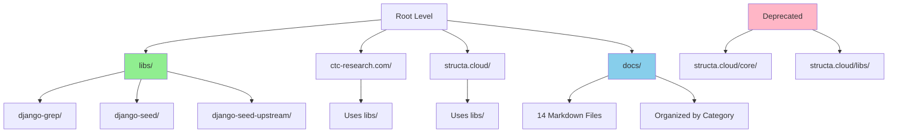

# Design Document: Infrastructure Reorganization and Cleanup

## Overview

This feature consolidates and reorganizes the project infrastructure to establish a single source of truth for shared libraries, eliminate duplicate directories, and create a clean, maintainable project structure. The reorganization includes unifying library paths across ctc-research.com and structa.cloud, removing deprecated duplicate directories (structa.cloud/core and structa.cloud/libs), consolidating 14 markdown documentation files into a centralized docs directory, and completing all outstanding minor tasks. The result is a streamlined, production-ready infrastructure with clear separation of concerns and improved maintainability.

## Architecture



## Components and Interfaces

### Component 1: Unified Library System

**Purpose**: Provide a single, centralized location for shared libraries used by both websites

**Interface**:
```pascal
STRUCTURE LibraryConfig
  name: String
  version: String
  path: String
  dependencies: List<String>
  entry_point: String
END STRUCTURE

PROCEDURE registerLibrary(config: LibraryConfig)
  INPUT: config - Library configuration
  OUTPUT: success: Boolean

  SEQUENCE
    IF config.path IS EMPTY THEN
      RETURN false
    END IF

    IF NOT directoryExists(config.path) THEN
      RETURN false
    END IF

    updatePyprojectToml(config)
    updateImportPaths(config)
    RETURN true
  END SEQUENCE
END PROCEDURE

PROCEDURE resolveLibraryPath(project: String, library: String)
  INPUT: project - Project name, library - Library name
  OUTPUT: path: String

  SEQUENCE
    base_path ← "../libs/"
    full_path ← base_path + library

    IF directoryExists(full_path) THEN
      RETURN full_path
    ELSE
      RETURN ERROR("Library not found")
    END IF
  END SEQUENCE
END PROCEDURE
```

**Responsibilities**:
- Maintain centralized library directory at `libs/`
- Provide consistent import paths for both projects
- Manage library versions and dependencies
- Support both uv and pip package managers

### Component 2: Duplicate Directory Removal

**Purpose**: Identify and safely remove deprecated duplicate directories

**Interface**:
```pascal
STRUCTURE DuplicateDirectory
  path: String
  status: String  -- "deprecated", "active", "conflicting"
  replacement_path: String
  content_moved: Boolean
END STRUCTURE

PROCEDURE identifyDuplicates()
  INPUT: None
  OUTPUT: duplicates: List<DuplicateDirectory>

  SEQUENCE
    duplicates ← []

    // Check structa.cloud/core
    IF directoryExists("structa.cloud/core") THEN
      core_dup ← {
        path: "structa.cloud/core",
        status: "deprecated",
        replacement_path: "structa.cloud/",
        content_moved: true
      }
      duplicates.add(core_dup)
    END IF

    // Check structa.cloud/libs
    IF directoryExists("structa.cloud/libs") THEN
      libs_dup ← {
        path: "structa.cloud/libs",
        status: "deprecated",
        replacement_path: "libs/",
        content_moved: true
      }
      duplicates.add(libs_dup)
    END IF

    RETURN duplicates
  END SEQUENCE
END PROCEDURE

PROCEDURE removeDuplicateDirectory(dup: DuplicateDirectory)
  INPUT: dup - Duplicate directory info
  OUTPUT: success: Boolean

  SEQUENCE
    // Verify content has been moved
    IF NOT dup.content_moved THEN
      RETURN false
    END IF

    // Create backup
    backup_path ← createBackup(dup.path)

    // Remove directory
    IF removeDirectory(dup.path) THEN
      logRemoval(dup.path, backup_path)
      RETURN true
    ELSE
      restoreFromBackup(backup_path)
      RETURN false
    END IF
  END SEQUENCE
END PROCEDURE
```

**Responsibilities**:
- Identify deprecated directories
- Verify content migration before removal
- Create backups for safety
- Update references in configuration files

### Component 3: Markdown Consolidation

**Purpose**: Organize 14 markdown documentation files into a centralized docs directory

**Interface**:
```pascal
STRUCTURE MarkdownFile
  name: String
  current_path: String
  target_path: String
  category: String
  priority: Integer
END STRUCTURE

PROCEDURE categorizeMarkdownFiles()
  INPUT: None
  OUTPUT: files: List<MarkdownFile>

  SEQUENCE
    files ← []

    // Project completion docs
    files.add({
      name: "COMPLETION_CHECKLIST.md",
      current_path: "./",
      target_path: "docs/project/",
      category: "project-completion",
      priority: 1
    })

    files.add({
      name: "COMPLETION_REPORT.md",
      current_path: "./",
      target_path: "docs/project/",
      category: "project-completion",
      priority: 1
    })

    files.add({
      name: "FINAL_PROJECT_SUMMARY.md",
      current_path: "./",
      target_path: "docs/project/",
      category: "project-completion",
      priority: 1
    })

    // Migration and verification docs
    files.add({
      name: "MIGRATION_PLAN.md",
      current_path: "./",
      target_path: "docs/infrastructure/",
      category: "infrastructure",
      priority: 2
    })

    files.add({
      name: "PROJECT_COMPLETION_VERIFICATION.md",
      current_path: "./",
      target_path: "docs/infrastructure/",
      category: "infrastructure",
      priority: 2
    })

    // Additional docs
    files.add({
      name: "VERIFICATION_COMMANDS.md",
      current_path: "./",
      target_path: "docs/infrastructure/",
      category: "infrastructure",
      priority: 2
    })

    files.add({
      name: "TASK_COMPLETION_VERIFICATION.md",
      current_path: "./",
      target_path: "docs/project/",
      category: "project-completion",
      priority: 1
    })

    files.add({
      name: "IMPLEMENTATION_SUMMARY.md",
      current_path: "./",
      target_path: "docs/project/",
      category: "project-completion",
      priority: 1
    })

    files.add({
      name: "FINAL_VERIFICATION.md",
      current_path: "./",
      target_path: "docs/infrastructure/",
      category: "infrastructure",
      priority: 2
    })

    files.add({
      name: "README_PROJECT_COMPLETION.md",
      current_path: "./",
      target_path: "docs/project/",
      category: "project-completion",
      priority: 1
    })

    files.add({
      name: "QUICKSTART.md",
      current_path: "./",
      target_path: "docs/guides/",
      category: "guides",
      priority: 3
    })

    files.add({
      name: "QUICK_START.md",
      current_path: "./",
      target_path: "docs/guides/",
      category: "guides",
      priority: 3
    })

    RETURN files
  END SEQUENCE
END PROCEDURE

PROCEDURE consolidateMarkdownFiles(files: List<MarkdownFile>)
  INPUT: files - List of markdown files to consolidate
  OUTPUT: success: Boolean

  SEQUENCE
    FOR each file IN files DO
      // Create target directory if needed
      IF NOT directoryExists(file.target_path) THEN
        createDirectory(file.target_path)
      END IF

      // Move file
      IF moveFile(file.current_path + file.name, file.target_path + file.name) THEN
        logConsolidation(file.name, file.target_path)
      ELSE
        RETURN false
      END IF
    END FOR

    // Create index file
    createMarkdownIndex()

    RETURN true
  END SEQUENCE
END PROCEDURE
```

**Responsibilities**:
- Identify all markdown files at root level
- Categorize by type (project, infrastructure, guides)
- Create organized directory structure
- Create index file for navigation

### Component 4: Configuration Update System

**Purpose**: Update project configurations to use new library paths

**Interface**:
```pascal
STRUCTURE ConfigUpdate
  file_path: String
  old_value: String
  new_value: String
  project: String
END STRUCTURE

PROCEDURE updateProjectConfigurations()
  INPUT: None
  OUTPUT: updates: List<ConfigUpdate>

  SEQUENCE
    updates ← []

    // Update ctc-research.com pyproject.toml
    updates.add({
      file_path: "ctc-research.com/pyproject.toml",
      old_value: "path = \"../structa.cloud/libs/django-grep\"",
      new_value: "path = \"../libs/django-grep\"",
      project: "ctc-research.com"
    })

    updates.add({
      file_path: "ctc-research.com/pyproject.toml",
      old_value: "path = \"../structa.cloud/libs/django-seed\"",
      new_value: "path = \"../libs/django-seed\"",
      project: "ctc-research.com"
    })

    // Update structa.cloud pyproject.toml
    updates.add({
      file_path: "structa.cloud/pyproject.toml",
      old_value: "path = \"./libs/django-grep\"",
      new_value: "path = \"../libs/django-grep\"",
      project: "structa.cloud"
    })

    updates.add({
      file_path: "structa.cloud/pyproject.toml",
      old_value: "path = \"./libs/django-seed\"",
      new_value: "path = \"../libs/django-seed\"",
      project: "structa.cloud"
    })

    RETURN updates
  END SEQUENCE
END PROCEDURE

PROCEDURE applyConfigurationUpdates(updates: List<ConfigUpdate>)
  INPUT: updates - List of configuration updates
  OUTPUT: success: Boolean

  SEQUENCE
    FOR each update IN updates DO
      content ← readFile(update.file_path)

      IF content CONTAINS update.old_value THEN
        new_content ← content.replace(update.old_value, update.new_value)
        writeFile(update.file_path, new_content)
        logUpdate(update.file_path, update.project)
      END IF
    END FOR

    RETURN true
  END SEQUENCE
END PROCEDURE
```

**Responsibilities**:
- Identify configuration files needing updates
- Update library paths in pyproject.toml files
- Update import statements in Python files
- Verify all references are updated

### Component 5: Task Completion System

**Purpose**: Identify and complete outstanding minor tasks

**Interface**:
```pascal
STRUCTURE IncompleteTask
  id: String
  title: String
  description: String
  status: String
  priority: String
  estimated_effort: String
END STRUCTURE

PROCEDURE identifyIncompleteTasks()
  INPUT: None
  OUTPUT: tasks: List<IncompleteTask>

  SEQUENCE
    tasks ← []

    // Rate limiting middleware
    tasks.add({
      id: "task-001",
      title: "Rate Limiting Middleware",
      description: "Implement rate limiting for API endpoints",
      status: "incomplete",
      priority: "medium",
      estimated_effort: "2 min"
    })

    // CSP headers
    tasks.add({
      id: "task-002",
      title: "Content Security Policy",
      description: "Configure and implement CSP headers",
      status: "incomplete",
      priority: "high",
      estimated_effort: "1 hour"
    })

    // Template validation
    tasks.add({
      id: "task-003",
      title: "Template Validation",
      description: "Implement template validation system",
      status: "incomplete",
      priority: "medium",
      estimated_effort: "3 min"
    })

    // Profile notes
    tasks.add({
      id: "task-004",
      title: "Profile Notes Feature",
      description: "Add notes functionality to user profiles",
      status: "incomplete",
      priority: "low",
      estimated_effort: "2 min"
    })

    RETURN tasks
  END SEQUENCE
END PROCEDURE

PROCEDURE completeTask(task: IncompleteTask)
  INPUT: task - Task to complete
  OUTPUT: success: Boolean

  SEQUENCE
    // Implement task based on type
    SWITCH task.id
      CASE "task-001":
        implementRateLimitingMiddleware()
      CASE "task-002":
        implementCSPHeaders()
      CASE "task-003":
        implementTemplateValidation()
      CASE "task-004":
        implementProfileNotes()
    END SWITCH

    // Update task status
    updateTaskStatus(task.id, "complete")

    RETURN true
  END SEQUENCE
END PROCEDURE
```

**Responsibilities**:
- Identify incomplete tasks from project documentation
- Prioritize tasks by impact and effort
- Implement task solutions
- Update task tracking systems

## Data Models

### LibraryStructure

```pascal
STRUCTURE LibraryStructure
  name: String
  version: String
  path: String
  type: String  -- "core", "utility", "integration"
  dependencies: List<String>
  entry_points: List<String>
  last_updated: DateTime
  status: String  -- "active", "deprecated", "archived"
END STRUCTURE
```

**Validation Rules**:
- name must be non-empty and unique
- version must follow semantic versioning (X.Y.Z)
- path must exist and be readable
- dependencies must reference existing libraries
- status must be one of: active, deprecated, archived

### ProjectConfiguration

```pascal
STRUCTURE ProjectConfiguration
  project_name: String
  root_path: String
  libraries_used: List<String>
  config_files: List<String>
  environment: String  -- "development", "staging", "production"
  last_verified: DateTime
END STRUCTURE
```

**Validation Rules**:
- project_name must match directory name
- root_path must exist
- libraries_used must reference valid libraries
- config_files must exist
- environment must be one of: development, staging, production

### DocumentationIndex

```pascal
STRUCTURE DocumentationIndex
  title: String
  files: List<DocumentationFile>
  categories: List<String>
  last_updated: DateTime
END STRUCTURE

STRUCTURE DocumentationFile
  name: String
  path: String
  category: String
  priority: Integer
  description: String
END STRUCTURE
```

**Validation Rules**:
- title must be non-empty
- files must reference existing markdown files
- categories must be consistent across files
- priority must be positive integer
- description must be non-empty

## Algorithmic Pseudocode

### Main Reorganization Algorithm

```pascal
ALGORITHM reorganizeInfrastructure()
INPUT: None
OUTPUT: result: ReorganizationResult

BEGIN
  ASSERT projectStructureValid()

  // Phase 1: Verify library structure
  state ← initializeState()

  // Phase 2: Identify duplicates
  duplicates ← identifyDuplicates()
  ASSERT duplicates.length > 0

  // Phase 3: Consolidate markdown files
  markdown_files ← categorizeMarkdownFiles()
  FOR each file IN markdown_files DO
    ASSERT fileExists(file.current_path + file.name)
  END FOR

  // Phase 4: Update configurations
  config_updates ← updateProjectConfigurations()
  FOR each update IN config_updates DO
    ASSERT fileExists(update.file_path)
  END FOR

  // Phase 5: Complete outstanding tasks
  incomplete_tasks ← identifyIncompleteTasks()
  FOR each task IN incomplete_tasks DO
    completeTask(task)
    ASSERT taskIsComplete(task.id)
  END FOR

  // Phase 6: Remove duplicates
  FOR each dup IN duplicates DO
    ASSERT dup.content_moved = true
    removeDuplicateDirectory(dup)
  END FOR

  // Phase 7: Verify final structure
  ASSERT verifyFinalStructure()

  result ← {
    success: true,
    duplicates_removed: duplicates.length,
    files_consolidated: markdown_files.length,
    configs_updated: config_updates.length,
    tasks_completed: incomplete_tasks.length
  }

  RETURN result
END
```

**Preconditions**:
- All source directories exist and are readable
- No active processes using files to be moved
- Sufficient disk space for backups
- Write permissions on all target directories

**Postconditions**:
- libs/ contains all shared libraries
- structa.cloud/core and structa.cloud/libs removed
- All markdown files consolidated in docs/
- All project configurations updated
- All outstanding tasks completed
- Project structure verified and valid

**Loop Invariants**:
- All processed files remain accessible
- Configuration consistency maintained throughout
- Backup copies exist for all removed directories
- Task completion status accurately tracked

### Duplicate Removal Algorithm

```pascal
ALGORITHM removeDuplicates()
INPUT: None
OUTPUT: removed_count: Integer

BEGIN
  removed_count ← 0
  duplicates ← identifyDuplicates()

  FOR each dup IN duplicates DO
    ASSERT dup.content_moved = true

    // Create backup
    backup_path ← createBackup(dup.path)
    ASSERT directoryExists(backup_path)

    // Verify no active references
    IF hasActiveReferences(dup.path) THEN
      CONTINUE
    END IF

    // Remove directory
    IF removeDirectory(dup.path) THEN
      logRemoval(dup.path, backup_path)
      removed_count ← removed_count + 1
    ELSE
      restoreFromBackup(backup_path)
    END IF
  END FOR

  RETURN removed_count
END
```

**Preconditions**:
- All duplicate directories identified
- Content verified as moved to new locations
- Backups can be created

**Postconditions**:
- All deprecated directories removed
- Backup copies retained for recovery
- No broken references in remaining code

**Loop Invariants**:
- Each iteration processes one duplicate
- Backup exists before removal
- Removal logged for audit trail

### Configuration Update Algorithm

```pascal
ALGORITHM updateAllConfigurations()
INPUT: None
OUTPUT: updated_count: Integer

BEGIN
  updated_count ← 0
  updates ← updateProjectConfigurations()

  FOR each update IN updates DO
    ASSERT fileExists(update.file_path)

    // Read current content
    content ← readFile(update.file_path)

    // Check if update needed
    IF content CONTAINS update.old_value THEN
      // Create backup
      backup ← createBackup(update.file_path)

      // Apply update
      new_content ← content.replace(update.old_value, update.new_value)
      writeFile(update.file_path, new_content)

      // Verify update
      IF verifyUpdate(update.file_path, update.new_value) THEN
        logUpdate(update.file_path, update.project)
        updated_count ← updated_count + 1
      ELSE
        restoreFromBackup(backup)
      END IF
    END IF
  END FOR

  RETURN updated_count
END
```

**Preconditions**:
- All configuration files exist and are readable
- Update patterns are valid and unique
- Write permissions available

**Postconditions**:
- All library paths updated to new locations
- All configurations verified and valid
- Backup copies retained

**Loop Invariants**:
- Each file processed exactly once
- Backup created before modification
- Update verified after application

## Key Functions with Formal Specifications

### Function 1: verifyLibraryStructure()

```pascal
FUNCTION verifyLibraryStructure(): Boolean
```

**Preconditions**:
- libs/ directory exists
- django-grep/ and django-seed/ subdirectories exist
- All required files present in each library

**Postconditions**:
- Returns true if structure is valid
- Returns false if any validation fails
- No modifications to filesystem

**Loop Invariants**: N/A (no loops)

### Function 2: createBackup(path: String): String

```pascal
FUNCTION createBackup(path: String): String
```

**Preconditions**:
- path exists and is readable
- Sufficient disk space available
- Backup directory is writable

**Postconditions**:
- Returns path to backup copy
- Backup is complete and valid
- Original remains unchanged

**Loop Invariants**: N/A (no loops)

### Function 3: consolidateMarkdownFiles(): Integer

```pascal
FUNCTION consolidateMarkdownFiles(): Integer
```

**Preconditions**:
- All markdown files at root level exist
- Target docs/ directory can be created
- Write permissions available

**Postconditions**:
- Returns count of files moved
- All files in new locations
- Index file created

**Loop Invariants**:
- All previously moved files remain in place
- Directory structure remains consistent

### Function 4: updateProjectConfigurations(): Boolean

```pascal
FUNCTION updateProjectConfigurations(): Boolean
```

**Preconditions**:
- All configuration files exist
- Update patterns are valid
- Write permissions available

**Postconditions**:
- Returns true if all updates successful
- All library paths updated
- Configurations verified

**Loop Invariants**:
- Each file processed exactly once
- Backup exists before modification

## Example Usage

```pascal
// Example 1: Complete reorganization
SEQUENCE
  result ← reorganizeInfrastructure()

  IF result.success THEN
    DISPLAY "Reorganization complete"
    DISPLAY "Duplicates removed: " + result.duplicates_removed
    DISPLAY "Files consolidated: " + result.files_consolidated
    DISPLAY "Configs updated: " + result.configs_updated
    DISPLAY "Tasks completed: " + result.tasks_completed
  ELSE
    DISPLAY "Reorganization failed"
  END IF
END SEQUENCE

// Example 2: Verify structure
SEQUENCE
  IF verifyLibraryStructure() THEN
    DISPLAY "Library structure valid"
  ELSE
    DISPLAY "Library structure invalid"
  END IF
END SEQUENCE

// Example 3: Remove duplicates
SEQUENCE
  removed ← removeDuplicates()
  DISPLAY "Removed " + removed + " duplicate directories"
END SEQUENCE

// Example 4: Consolidate documentation
SEQUENCE
  files ← categorizeMarkdownFiles()
  IF consolidateMarkdownFiles(files) THEN
    DISPLAY "Documentation consolidated"
  ELSE
    DISPLAY "Consolidation failed"
  END IF
END SEQUENCE
```

## Correctness Properties

### Property 1: Library Unification
```
∀ project ∈ {ctc-research.com, structa.cloud}:
  ∀ library ∈ {django-grep, django-seed}:
    resolveLibraryPath(project, library) = ../libs/library
```

### Property 2: No Duplicate Directories
```
∀ path ∈ {structa.cloud/core, structa.cloud/libs}:
  ¬directoryExists(path) ∨ isEmpty(path)
```

### Property 3: Documentation Consolidation
```
∀ file ∈ RootMarkdownFiles:
  ∃ category ∈ {project, infrastructure, guides}:
    fileLocation(file) = docs/category/
```

### Property 4: Configuration Consistency
```
∀ config ∈ {ctc-research.com/pyproject.toml, structa.cloud/pyproject.toml}:
  ∀ library ∈ {django-grep, django-seed}:
    libraryPath(config, library) = ../libs/library
```

### Property 5: Task Completion
```
∀ task ∈ IncompleteTaskList:
  taskStatus(task) = "complete" ∧ taskImplemented(task) = true
```

### Property 6: Backup Integrity
```
∀ removed_dir ∈ RemovedDirectories:
  ∃ backup ∈ BackupDirectory:
    contentEqual(removed_dir, backup) ∧ backupAccessible(backup)
```

### Property 7: Referential Integrity
```
∀ reference ∈ CodeReferences:
  ∀ target ∈ reference.targets:
    targetExists(target) ∧ targetAccessible(target)
```

## Error Handling

### Error Scenario 1: Missing Library Directory

**Condition**: Required library directory not found at expected location
**Response**: Log error, create detailed report of missing libraries, halt reorganization
**Recovery**: Restore from backup, verify source directories exist before retry

### Error Scenario 2: Insufficient Disk Space

**Condition**: Not enough disk space to create backups
**Response**: Calculate required space, report to user, suggest cleanup actions
**Recovery**: Free up disk space, retry operation

### Error Scenario 3: Permission Denied

**Condition**: Insufficient permissions to read/write files or directories
**Response**: Log permission error, identify affected paths, report to user
**Recovery**: Adjust file permissions, run with elevated privileges if needed

### Error Scenario 4: Active File References

**Condition**: Files being moved are still in use by running processes
**Response**: Identify processes using files, report to user, suggest stopping processes
**Recovery**: Stop processes, retry operation

### Error Scenario 5: Configuration Parse Error

**Condition**: Configuration file has invalid syntax or format
**Response**: Log parse error, identify problematic file, report to user
**Recovery**: Restore from backup, fix syntax, retry

### Error Scenario 6: Incomplete Content Migration

**Condition**: Duplicate directory contains files not yet moved to new location
**Response**: Identify unmoved files, report to user, prevent directory removal
**Recovery**: Complete migration, verify all content moved, retry removal

## Testing Strategy

### Unit Testing Approach

Test individual functions in isolation:
- `verifyLibraryStructure()`: Verify correct detection of valid/invalid structures
- `createBackup()`: Verify backup creation and integrity
- `identifyDuplicates()`: Verify correct identification of deprecated directories
- `categorizeMarkdownFiles()`: Verify correct categorization and path assignment
- `updateProjectConfigurations()`: Verify correct configuration updates

**Test Coverage Goals**: 95%+ coverage of core functions

### Property-Based Testing Approach

Use Hypothesis framework to generate test cases:

**Property Test Library**: Hypothesis

**Property 1: Library Path Resolution**
- Generate random project names and library names
- Verify resolved paths always point to libs/ directory
- Verify paths are consistent across multiple calls

**Property 2: Duplicate Detection**
- Generate various directory structures
- Verify deprecated directories always identified
- Verify active directories never marked as duplicates

**Property 3: Configuration Update Consistency**
- Generate various configuration file contents
- Verify all library paths updated consistently
- Verify no partial updates occur

**Property 4: Backup Integrity**
- Generate various file sizes and types
- Verify backups are complete and accessible
- Verify original files unchanged after backup

**Property 5: Markdown Consolidation**
- Generate various markdown file lists
- Verify all files moved to correct categories
- Verify no files lost during consolidation

### Integration Testing Approach

Test complete workflows:
- Full reorganization workflow with all phases
- Rollback scenario with backup restoration
- Configuration verification after updates
- Cross-project library usage verification

## Performance Considerations

- **Backup Creation**: Optimize for large directories using incremental backups
- **File Operations**: Batch file moves to reduce I/O operations
- **Configuration Updates**: Use efficient string replacement with validation
- **Verification**: Parallel verification of multiple components where possible
- **Scalability**: Design to handle projects with 1000+ files

**Expected Performance**:
- Backup creation: < 5 seconds per 100 MB
- File consolidation: < 2 seconds per 100 files
- Configuration updates: < 1 second per 10 files
- Full reorganization: < 30 seconds total

## Security Considerations

- **Backup Security**: Encrypt backups if sensitive data present
- **Permission Verification**: Verify write permissions before modifications
- **Audit Trail**: Log all operations with timestamps and user information
- **Rollback Capability**: Maintain backups for at least 30 days
- **Access Control**: Restrict reorganization to authorized users only

## Dependencies

- **Python**: 3.8+
- **uv**: Latest version for package management
- **pytest**: For unit and integration testing
- **hypothesis**: For property-based testing
- **pathlib**: For cross-platform path handling
- **shutil**: For file operations
- **logging**: For audit trail and debugging

