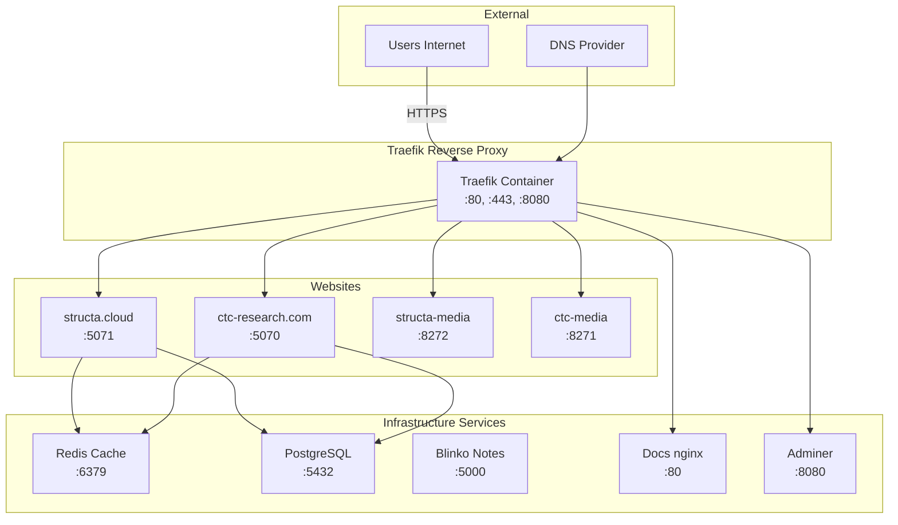
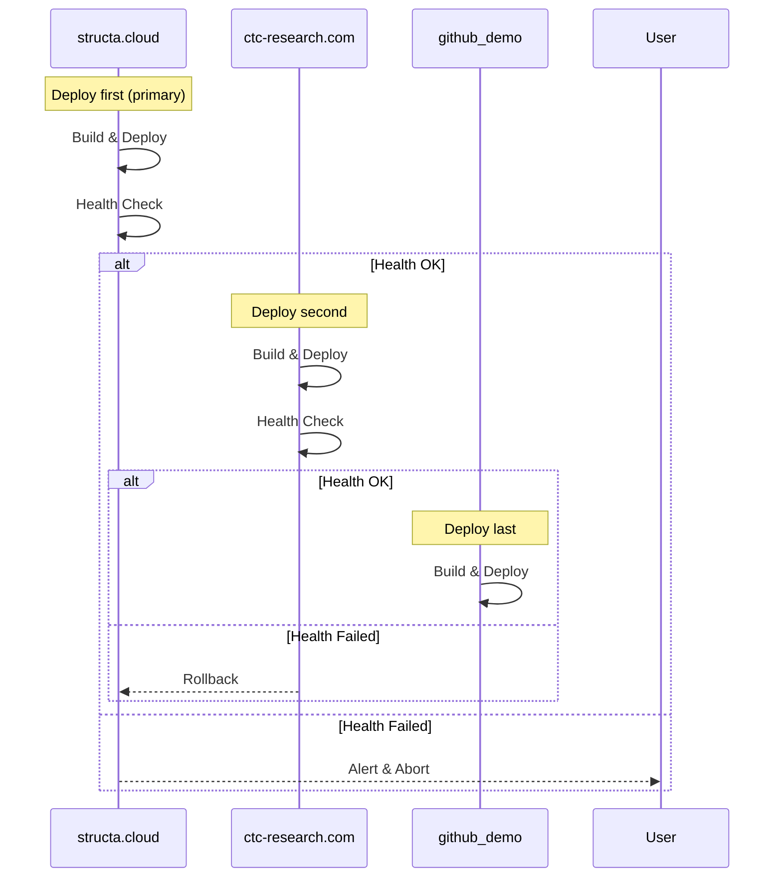

# Design Document: Docker Deployment & Documentation Enhancement

## Overview

This design addresses the completion of Docker container tests, domain-based deployment, and comprehensive documentation enhancement across the ecosystem. The project consists of two Django-based websites (ctc-research.com and structa.cloud) deployed via Docker with Traefik reverse proxy, PostgreSQL database, Redis cache, and supporting services.

### Key Design Decisions

1. **Dual Database Strategy**: SQLite for development/local testing, PostgreSQL for production - controlled via environment variables
2. **Modular Compose Files**: Separate compose files for infrastructure, each website, allowing selective deployment
3. **Test Strategy**: Integration tests for infrastructure, property-based tests for configuration logic
4. **Documentation Structure**: Per-category documentation (apps, plugins, settings, packages) in the existing docs/ hierarchy
5. **Deployment Priority**: structa.cloud → ctc-research.com → github_demo

---

## Architecture

### Container Architecture



### Network Architecture

- **traefik-net**: External network shared by all containers
- **Volume Strategy**: Shared volumes for static/media files between Django and nginx containers

---

## Components and Interfaces

### Docker Compose Component Structure

| Component | File | Purpose |
|-----------|------|---------|
| Base Infrastructure | `docker-compose.proxy.yml`, `docker-compose.warehouse.yml` | Traefik, Redis, PostgreSQL, Blinko, Docs, Adminer |
| Website Base | `docker-compose.yml` | Combines all compose files |
| structa.cloud | `structa.docker-compose.yml` | Django website, media server, worker |
| ctc-research.com | `ctc-research.docker-compose.yml` | Django website, media server, worker |
| GitHub Demo | `github_demo/docker-compose.yml` | Independent demo environment |

### Service Interfaces

```yaml
# Key service endpoints after deployment
services:
  traefik:
    ports: [80, 443, 8080]
    health: /ping

  postgres:
    databases: [db_site, db_ctc, db_structa, blinko]
    port: 5432

  redis:
    port: 6379
    auth: required

  structa-website:
    port: 5071
    health: /health/

  ctc-website:
    port: 5070
    health: /health/
```

---

## Data Models

### Database Configuration Schema

The system uses YAML-based configuration with Jinja2 templating:

```
configs/settings/ENV/
├── database.yml      # Database backend configuration
├── security.yml      # SSL, CORS, rate limiting
├── storage.yml       # Static/media file storage
├── logging.yml       # Log levels and handlers
└── ...other settings
```

### Database Switching Logic

```python
# Pseudo-code for database configuration switching
DATABASE_CONFIG = {
    'development': {
        'ENGINE': 'django.db.backends.sqlite3',
        'NAME': 'db.sqlite3'
    },
    'production': {
        'ENGINE': 'django.db.backends.postgresql',
        'HOST': 'postgres',
        'NAME': 'db_structa'  # or db_ctc
    }
}
```

### Environment Variables for Database Switching

| Variable | Development | Production |
|----------|-------------|------------|
| DJANGO_ENV | development | production |
| DB_ENGINE | sqlite3 | postgresql |
| DB_NAME | db.sqlite3 | db_ctc / db_structa |
| DB_HOST | - | postgres |

---

## Correctness Properties

*A property is a characteristic or behavior that should hold true across all valid executions of a system—essentially, a formal statement about what the system should do. Properties serve as the bridge between human-readable specifications and machine-verifiable correctness guarantees.*

This feature is primarily infrastructure and documentation-focused. Property-based testing applies only to the database configuration switching logic.

### Property 1: Database Backend Switches Based on Environment

*For any* valid environment configuration (DJANGO_ENV or DATABASE_URL), the Django settings module SHALL configure the correct database engine

**Validates: Requirements 11.1, 11.3**

```python
# Property test example (using Hypothesis)
@given(env_vars=st.fixed_dictionaries({
    'DJANGO_ENV': st.sampled_from(['development', 'production', 'testing']),
    'DATABASE_URL': st.one_of(st.none(), st.text()),
    'DB_ENGINE': st.sampled_from(['sqlite3', 'postgresql', st.none()])
}))
def test_database_engine_selection(env_vars):
    # Verify correct engine is selected based on environment
    engine = determine_database_engine(env_vars)
    expected = expected_engine_for_env(env_vars.get('DJANGO_ENV'))
    assert engine == expected
```

---

## Error Handling

### Container Failure Handling

| Failure Scenario | Behavior | Logging |
|-----------------|----------|---------|
| Container fails to start | Mark test failed | Container logs to stdout |
| PostgreSQL connection fails | Retry with backoff | Error to stderr |
| Redis auth fails | Fail fast | Authentication error logged |
| SSL certificate failure | Continue with HTTP | Warning logged, HTTP fallback |

### Configuration Errors

- Invalid compose file: Validation step fails before deployment
- Missing environment variables: Container exits with clear error message
- Database migration failure: Startup script exits non-zero

---

## Testing Strategy

### Test Classification Summary

| Requirement | Classification | Strategy |
|-------------|---------------|----------|
| Docker container tests | INTEGRATION | Run docker inspect, verify container state |
| PostgreSQL connection | INTEGRATION | Use psql or psycopg connection test |
| Redis connection | INTEGRATION | redis-cli ping test |
| Domain configuration | SMOKE | Traefik dashboard verification |
| Database config switching | PROPERTY | Hypothesis-based property tests |
| Documentation structure | MANUAL | Structure validation, content review |
| Backup procedures | INTEGRATION | Test backup script execution |
| Deployment order | SMOKE | Script execution order verification |

### Test Commands

```makefile
# Existing and new test targets
make validate                  # Validate compose configs
make test-compose              # Test compose file parsing
make health-check              # Run health checks
make test-local                # Run tests with SQLite
make test                      # Run all tests
```

### Property-Based Testing Configuration

Since only the database configuration logic is suitable for PBT:

- **Library**: Hypothesis (already in project - see docs/libs/hypothesis.md)
- **Iterations**: Minimum 100 per property
- **Test Location**: `websites/tests/properties/` or `websites/structa.cloud/tests/`

### Test Report Structure

```json
{
  "structa.cloud": {
    "tests_run": 150,
    "passed": 148,
    "failed": 2,
    "coverage": "85%"
  },
  "ctc-research.com": {
    "tests_run": 142,
    "passed": 142,
    "coverage": "82%"
  },
  "github_demo": {
    "tests_run": 45,
    "passed": 45,
    "coverage": "78%"
  }
}
```

---

## Deployment Workflow

### Deployment Priority Order



### Deployment Commands

```bash
# Phase 1: structa.cloud (primary)
docker compose -f docker-compose.yml -f structa.docker-compose.yml up -d
make health-check svc=structa-website

# Phase 2: ctc-research.com
docker compose -f docker-compose.yml -f ctc-research.docker-compose.yml up -d
make health-check svc=ctc-website

# Phase 3: github_demo (demo environment)
cd github_demo && docker compose up -d
```

---

## Documentation Structure

### Apps Documentation (Requirement 4)

Location: `docs/{structa.cloud,ctc-research.com}/apps/`

| App | Document | Content |
|-----|----------|---------|
| admin | `admin.md` | Configuration, customization options |
| filters | `filters.md` | Available filters, usage patterns |
| forms | `forms.md` | Form classes, validation rules |
| management | `management.md` | Commands, utilities |
| managers | `managers.md` | Custom querysets, managers |
| middleware | `middleware.md` | Middleware classes, execution order |
| models | `models.md` | Entity relationships, field definitions |
| processors | `processors.md` | Data processing logic |
| services | `services.md` | Business logic services |
| site | `site.md` | Site-specific configurations |
| snippets | `snippets.md` | Reusable template snippets |
| views | `views.md` | URL patterns, view classes |

### Plugins Documentation (Requirement 5)

Location: `docs/{structa.cloud,ctc-research.com}/plugins/`

| Plugin | Document | Content |
|--------|----------|---------|
| accounts | `accounts.md` | User authentication flows |
| blog | `blog.md` | Post models, categories, tags |
| components | `components.md` | Reusable UI components |
| lms | `lms.md` | Course, lesson, enrollment models |
| products | `products.md` | E-commerce product management |
| profile | `profile.md` | User profile customization |
| templates | `templates.md` | Base templates, theme support |

### Settings Documentation (Requirement 6)

Location: `docs/{structa.cloud,ctc-research.com}/config/`

| Document | Content |
|----------|---------|
| `database.md` | PostgreSQL connection, pool settings, SQLite vs PostgreSQL |
| `cache.md` | Redis connection, cache backends |
| `storage.md` | Whitenoise, S3 storage configuration |
| `authentication.md` | AllAuth, social login providers |
| `middleware.md` | Middleware settings, execution order |
| `logging.md` | structlog, log levels, handlers |
| `environment.md` | Environment-specific settings (dev, test, prod) |
| `environment-variables.md` | .env.example, required variables |

### Project Structure Documentation (Requirement 7)

Location: `docs/ecosystem/architecture/`

| Document | Content |
|----------|---------|
| `workspace.md` | Workspace structure, shared dependencies |
| `website-overrides.md` | Website-specific customizations |
| `plugin-architecture.md` | Plugin loading mechanism |
| `app-separation.md` | Core vs plugins vs apps concerns |
| `compose-organization.md` | traefik, nginx, postgres directories |
| `configuration-inheritance.md` | Base, variant, site-specific layers |
| `test-organization.md` | Unit, integration, performance directories |
| `patterns.md` | Architectural patterns: SoC, DRY, pluggable apps |

### Package Documentation (Requirement 8)

Location: `docs/libs/` and `docs/packages/`

| Document | Content |
|----------|---------|
| `django-allauth.md` | Authentication, social login |
| `django-htmx.md` | HTMX integration patterns |
| `django-crispy-forms.md` | Form rendering |
| `wagtail.md` | CMS features, page types |
| `django-ninja.md` | API endpoints |
| `django-redis.md` | Caching, sessions |
| `django-storages.md` | S3, cloud storage |
| `django-structlog.md` | Structured logging |
| `gunicorn-uvicorn.md` | Server configuration |
| `internal-packages.md` | django-osoul, django-rseal, django-grep |

---

## GitHub Demo Configuration

### Separate Settings Structure

```
github_demo/
├── configs/
│   └── settings/
│       ├── __init__.py
│       └── settings.py    # Demo-specific settings
├── docs/                  # Demo-specific documentation
├── docker-compose.yml     # Simplified compose
└── tests/                 # Demo test suite
```

### Demo Database Configuration

The github_demo uses simplified database settings:
- **Default**: SQLite (db.sqlite3) for easy local development
- **Option**: PostgreSQL via DATABASE_URL

### Test Execution in GitHub Demo

```bash
# Inside container
docker compose exec website python manage.py test

# Or with make
cd github_demo && make test
```

---

## Implementation Checklist

### Phase 1: Container Testing (Requirements 1, 9)
- [ ] Create health-check script in `scripts/health-check.sh`
- [ ] Add container test cases for each service
- [ ] Configure Docker health checks in compose files
- [ ] Add resource limits to compose files

### Phase 2: Domain Deployment (Requirement 2)
- [ ] Configure Traefik for ctc-research.com
- [ ] Configure Traefik for structa.cloud
- [ ] Set up SSL certificates with Let's Encrypt
- [ ] Configure subdomains (docs.structa.cloud, space.structa.cloud)
- [ ] Add rate limiting middleware

### Phase 3: Local Development (Requirement 11)
- [ ] Verify SQLite configuration in database.yml
- [ ] Add `make test-local` target
- [ ] Document SQLite/PostgreSQL switching
- [ ] Add migration tool for schema differences

### Phase 4: Multi-Website Testing (Requirement 12)
- [ ] Configure tests for structa.cloud
- [ ] Configure tests for ctc-research.com
- [ ] Add test report aggregation
- [ ] Implement parallel test execution

### Phase 5: Documentation (Requirements 4-8)
- [ ] Document all Django apps
- [ ] Document all plugins
- [ ] Document settings configuration
- [ ] Document project structure
- [ ] Document package usage

### Phase 6: GitHub Demo (Requirement 13)
- [ ] Verify github_demo test configuration
- [ ] Add demo-specific documentation
- [ ] Ensure deployment order (main sites first)

### Phase 7: Deployment (Requirement 14)
- [ ] Implement deployment scripts
- [ ] Add health check verification between deployments
- [ ] Document rollback procedures

---

## References

- Existing compose files: `websites/structa.docker-compose.yml`, `websites/ctc-research.docker-compose.yml`
- Database config: `websites/structa.cloud/configs/settings/ENV/database.yml`
- Health check: `scripts/health-check.sh`
- Makefile targets: `Makefile`
- Hypothesis library: `docs/libs/hypothesis.md`
