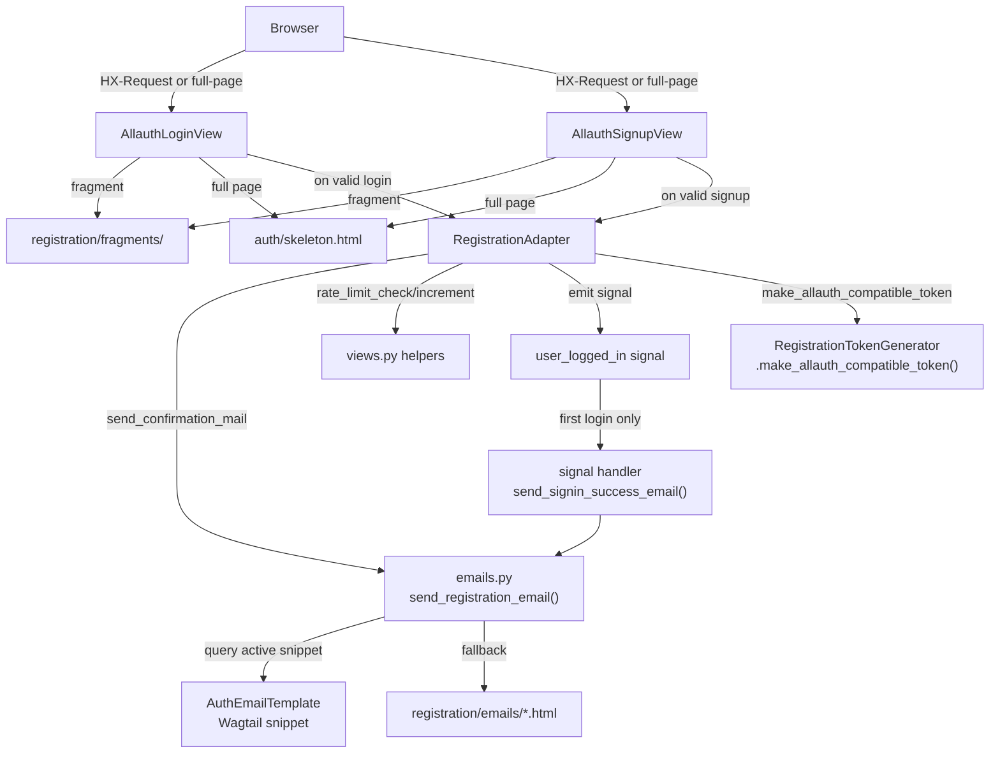
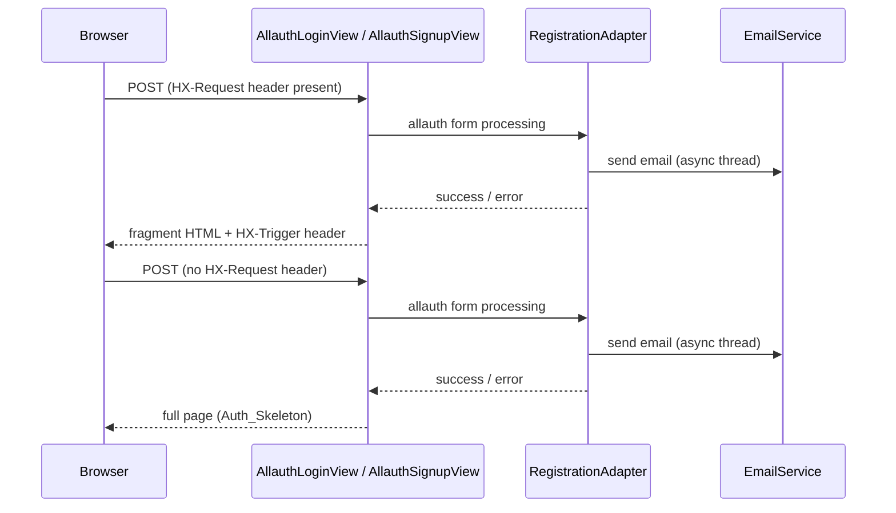

# Design Document: auth-allauth-enhancement

**Category Context: Authentication & Authorization**
- **Category**: Auth
- **Scope**: Authentication systems, user management, permissions, security
- **Related Specs**: auth-allauth-enhancement, ctc-research-server-and-auth-fix, ctc-structa-admin-auth-integration
- **Common Patterns**: Allauth integration, Django authentication, OAuth, JWT tokens, permission systems
- **Avoid Duplicates**: Check existing auth specs before creating new authentication features


## Overview

This enhancement integrates django-allauth into the existing ctc-research authentication system while preserving the PageHandler/HTMX fragment mechanism, the multi-sender email service, and all existing URL patterns. The work is purely additive: new files are created alongside existing ones, and the existing `RegisterView` / `CreatePasswordView` remain untouched.

The six concrete deliverables are:

1. `RegistrationAdapter` — a `DefaultAccountAdapter` subclass that routes allauth events into the existing email service and rate limiter.
2. `AuthEmailTemplate` — a Wagtail snippet model for admin-editable email subjects and bodies.
3. `make_allauth_compatible_token()` — a new method on `RegistrationTokenGenerator` that embeds an allauth key in the signed payload.
4. `AllauthLoginView` / `AllauthSignupView` — PageHandler subclasses that wrap allauth's login and signup logic.
5. Signal handler for `user_logged_in` → send sign-in success email on first login.
6. Auth skeleton light-theme default and HX-Trigger notification fix.

---

## Architecture



### Request Flow — HTMX vs Full-Page



---

## Components and Interfaces

### 1. `AllauthLoginView` — `apps/handlers/registration/allauth_views.py`

Subclasses both `PageHandler` and allauth's `LoginView`. Overrides `form_valid` and `form_invalid` to inject `HX-Trigger` headers and return fragments on HTMX requests.

```python
# apps/handlers/registration/allauth_views.py

from allauth.account.views import LoginView as AllauthBaseLoginView
from allauth.account.views import SignupView as AllauthBaseSignupView
from django.http import HttpResponse
from django_grep.comp.site import PageHandler

from .views import trigger_notification


class AllauthLoginView(PageHandler, AllauthBaseLoginView):
    """
    Wraps allauth LoginView inside PageHandler so HTMX fragment
    rendering and the auth skeleton work without duplication.
    """
    template_name = "registration/login.html"
    fragment_template = "registration/fragments/login_form.html"
    page_title = "Sign In"

    def get(self, request, *args, **kwargs):
        if request.user.is_authenticated:
            return redirect("handlers:dashboard")
        response = super().get(request, *args, **kwargs)
        if self.strategy == "fragment":
            return self.render_fragment(request, self.get_context_data())
        return response

    def form_valid(self, form):
        response = super().form_valid(form)
        if self.request.headers.get("HX-Request"):
            htmx_response = HttpResponse(status=200)
            htmx_response["HX-Redirect"] = self.get_success_url()
            trigger_notification(htmx_response, "Welcome back!", "success")
            return htmx_response
        return response

    def form_invalid(self, form):
        first_error = next(iter(form.errors.values()))[0] if form.errors else "Login failed."
        if self.request.headers.get("HX-Request"):
            context = self.get_context_data(form=form)
            response = self.render_fragment(self.request, context)
            trigger_notification(response, first_error, "error")
            return response
        return super().form_invalid(form)

    def get_success_url(self):
        next_url = self.request.GET.get("next") or self.request.POST.get("next")
        if next_url:
            return next_url
        return reverse("handlers:dashboard")


class AllauthSignupView(PageHandler, AllauthBaseSignupView):
    """
    Wraps allauth SignupView inside PageHandler.
    On success, delegates email sending to RegistrationAdapter.
    """
    template_name = "registration/register.html"
    fragment_template = "registration/fragments/register_form.html"
    page_title = "Register"

    def get(self, request, *args, **kwargs):
        if request.user.is_authenticated:
            return redirect("handlers:dashboard")
        if self.strategy == "fragment":
            return self.render_fragment(request, self.get_context_data())
        return super().get(request, *args, **kwargs)

    def form_valid(self, form):
        response = super().form_valid(form)
        if self.request.headers.get("HX-Request"):
            context = self.get_context_data(
                form=form, success=True, email=form.cleaned_data["email"]
            )
            htmx_response = self.render_fragment(self.request, context)
            trigger_notification(htmx_response, "Account created! Check your email.", "success")
            return htmx_response
        return response

    def form_invalid(self, form):
        first_error = next(iter(form.errors.values()))[0] if form.errors else "Signup failed."
        if self.request.headers.get("HX-Request"):
            context = self.get_context_data(form=form)
            response = self.render_fragment(self.request, context)
            trigger_notification(response, first_error, "error")
            return response
        return super().form_invalid(form)
```

### 2. `RegistrationAdapter` — `apps/handlers/registration/adapter.py`

```python
# apps/handlers/registration/adapter.py

import logging
import threading

from allauth.account.adapter import DefaultAccountAdapter
from django.http import HttpRequest

from .emails import send_registration_email, send_signin_success_email
from .tokens import registration_token_generator
from .views import rate_limit_check, rate_limit_increment

logger = logging.getLogger("apps.registration")


class RegistrationAdapter(DefaultAccountAdapter):
    """
    Custom allauth adapter that routes lifecycle events into the
    existing email service and rate limiter.

    Register in settings:
        ACCOUNT_ADAPTER = "apps.handlers.registration.adapter.RegistrationAdapter"
    """

    # ------------------------------------------------------------------
    # Email confirmation — delegate to existing email service
    # ------------------------------------------------------------------

    def send_confirmation_mail(self, request, emailconfirmation, signup):
        """
        Override allauth's default confirmation mailer.
        Converts the allauth EmailConfirmationHMAC key into a payload
        compatible with RegistrationTokenGenerator, then calls the
        existing send_registration_email().
        """
        user = emailconfirmation.email_address.user
        allauth_key = emailconfirmation.key

        # Build a token that embeds the allauth key alongside the HMAC payload
        token = registration_token_generator.make_allauth_compatible_token(
            user, allauth_key
        )

        site_url = self._get_site_url(request)
        from django.urls import reverse
        confirmation_path = reverse("handlers:create-password", kwargs={"token": token})
        confirmation_url = f"{site_url}{confirmation_path}"

        send_registration_email(user, confirmation_url)

    # ------------------------------------------------------------------
    # Rate limiting — reuse existing helpers
    # ------------------------------------------------------------------

    def pre_login(self, request, user, **kwargs):
        if not rate_limit_check(request):
            from allauth.account.adapter import get_adapter
            raise get_adapter().validation_error("too_many_login_attempts")
        return super().pre_login(request, user, **kwargs)

    def pre_signup(self, request, user):
        if not rate_limit_check(request):
            from allauth.account.adapter import get_adapter
            raise get_adapter().validation_error("too_many_signup_attempts")
        rate_limit_increment(request)
        return super().pre_signup(request, user)

    # ------------------------------------------------------------------
    # Helpers
    # ------------------------------------------------------------------

    def _get_site_url(self, request: HttpRequest) -> str:
        from django.conf import settings
        url = getattr(settings, "WAGTAILADMIN_BASE_URL", "")
        if not url or url == "https://example.com":
            url = "https://ctc-research.com"
        return url.rstrip("/")
```

### 3. `AuthEmailTemplate` — `apps/handlers/registration/models.py`

```python
# apps/handlers/registration/models.py

from django.db import models
from django.utils.translation import gettext_lazy as _
from wagtail.fields import RichTextField
from wagtail.snippets.models import register_snippet


class AuthEmailTemplate(models.Model):
    """
    Admin-editable email template for transactional auth emails.
    Registered as a Wagtail snippet under "Auth & Email".
    """

    class TemplateType(models.TextChoices):
        REGISTRATION_CONFIRMATION = "registration_confirmation", _("Registration Confirmation")
        SIGNIN_SUCCESS = "signin_success", _("Sign-In Success")

    template_type = models.CharField(
        max_length=50,
        choices=TemplateType.choices,
        verbose_name=_("Template Type"),
    )
    subject = models.CharField(max_length=255, verbose_name=_("Subject"))
    body_html = RichTextField(verbose_name=_("Body (HTML)"))
    body_text = models.TextField(
        verbose_name=_("Body (Plain Text)"),
        help_text=_("Used as fallback for email clients that do not render HTML."),
    )
    is_active = models.BooleanField(default=False, verbose_name=_("Active"))

    class Meta:
        verbose_name = _("Auth Email Template")
        verbose_name_plural = _("Auth Email Templates")

    def __str__(self):
        status = "active" if self.is_active else "inactive"
        return f"{self.get_template_type_display()} ({status})"

    def save(self, *args, **kwargs):
        """
        Enforce single-active-per-type invariant:
        deactivate all other snippets of the same type before saving
        this one as active.
        """
        if self.is_active:
            AuthEmailTemplate.objects.filter(
                template_type=self.template_type,
                is_active=True,
            ).exclude(pk=self.pk).update(is_active=False)
        super().save(*args, **kwargs)
```

### 4. Enhanced `RegistrationTokenGenerator.make_allauth_compatible_token()`

New method added to the existing class in `tokens.py`:

```python
def make_allauth_compatible_token(self, user, allauth_key: str) -> str:
    """
    Generate a signed token that embeds both the standard registration
    payload and the allauth EmailConfirmationHMAC key.

    The resulting token can be validated with validate_token(), which
    will return a dict containing 'uid', 'ts', 'hash', and 'allauth_key'.

    Args:
        user: Django User instance
        allauth_key: The key string from allauth's EmailConfirmationHMAC

    Returns:
        Signed token string (same format as make_token, with extra field)
    """
    data = {
        "uid": str(user.pk),
        "ts": timezone.now().isoformat(),
        "hash": self._make_hash(user),
        "allauth_key": allauth_key,
    }
    token = signing.dumps(data, salt=self.SALT)
    logger.info(
        f"Allauth-compatible token generated for user_id={user.pk}"
    )
    return token
```

### 5. Sign-In Success Signal Handler — `apps/handlers/registration/signals.py`

```python
# apps/handlers/registration/signals.py

import logging
import threading

from django.contrib.auth.signals import user_logged_in
from django.dispatch import receiver

logger = logging.getLogger("apps.registration")


@receiver(user_logged_in)
def on_user_logged_in(sender, request, user, **kwargs):
    """
    Send a sign-in success email on the user's first login.
    Dispatched asynchronously so it does not delay the login response.
    """
    # last_login is None before the first login; Django sets it after this signal fires
    if user.last_login is not None:
        return  # not first login

    def _send():
        try:
            from .emails import send_signin_success_email
            send_signin_success_email(user)
        except Exception as exc:
            logger.error(
                f"sign-in success email failed for user_id={user.pk}: {exc}",
                exc_info=True,
            )

    thread = threading.Thread(target=_send, daemon=True)
    thread.start()
```

### 6. `send_signin_success_email()` addition to `emails.py`

```python
def send_signin_success_email(user) -> bool:
    """
    Send a "sign-in success" email after the user's first login.
    Uses the AuthEmailTemplate snippet if an active one exists for
    template_type='signin_success', otherwise falls back to the
    file-based template.
    """
    subject, html_content, text_content = _resolve_template(
        template_type="signin_success",
        fallback_template="registration/emails/signin_success.html",
        context=_build_user_context(user),
    )
    return _dispatch_email(subject, html_content, text_content, user.email)


def _resolve_template(template_type: str, fallback_template: str, context: dict):
    """
    Query AuthEmailTemplate for an active snippet of the given type.
    Falls back to the file-based template if none is found.
    Returns (subject, html_content, text_content).
    """
    try:
        from .models import AuthEmailTemplate
        snippet = AuthEmailTemplate.objects.filter(
            template_type=template_type, is_active=True
        ).first()
        if snippet:
            from django.template import Context, Template
            html_content = Template(snippet.body_html).render(Context(context))
            text_content = snippet.body_text or strip_tags(html_content)
            return snippet.subject, html_content, text_content
    except Exception as exc:
        logger.warning(f"Could not load AuthEmailTemplate for {template_type}: {exc}")

    # Fallback to file template
    html_content = render_to_string(fallback_template, context)
    text_content = strip_tags(html_content)
    subject = context.get("subject", "CTC Research")
    return subject, html_content, text_content
```

### 7. Auth Skeleton Light Theme Default

Change in `assets/templates/layout/auth/skeleton.html` — add `data-theme="light"` to the `<html>` element via the `html_attr` block:

```html
data-theme="light"
```

### 8. Wagtail Admin Registration — `apps/handlers/registration/wagtail_hooks.py`

```python
# apps/handlers/registration/wagtail_hooks.py

from django.utils.translation import gettext_lazy as _
from wagtail.snippets.models import register_snippet
from wagtail.snippets.views.snippets import SnippetViewSet, SnippetViewSetGroup

from .models import AuthEmailTemplate


class AuthEmailTemplateViewSet(SnippetViewSet):
    model = AuthEmailTemplate
    icon = "mail"
    menu_label = _("Email Templates")
    list_display = ["template_type", "subject", "is_active"]
    list_filter = ["template_type", "is_active"]
    search_fields = ["subject"]


class AuthEmailSnippetGroup(SnippetViewSetGroup):
    menu_label = _("Auth & Email")
    menu_icon = "lock"
    menu_order = 300
    items = (AuthEmailTemplateViewSet,)


register_snippet(AuthEmailSnippetGroup)
```

---

## Data Models

### `AuthEmailTemplate`

| Field | Type | Notes |
|---|---|---|
| `id` | AutoField | PK |
| `template_type` | CharField(50) | Choices: `registration_confirmation`, `signin_success` |
| `subject` | CharField(255) | Email subject line |
| `body_html` | RichTextField | HTML body, rendered via Wagtail rich text |
| `body_text` | TextField | Plain-text fallback |
| `is_active` | BooleanField | At most one active per `template_type` (enforced in `save()`) |

No new fields are added to the `User` model. The `last_login` field already present on Django's `AbstractBaseUser` is used to detect first login.

### Token Payload (extended)

`make_allauth_compatible_token` produces a signed payload with these keys:

| Key | Type | Notes |
|---|---|---|
| `uid` | str | User PK |
| `ts` | str | ISO-8601 creation timestamp |
| `hash` | str | HMAC-SHA256 of user state |
| `allauth_key` | str | allauth `EmailConfirmationHMAC.key` |

---

## Correctness Properties

*A property is a characteristic or behavior that should hold true across all valid executions of a system — essentially, a formal statement about what the system should do. Properties serve as the bridge between human-readable specifications and machine-verifiable correctness guarantees.*

### Property 1: HTMX fragment vs full-page routing

*For any* request to `AllauthLoginView` or `AllauthSignupView`, if the request carries an `HX-Request` header then the response body must be a fragment (not a full skeleton page), and if the header is absent the response must include the full auth skeleton.

**Validates: Requirements 1.1, 1.2**

### Property 2: Login redirect honours `next` parameter

*For any* successful login request that includes a `next` query parameter, the redirect target in the response must equal the value of `next`. When `next` is absent, the redirect target must equal the dashboard URL.

**Validates: Requirements 1.3**

### Property 3: Confirmation email sent for every valid registration

*For any* valid (non-empty, non-duplicate) email address submitted to the signup view, `send_registration_email` must be called exactly once and must return `True`.

**Validates: Requirements 3.1**

### Property 4: Email template snippet resolution

*For any* `template_type`, if an active `AuthEmailTemplate` snippet exists for that type, the email subject and body used must match the snippet's `subject` and `body_html` fields. If no active snippet exists, the email must be rendered from the file-based fallback template without raising an exception.

**Validates: Requirements 3.2, 5.3, 5.4**

### Property 5: Single-active-per-type invariant

*For any* sequence of `AuthEmailTemplate.save()` calls that set `is_active=True` for a given `template_type`, after each save at most one record with that `template_type` must have `is_active=True`.

**Validates: Requirements 5.6, 5.7**

### Property 6: Sign-in success email sent on first login only

*For any* user whose `last_login` is `None` at the time the `user_logged_in` signal fires, `send_signin_success_email` must be called. For any user whose `last_login` is not `None`, `send_signin_success_email` must not be called.

**Validates: Requirements 4.1**

### Property 7: HX-Trigger present on all HTMX form responses

*For any* HTMX form submission to `AllauthLoginView` or `AllauthSignupView` (whether the form is valid or invalid), the response must include an `HX-Trigger` header whose value is valid JSON containing `showNotification.message` and `showNotification.type`.

**Validates: Requirements 6.5, 6.6**

### Property 8: Allauth-compatible token round-trip

*For any* user and any non-empty `allauth_key` string, calling `make_allauth_compatible_token(user, allauth_key)` followed by `validate_token(token)` must return a dict containing both a `uid` field equal to `str(user.pk)` and an `allauth_key` field equal to the original `allauth_key`.

**Validates: Requirements 7.7, 7.8**

---

## Error Handling

| Scenario | Handling |
|---|---|
| `send_registration_email` fails all senders | Returns `False`; view logs error; user sees success fragment (email failure is non-blocking) |
| `send_signin_success_email` fails | Logged at ERROR level; thread exits silently; user session is unaffected |
| `AuthEmailTemplate` DB query fails | `_resolve_template` catches exception, logs WARNING, falls back to file template |
| `make_allauth_compatible_token` called with empty `allauth_key` | Raises `ValueError("allauth_key must not be empty")` |
| `validate_token` on expired allauth-compatible token | Returns `{"expired": True}` — same as existing behaviour |
| Rate limit exceeded in `RegistrationAdapter.pre_signup` | Raises allauth `ValidationError`; view catches it and sets HX-Trigger error notification |
| `AuthEmailTemplate.save()` DB error during deactivation | Exception propagates; admin sees error; no partial state left (wrapped in transaction) |
| `AllauthLoginView.form_valid` — `get_success_url` raises `NoReverseMatch` | Falls back to `/` |

---

## Testing Strategy

### Dual Testing Approach

Both unit tests and property-based tests are required. Unit tests cover specific examples and integration points; property tests verify universal correctness across randomised inputs.

### Property-Based Testing Library

Use **Hypothesis** (already present in the project, as evidenced by `.hypothesis/` directory and existing test files).

Each property test must run a minimum of **100 iterations** (`@settings(max_examples=100)`).

Each test must carry a comment tag in the format:
`# Feature: auth-allauth-enhancement, Property N: <property_text>`

### Property Tests

| Property | Test file | Key strategy |
|---|---|---|
| P1: HTMX routing | `test_property_allauth_htmx_routing.py` | Generate requests with/without `HX-Request` header; assert response type |
| P2: Login redirect | `test_property_login_redirect.py` | Generate arbitrary `next` URL strings; assert redirect target |
| P3: Confirmation email sent | `test_property_confirmation_email.py` | Generate valid user objects; assert `send_registration_email` called |
| P4: Template snippet resolution | `test_property_email_template_resolution.py` | Generate snippet present/absent states; assert subject/body source |
| P5: Single-active invariant | `test_property_single_active_snippet.py` | Generate sequences of save() calls; assert count of active snippets ≤ 1 |
| P6: First-login signal | `test_property_signin_success_email.py` | Generate users with `last_login=None` vs set; assert email sent/not sent |
| P7: HX-Trigger on all HTMX responses | `test_property_allauth_hx_trigger.py` | Generate valid/invalid form data; assert header present and valid JSON |
| P8: Token round-trip | `test_property_allauth_token_roundtrip.py` | Generate user PKs and allauth key strings; assert round-trip equality |

### Unit Tests

- `test_registration_adapter.py` — example tests for `RegistrationAdapter.send_confirmation_mail` delegation (Req 8.2)
- `test_auth_email_template_model.py` — example test that all five model fields exist and `__str__` works (Req 5.1)
- `test_url_names.py` — example test that all existing URL names still resolve (Req 9.2)
- `test_auth_skeleton_theme.py` — example test that rendered skeleton HTML contains `data-theme="light"` (Req 2.1, 2.4)

### Running Tests

```bash
# All registration tests
uv run pytest apps/handlers/registration/tests/ -v

# Single property test file
uv run pytest apps/handlers/registration/tests/test_property_allauth_token_roundtrip.py -v

# With Hypothesis database reset (clean run)
uv run pytest apps/handlers/registration/tests/ --hypothesis-seed=0 -v
```
