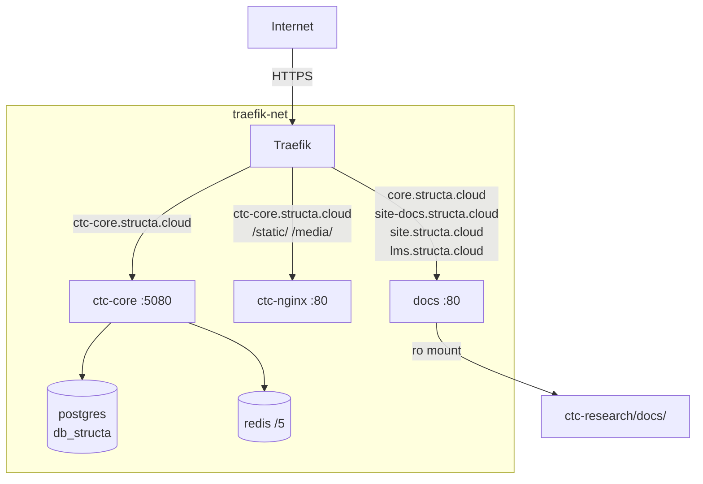

# Design Document: ctc-docs-and-core-containers

**Category Context: Documentation**
- **Category**: Docs
- **Scope**: Documentation systems, content management, API documentation, user guides
- **Related Specs**: comprehensive-project-documentation, ctc-docs-and-core-containers, docs-plugin-enhancement
- **Common Patterns**: Documentation generation, content management, plugin development, API docs
- **Avoid Duplicates**: Check existing docs specs before creating new documentation features


## Overview

This design covers adding two new Docker services to `ctc-research/docker-compose.yml`:

1. **docs** — an `nginx:alpine` container serving docsify-style markdown documentation, reachable via the existing Traefik routes already defined in `compose/traefik/dynamic/docs.yml` (no Traefik config changes needed).
2. **ctc-core** — a Django/Uvicorn container running `core.asgi:application`, following the same build and environment patterns as `ctc-django-main`, reachable via a new dedicated Traefik dynamic config at `compose/traefik/dynamic/ctc-core.yml`.

Both containers join the external `traefik-net` network and follow the conventions already established in the project.

---

## Architecture



The docs container is purely static — nginx serves files from a read-only bind mount of `ctc-research/docs/`. No database or cache dependency.

The ctc-core container uses its own dedicated PostgreSQL database (`db_structa`) on the shared postgres server, and its own Redis database index (`/5`). Because it has its own database, `RUN_SETUP=true` so that migrations are applied on startup.

---

## Components and Interfaces

### docs service

- Image: `nginx:alpine`
- Container name: `docs`
- Volume: `./docs:/usr/share/nginx/html:ro` (bind mount, read-only)
- Config mount: `../compose/nginx/ctc-docsify.conf:/etc/nginx/conf.d/default.conf:ro`
- Network: `traefik-net` (external)
- Healthcheck: `wget -q --spider http://localhost/`
- No host port binding — Traefik routes directly to container port 80

The existing `compose/traefik/dynamic/docs.yml` already routes `core.structa.cloud`, `site-docs.structa.cloud`, `site.structa.cloud`, and `lms.structa.cloud` to `http://docs:80`. The container name `docs` satisfies this without any Traefik config changes.

### ctc-core service

- Build: same as `ctc-django-main` (context `.`, dockerfile `./compose/django/Dockerfile`)
- Container name: `ctc-core`
- Network: `traefik-net` (external)
- Port: 5080 (internal only, no host binding)
- ASGI module: `core.asgi:application`
- Redis DB: `/5` (distinct from main `/3` and demo `/4`)
- `RUN_SETUP=true` — ctc-core has its own `db_structa` database and must run migrations on startup
- Healthcheck: `wget -q --spider http://localhost:5080/health/`

### compose/nginx/ctc-docsify.conf

New nginx config file for the docs container. Modelled on the existing `compose/nginx/docsify.conf` but with `server_name` set to `_` (catch-all, since Traefik handles domain routing) and the correct root path.

### compose/traefik/dynamic/ctc-core.yml

New Traefik dynamic config for the ctc-core container. Follows the same pattern as `ctc-main.yml`:
- HTTP router redirects to HTTPS
- HTTPS router excludes `/static/` and `/media/` paths (routed to `ctc-nginx`)
- Separate `ctc-assets` router for static/media → `ctc-nginx:80`
- TLS via `letsencrypt` cert resolver
- Middlewares: `compress`, `security-headers` (and `csrf-headers` on HTTPS)

### ctc-research/docs/index.html (scaffold)

A minimal docsify `index.html` to bootstrap the docs site if the `docs/` directory doesn't exist yet. Contains the standard docsify CDN setup.

---

## Data Models

No new data models are introduced. The docs container has no database dependency at all. The ctc-core container uses its own dedicated PostgreSQL database (`db_structa`) on the shared postgres server — separate from `db_ctc` used by `ctc-django-main` and `ctc-django-demo`.

> **Note:** The postgres init scripts at `compose/postgres/init.d/` must be updated to create the `db_structa` database and grant the appropriate user permissions. Specifically, `00-create-databases.sql` (or the equivalent init script) should include `CREATE DATABASE db_structa;` and `02-grant-permissions.sql` should grant privileges to the postgres user for `db_structa`.

**Environment variable mapping for ctc-core:**

| Variable | Value |
|---|---|
| `RUNNING_ENV` | `docker` |
| `SERVER_ENV` | `production` |
| `DEBUG` | `False` |
| `PORT` | `5080` |
| `WORKERS` | `4` |
| `APP_MODULE` | `core.asgi:application` |
| `DJANGO_SETTINGS_MODULE` | `configs.settings` |
| `DB_HOST` | `postgres` |
| `DB_NAME` | `db_structa` |
| `REDIS_URL` | `redis://:${REDIS_PASSWORD}@redis:6379/5` |
| `RUN_SETUP` | `true` (own DB, needs migrations) |
| `ALLOWED_HOSTS` | includes core domain |


---

## Correctness Properties

*A property is a characteristic or behavior that should hold true across all valid executions of a system — essentially, a formal statement about what the system should do. Properties serve as the bridge between human-readable specifications and machine-verifiable correctness guarantees.*

### Property 1: Container name matches Traefik service URL hostname

*For any* service defined in `docker-compose.yml` that is referenced by a Traefik dynamic config, the `container_name` of that service must equal the hostname used in the corresponding Traefik `loadBalancer.servers[].url`.

This ensures that Traefik's DNS-based service discovery resolves correctly on the `traefik-net` network. Specifically: `docs` → `http://docs:80` and `ctc-core` → `http://ctc-core:5080`.

**Validates: Requirements 3.1**

### Property 2: Redis database index and PostgreSQL database name uniqueness across Django containers

*For any* two distinct Django containers defined in `ctc-research/docker-compose.yml`, their `REDIS_URL` environment variables must use different database index suffixes (the `/N` path component), and their `DB_NAME` environment variables must be different.

This prevents cache and queue collisions between containers sharing the same Redis instance, and ensures each container with its own database schema does not accidentally share state. The existing assignments are: main=`/3`/`db_ctc`, demo=`/4`/`db_ctc`; ctc-core must use `/5`/`db_structa`.

**Validates: Requirements 5.5**

### Property 3: Service configuration completeness

*For any* service added to `ctc-research/docker-compose.yml`, all fields required by the specification (image or build, container_name, networks, restart policy, healthcheck, environment variables, volumes) must be present and match the specified values.

This is validated by parsing the YAML and asserting each required key-value pair exists for both the `docs` and `ctc-core` services.

**Validates: Requirements 1.1–1.6, 2.1, 4.1–4.7, 5.1–5.7, 7.1–7.4**

### Property 4: Traefik config routing completeness

*For any* Traefik dynamic config file added under `compose/traefik/dynamic/`, all required routers (HTTP redirect, HTTPS app, HTTPS assets), services (app service, nginx service), TLS configuration, and middleware assignments must be present and match the specification.

**Validates: Requirements 6.1–6.6**

---

## Error Handling

**docs container:**
- If `ctc-research/docs/` is empty or missing `index.html`, nginx returns a 404. The scaffold `docs/index.html` prevents this on first deploy.
- Nginx config errors (syntax) will prevent the container from starting. The config is validated by running `nginx -t` during image build or via the healthcheck.
- If the bind mount path doesn't exist on the host, Docker will create an empty directory — the healthcheck will catch a missing `index.html`.

**ctc-core container:**
- `RUN_SETUP=true` means migrations, collectstatic, and superuser creation run on startup. ctc-core has its own `db_structa` database and must apply its own migrations independently of `ctc-django-main`.
- The `db_structa` database must be created on the shared postgres server before ctc-core starts. The postgres init scripts at `compose/postgres/init.d/` must include `CREATE DATABASE db_structa;` and the corresponding `GRANT ALL PRIVILEGES` statement. If the database does not exist, ctc-core will fail to start with a connection error.
- If `core.asgi:application` doesn't exist in the codebase, the container will exit immediately. The healthcheck will mark it unhealthy within 3 intervals.
- Redis DB `/5` must be available on the shared Redis instance. Redis supports up to 16 databases by default (0–15), so `/5` is safe.
- Port 5080 must not conflict with other services. Current assignments: 5070 (main), 5055/5056 (demo), 5075 (rqworker-main), 5076 (rqworker-demo). Port 5080 is free.

**Traefik routing:**
- If `ctc-core.yml` has a syntax error, Traefik will log a warning and skip the file — other routes remain unaffected.
- The `docs.yml` file is unchanged, so existing docs routing is not impacted by this feature.

---

## Testing Strategy

### Dual Testing Approach

Both unit tests and property-based tests are used. Unit tests verify specific configuration examples; property-based tests verify universal invariants across the config files.

### Unit Tests (Configuration Validation)

These tests parse the YAML/nginx config files and assert specific values. They are fast, deterministic, and serve as regression guards.

**docker-compose.yml checks:**
- `docs` service: image=`nginx:alpine`, container_name=`docs`, networks includes `traefik-net`, restart=`unless-stopped`, volume contains `./docs:/usr/share/nginx/html:ro`, no `ports:` mapping, healthcheck test contains `http://localhost/`, retries=3
- `ctc-core` service: container_name=`ctc-core`, build matches `ctc-django-main`, networks includes `traefik-net`, restart=`unless-stopped`, env_file=`.env`, environment contains `APP_MODULE=core.asgi:application`, `PORT=5080`, `WORKERS=4`, `RUN_SETUP=true`, `DB_HOST=postgres`, `DB_NAME=db_structa`, `REDIS_URL` ends with `/5`, healthcheck test contains `http://localhost:5080/health/`, retries=3

**compose/nginx/ctc-docsify.conf checks:**
- Contains `listen 80`
- Contains `try_files $uri $uri/ /index.html`
- Contains `Content-Type "text/markdown` in a `.md` location block
- Contains `gzip on` and `gzip_types` with `text/plain text/css text/javascript application/json`

**compose/traefik/dynamic/ctc-core.yml checks:**
- HTTP router has redirect middleware
- HTTPS router service URL is `http://ctc-core:5080`
- HTTPS router has `compress` and `security-headers` middlewares
- TLS certResolver is `letsencrypt`
- Assets router has PathPrefix `/static/` and `/media/` pointing to `ctc-nginx:80`

### Property-Based Tests

Using **Hypothesis** (already present in the ctc-research project, as evidenced by `.hypothesis/` directory).

**Property 1 test — Container name / Traefik URL consistency:**
```
# Feature: ctc-docs-and-core-containers, Property 1: container name matches Traefik service URL hostname
@given(st.just(load_compose_and_traefik_configs()))
@settings(max_examples=100)
def test_container_name_matches_traefik_url(configs):
    for service_name, traefik_url in configs.traefik_service_urls.items():
        container_name = configs.compose_services[service_name]["container_name"]
        hostname = extract_hostname(traefik_url)
        assert container_name == hostname
```

**Property 2 test — Redis DB index and PostgreSQL DB name uniqueness:**
```
# Feature: ctc-docs-and-core-containers, Property 2: Redis database index and PostgreSQL database name uniqueness across Django containers
@given(st.just(load_compose_django_services()))
@settings(max_examples=100)
def test_redis_db_index_and_db_name_uniqueness(django_services):
    db_indices = [extract_redis_db_index(svc["environment"]["REDIS_URL"])
                  for svc in django_services.values()]
    assert len(db_indices) == len(set(db_indices))
    # DB_NAME uniqueness only required for containers with their own schema
    # (ctc-core uses db_structa; main/demo share db_ctc by design)
    core_db_name = django_services["ctc-core"]["environment"]["DB_NAME"]
    main_db_name = django_services["ctc-django-main"]["environment"]["DB_NAME"]
    assert core_db_name != main_db_name
```

**Property 3 test — Service configuration completeness:**
```
# Feature: ctc-docs-and-core-containers, Property 3: service configuration completeness
@given(st.just(load_compose()))
@settings(max_examples=100)
def test_service_config_completeness(compose):
    for service_name, required_fields in REQUIRED_FIELDS.items():
        service = compose["services"][service_name]
        for field, expected in required_fields.items():
            assert service[field] == expected
```

**Property 4 test — Traefik config routing completeness:**
```
# Feature: ctc-docs-and-core-containers, Property 4: Traefik config routing completeness
@given(st.just(load_traefik_config("ctc-core.yml")))
@settings(max_examples=100)
def test_traefik_config_completeness(config):
    assert_http_redirect_router_exists(config)
    assert_https_app_router_exists(config)
    assert_https_assets_router_exists(config)
    assert_tls_cert_resolver(config, "letsencrypt")
    assert_middlewares(config, ["compress", "security-headers"])
```

Each property test runs a minimum of 100 iterations. Since these tests operate on static config files (not random data), the generators produce the same value each time — the value of these tests is as regression guards that run in CI and catch accidental config drift.
