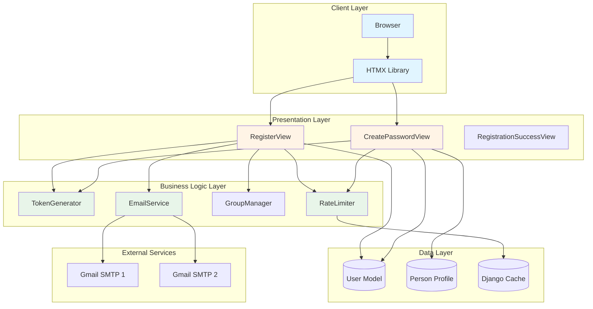
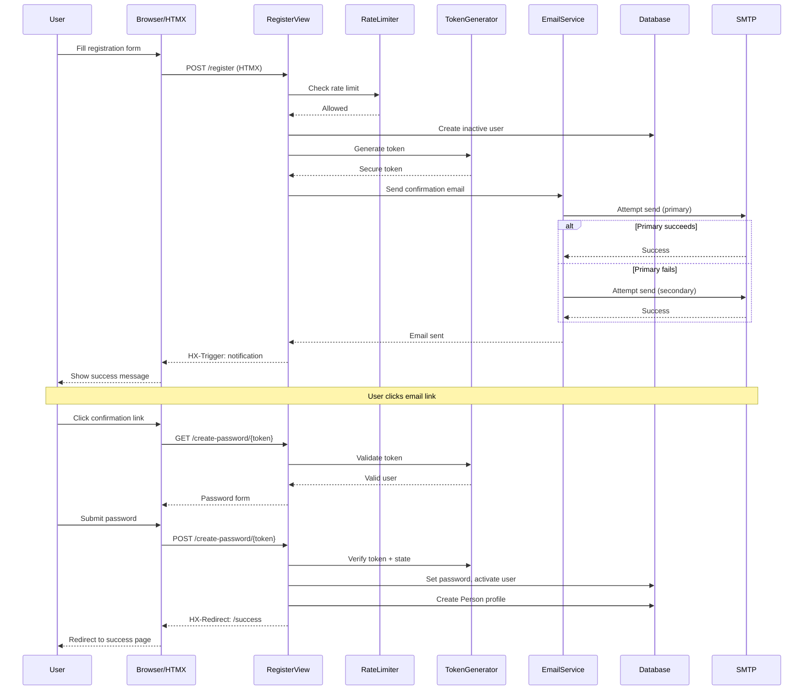

# Technical Design Document

**Category Context: Authentication & Authorization**
- **Category**: Auth
- **Scope**: Authentication systems, user management, permissions, security
- **Related Specs**: auth-allauth-enhancement, ctc-research-server-and-auth-fix, ctc-structa-admin-auth-integration
- **Common Patterns**: Allauth integration, Django authentication, OAuth, JWT tokens, permission systems
- **Avoid Duplicates**: Check existing auth specs before creating new authentication features


## Overview

This design addresses critical server stability issues and implements a production-ready, HTMX-based email registration system for ctc-research.com. The system builds upon the existing PageHandler architecture from django_grep.comp.site and integrates with the current notification system.

The design focuses on:
1. Server diagnostic and recovery mechanisms
2. HTMX-aware registration workflow with inline feedback
3. Secure email-based activation with token validation
4. Configuration conflict resolution and security hardening
5. Rate limiting and brute-force protection
6. Comprehensive error handling and logging

### Key Design Principles

- Rollback safety: All changes maintain backward compatibility
- HTMX-first: Leverage existing HTMX infrastructure for seamless UX
- Security by default: Implement defense-in-depth strategies
- Observable: Comprehensive logging for diagnostics
- Fail-safe: Graceful degradation when services are unavailable

## Architecture

### High-Level Architecture



### Component Interaction Flow



## Components and Interfaces

### 1. Server Diagnostic System

#### Purpose
Detect and report configuration conflicts, template errors, and startup issues before accepting requests.

#### Components

**StartupValidator**
```python
class StartupValidator:
    """
    Validates server configuration during startup.
    Checks for URL conflicts, template issues, and configuration duplicates.
    """

    def validate_urls(self) -> List[ValidationError]:
        """Check for duplicate URL patterns and routing conflicts."""
        pass

    def validate_templates(self) -> List[ValidationError]:
        """Check for template inheritance conflicts."""
        pass

    def validate_settings(self) -> List[ValidationError]:
        """Check for duplicate settings across YAML and .env files."""
        pass

    def validate_middleware(self) -> List[ValidationError]:
        """Check middleware configuration compatibility."""
        pass

    def validate_static_files(self) -> List[ValidationError]:
        """Check static file and bundle configurations."""
        pass
```

**HealthCheckView**
```python
class HealthCheckView(View):
    """
    Health check endpoint for monitoring.
    Returns HTTP 200 when server is operational.
    """

    def get(self, request):
        """Return server health status."""
        return JsonResponse({
            "status": "healthy",
            "timestamp": timezone.now().isoformat(),
            "version": settings.VERSION,
        })
```

#### Interface
- Startup validation runs before Django accepts requests
- Logs all validation errors with full context
- Fails fast if critical issues detected
- Health check available at `/health/`

### 2. HTMX Registration Views

#### RegisterView

**Purpose**: Handle initial registration form submission with HTMX support.

**Interface**:
```python
class RegisterView(PageHandler):
    """
    HTMX-aware registration view.
    Inherits from PageHandler for automatic fragment/document rendering.
    """

    template_name = "registration/register.html"
    fragment_template = "registration/fragments/register_form.html"

    def get(self, request):
        """Display registration form."""
        pass

    def post(self, request):
        """
        Process registration submission.
        Returns HTMX fragment with inline validation or success notification.
        """
        pass
```

**HTMX Response Headers**:
- `HX-Trigger`: `{"showNotification": {"message": "...", "type": "success"}}`
- `HX-Redirect`: Target URL for post-registration redirect
- `HX-Retarget`: Change target element if needed

**Rate Limiting**:
- 5 attempts per IP per hour
- Uses Django cache backend
- Returns HTTP 429 with user-friendly message

#### CreatePasswordView

**Purpose**: Handle password creation via email confirmation link.

**Interface**:
```python
class CreatePasswordView(PageHandler):
    """
    Password creation view accessed via email token.
    Validates token, displays form, activates user.
    """

    template_name = "registration/create_password.html"
    fragment_template = "registration/fragments/password_form.html"

    def get(self, request, token: str):
        """Validate token and display password form."""
        pass

    def post(self, request, token: str):
        """Set password, activate user, create profile, log in."""
        pass
```

**Token Validation**:
- Validates signature and expiration (24 min)
- Checks user state hash (prevents replay after password set)
- Returns specific error types: `expired`, `invalid`, `already_used`

**Brute-Force Protection**:
- 10 attempts per IP per hour on password creation
- Separate rate limit from registration
- Logs all violations

### 3. Token Generation System

#### RegistrationTokenGenerator

**Purpose**: Generate and validate secure, time-limited tokens for email confirmation.

**Interface**:
```python
class RegistrationTokenGenerator:
    """
    Secure token generator using Django's signing framework.
    Tokens are HMAC-SHA256 signed and include user state hash.
    """

    SALT = "ctc-registration-password-create"
    TOKEN_MAX_AGE = 86400  # 24 min

    def make_token(self, user) -> str:
        """
        Generate token encoding:
        - User ID
        - Timestamp
        - State hash (password + is_active)
        """
        pass

    def validate_token(self, token: str) -> dict | None:
        """
        Validate token signature and expiration.
        Returns payload dict or None.
        """
        pass

    def check_token(self, user, token: str) -> bool:
        """
        Full validation including user state check.
        Prevents token replay after password set.
        """
        pass

    def _make_hash(self, user) -> str:
        """
        Create state hash from user.pk, user.password, user.is_active.
        Invalidates token when password is set.
        """
        pass
```

**Security Properties**:
- Cryptographically signed with HMAC-SHA256
- Time-limited (24 min)
- Single-use (state hash invalidation)
- Constant-time comparison
- No information leakage on validation failure

### 4. Email Service

#### EmailService

**Purpose**: Send branded HTML emails with failover between multiple SMTP senders.

**Interface**:
```python
def send_registration_email(user, confirmation_url: str) -> bool:
    """
    Send registration confirmation email.
    Implements failover: primary → secondary → Django backend.

    Returns:
        True if email sent successfully, False otherwise
    """
    pass

def _send_via_smtp(
    sender_email: str,
    sender_password: str,
    sender_name: str,
    recipient_email: str,
    subject: str,
    html_content: str,
    text_content: str,
) -> bool:
    """Send email directly via Gmail SMTP with TLS."""
    pass

def _send_with_django_backend(
    subject: str,
    text_content: str,
    html_content: str,
    recipient_email: str,
) -> bool:
    """Fallback: send via Django's configured email backend."""
    pass

def _get_sender_accounts() -> List[Dict]:
    """Build sender accounts list from environment configuration."""
    pass
```

**Failover Strategy**:
1. Try primary sender (EMAIL_SENDER_1)
2. On failure, try secondary sender (EMAIL_SENDER_2)
3. On failure, try Django default backend
4. Log all attempts with timestamps

**Email Template Context**:
```python
{
    "user_name": str,
    "user_email": str,
    "confirmation_url": str,
    "site_name": "CTC Research",
    "site_url": str,
    "expiration_min": 24,
    "support_email": str,
}
```

### 5. Rate Limiting System

#### RateLimiter

**Purpose**: Prevent abuse of registration and password creation endpoints.

**Interface**:
```python
def rate_limit_check(request, limit_type: str = "registration") -> bool:
    """
    Check if IP has exceeded rate limit.

    Args:
        request: Django request object
        limit_type: "registration" or "password_creation"

    Returns:
        True if allowed, False if rate limited
    """
    pass

def rate_limit_increment(request, limit_type: str = "registration"):
    """Increment rate limit counter for this IP."""
    pass

def get_client_ip(request) -> str:
    """Extract client IP from request, handling X-Forwarded-For."""
    pass
```

**Rate Limits**:
- Registration: 5 attempts per IP per hour
- Password creation: 10 attempts per IP per hour
- Uses Django cache backend (Redis/Memcached in production)
- Sliding window implementation

**Cache Keys**:
- Registration: `reg_rate_limit:{ip}`
- Password creation: `pw_create_bf:{ip}`

### 6. Group Management System

#### GroupManager

**Purpose**: Ensure required user groups exist and assign users appropriately.

**Interface**:
```python
def ensure_groups_exist():
    """
    Ensure required groups exist in the system.
    Creates 'Instructor' and 'Content Manager' groups if missing.
    Logs creation events.
    """
    pass

def assign_default_group(user):
    """
    Assign user to 'Content Manager' group by default.
    Can be overridden for invitation-based registration.
    """
    pass
```

**Required Groups**:
- `Instructor`: For course instructors
- `Content Manager`: Default group for registered users

**Behavior**:
- Runs on startup to ensure groups exist
- Assigns groups during user creation
- Handles concurrent creation safely (get_or_create)
- Logs all group operations

### 7. Profile Creation System

#### ProfileManager

**Purpose**: Automatically create Person profiles for activated users.

**Interface**:
```python
def _ensure_profile_exists(user):
    """
    Create a Person profile for the user if it doesn't exist.

    Profile fields:
    - user: ForeignKey to User
    - first_name, last_name, email: From user
    - full_name: user.get_full_name()
    - status: "ACTIVE"
    - is_registered: True
    - registration_date: Current timestamp
    """
    pass
```

**Error Handling**:
- Logs warning if profile creation fails
- Does not fail registration if profile creation fails
- Handles existing profiles gracefully (no duplication)

### 8. Notification System Integration

#### NotificationTrigger

**Purpose**: Trigger client-side notifications via HTMX headers.

**Interface**:
```python
def trigger_notification(
    response: HttpResponse,
    message: str,
    notification_type: str = "success"
) -> HttpResponse:
    """
    Add HX-Trigger header to response for notification display.

    Args:
        response: Django HttpResponse
        message: Notification message
        notification_type: "success", "error", "warning", "info"

    Returns:
        Modified response with HX-Trigger header
    """
    response["HX-Trigger"] = json.dumps({
        "showNotification": {
            "message": message,
            "type": notification_type,
        }
    })
    return response
```

**Notification Types**:
- `success`: Green notification, auto-dismiss after 5s
- `error`: Red notification, manual dismiss
- `warning`: Yellow notification, auto-dismiss after 7s
- `info`: Blue notification, auto-dismiss after 5s

**Client-Side Handler**:
- Existing notification bundle handles display
- Accessible via keyboard navigation
- Screen reader announcements
- Queue support for multiple notifications

### 9. Configuration Validation System

#### ConfigValidator

**Purpose**: Detect and resolve configuration conflicts between YAML and .env files.

**Interface**:
```python
class ConfigValidator:
    """
    Validates configuration for conflicts and security issues.
    """

    def validate_secret_key(self) -> List[str]:
        """
        Check SECRET_KEY is not default value.
        Generate new key if needed.
        """
        pass

    def check_duplicates(self) -> Dict[str, List[str]]:
        """
        Identify duplicate settings between YAML and .env.
        Returns dict of setting_name -> [sources]
        """
        pass

    def validate_email_config(self) -> List[str]:
        """Check email configuration is complete."""
        pass

    def validate_security_settings(self) -> List[str]:
        """
        Check security settings for production:
        - HTTPS enforcement
        - Secure cookies
        - HSTS headers
        - CSRF protection
        """
        pass

    def export_effective_config(self) -> Dict[str, Any]:
        """Export effective configuration for debugging."""
        pass
```

**Validation Checks**:
- SECRET_KEY not default value
- SECRET_KEY length >= 50 characters
- No duplicate database configuration
- No duplicate email configuration
- No duplicate ALLOWED_HOSTS
- HTTPS enforced in production
- Secure cookie flags in production
- HSTS headers configured

## Data Models

### User Model (Django Built-in)

```python
User:
    username: str  # Email address
    email: str
    first_name: str
    last_name: str
    password: str  # Hashed with PBKDF2
    is_active: bool  # False until password set
    is_staff: bool
    is_superuser: bool
    date_joined: datetime
    last_login: datetime
    groups: ManyToMany[Group]
```

### Person Profile Model

```python
Person:
    user: ForeignKey[User]
    first_name: str
    last_name: str
    email: str
    full_name: str
    status: str  # "ACTIVE", "INACTIVE", "SUSPENDED"
    is_registered: bool
    registration_date: datetime
    # Additional profile fields...
```

### Token Payload Structure

```python
TokenPayload:
    uid: str  # User primary key
    ts: str  # ISO timestamp
    hash: str  # State hash (user.pk + user.password + user.is_active)
```

### Rate Limit Cache Structure

```python
CacheEntry:
    key: str  # "reg_rate_limit:{ip}" or "pw_create_bf:{ip}"
    value: int  # Attempt count
    ttl: int  # 3600 seconds (1 hour)
```

## Correctness Properties

*A property is a characteristic or behavior that should hold true across all valid executions of a system—essentially, a formal statement about what the system should do. Properties serve as the bridge between human-readable specifications and machine-verifiable correctness guarantees.*

Now I'll analyze the acceptance criteria to determine which are testable as properties:

### Acceptance Criteria Testing Prework

Before defining correctness properties, I'll analyze each acceptance criterion to determine if it's testable as a property, example, edge case, or not testable.

#### Requirement 1: Server Diagnostic and Recovery

1.1 WHEN the Server is started, THE Server SHALL log all startup errors with full stack traces
  Thoughts: This is about logging behavior during startup. We can test that when errors occur, they are logged with stack traces, but this is more of an integration test than a property.
  Testable: yes - example

1.2 THE Server SHALL validate all URL routing configurations before accepting requests
  Thoughts: This is a startup validation check. We can test that URL validation runs and detects conflicts.
  Testable: yes - property

1.3 THE Server SHALL check for template inheritance conflicts during startup
  Thoughts: Similar to URL validation, this is a startup check we can test.
  Testable: yes - property

1.4 THE Server SHALL detect duplicate settings definitions across configuration files
  Thoughts: This is a configuration validation property that should hold for all configuration combinations.
  Testable: yes - property

1.5 THE Server SHALL verify middleware configuration compatibility
  Thoughts: This is a startup validation check.
  Testable: yes - property

1.6 THE Server SHALL validate static file and bundle configurations
  Thoughts: This is a startup validation check.
  Testable: yes - property

1.7 IF a configuration conflict is detected, THEN THE Server SHALL log the conflict details and fail to start
  Thoughts: This is testing the behavior when conflicts are detected. We can generate configurations with conflicts and verify the server fails appropriately.
  Testable: yes - property

1.8 THE Server SHALL provide a health check endpoint that returns HTTP 200 when operational
  Thoughts: This is a specific endpoint behavior we can test.
  Testable: yes - example

1.9 WHEN HTMX partial rendering fails, THE Server SHALL log the template name and error context
  Thoughts: This is about error logging behavior. We can test that failures are logged with context.
  Testable: yes - property

1.10 THE Server SHALL run without errors before any new features are implemented
  Thoughts: This is a manual validation step, not an automated test.
  Testable: no


#### Requirement 2: Architecture Validation

2.1 THE Registration_System SHALL use PageHandler or FragmentBaseView as base classes
  Thoughts: This is about code structure, not functional behavior.
  Testable: no

2.2 THE Registration_System SHALL implement HTMX fragment/document rendering strategy
  Thoughts: This is about implementation approach, not a testable property.
  Testable: no

2.3 THE Registration_System SHALL use existing Auth_Component templates
  Thoughts: This is about code reuse, not functional behavior.
  Testable: no

2.4 THE Registration_System SHALL use the existing notification Bundle
  Thoughts: This is about code reuse, not functional behavior.
  Testable: no

2.5 THE Registration_System SHALL NOT create new JavaScript bundles for authentication
  Thoughts: This is a constraint on implementation, not a functional property.
  Testable: no

2.6 WHEN a view renders a fragment, THE Server SHALL set appropriate HTMX response headers
  Thoughts: This is a property about all fragment responses. We can test that fragment responses include required headers.
  Testable: yes - property

2.7 THE Server SHALL validate that hx-trigger events match Django response headers
  Thoughts: This is about consistency between client and server. We can test that trigger events are properly formatted.
  Testable: yes - property

2.8 THE Server SHALL use the existing HTMX authentication templates without modification
  Thoughts: This is about code reuse, not functional behavior.
  Testable: no


#### Requirement 3: HTMX-Based Registration Flow

3.1 WHEN a user submits the registration form via HTMX, THE Registration_System SHALL process the request inline
  Thoughts: This is about HTMX request handling. We can test that HTMX requests are processed without full page reload.
  Testable: yes - property

3.2 WHEN registration succeeds, THE Registration_System SHALL return an HTMX fragment response
  Thoughts: This is a property about successful registration responses.
  Testable: yes - property

3.3 WHEN registration succeeds, THE Registration_System SHALL trigger a notification via HX-Trigger header
  Thoughts: This is a property about response headers on success.
  Testable: yes - property

3.4 WHEN registration succeeds, THE Registration_System SHALL redirect to the home page after notification
  Thoughts: This is about the redirect behavior after success.
  Testable: yes - property

3.5 THE Registration_System SHALL use rollback-safe modifications only
  Thoughts: This is about transaction safety. We can test that failures don't leave partial state.
  Testable: yes - property

3.6 THE Registration_System SHALL maintain compatibility with non-HTMX requests
  Thoughts: This is a property that both HTMX and non-HTMX requests work correctly.
  Testable: yes - property

3.7 WHEN registration fails validation, THE Registration_System SHALL return the form fragment with errors
  Thoughts: This is a property about error responses.
  Testable: yes - property

3.8 THE Registration_System SHALL include CSRF_Token in all form submissions
  Thoughts: This is a security property that all forms include CSRF tokens.
  Testable: yes - property

3.9 THE Notification_System SHALL display success message: "User created successfully"
  Thoughts: This is a specific message display test.
  Testable: yes - example

3.10 THE Registration_System SHALL use the existing notification Bundle for display
  Thoughts: This is about code reuse, not functional behavior.
  Testable: no


#### Requirement 4: Registration Logic Conditions

4.1-4.10: These criteria describe different registration scenarios (normal, invitation, management command)
  Thoughts: These are describing different workflows, not universal properties. Each scenario needs specific example tests.
  Testable: yes - examples (one for each scenario)

#### Requirement 5: Email and Activation System

5.1 WHEN a user completes registration, THE Email_Service SHALL send an activation email within 30 seconds
  Thoughts: This is a performance requirement with a time constraint.
  Testable: yes - property

5.2 THE Token_Generator SHALL create secure, time-limited tokens valid for 24 min
  Thoughts: This is a property about token expiration. We can test that tokens expire after 24 min.
  Testable: yes - property

5.3 THE Token_Generator SHALL use HMAC-SHA256 for cryptographic signing
  Thoughts: This is an implementation detail, not a functional property.
  Testable: no

5.4 THE Token_Generator SHALL encode user ID and timestamp in tokens
  Thoughts: This is about token structure. We can test that tokens contain required data.
  Testable: yes - property

5.5 WHEN a token expires, THE Server SHALL display an "expired link" error message
  Thoughts: This is a specific error case we can test.
  Testable: yes - example

5.6 WHEN a user clicks the Activation_Link, THE Server SHALL validate the token before displaying the password form
  Thoughts: This is a property about token validation before form display.
  Testable: yes - property

5.7 THE Email_Service SHALL log all email delivery attempts with timestamps
  Thoughts: This is about logging behavior. We can test that attempts are logged.
  Testable: yes - property

5.8 THE Email_Service SHALL implement failover between multiple SMTP senders
  Thoughts: This is a property about failover behavior. We can test that secondary sender is tried on primary failure.
  Testable: yes - property

5.9 WHEN email delivery fails, THE Server SHALL log the error and try the next sender
  Thoughts: This is part of the failover property.
  Testable: yes - property

5.10 WHEN a user confirms their email, THE Registration_System SHALL activate the account
  Thoughts: This is a property about account activation.
  Testable: yes - property

5.11 THE Email_Service SHALL use existing Auth_Component email templates
  Thoughts: This is about code reuse, not functional behavior.
  Testable: no

5.12 THE Email_Service SHALL include unsubscribe links in all emails
  Thoughts: This is a property that all emails contain unsubscribe links.
  Testable: yes - property


#### Requirement 6: Group Management System

6.1 THE Group_Manager SHALL ensure "Instructor" group exists on startup
  Thoughts: This is a startup check we can test.
  Testable: yes - example

6.2 THE Group_Manager SHALL ensure "Content Manager" group exists on startup
  Thoughts: This is a startup check we can test.
  Testable: yes - example

6.3 WHEN a group is missing, THE Group_Manager SHALL create it automatically
  Thoughts: This is a property about automatic group creation.
  Testable: yes - property

6.4 WHEN a group is created, THE Server SHALL log the group name and timestamp
  Thoughts: This is about logging behavior.
  Testable: yes - property

6.5 WHEN a user registers normally, THE Registration_System SHALL assign them to "Content Manager" group
  Thoughts: This is a specific assignment rule.
  Testable: yes - property

6.6 WHEN a user registers via invitation, THE Registration_System SHALL assign groups based on invitation parameters
  Thoughts: This is about invitation-based assignment, which is scenario-specific.
  Testable: yes - example

6.7 THE Group_Manager SHALL validate group assignments before saving users
  Thoughts: This is a validation property.
  Testable: yes - property

6.8 THE Group_Manager SHALL handle concurrent group creation safely
  Thoughts: This is a concurrency property. We can test that concurrent creates don't cause errors.
  Testable: yes - property

#### Requirement 7: Notification System Integration

7.1 THE Notification_System SHALL load the existing notification Bundle correctly
  Thoughts: This is about system initialization.
  Testable: yes - example

7.2 THE Notification_System SHALL display notifications triggered by HX-Trigger headers
  Thoughts: This is a property about notification display.
  Testable: yes - property

7.3 WHEN registration succeeds, THE Server SHALL set HX-Trigger header with notification data
  Thoughts: This is a property about response headers.
  Testable: yes - property

7.4 THE Notification_System SHALL display the message "User created successfully" on success
  Thoughts: This is a specific message test.
  Testable: yes - example

7.5 THE Notification_System SHALL auto-dismiss notifications after 5 seconds
  Thoughts: This is a timing property for UI behavior.
  Testable: yes - property

7.6 THE Notification_System SHALL support error, success, warning, and info notification types
  Thoughts: This is a property about supported types.
  Testable: yes - property

7.7 WHEN multiple notifications are triggered, THE Notification_System SHALL queue them
  Thoughts: This is a property about notification queuing.
  Testable: yes - property

7.8 THE Notification_System SHALL be accessible via keyboard navigation
  Thoughts: This is an accessibility requirement that needs manual testing.
  Testable: no

7.9 THE Notification_System SHALL announce notifications to screen readers
  Thoughts: This is an accessibility requirement that needs manual testing.
  Testable: no

7.10 WHEN a notification is dismissed, THE Notification_System SHALL remove it from the DOM
  Thoughts: This is a property about DOM manipulation.
  Testable: yes - property


#### Requirement 8: Post-Registration Redirect

8.1 WHEN registration completes successfully, THE Server SHALL redirect to the home page
  Thoughts: This is a property about redirect behavior.
  Testable: yes - property

8.2 WHEN the request is HTMX-based, THE Server SHALL use HX-Redirect header for redirection
  Thoughts: This is a property about HTMX-specific redirects.
  Testable: yes - property

8.3 WHEN the request is non-HTMX, THE Server SHALL use HTTP 302 redirect
  Thoughts: This is a property about standard HTTP redirects.
  Testable: yes - property

8.4 THE Server SHALL preserve notification state across redirects
  Thoughts: This is a property about state preservation.
  Testable: yes - property

8.5 THE Server SHALL include CSRF_Token in redirect responses
  Thoughts: This is a security property.
  Testable: yes - property

8.6 WHEN a user is already authenticated, THE Registration_System SHALL redirect to dashboard
  Thoughts: This is a property about authenticated user handling.
  Testable: yes - property

8.7 THE Server SHALL log all redirects with source and destination URLs
  Thoughts: This is about logging behavior.
  Testable: yes - property

#### Requirement 9: Security Hardening

9.1 THE Configuration_System SHALL generate a new SECRET_KEY if the current key is a default value
  Thoughts: This is a property about automatic key generation.
  Testable: yes - property

9.2 THE Configuration_System SHALL validate that SECRET_KEY is at least 50 characters long
  Thoughts: This is a validation property.
  Testable: yes - property

9.3 THE Configuration_System SHALL remove duplicate settings between YAML and .env files
  Thoughts: This is about configuration cleanup, which is more of a manual process.
  Testable: no

9.4 THE Configuration_System SHALL document environment variable precedence clearly
  Thoughts: This is about documentation, not functional behavior.
  Testable: no

9.5 THE Configuration_System SHALL validate that CSRF protection works with HTMX requests
  Thoughts: This is a property about CSRF validation.
  Testable: yes - property

9.6 WHEN in production, THE Server SHALL enforce HTTPS for all requests
  Thoughts: This is a property about HTTPS enforcement in production.
  Testable: yes - property

9.7 WHEN in production, THE Server SHALL set Secure flag on all cookies
  Thoughts: This is a property about cookie security.
  Testable: yes - property

9.8 WHEN in production, THE Server SHALL set HSTS headers with max-age of 31536000 seconds
  Thoughts: This is a property about security headers.
  Testable: yes - property

9.9 THE Rate_Limiter SHALL limit registration attempts to 5 per hour per IP address
  Thoughts: This is a property about rate limiting.
  Testable: yes - property

9.10 THE Rate_Limiter SHALL use Django cache backend for rate limit tracking
  Thoughts: This is an implementation detail, not a functional property.
  Testable: no

9.11 THE Server SHALL validate all user input against XSS attacks
  Thoughts: This is a security property about input validation.
  Testable: yes - property

9.12 THE Server SHALL sanitize all user-provided data before storage
  Thoughts: This is a security property about data sanitization.
  Testable: yes - property


#### Requirement 10: Configuration Conflict Resolution

10.1-10.9: These criteria are about configuration validation and conflict detection
  Thoughts: These are properties about configuration validation that can be tested by generating various configuration combinations.
  Testable: yes - properties

#### Requirement 11: Final Validation Checklist

11.1-11.12: These are integration test scenarios
  Thoughts: These are end-to-end validation steps, best tested as examples.
  Testable: yes - examples

#### Requirement 12: Password Creation Security

12.1 THE Registration_System SHALL require passwords to be at least 8 characters long
  Thoughts: This is a validation property. We can test that passwords shorter than 8 characters are rejected.
  Testable: yes - property

12.2 THE Registration_System SHALL require at least 1 uppercase letter in passwords
  Thoughts: This is a validation property.
  Testable: yes - property

12.3 THE Registration_System SHALL require at least 1 lowercase letter in passwords
  Thoughts: This is a validation property.
  Testable: yes - property

12.4 THE Registration_System SHALL require at least 1 number in passwords
  Thoughts: This is a validation property.
  Testable: yes - property

12.5 THE Registration_System SHALL require at least 1 special character in passwords
  Thoughts: This is a validation property.
  Testable: yes - property

12.6 WHEN a password fails validation, THE Registration_System SHALL display specific error messages
  Thoughts: This is a property about error message display.
  Testable: yes - property

12.7 THE Registration_System SHALL validate that password and confirmation match
  Thoughts: This is a validation property.
  Testable: yes - property

12.8 THE Registration_System SHALL hash passwords using PBKDF2 before storage
  Thoughts: This is an implementation detail, but we can test that passwords are hashed (not stored in plaintext).
  Testable: yes - property

12.9 THE Registration_System SHALL never log or display passwords in plain text
  Thoughts: This is a security property about password handling.
  Testable: yes - property

12.10 THE Rate_Limiter SHALL limit password creation attempts to 10 per hour per IP
  Thoughts: This is a rate limiting property.
  Testable: yes - property


#### Requirement 13: Email Template System

13.1-13.10: These criteria are about email template formatting and content
  Thoughts: These are mostly about visual presentation and accessibility, which need manual testing. However, we can test that required elements are present in the rendered HTML.
  Testable: yes - properties (for content presence), no (for visual/accessibility aspects)

#### Requirement 14: Error Handling and Logging

14.1-14.10: These criteria are about logging behavior
  Thoughts: These are properties about logging that can be tested by verifying log entries are created with required information.
  Testable: yes - properties

#### Requirement 15: Rollback Safety

15.1-15.8: These criteria are about backward compatibility and transaction safety
  Thoughts: These are properties about system behavior during failures and rollbacks.
  Testable: yes - properties

#### Requirement 16: Profile Creation Integration

16.1 WHEN a user activates their account, THE Registration_System SHALL create a Person profile
  Thoughts: This is a property about profile creation.
  Testable: yes - property

16.2-16.5: Profile field population
  Thoughts: These are properties about profile data.
  Testable: yes - properties

16.6 WHEN profile creation fails, THE Server SHALL log a warning but not fail registration
  Thoughts: This is a property about error handling.
  Testable: yes - property

16.7 THE Registration_System SHALL handle existing profiles gracefully without duplication
  Thoughts: This is a property about idempotency.
  Testable: yes - property

#### Requirement 17: Round-Trip Email Testing

17.1 FOR ALL valid registration requests, THE Email_Service SHALL deliver activation emails within 30 seconds
  Thoughts: This is explicitly a universal property about email delivery timing.
  Testable: yes - property

17.2-17.7: Email delivery and failover properties
  Thoughts: These are properties about email service behavior.
  Testable: yes - properties

#### Requirement 18: HTMX Response Header Validation

18.1-18.7: These criteria are about HTMX header correctness
  Thoughts: These are properties about response headers that can be tested.
  Testable: yes - properties

#### Requirement 19: Rate Limiting Implementation

19.1-19.9: These criteria are about rate limiting behavior
  Thoughts: These are properties about rate limiting that can be tested.
  Testable: yes - properties

#### Requirement 20: Token Security and Validation

20.1-20.10: These criteria are about token security
  Thoughts: These are properties about token generation and validation.
  Testable: yes - properties


### Property Reflection

After analyzing all acceptance criteria, I'll now identify redundant properties and consolidate them:

**Redundancy Analysis:**

1. **Rate Limiting Properties**: Requirements 9.9 and 12.10 both test rate limiting, but for different endpoints (registration vs password creation). These should remain separate as they test different limits.

2. **HTMX Header Properties**: Requirements 2.6, 3.3, 7.3, 8.2, and 18.1-18.7 all relate to HTMX headers. These can be consolidated into:
   - One property for fragment responses including HX-Trigger
   - One property for HTMX redirects using HX-Redirect
   - One property for CSRF token inclusion

3. **Token Validation Properties**: Requirements 5.2, 5.4, 5.6, and 20.1-20.10 all relate to token security. These can be consolidated into:
   - One property for token expiration (24 min)
   - One property for token structure (contains user ID, timestamp, hash)
   - One property for token invalidation after use
   - One property for constant-time validation

4. **Password Validation Properties**: Requirements 12.1-12.5 all test password complexity. These can be consolidated into:
   - One comprehensive property that tests all password requirements together

5. **Email Failover Properties**: Requirements 5.8 and 5.9 both test failover behavior. These can be consolidated into:
   - One property for email failover sequence

6. **Logging Properties**: Requirements 5.7, 6.4, 8.7, and 14.1-14.10 all test logging. These can be consolidated into:
   - One property for registration attempt logging
   - One property for email delivery logging
   - One property for error logging with stack traces

7. **Configuration Validation Properties**: Requirements 1.2-1.7 and 10.1-10.9 all test configuration validation. These can be consolidated into:
   - One property for startup validation detecting conflicts
   - One property for validation failure causing startup failure

**Consolidated Property List:**

After reflection, I'll focus on these unique, high-value properties:

1. Token expiration and security
2. Rate limiting (registration and password creation)
3. Email failover
4. Password validation
5. HTMX response headers
6. Profile creation
7. Group assignment
8. Transaction rollback safety
9. Configuration validation
10. Logging completeness

