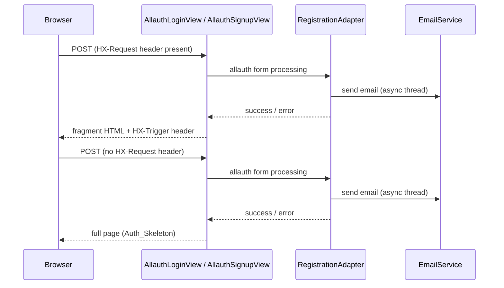

# Design Document: ctc-structa-admin-auth-integration

**Category Context: Authentication & Authorization**
- **Category**: Auth
- **Scope**: Authentication systems, user management, permissions, security
- **Related Specs**: auth-allauth-enhancement, ctc-research-server-and-auth-fix, ctc-structa-admin-auth-integration
- **Common Patterns**: Allauth integration, Django authentication, OAuth, JWT tokens, permission systems
- **Avoid Duplicates**: Check existing auth specs before creating new authentication features


## Overview

This feature covers five coordinated workstreams across the monorepo:

1. **Port conflict audit and cleanup** — fix hardcoded `5080` references in `ctc-research/configs/` that should be `5070` (the canonical CTC_App port).
2. **Utility script migration** — extract the five stale base-directory scripts into proper Django management commands, then delete the originals.
3. **Structa.cloud parity** — port server-diagnostic, health-check, config-validation, security-hardening, and allauth `PageHandler`/`RegistrationAdapter`/`AuthEmailTemplate` patterns to `structa.cloud/core`.
4. **Feature comparison documentation** — produce `/docs/feature-comparison.md`.
5. **Django Unfold admin + allauth wiring for ctc-research** — install `django-unfold`, configure navigation groups, and wire up the `auth-allauth-enhancement` plan inside `ctc-research`.

All changes are additive and rollback-safe. The root `docker-compose.yml` and `ctc-research/docker-compose.yml` are read-only.

---

## Architecture

```mermaid
graph TD
    subgraph ctc-research [ctc-research PORT=5070]
        CTC_Conf["configs/settings/conf.py\nPORT default → 5070"]
        CTC_Sec["configs/settings/ENV/security.yml\ndefault CORS/CSRF → 5070"]
        CTC_Cmds["apps/handlers/management/commands/\n+ populate_content\n+ update_site_settings\n+ verify_content\n+ verify_deployment\n+ run_campaign_worker\n+ send_test_email"]
        CTC_Unfold["INSTALLED_APPS: unfold\nUNFOLD[SIDEBAR] groups"]
        CTC_Allauth["apps/handlers/registration/\nAllauthLoginView\nAllauthSignupView\nRegistrationAdapter\nAuthEmailTemplate\nTokenGenerator"]
        CTC_Admin["/admin/ → Unfold\n/cms/ → Wagtail"]
    end

    subgraph structa [structa.cloud/core PORT=5080]
        SC_Health["/health/ endpoint"]
        SC_Diag["Server diagnostic\nstartup validation"]
        SC_Cmds["apps/handlers/management/commands/\n+ validate_config (ported)\n+ verify_deployment (new)"]
        SC_Allauth["apps/handlers/registration/ (new)\nRegistrationAdapter\nAuthEmailTemplate\nAllauthLoginView\nAllauthSignupView"]
    end

    subgraph docs [/docs/]
        FC["feature-comparison.md"]
    end

    CTC_Cmds -->|shared interface| SC_Cmds
    CTC_Allauth -.->|parity pattern| SC_Allauth
```

### Request Flow — Allauth HTMX vs Full-Page (both projects)



---

## Components and Interfaces

### 1. Port Conflict Fix

Two files in `ctc-research/` require targeted edits:

**`ctc-research/configs/settings/conf.py`**
- `PORT: int = Field(default=5080, ...)` → `default=5070`
- Warning message in `validate_environment()` referencing `5080` → `5070`

**`ctc-research/configs/settings/ENV/security.yml`** — `default` block only:
- Remove `http://localhost:5080` and `http://127.0.0.1:5080` from `CORS_ALLOWED_ORIGINS`
- Remove `http://localhost:5080` and `http://127.0.0.1:5080` from `CSRF_TRUSTED_ORIGINS`
- The `5070` entries already present in the `default` block are kept as-is
- `demo` and `production` blocks are untouched (they intentionally reference both ports for inter-service CORS)

### 2. Management Commands

All new commands live under `apps/handlers/management/commands/` in their respective project.

#### 2a. `populate_content` (ctc-research only)

Extracts the logic from `populate_content.py`. Accepts `--content-file` (path to markdown) and `--locale` (optional language code filter).

```python
class Command(BaseCommand):
    help = "Populate Wagtail pages with multilingual content from a markdown file"

    def add_arguments(self, parser):
        parser.add_argument("--content-file", required=True, help="Path to content markdown file")
        parser.add_argument("--locale", default=None, help="Limit to a single locale code (e.g. 'en')")
```

#### 2b. `update_site_settings` (ctc-research only)

Extracts the logic from `update_footer_settings.py`. Accepts `--logo-path` and `--social-json`.

```python
class Command(BaseCommand):
    help = "Update GlobalSettings with logo image and social link data"

    def add_arguments(self, parser):
        parser.add_argument("--logo-path", required=True, help="Path to logo image file")
        parser.add_argument("--social-json", default=None, help="JSON string or file path for social links")
```

#### 2c. `verify_content` (ctc-research only)

Extracts the logic from `verify_content.py`. Generates a markdown report of all published Wagtail pages.

```python
class Command(BaseCommand):
    help = "Generate a markdown report of all published Wagtail pages"

    def add_arguments(self, parser):
        parser.add_argument("--output", default="docs/added_content.md", help="Output file path")
```

#### 2d. `verify_deployment` (both projects)

Extracts the logic from `verify-demo-config.sh`. Checks Docker container status, network, ports, env vars, Traefik config, and service health. Identical interface in both projects.

```python
class Command(BaseCommand):
    help = "Verify deployment: container status, network, ports, env vars, Traefik, health"

    def add_arguments(self, parser):
        parser.add_argument(
            "--container",
            default=None,
            help="Container name to inspect (default: auto-detected from RUNNING_ENV)",
        )

    def handle(self, *args, **options):
        # Returns exit code 0 on all-pass, 1 on any failure
        ...
```

Checks performed (colour-coded pass/fail/warn):
1. Docker Compose config validity
2. Container running status
3. Network connectivity (`traefik-net`)
4. Port exposure
5. Environment variables (`PORT`, `DEBUG`, `DB_NAME`)
6. Traefik routing config file
7. Dependency services (postgres, redis, traefik)
8. Container health check status

#### 2e. `run_campaign_worker` (ctc-research only)

Extracts the logic from `worker.py`. Starts the Temporal workflow worker.

```python
class Command(BaseCommand):
    help = "Start the Temporal workflow worker for the campaigns task queue"

    def add_arguments(self, parser):
        parser.add_argument(
            "--task-queue",
            default="campaigns-task-queue",
            help="Temporal task queue name",
        )
```

Reads `TEMPORAL_SERVER_URL` from settings (default: `localhost:7233`).

#### 2f. `send_test_email` (ctc-research — ported from structa.cloud/core)

Ports the existing `structa.cloud/core/apps/handlers/management/commands/send_test_email.py` to ctc-research, delegating to the multi-sender `emails.py` service.

```python
class Command(BaseCommand):
    help = "Send a test email to verify configuration"

    def add_arguments(self, parser):
        parser.add_argument("--email", type=str, required=True, help="Recipient email address")
```

### 3. Structa.cloud Server Diagnostic and Health Check

#### 3a. Health Check Endpoint

Add a `/health/` URL and view to `structa.cloud/core`:

```python
# apps/handlers/site/health.py
from django.http import JsonResponse

def health_check(request):
    return JsonResponse({"status": "ok"}, status=200)
```

Registered in `apps/urls.py`:
```python
path("health/", health_check, name="health-check"),
```

#### 3b. Server Diagnostic Middleware / AppConfig.ready()

Port the startup validation pattern from `ctc-research` to `structa.cloud/core/apps/handlers/apps.py`:

```python
class HandlersConfig(AppConfig):
    def ready(self):
        from .startup import run_startup_checks
        run_startup_checks()
```

`run_startup_checks()` validates:
- `SECRET_KEY` length ≥ 50 characters
- `SECRET_KEY` is not the default placeholder
- No duplicate settings across YAML files
- URL routing resolves without errors
- Middleware list compatibility

#### 3c. `validate_config` command (structa.cloud/core)

Port `ctc-research/apps/handlers/management/commands/validate_config.py` to `structa.cloud/core/apps/handlers/management/commands/validate_config.py`.

The only difference is the `project_root` path resolution:
```python
# parents: [0]=commands, [1]=management, [2]=handlers, [3]=apps, [4]=project_root
project_root = Path(__file__).resolve().parents[4]  # …/structa.cloud/core
```

Same `--export-effective` flag, same duplicate detection, same SECRET_KEY validation.

### 4. Structa.cloud Security Hardening Parity

The `structa.cloud/core/configs/settings/ENV/security.yml` already has the correct production security settings (HSTS, secure cookies, proxy SSL header). The gaps to address:

- `RATE_LIMIT_LOGIN_ATTEMPTS: 5` in production block — already present ✓
- `X_FRAME_OPTIONS: "DENY"` — already present ✓
- `SECURE_CONTENT_TYPE_NOSNIFF: true` — already present ✓
- `SECURE_PROXY_SSL_HEADER` — already present ✓

The main gap is the **startup validation** (Req 3.4–3.8) which is addressed by the `run_startup_checks()` in section 3b.

### 5. Structa.cloud Allauth Integration Parity

Create `structa.cloud/core/apps/handlers/registration/` mirroring the ctc-research pattern:

```
structa.cloud/core/apps/handlers/registration/
    __init__.py
    adapter.py          # RegistrationAdapter (DefaultAccountAdapter subclass)
    allauth_views.py    # AllauthLoginView, AllauthSignupView (PageHandler subclasses)
    emails.py           # send_registration_email, send_signin_success_email
    models.py           # AuthEmailTemplate snippet
    signals.py          # user_logged_in → send_signin_success_email
    tokens.py           # RegistrationTokenGenerator with make_allauth_compatible_token
    urls.py             # URL patterns
    wagtail_hooks.py    # Register AuthEmailTemplate under "Auth & Email"
    apps.py
    migrations/
```

The implementation mirrors `ctc-research/apps/handlers/registration/` with these adaptations:
- `site_url` defaults to `https://structa.cloud` instead of `https://ctc-research.com`
- `site_name` in email context is `"Structa"` instead of `"CTC Research"`
- `DEFAULT_FROM_EMAIL` fallback is `support@structa.cloud`

Settings additions to `structa.cloud/core/configs/settings/`:
```python
ACCOUNT_ADAPTER = "apps.handlers.registration.adapter.RegistrationAdapter"
INSTALLED_APPS += ["allauth", "allauth.account", "allauth.socialaccount"]
```

### 6. Feature Comparison Documentation

`/docs/feature-comparison.md` — a markdown table comparing features across both projects. Structure:

| Feature | ctc-research | structa.cloud/core | Parity Status |
|---|---|---|---|
| Registration system (`apps/handlers/registration/`) | ✅ Full | ❌ Missing → ✅ Added by this spec | Added |
| Allauth integration | ✅ Full | ❌ Missing → ✅ Added by this spec | Added |
| Django Unfold admin | ❌ Missing → ✅ Added by this spec | ❌ Not applicable | N/A for structa |
| LMS (courses, modules, lessons, quizzes, certs) | ✅ Full | ✅ Full | Parity |
| Newsletter app | ✅ Present | ❌ Missing | Planned |
| Blog app | ✅ Present | ✅ Present | Parity |
| `validate_config` command | ✅ Present | ❌ Missing → ✅ Added | Added |
| `verify_deployment` command | ❌ Missing → ✅ Added | ❌ Missing → ✅ Added | Added |
| `send_test_email` command | ❌ Missing → ✅ Added | ✅ Present | Added |
| Health check endpoint `/health/` | ✅ Present | ❌ Missing → ✅ Added | Added |
| Server startup diagnostics | ✅ Present | ❌ Missing → ✅ Added | Added |

### 7. Django Unfold Admin for ctc-research

#### 7a. Installation

Add to `INSTALLED_APPS` in `ctc-research/configs/settings/` (before `django.contrib.admin`):
```python
INSTALLED_APPS = [
    "unfold",
    "unfold.contrib.filters",
    "unfold.contrib.forms",
    "django.contrib.admin",
    # ... rest of apps
]
```

#### 7b. UNFOLD Configuration

```python
UNFOLD = {
    "SITE_TITLE": "CTC Research Admin",
    "SITE_HEADER": "CTC Research",
    "SITE_URL": "/",
    "SIDEBAR": {
        "show_search": True,
        "show_all_applications": False,
        "navigation": [
            {
                "title": "Content",
                "items": [
                    {"title": "Pages", "icon": "article", "link": reverse_lazy("wagtailadmin_home")},
                    {"title": "Blog", "icon": "rss_feed", "link": reverse_lazy("wagtailsnippets:list", args=["blog", "blogpage"])},
                ],
            },
            {
                "title": "Users & Auth",
                "items": [
                    {"title": "Users", "icon": "person", "link": reverse_lazy("admin:auth_user_changelist")},
                    {"title": "Groups", "icon": "group", "link": reverse_lazy("admin:auth_group_changelist")},
                    {"title": "Social Accounts", "icon": "link", "link": reverse_lazy("admin:socialaccount_socialaccount_changelist")},
                ],
            },
            {
                "title": "LMS",
                "items": [
                    {"title": "Courses", "icon": "school", "link": reverse_lazy("admin:lms_course_changelist")},
                    {"title": "Modules", "icon": "layers", "link": reverse_lazy("admin:lms_module_changelist")},
                    {"title": "Lessons", "icon": "menu_book", "link": reverse_lazy("admin:lms_lesson_changelist")},
                    {"title": "Quizzes", "icon": "quiz", "link": reverse_lazy("admin:lms_quiz_changelist")},
                    {"title": "Certificates", "icon": "workspace_premium", "link": reverse_lazy("admin:lms_certificate_changelist")},
                ],
            },
            {
                "title": "Registration",
                "items": [
                    {"title": "Persons", "icon": "badge", "link": reverse_lazy("admin:handlers_person_changelist")},
                    {"title": "Email Templates", "icon": "mail", "link": reverse_lazy("wagtailsnippets:list", args=["registration", "authemailtemplate"])},
                ],
            },
            {
                "title": "System",
                "items": [
                    {"title": "Sites", "icon": "dns", "link": reverse_lazy("admin:sites_site_changelist")},
                    {"title": "Redirects", "icon": "redirect", "link": reverse_lazy("admin:redirects_redirect_changelist")},
                    {"title": "Log Entries", "icon": "history", "link": reverse_lazy("admin:admin_logentry_changelist")},
                ],
            },
        ],
    },
}
```

#### 7c. SocialAccount Inline on User Detail

```python
# apps/handlers/registration/admin.py
from allauth.socialaccount.models import SocialAccount
from django.contrib import admin
from django.contrib.auth import get_user_model
from unfold.admin import ModelAdmin, TabularInline

User = get_user_model()

class SocialAccountInline(TabularInline):
    model = SocialAccount
    extra = 0
    readonly_fields = ["provider", "uid", "extra_data", "date_joined", "last_login"]

class UserAdmin(ModelAdmin):
    inlines = [SocialAccountInline]

admin.site.unregister(User)
admin.site.register(User, UserAdmin)
```

### 8. Allauth Wiring for ctc-research

The `auth-allauth-enhancement` spec has already been implemented (files exist in `ctc-research/apps/handlers/registration/`). This workstream ensures the wiring is complete:

1. **Settings** — `ACCOUNT_ADAPTER`, `INSTALLED_APPS` allauth entries, `AUTHENTICATION_BACKENDS`
2. **URLs** — allauth URL patterns included in `ctc-research/core/urls.py`
3. **Person profile** — `_ensure_profile_exists()` called in `CreatePasswordView.post()` (already implemented)
4. **Unfold admin** — `SocialAccountInline` on user detail (section 7c above)

---

## Data Models

### `AuthEmailTemplate` (both projects)

| Field | Type | Notes |
|---|---|---|
| `id` | AutoField | PK |
| `template_type` | CharField(50) | Choices: `registration_confirmation`, `signin_success` |
| `subject` | CharField(255) | Email subject line |
| `body_html` | RichTextField | HTML body |
| `body_text` | TextField | Plain-text fallback |
| `is_active` | BooleanField | At most one active per `template_type` (enforced in `save()`) |

### Management Command Exit Codes

| Exit code | Meaning |
|---|---|
| `0` | All checks passed |
| `1` | One or more checks failed |

### Token Payload (allauth-compatible)

| Key | Type | Notes |
|---|---|---|
| `uid` | str | User PK |
| `ts` | str | ISO-8601 creation timestamp |
| `hash` | str | HMAC-SHA256 of user state |
| `allauth_key` | str | allauth `EmailConfirmationHMAC.key` |

---

## Correctness Properties

*A property is a characteristic or behavior that should hold true across all valid executions of a system — essentially, a formal statement about what the system should do. Properties serve as the bridge between human-readable specifications and machine-verifiable correctness guarantees.*

### Property 1: Allauth-compatible token round-trip

*For any* Django user and any non-empty `allauth_key` string, calling `make_allauth_compatible_token(user, allauth_key)` followed by `validate_token(token)` must return a dict where `uid == str(user.pk)` and `allauth_key` equals the original key.

**Validates: Requirements 8.9, 9.7**

### Property 2: Single-active AuthEmailTemplate invariant

*For any* sequence of `AuthEmailTemplate.save()` calls that set `is_active=True` for a given `template_type`, after each save the count of records with `is_active=True` for that `template_type` must equal exactly 1.

**Validates: Requirements 5.5, 5.11**

### Property 3: HX-Trigger present on all HTMX form responses

*For any* HTMX form submission (with `HX-Request` header) to `AllauthLoginView` or `AllauthSignupView` — whether the form is valid or invalid — the response must include an `HX-Trigger` header whose value is valid JSON containing `showNotification.message` and `showNotification.type`.

**Validates: Requirements 10.5, 10.8**

### Property 4: Security headers on all responses

*For any* valid URL in the Structa_App, the HTTP response must contain both `X-Frame-Options: DENY` and `X-Content-Type-Options: nosniff` headers.

**Validates: Requirements 4.5, 4.6**

### Property 5: Health check always returns 200 for valid startup

*For any* valid configuration state (non-empty SECRET_KEY, valid DB config), a GET request to `/health/` must return HTTP 200.

**Validates: Requirements 3.2, 3.10**

### Property 6: Management command failure exits non-zero

*For any* management command in either project, when the `handle()` method raises an unhandled exception or explicitly calls `sys.exit(1)`, the process exit code must be non-zero and a human-readable error message must be written to stderr.

**Validates: Requirements 2.16**

### Property 7: Shared command interface parity

*For any* shared management command (`validate_config`, `verify_deployment`, `send_test_email`), the set of argument names accepted by the command in `ctc-research` must equal the set of argument names accepted by the same command in `structa.cloud/core`.

**Validates: Requirements 13.6**

---

## Error Handling

| Scenario | Handling |
|---|---|
| `send_registration_email` fails all senders | Returns `False`; view logs error; user sees success fragment (email failure is non-blocking) |
| `send_signin_success_email` fails | Logged at `ERROR` level; thread exits silently; user session unaffected |
| `AuthEmailTemplate` DB query fails | `_resolve_template` catches exception, logs `WARNING`, falls back to file template |
| `make_allauth_compatible_token` called with empty `allauth_key` | Raises `ValueError("allauth_key must not be empty")` |
| `validate_token` on expired token | Returns `{"expired": True}` |
| Rate limit exceeded | Returns HTTP 429 with `HX-Trigger` error notification |
| `AuthEmailTemplate.save()` DB error during deactivation | Exception propagates; admin sees error; wrapped in transaction for atomicity |
| `verify_deployment` — Docker not available | Logs warning per check, exits with code `1` |
| `populate_content` — content file not found | Raises `CommandError` with human-readable message, exits non-zero |
| `run_campaign_worker` — Temporal server unreachable | Logs error, exits non-zero |
| Startup diagnostic finds SECRET_KEY < 50 chars | Logs `CRITICAL` warning; app continues (non-fatal) |
| Health check endpoint — DB unavailable | Returns HTTP 200 (shallow check); deep check variant can return 503 |
| Unfold admin — allauth not installed | `SocialAccountInline` import guarded with `try/except ImportError` |

---

## Testing Strategy

### Dual Testing Approach

Both unit tests and property-based tests are required. Unit tests cover specific examples and integration points; property tests verify universal correctness across randomised inputs.

### Property-Based Testing Library

Use **Hypothesis** (already present in `ctc-research/.hypothesis/` and existing test files).

Each property test must run a minimum of **100 iterations** (`@settings(max_examples=100)`).

Each test must carry a comment tag:
`# Feature: ctc-structa-admin-auth-integration, Property N: <property_text>`

### Property Tests

| Property | Test file | Key strategy |
|---|---|---|
| P1: Token round-trip | `tests/test_property_token_roundtrip.py` | Generate random user PKs and allauth_key strings via `st.text(min_size=1)`; assert round-trip equality |
| P2: Single-active invariant | `tests/test_property_single_active_snippet.py` | Generate sequences of `AuthEmailTemplate` saves with `is_active=True`; assert count == 1 after each save |
| P3: HX-Trigger on HTMX responses | `tests/test_property_hx_trigger.py` | Generate valid/invalid form data with `HX-Request` header; assert header present and valid JSON |
| P4: Security headers | `structa.cloud/core/tests/test_property_security_headers.py` | Generate URL paths from the URL conf; assert both headers present |
| P5: Health check 200 | `structa.cloud/core/tests/test_property_health_check.py` | Generate valid config states; assert GET /health/ returns 200 |
| P6: Command failure exits non-zero | `tests/test_property_command_exit_codes.py` | Mock `handle()` to raise exceptions; assert exit code non-zero |
| P7: Shared command interface parity | `tests/test_property_command_parity.py` | Compare argument parsers of shared commands between projects |

### Unit Tests

- `test_port_config.py` — assert `MainSettings().PORT == 5070` and no `5080` in `security.yml` default block
- `test_health_endpoint.py` — GET `/health/` returns 200
- `test_unfold_installed.py` — `unfold` appears in `INSTALLED_APPS` before `django.contrib.admin`
- `test_admin_urls.py` — `/admin/` and `/cms/` both resolve without error
- `test_validate_config_command.py` — command runs with `--export-effective` flag in both projects
- `test_auth_email_template_model.py` — all five fields exist; `__str__` works
- `test_token_empty_key.py` — `make_allauth_compatible_token(user, "")` raises `ValueError`
- `test_verify_deployment_exit_codes.py` — all-pass → exit 0; one-fail → exit 1

### Running Tests

```bash
# ctc-research property tests
cd ctc-research && uv run pytest tests/ -v --hypothesis-seed=0

# structa.cloud/core tests
cd structa.cloud/core && uv run pytest tests/ -v

# Single property test
uv run pytest tests/test_property_token_roundtrip.py -v
```
