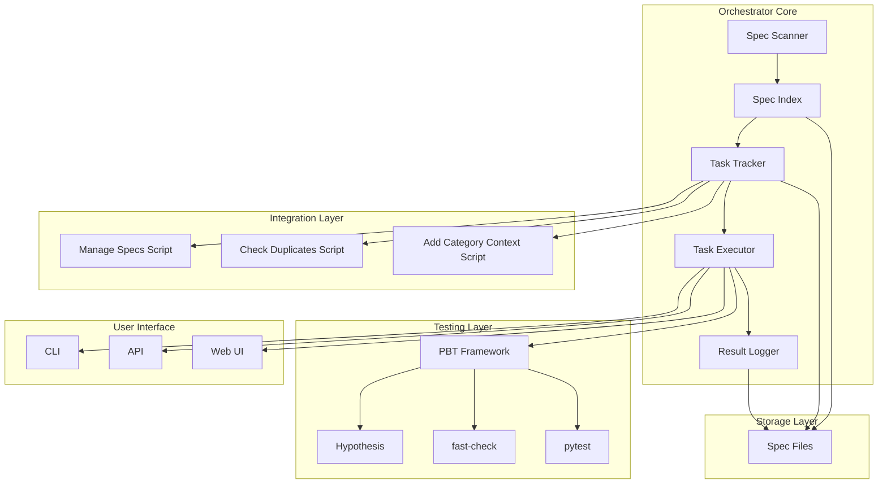
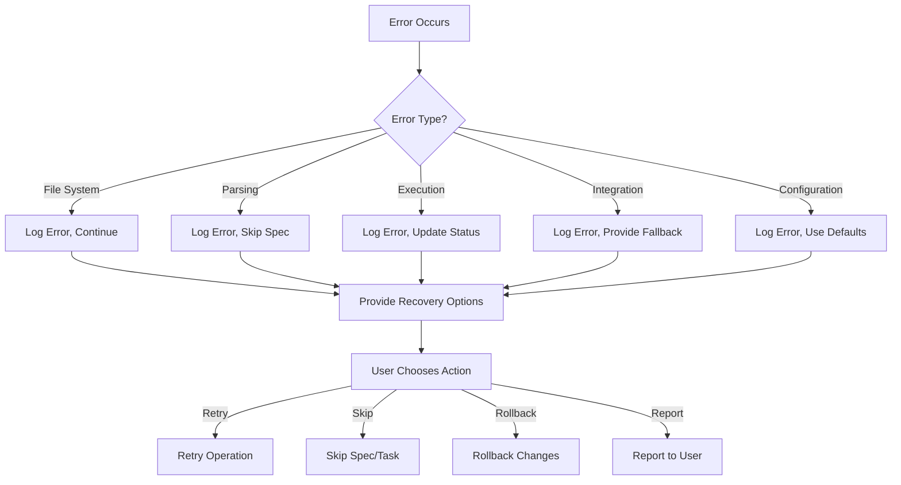

# Spec Task Orchestrator Design Document

**Category Context: Features**
- **Category**: Features
- **Scope**: New functionality, feature development, capability enhancements
- **Related Specs**: None yet (this category is for new features)
- **Common Patterns**: Performance features, security enhancements, monitoring tools, testing improvements
- **Avoid Duplicates**: Check all categories before creating new features to ensure no overlap

---

## Overview

The Spec Task Orchestrator is a system that extracts data from the organized specs structure (`.kiro/specs-organized/`) to run tasks tracked by category and feature/action. The orchestrator provides a unified interface for spec management and task execution, integrating with existing management scripts (`manage-specs.sh`, `check-duplicates.py`, `add-category-context.py`) to provide comprehensive spec lifecycle management.

### Key Design Principles

1. **Discoverability**: Automatically discover and index all spec directories
2. **Extensibility**: Support custom task handlers, plugins, and workflows
3. **Resilience**: Graceful error handling with recovery operations
4. **Traceability**: Maintain requirements-to-task-to-test traceability
5. **Testability**: Support property-based testing for correctness verification
6. **Integration**: Seamless integration with existing management scripts
7. **Performance**: Efficient scanning, caching, and parallel execution
8. **Security**: Role-based access control and audit logging

---

## Architecture



### Component Descriptions

#### Spec Scanner
- Discovers spec directories in `.kiro/specs-organized/`
- Validates required files (requirements.md, design.md, tasks.md)
- Builds internal index mapping category → spec → files
- Handles missing files gracefully with warnings

#### Spec Index
- Stores metadata for all discovered specs
- Maintains relationships between specs and categories
- Supports incremental updates for performance
- Provides query interface for task tracking

#### Task Tracker
- Groups tasks by category and status
- Tracks task dependencies and ordering
- Manages task status transitions
- Calculates spec progress percentages

#### Task Executor
- Identifies task types (implementation, testing, documentation, configuration)
- Dispatches to appropriate handlers
- Manages task dependencies
- Handles failures with retry and rollback options

#### Result Logger
- Records task execution metadata
- Stores test results and counterexamples
- Maintains audit trail for all operations
- Supports export to various formats

#### Integration Layer
- Wraps existing management scripts
- Provides unified interface for script functionality
- Captures and parses script output
- Handles script errors gracefully

#### Testing Layer
- Supports property-based testing frameworks
- Executes PBT tests with configurable iterations
- Captures and reports counterexamples
- Validates correctness properties

---

## Components and Interfaces

### Spec Directory Structure

```
.kiro/specs-organized/
├── auth/
│   ├── spec-name/
│   │   ├── requirements.md
│   │   ├── design.md
│   │   ├── tasks.md
│   │   └── .config.kiro
│   └── ...
├── docs/
├── integration/
├── fixes/
├── modernization/
├── features/
│   └── spec-task-orchestrator/
│       ├── requirements.md
│       ├── design.md
│       ├── tasks.md
│       └── .config.kiro
└── .config.kiro
```

### Core Interfaces

#### SpecIndex Interface

```python
class SpecIndex:
    def scan(self, base_path: str) -> List[SpecMetadata]
    def get_spec(self, category: str, spec_name: str) -> Spec
    def get_specs_by_category(self, category: str) -> List[Spec]
    def get_specs_by_status(self, status: TaskStatus) -> List[Task]
    def find_similar_specs(self, name: str) -> List[Tuple[str, str]]
    def update_spec(self, spec: Spec) -> None
    def remove_spec(self, category: str, spec_name: str) -> None
    def get_stats(self) -> Dict[str, Any]
```

#### TaskTracker Interface

```python
class TaskTracker:
    def get_tasks_by_category(self, category: str) -> List[Task]
    def get_tasks_by_status(self, status: TaskStatus) -> List[Task]
    def get_tasks_by_spec(self, category: str, spec_name: str) -> List[Task]
    def filter_tasks(self, filters: TaskFilters) -> List[Task]
    def update_task_status(self, task: Task, new_status: TaskStatus) -> None
    def calculate_spec_progress(self, category: str, spec_name: str) -> float
    def get_spec_status(self, category: str, spec_name: str) -> SpecStatus
    def add_task_dependency(self, task: Task, dependency: Task) -> None
```

#### TaskExecutor Interface

```python
class TaskExecutor:
    def execute_task(self, task: Task) -> ExecutionResult
    def execute_spec_tasks(self, category: str, spec_name: str) -> List[ExecutionResult]
    def execute_category_tasks(self, category: str) -> List[ExecutionResult]
    def execute_all_tasks(self) -> List[ExecutionResult]
    def retry_failed_tasks(self) -> List[ExecutionResult]
    def rollback_task(self, task: Task) -> None
    def get_execution_history(self, task: Task) -> List[ExecutionRecord]
```

#### PBTExecutor Interface

```python
class PBTExecutor:
    def execute_property_test(self, property: Property, framework: str) -> TestResult
    def execute_round_trip_test(self, data: Any, serialize: Callable, deserialize: Callable) -> bool
    def execute_idempotence_test(self, data: Any, operation: Callable) -> bool
    def execute_metamorphic_test(self, data: Any, transform: Callable, verify: Callable) -> bool
    def capture_counterexample(self, failure: TestFailure) -> Counterexample
    def store_test_results(self, results: List[TestResult]) -> None
```

---

## Data Models

### SpecMetadata

```python
@dataclass
class SpecMetadata:
    category: str
    spec_name: str
    path: str
    requirements_path: Optional[str] = None
    design_path: Optional[str] = None
    tasks_path: Optional[str] = None
    bugfix_path: Optional[str] = None
    config_path: Optional[str] = None
    files: List[str] = field(default_factory=list)
    metadata: Dict[str, Any] = field(default_factory=dict)
```

### Spec

```python
@dataclass
class Spec:
    category: str
    spec_name: str
    introduction: str
    glossary: Dict[str, str]
    requirements: List[Requirement]
    design: Optional[Design] = None
    tasks: List[Task] = field(default_factory=list)
    bugfix: Optional[Bugfix] = None
    status: SpecStatus = SpecStatus.NOT_STARTED
    progress: float = 0.0
    last_updated: datetime = field(default_factory=datetime.now)
    owner: Optional[str] = None
```

### Requirement

```python
@dataclass
class Requirement:
    id: str
    user_story: str
    acceptance_criteria: List[AcceptanceCriterion]
    traceability: List[str] = field(default_factory=list)
```

### AcceptanceCriterion

```python
@dataclass
class AcceptanceCriterion:
    id: str
    description: str
    testable: bool
    test_type: Optional[TestType] = None
    test_strategy: Optional[str] = None
```

### Task

```python
@dataclass
class Task:
    id: str
    description: str
    status: TaskStatus
    category: str
    spec_name: str
    spec_category: str
    requirements_traceability: List[str]
    dependencies: List[str] = field(default_factory=list)
    pbt_specification: Optional[PBTSpecification] = None
    execution_metadata: Optional[ExecutionMetadata] = None
```

### Design

```python
@dataclass
class Design:
    overview: str
    key_principles: List[str]
    architecture: ArchitectureDiagram
    components: List[Component]
    data_models: List[DataModel]
    correctness_properties: List[CorrectnessProperty]
    error_handling: ErrorHandlingStrategy
    testing_strategy: TestingStrategy
```

### CorrectnessProperty

```python
@dataclass
class CorrectnessProperty:
    id: str
    title: str
    statement: str
    validates: List[str]
    test_type: str
    framework: Optional[str] = None
```

### PBTSpecification

```python
@dataclass
class PBTSpecification:
    framework: str
    iterations: int = 100
    patterns: List[str] = field(default_factory=list)
    properties: List[str] = field(default_factory=list)
```

### ExecutionMetadata

```python
@dataclass
class ExecutionMetadata:
    start_time: datetime
    end_time: Optional[datetime] = None
    duration: Optional[timedelta] = None
    success: bool = False
    error_message: Optional[str] = None
    user: Optional[str] = None
    environment: Optional[str] = None
```

### TestResult

```python
@dataclass
class TestResult:
    property_id: str
    passing: bool
    iterations: int
    execution_time: timedelta
    counterexample: Optional[Counterexample] = None
    framework: str
```

### Counterexample

```python
@dataclass
class Counterexample:
    input: Any
    expected: Any
    actual: Any
    error_message: str
    stack_trace: Optional[str] = None
```

---

## Correctness Properties

*A property is a characteristic or behavior that should hold true across all valid executions of a system-essentially, a formal statement about what the system should do. Properties serve as the bridge between human-readable specifications and machine-verifiable correctness guarantees.*

### Property 1: Spec data round-trip integrity

*For any* valid spec data parsed by the orchestrator, when the data is serialized to JSON and deserialized, the resulting spec representation shall match the original with all fields preserved exactly.

**Validates: Requirements 20.1, 20.2, 20.3, 20.4, 20.5, 20.6, 20.7**

### Property 2: Spec scanning completeness

*For any* directory structure in `.kiro/specs-organized/`, when the orchestrator scans the directory, it shall discover all category directories and all spec subdirectories within each category, regardless of the number of categories or specs.

**Validates: Requirements 1.1, 1.2, 1.3**

### Property 3: File validation accuracy

*For any* spec directory, when the orchestrator validates required files, it shall correctly identify the presence or absence of requirements.md, design.md, and tasks.md, and shall not report false positives or false negatives.

**Validates: Requirements 1.4, 1.6, 1.7**

### Property 4: Task status consistency

*For any* task status change, when the orchestrator updates the task status, it shall update the tasks.md file to reflect the new status, and subsequent reads of the file shall return the updated status.

**Validates: Requirements 3.6**

### Property 5: Progress calculation correctness

*For any* spec with a given set of tasks, when the orchestrator calculates progress, it shall return (completed_tasks / total_tasks) * 100, and this value shall remain consistent across multiple calculations with the same task set.

**Validates: Requirements 7.1**

### Property 6: Task filtering correctness

*For any* set of tasks and filter criteria, when the orchestrator filters tasks, it shall return exactly the subset of tasks that match all filter criteria, with no false positives or false negatives.

**Validates: Requirements 8.1, 8.2, 8.3**

### Property 7: PBT test iteration count

*For any* property-based test task, when the orchestrator executes the test, it shall run with at least 100 iterations, and the number of iterations shall be exactly as specified in the PBT specification.

**Validates: Requirements 6.2**

### Property 8: Error handling completeness

*For any* error condition (malformed file, failed task, script failure, PBT failure), when the orchestrator encounters the error, it shall log appropriate information, update relevant state, and provide options for recovery without crashing.

**Validates: Requirements 11.1, 11.2, 11.3, 11.4, 11.5, 11.6, 11.7**

### Property 9: Configuration loading validity

*For any* valid configuration source (.config.kiro, environment variables, command-line arguments), when the orchestrator loads the configuration, it shall validate all settings, log a summary, and provide warnings for deprecated settings.

**Validates: Requirements 12.3**

### Property 10: Backward compatibility preservation

*For any* existing spec file format, when the orchestrator processes the file, it shall maintain compatibility with the existing format without modification, and shall support both old and new formats when new formats are introduced.

**Validates: Requirements 13.1, 13.2, 13.3, 13.4, 13.5, 13.6, 13.7**

---

## Error Handling

### Error Categories

1. **File System Errors**
   - Missing directories or files
   - Permission denied
   - Disk full
   - I/O errors

2. **Parsing Errors**
   - Malformed markdown
   - Invalid JSON in .config.kiro
   - Syntax errors in spec files

3. **Execution Errors**
   - Task handler failures
   - Script execution failures
   - PBT test failures

4. **Integration Errors**
   - Script output parsing failures
   - API response failures
   - Network errors

5. **Configuration Errors**
   - Invalid configuration values
   - Missing required settings
   - Deprecated settings

### Error Handling Strategy

1. **Graceful Degradation**
   - Continue processing when individual specs fail
   - Provide warnings for non-critical issues
   - Support fallback configurations

2. **Error Logging**
   - Log errors with full context (file path, line number, stack trace)
   - Include suggested next steps
   - Support error aggregation

3. **Recovery Operations**
   - Retry failed operations with exponential backoff
   - Skip problematic specs with warnings
   - Rollback changes when needed

4. **User Feedback**
   - Provide clear error messages
   - Link to relevant documentation
   - Support interactive troubleshooting

### Error Recovery Flow



---

## Testing Strategy

### Dual Testing Approach

The testing strategy combines two complementary approaches:

1. **Unit Tests**
   - Verify specific examples and edge cases
   - Test individual components in isolation
   - Cover error conditions and failure scenarios
   - Use mocking for dependencies

2. **Property-Based Tests**
   - Verify universal properties across all inputs
   - Test correctness properties from the design
   - Use random input generation for comprehensive coverage
   - Run with minimum 100 iterations per property

### Property-Based Testing Framework

**Selected Framework**: Hypothesis (Python)

**Configuration**:
- Minimum iterations: 100
- Maximum examples: 1000
- Verbosity: Normal
- Deadline: 500ms per test

**Test Tagging Format**:
```
Feature: spec-task-orchestrator, Property {number}: {property_text}
```

### Test Coverage Requirements

1. **Spec Scanner Tests**
   - Directory discovery
   - File validation
   - Index building
   - Incremental updates

2. **Task Tracker Tests**
   - Task grouping and filtering
   - Status transitions
   - Progress calculation
   - Dependency management

3. **Task Executor Tests**
   - Task execution handlers
   - Dependency resolution
   - Failure handling
   - Retry and rollback

4. **PBT Executor Tests**
   - Property test execution
   - Round-trip verification
   - Idempotence verification
   - Metamorphic verification

5. **Integration Tests**
   - Script integration
   - End-to-end workflows
   - Error scenarios
   - Performance benchmarks

### Test Execution Strategy

1. **Unit Tests**
   - Run on every commit
   - Target: 90%+ coverage
   - Use pytest with coverage
   - Run in parallel

2. **Property-Based Tests**
   - Run on every commit
   - Minimum 100 iterations per property
   - Tag with feature and property number
   - Run in parallel

3. **Integration Tests**
   - Run on every commit
   - Test end-to-end workflows
   - Mock external dependencies
   - Run in parallel

4. **Performance Tests**
   - Run on every commit
   - Test with large spec repositories
   - Verify performance requirements
   - Report metrics

### Test Configuration

```python
# pytest.ini
[pytest]
addopts = -v --tb=short --cov=. --cov-report=term-missing
testpaths = tests
python_files = test_*.py
python_classes = Test*
python_functions = test_*

# hypothesis profile
hypothesis_profiles = {
    "default": {"max_examples": 100, "deadline": 500},
    "ci": {"max_examples": 50, "deadline": 1000},
    "debug": {"max_examples": 10, "verbosity": "verbose"}
}
```

### Property-Based Test Examples

```python
# Property 1: Spec data round-trip integrity
# Feature: spec-task-orchestrator, Property 1: Spec data round-trip integrity

@given(spec_data_strategy())
def test_spec_round_trip_integrity(spec_data):
    """For any valid spec data, serialization round-trip preserves data."""
    # Serialize to JSON
    json_data = json.dumps(spec_data.to_dict())

    # Deserialize from JSON
    deserialized_spec = Spec.from_dict(json.loads(json_data))

    # Verify equivalence
    assert spec_data == deserialized_spec

# Property 2: Spec scanning completeness
# Feature: spec-task-orchestrator, Property 2: Spec scanning completeness

@given(category_strategy(), spec_strategy())
def test_spec_scanning_completeness(categories, specs):
    """For any directory structure, scanning discovers all categories and specs."""
    # Create test directory structure
    with temporary_directory() as tmpdir:
        setup_test_structure(tmpdir, categories, specs)

        # Run scanner
        index = SpecIndex()
        index.scan(tmpdir)

        # Verify discovery
        for category in categories:
            assert category in index.categories
            for spec in specs.get(category, []):
                assert spec in index.get_specs_by_category(category)

# Property 3: File validation accuracy
# Feature: spec-task-orchestrator, Property 3: File validation accuracy

@given(spec_directory_strategy())
def test_file_validation_accuracy(directory):
    """For any spec directory, validation correctly identifies required files."""
    # Run validator
    result = validate_spec_files(directory)

    # Verify accuracy
    for required_file in ['requirements.md', 'design.md', 'tasks.md']:
        expected = os.path.exists(os.path.join(directory, required_file))
        assert result.has_file(required_file) == expected
```

---

## Integration Points

### Management Scripts Integration

#### manage-specs.sh

**Purpose**: List specs, check for duplicates, show statistics

**Integration Points**:
- `list_specs(category)` - List specs in a category or all categories
- `check_duplicates()` - Run duplicate checker
- `show_stats()` - Show spec statistics

**Usage**:
```python
result = run_management_script("manage-specs.sh", "list", "auth")
result = run_management_script("manage-specs.sh", "check")
result = run_management_script("manage-specs.sh", "stats")
```

#### check-duplicates.py

**Purpose**: Find similar spec names, suggest categories

**Integration Points**:
- `find_similar_names(spec_name)` - Find similar specs
- `suggest_category(spec_name)` - Suggest category for new spec

**Usage**:
```python
similar = run_management_script("check-duplicates.py", "--find-similar", "auth")
category = run_management_script("check-duplicates.py", "--suggest-category", "new-feature")
```

#### add-category-context.py

**Purpose**: Add category context to spec files

**Integration Points**:
- `add_context(category, spec_name)` - Add context to spec file

**Usage**:
```python
result = run_management_script("add-category-context.py", "--category", "auth", "--spec", "auth-allauth")
```

### Unified Interface

```python
class ManagementInterface:
    def list_specs(self, category: Optional[str] = None) -> List[str]
    def check_duplicates(self) -> Dict[str, List[Tuple[str, str]]]
    def suggest_category(self, spec_name: str) -> List[str]
    def add_category_context(self, category: str, spec_name: str) -> bool
    def get_stats(self) -> Dict[str, Any]
```

---

## Task Execution Handlers

### Implementation Tasks

**Purpose**: Code changes, new features, module creation

**Handler**:
```python
class ImplementationTaskHandler:
    def can_handle(self, task: Task) -> bool
    def execute(self, task: Task, spec: Spec) -> ExecutionResult
    def generate_code(self, spec: Spec) -> Dict[str, str]
    def apply_fixes(self, spec: Spec) -> Dict[str, str]
    def create_module(self, spec: Spec) -> Dict[str, str]
```

**Workflow**:
1. Validate task requirements
2. Generate code or apply fixes
3. Write changes to files
4. Update task status
5. Log execution metadata

### Testing Tasks

**Purpose**: Unit tests, property-based tests, integration tests

**Handler**:
```python
class TestingTaskHandler:
    def can_handle(self, task: Task) -> bool
    def execute(self, task: Task, spec: Spec) -> ExecutionResult
    def run_unit_tests(self, spec: Spec) -> TestResult
    def run_property_tests(self, spec: Spec) -> TestResult
    def run_integration_tests(self, spec: Spec) -> TestResult
```

**Workflow**:
1. Identify test type
2. Run appropriate test suite
3. Capture results
4. Update task status
5. Log test results

### Documentation Tasks

**Purpose**: Create/update documentation, guides, examples

**Handler**:
```python
class DocumentationTaskHandler:
    def can_handle(self, task: Task) -> bool
    def execute(self, task: Task, spec: Spec) -> ExecutionResult
    def generate_docs(self, spec: Spec) -> Dict[str, str]
    def update_guides(self, spec: Spec) -> Dict[str, str]
    def create_examples(self, spec: Spec) -> Dict[str, str]
```

**Workflow**:
1. Identify documentation type
2. Generate or update documentation
3. Write documentation files
4. Update task status
5. Log execution metadata

### Configuration Tasks

**Purpose**: Setup, environment configuration, validation

**Handler**:
```python
class ConfigurationTaskHandler:
    def can_handle(self, task: Task) -> bool
    def execute(self, task: Task, spec: Spec) -> ExecutionResult
    def setup_environment(self, spec: Spec) -> Dict[str, Any]
    def configure_services(self, spec: Spec) -> Dict[str, Any]
    def validate_settings(self, spec: Spec) -> bool
```

**Workflow**:
1. Identify configuration type
2. Perform setup or validation
3. Update configuration files
4. Update task status
5. Log execution metadata

---

## Configuration and Extensibility

### Configuration Sources

1. **.config.kiro** (per-spec)
   ```json
   {
     "specId": "uuid",
     "workflowType": "requirements-first",
     "specType": "feature"
   }
   ```

2. **Environment Variables**
   - `ORCHESTRATOR_BASE_PATH`
   - `ORCHESTRATOR_DEFAULT_STATUS`
   - `ORCHESTRATOR_PBT_FRAMEWORK`
   - `ORCHESTRATOR_SCRIPT_PATHS`

3. **Command-Line Arguments**
   - `--base-path`
   - `--default-status`
   - `--pbt-framework`
   - `--script-paths`

### Configuration Options

```python
@dataclass
class OrchestratorConfig:
    base_path: str = ".kiro/specs-organized"
    default_status: TaskStatus = TaskStatus.NOT_STARTED
    pbt_framework: str = "hypothesis"
    pbt_iterations: int = 100
    script_paths: Dict[str, str] = field(default_factory=dict)
    report_output_dir: str = "reports"
    log_level: str = "INFO"
    max_retries: int = 3
    enable_parallel: bool = True
    enable_rollback: bool = True
```

### Extension Points

1. **Custom Task Handlers**
   ```python
   class CustomTaskHandler:
       def can_handle(self, task: Task) -> bool
       def execute(self, task: Task, spec: Spec) -> ExecutionResult
   ```

2. **Custom Report Templates**
   ```python
   class CustomReportTemplate:
       def generate(self, data: Dict[str, Any]) -> str
   ```

3. **Custom Workflows**
   ```python
   class CustomWorkflow:
       def can_execute(self, spec: Spec) -> bool
       def execute(self, spec: Spec) -> List[ExecutionResult]
   ```

### Plugin Architecture

```python
class PluginManager:
    def discover_plugins(self, plugin_dir: str) -> List[Plugin]
    def load_plugin(self, plugin: Plugin) -> None
    def execute_plugin(self, plugin: Plugin, spec: Spec) -> ExecutionResult
    def validate_plugin(self, plugin: Plugin) -> bool
```

---

## Performance and Scalability

### Optimization Strategies

1. **Efficient Directory Traversal**
   - Use `os.scandir()` instead of `os.listdir()`
   - Implement incremental scanning
   - Cache scan results

2. **Parallel Processing**
   - Parallel spec scanning
   - Parallel task execution
   - Parallel test execution

3. **Lazy Loading**
   - Load spec data on demand
   - Cache frequently accessed data
   - Stream large files

4. **Memory Management**
   - Use generators for large datasets
   - Implement pagination
   - Provide memory usage reports

### Performance Targets

- **Spec Scanning**: < 1 second per 100 specs
- **Task Execution**: < 10 seconds per task
- **PBT Execution**: < 60 seconds per property
- **Memory Usage**: < 500 MB for 1000 specs
- **Parallel Speedup**: 4x with 4 cores

---

## Security and Access Control

### Authentication

- **User Authentication**: Required for write operations
- **API Key Authentication**: For programmatic access
- **Session Management**: Secure session handling

### Authorization

- **Read-Only Users**: Can view specs and tasks
- **Write Users**: Can modify specs and tasks
- **Admin Users**: Full access including configuration

### Audit Logging

- **Access Attempts**: Log all access attempts
- **Write Operations**: Log all write operations with user identity
- **Security Events**: Log security-related events

### Security Best Practices

1. **Input Validation**: Validate all user input
2. **Path Sanitization**: Sanitize file paths
3. **Error Handling**: Don't leak sensitive information
4. **Secure Storage**: Encrypt sensitive data
5. **Regular Audits**: Perform security audits

---

## Documentation and Help

### Documentation Structure

1. **Command-Line Help**
   - `--help` for all commands
   - Usage examples for each command
   - Argument descriptions

2. **Online Documentation**
   - Quick start guide
   - Advanced usage examples
   - API documentation
   - Troubleshooting guides

3. **In-App Help**
   - Interactive help mode
   - Context-sensitive help
   - Suggested next steps

### Documentation Content

1. **Quick Start**
   - Installation
   - Basic usage
   - First spec

2. **Advanced Usage**
   - Custom task handlers
   - Plugin development
   - Configuration

3. **API Documentation**
   - Public APIs
   - Extension points
   - Data models

4. **Troubleshooting**
   - Common issues
   - Error messages
   - Debugging tips

---

## Implementation Roadmap

### Phase 1: Core Functionality
1. Spec directory discovery
2. Spec file parsing
3. Task tracking
4. Basic task execution

### Phase 2: Integration
1. Management script integration
2. PBT framework integration
3. Reporting and analytics

### Phase 3: Advanced Features
1. Custom task handlers
2. Plugin architecture
3. Custom workflows

### Phase 4: Production Ready
1. Security and access control
2. Performance optimization
3. Comprehensive testing

### Phase 5: Documentation
1. User documentation
2. API documentation
3. Examples and tutorials
---

## Tasks

### Task 1: Spec Directory Discovery

**Status**: not_started

**Description**: Implement spec directory scanning and indexing functionality

**Category**: Features

**Spec**: spec-task-orchestrator

**Requirements Traceability**: 1.1, 1.2, 1.3, 1.4, 1.5, 1.6, 1.7, 1.8

**Property-Based Test Specification**:
- Framework: Hypothesis
- Iterations: 100
- Properties: 1, 2, 3

**Dependencies**: None

### Task 2: Spec File Parsing

**Status**: not_started

**Description**: Implement parsing for requirements.md, design.md, tasks.md, and bugfix.md files

**Category**: Features

**Spec**: spec-task-orchestrator

**Requirements Traceability**: 2.1, 2.2, 2.3, 2.4, 2.5, 2.6, 2.7

**Property-Based Test Specification**:
- Framework: Hypothesis
- Iterations: 100
- Properties: 1

**Dependencies**: Task 1

### Task 3: Task Tracking by Category

**Status**: not_started

**Description**: Implement task grouping, filtering, and status tracking by category

**Category**: Features

**Spec**: spec-task-orchestrator

**Requirements Traceability**: 3.1, 3.2, 3.3, 3.4, 3.5, 3.6, 3.7

**Property-Based Test Specification**:
- Framework: Hypothesis
- Iterations: 100
- Properties: 4, 5, 6

**Dependencies**: Task 2

### Task 4: Task Execution by Feature/Action

**Status**: not_started

**Description**: Implement task execution handlers for implementation, testing, documentation, and configuration tasks

**Category**: Features

**Spec**: spec-task-orchestrator

**Requirements Traceability**: 4.1, 4.2, 4.3, 4.4, 4.5, 4.6

**Property-Based Test Specification**:
- Framework: Hypothesis
- Iterations: 100
- Properties: 8

**Dependencies**: Task 3

### Task 5: Integration with Management Scripts

**Status**: not_started

**Description**: Integrate with manage-specs.sh, check-duplicates.py, and add-category-context.py

**Category**: Features

**Spec**: spec-task-orchestrator

**Requirements Traceability**: 5.1, 5.2, 5.3, 5.4, 5.5, 5.6, 5.7

**Property-Based Test Specification**:
- Framework: Hypothesis
- Iterations: 100
- Properties: 8

**Dependencies**: Task 4

### Task 6: Property-Based Testing Support

**Status**: not_started

**Description**: Implement PBT framework integration and property execution

**Category**: Features

**Spec**: spec-task-orchestrator

**Requirements Traceability**: 6.1, 6.2, 6.3, 6.4, 6.5, 6.6, 6.7

**Property-Based Test Specification**:
- Framework: Hypothesis
- Iterations: 100
- Properties: 7, 8

**Dependencies**: Task 5

### Task 7: Spec Status and Progress Tracking

**Status**: not_started

**Description**: Implement spec progress calculation and status tracking

**Category**: Features

**Spec**: spec-task-orchestrator

**Requirements Traceability**: 7.1, 7.2, 7.3, 7.4, 7.5, 7.6, 7.7

**Property-Based Test Specification**:
- Framework: Hypothesis
- Iterations: 100
- Properties: 5

**Dependencies**: Task 3

### Task 8: Task Filtering and Querying

**Status**: not_started

**Description**: Implement task filtering and complex query support

**Category**: Features

**Spec**: spec-task-orchestrator

**Requirements Traceability**: 8.1, 8.2, 8.3, 8.4, 8.5, 8.6

**Property-Based Test Specification**:
- Framework: Hypothesis
- Iterations: 100
- Properties: 6

**Dependencies**: Task 3

### Task 9: Spec Reorganization Support

**Status**: not_started

**Description**: Implement spec renaming, merging, and reorganization support

**Category**: Features

**Spec**: spec-task-orchestrator

**Requirements Traceability**: 9.1, 9.2, 9.3, 9.4, 9.5, 9.6

**Property-Based Test Specification**:
- Framework: Hypothesis
- Iterations: 100
- Properties: 8

**Dependencies**: Task 8

### Task 10: Reporting and Analytics

**Status**: not_started

**Description**: Implement reporting and analytics functionality

**Category**: Features

**Spec**: spec-task-orchestrator

**Requirements Traceability**: 10.1, 10.2, 10.3, 10.4, 10.5, 10.6, 10.7

**Property-Based Test Specification**:
- Framework: Hypothesis
- Iterations: 100
- Properties: 8

**Dependencies**: Task 7

### Task 11: Error Handling and Recovery

**Status**: not_started

**Description**: Implement comprehensive error handling and recovery operations

**Category**: Features

**Spec**: spec-task-orchestrator

**Requirements Traceability**: 11.1, 11.2, 11.3, 11.4, 11.5, 11.6, 11.7

**Property-Based Test Specification**:
- Framework: Hypothesis
- Iterations: 100
- Properties: 8

**Dependencies**: Task 4

### Task 12: Configuration and Customization

**Status**: not_started

**Description**: Implement configuration management and customization support

**Category**: Features

**Spec**: spec-task-orchestrator

**Requirements Traceability**: 12.1, 12.2, 12.3, 12.4, 12.5, 12.6, 12.7

**Property-Based Test Specification**:
- Framework: Hypothesis
- Iterations: 100
- Properties: 9

**Dependencies**: None

### Task 13: Backward Compatibility

**Status**: not_started

**Description**: Ensure backward compatibility with existing spec formats and workflows

**Category**: Features

**Spec**: spec-task-orchestrator

**Requirements Traceability**: 13.1, 13.2, 13.3, 13.4, 13.5, 13.6, 13.7

**Property-Based Test Specification**:
- Framework: Hypothesis
- Iterations: 100
- Properties: 10

**Dependencies**: None

### Task 14: Security and Access Control

**Status**: not_started

**Description**: Implement security features including authentication and access control

**Category**: Features

**Spec**: spec-task-orchestrator

**Requirements Traceability**: 14.1, 14.2, 14.3, 14.4, 14.5, 14.6, 14.7

**Property-Based Test Specification**:
- Framework: Hypothesis
- Iterations: 100
- Properties: 8

**Dependencies**: None

### Task 15: Documentation and Help

**Status**: not_started

**Description**: Implement comprehensive documentation and help system

**Category**: Features

**Spec**: spec-task-orchestrator

**Requirements Traceability**: 15.1, 15.2, 15.3, 15.4, 15.5, 15.6, 15.7

**Property-Based Test Specification**:
- Framework: Hypothesis
- Iterations: 100
- Properties: 8

**Dependencies**: None

### Task 16: Performance and Scalability

**Status**: not_started

**Description**: Optimize performance and ensure scalability for large spec repositories

**Category**: Features

**Spec**: spec-task-orchestrator

**Requirements Traceability**: 16.1, 16.2, 16.3, 16.4, 16.5, 16.6, 16.7

**Property-Based Test Specification**:
- Framework: Hypothesis
- Iterations: 100
- Properties: 8

**Dependencies**: None

### Task 17: Testing and Validation

**Status**: not_started

**Description**: Implement comprehensive testing suite including unit, integration, and property-based tests

**Category**: Features

**Spec**: spec-task-orchestrator

**Requirements Traceability**: 17.1, 17.2, 17.3, 17.4, 17.5, 17.6, 17.7

**Property-Based Test Specification**:
- Framework: Hypothesis
- Iterations: 100
- Properties: 1, 2, 3, 4, 5, 6, 7, 8, 9, 10

**Dependencies**: All previous tasks

### Task 18: Extensibility

**Status**: not_started

**Description**: Implement extensibility features including custom handlers, plugins, and workflows

**Category**: Features

**Spec**: spec-task-orchestrator

**Requirements Traceability**: 18.1, 18.2, 18.3, 18.4, 18.5, 18.6, 18.7

**Property-Based Test Specification**:
- Framework: Hypothesis
- Iterations: 100
- Properties: 8

**Dependencies**: None

### Task 19: CI/CD Integration

**Status**: not_started

**Description**: Implement CI/CD integration features including non-interactive mode and webhook support

**Category**: Features

**Spec**: spec-task-orchestrator

**Requirements Traceability**: 19.1, 19.2, 19.3, 19.4, 19.5, 19.6, 19.7

**Property-Based Test Specification**:
- Framework: Hypothesis
- Iterations: 100
- Properties: 8

**Dependencies**: None

### Task 20: Round-Trip Property Implementation

**Status**: not_started

**Description**: Implement and test the round-trip property for spec data serialization/deserialization

**Category**: Features

**Spec**: spec-task-orchestrator

**Requirements Traceability**: 20.1, 20.2, 20.3, 20.4, 20.5, 20.6, 20.7

**Property-Based Test Specification**:
- Framework: Hypothesis
- Iterations: 100
- Properties: 1

**Dependencies**: Task 2
