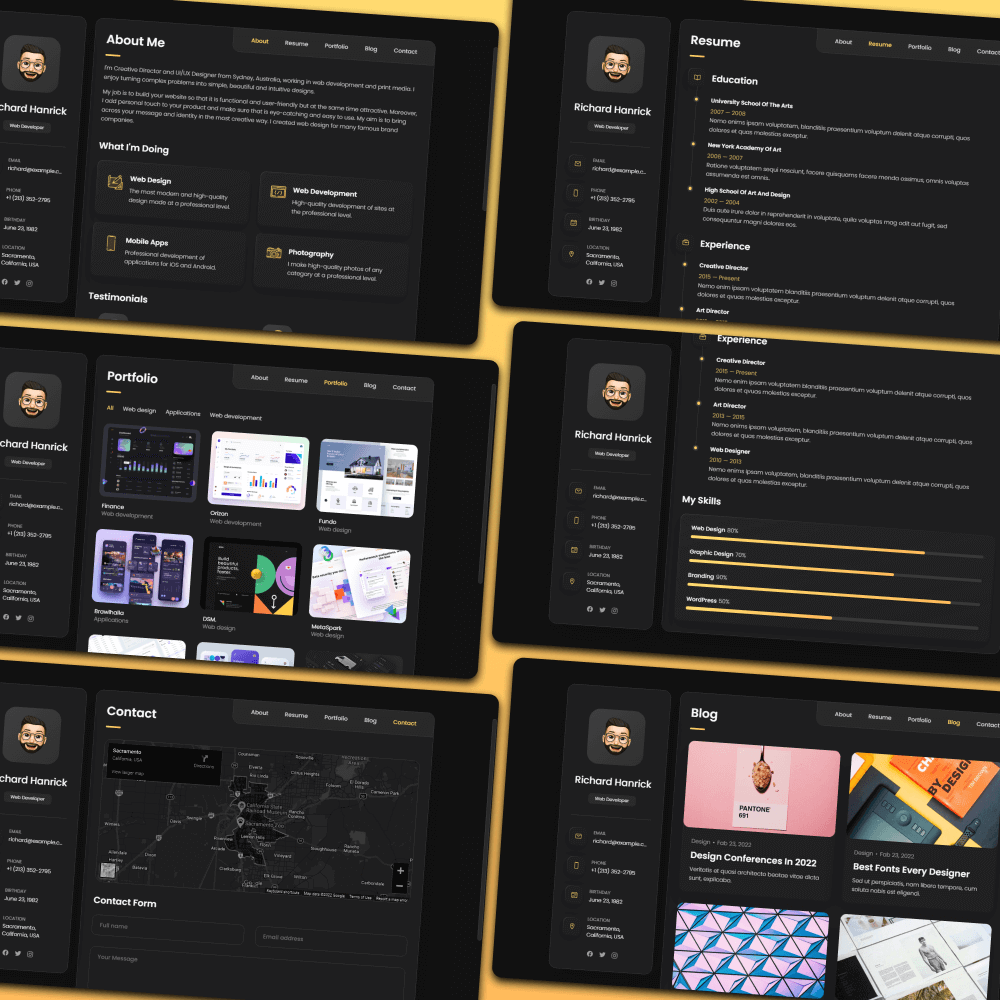

# VResume

A personal portfolio CMS built with Django, Wagtail, HTMX, and Bootstrap. Single-page app feel with server-side rendering, tab navigation, and HTMX-powered modals.

<p align="center">
  
  
  
  
  
  
</p>

## Preview

<p align="center">
  
  <br>
  
</p>

**Live:** [vresume.structa.cloud](https://vresume.structa.cloud)
**Version:** 1.1.0
**Stack:** Django 5 · Wagtail CMS · HTMX · Bootstrap 5 · SCSS · Webpack

---


## Workspace commands

This project is managed from the workspace root. The local `manage.py` delegates to `../manage.py`, and frontend assets are built by the single shared package at `../assets/package.json`. Do not add project-local `package.json` or webpack config files.

```bash
# Django CLI
../.venv/bin/python ../manage.py --site vresume check
./manage.py check
./manage.py runserver 0.0.0.0:5072

# Assets
make build-assets
make main-assets
make assets build
cd .. && make build-assets WEBSITE=vresume
cd .. && npm --prefix assets run build -- --site vresume
cd .. && npm --prefix assets run build:collect -- --site vresume

# Data and tests
cd .. && npm --prefix assets run populate -- --site vresume --dry-run
cd .. && make tests-website WEBSITE=vresume
```

Runtime port: `5072`. Generated media/staticfiles/bundles and database files are ignored; source fixtures and source static assets remain tracked.

## Scope

VResume is a content-managed personal portfolio site. The owner manages everything through the Wagtail admin — no code changes needed for content updates. Key capabilities:

- **Single-page navigation** — tab switching via HTMX with browser history push
- **Portfolio** — filterable project grid with category filter, search, grid/list toggle, and HTMX detail modals
- **Blog** — post listing with category filter, search, grid/list toggle, and HTMX preview modals
- **Resume** — education, experience, and skills timeline sections
- **Contact** — HTMX form submission with map embed
- **Newsletter** — double opt-in subscription with Celery-backed email delivery
- **Theming** — dark/light mode toggle with multiple theme families
- **i18n** — full translation support via Wagtail locales
- **GDPR** — cookie consent popup with category preferences

---

## 🚀 Quick Start

### 📋 Prerequisites

- **Python 3.12+**
- **uv** (Modern Python package manager)
- **Node.js 18+** & **npm**
- **Docker & Docker Compose**

### ⚡ First-Time Setup (Recommended)

The easiest way to get started is using the provided `Makefile`.

```bash
# 1. Download or clone the repository
# Visit: https://github.com/mammhoud/VResume
cd VResume

# 2. Run the automated setup
make setup
```

The `make setup` command will:
1. Sync dependencies using `uv`.
2. Run database migrations.
3. Collect static files.
4. Build the frontend assets.
5. Populate the CMS with professional dummy data and create a superuser.

### 🐳 Docker Setup

For a fully containerized environment:

```bash
# Start full application stack (Production-ready)
make up

# OR start development-optimized stack (with auto-reload)
make docker-dev
```
---

## 🛠️ Development Commands

We use `make` to simplify common tasks. Run `make help` to see all available commands.

| Command | Description |
|---------|-------------|
| `make setup` | Full project setup (sync, migrate, build, populate) |
| `make dev` | Start Django development server (Uvicorn) |
| `make menu` | **Interactive development menu** (Recommended) |
| `make docker-dev` | Start local development stack in Docker |
| `make docker-prod` | Start production stack in Docker |
| `make migrate` | Run database migrations |
| `make pd` | Populate CMS with professional dummy data |
| `make fb` | Build frontend assets (development) |
| `make fw` | Watch frontend assets for changes |
| `make docs` | Build documentation with MkDocs |
| `make test` | Run comprehensive automation tests |
| `make down` | Stop all Docker containers |


### Option 3: Production Deployment

```bash
# Build assets
npm run build

# Start with production profile
docker-compose --profile main up -d --build

# Run migrations
docker-compose exec vresume-django python manage.py migrate

# Collect static files
docker-compose exec vresume-django python manage.py collectstatic --noinput

# Setup SSL (Let's Encrypt)
certbot --nginx -d vresume.structa.cloud
```

See [docs/deployment.md](docs/deployment.md) for full production setup guide.

---

## Development Commands

### Django Management

```bash
# Development server
python manage.py runserver

# Database migrations
python manage.py makemigrations
python manage.py migrate

# Django shell with models pre-loaded
python manage.py shell_plus

# Populate sample data
python manage.py populate_data

# Collect static files
python manage.py collectstatic --noinput

# Create superuser
python manage.py createsuperuser

# Clear cache
python manage.py clear_cache
```

### Node / Asset Building

```bash
# Install dependencies
npm install

# Development build with HMR (hot reload)
npm run dev

# Production build (minified)
npm run build

# Watch mode (rebuild on file changes)
npm run watch

# Analyze bundle sizes
npm run analyze:build

# Lint JavaScript
npm run lint

# Format code
npm run format
```

### Asset Building Instructions

VResume uses Webpack to bundle SCSS and JavaScript. Build assets before deployment:

```bash
# Development (with source maps)
npm run dev

# Production (minified, optimized)
npm run build

# Watch for changes during development
npm run watch
```

**Output locations:**
- CSS: `assets/static/styles/` (compiled from SCSS)
- JS: `assets/static/js/` (bundled)
- Bundles: `assets/bundles/`

### Docker Shortcuts

| Command | Description |
|---------|-------------|
| `make up` | Start default production-ready stack |
| `make docker-dev` | Start local development stack |
| `make docker-prod` | Start production stack |
| `make docker-db` | Start infrastructure only (DB/Redis) |
| `make docker-app` | Start application services only |
| `make docker-proxy` | Start Nginx proxy only |
| `make down` | Stop all active containers |
| `make dl` | View Docker logs |

### Celery (Background Tasks)

```bash
# Worker (email delivery, newsletter)
celery -A configs worker -l info

# Beat scheduler (periodic tasks)
celery -A configs beat -l info

# Flower monitoring (http://localhost:5555)
celery -A configs flower

# Via Docker
docker-compose up -d vresume-celery
docker-compose up -d vresume-beat
```

### Testing & Quality

```bash
# Run tests
pytest

# Run tests with coverage
pytest --cov=pages

# Lint Python code
ruff check .

# Format Python code
ruff format .

# Type checking
mypy pages/

# Security check
bandit -r pages/
```

---

## Development Workflow

### Local Development Setup

1. **Clone and setup environment**
   ```bash
   # Visit https://github.com/mammhoud/VResume
   cd VResume
   python -m venv .venv
   source .venv/bin/activate  # Windows: .venv\Scripts\activate
   pip install -r requirements/local.txt
   npm install
   ```

2. **Initialize database**
   ```bash
   python manage.py migrate
   python manage.py createsuperuser
   python manage.py populate_data  # Optional: load sample data
   ```

3. **Start development servers** (in separate terminals)
   ```bash
   # Terminal 1: Django
   python manage.py runserver

   # Terminal 2: Asset builder
   npm run dev

   # Terminal 3 (optional): Celery worker
   celery -A configs worker -l info
   ```

4. **Access the application**
   - Frontend: http://localhost:8000
   - Admin: http://localhost:8000/cms/

### Making Changes

**Template Changes:**
- Edit files in `pages/templates/`
- Changes reflect immediately (no rebuild needed)
- Test in browser

**Style Changes:**
- Edit SCSS files in `assets/static/styles/`
- Webpack watches and rebuilds automatically
- Refresh browser to see changes

**JavaScript Changes:**
- Edit files in `assets/static/js/`
- Webpack rebuilds automatically
- Refresh browser to see changes

**Python Changes:**
- Edit files in `pages/` or `configs/`
- Django dev server auto-reloads
- Refresh browser to see changes

### Code Quality

Before committing:

```bash
# Format code
ruff format .
npm run format

# Lint code
ruff check .
npm run lint

# Run tests
pytest

# Type check
mypy pages/
```

### Building for Production

```bash
# Build optimized assets
npm run build

# Collect static files
python manage.py collectstatic --noinput

# Run tests
pytest

# Create deployment package
docker-compose --profile main build
```

### HTMX tab flow

```
Browser GET /pages/about/
  → tab_view("about")
  → HTMX request?  yes → render about/fragment.html
                   no  → render skeleton.html (which extends base.html)
```

### Modal flow (portfolio example)

```
User clicks project card
  → hx-get="/pages/project/<id>/"
  → project_detail_view() renders portfolio/modals/project_detail.html
  → HTMX swaps into #project-modal-container
  → JS adds .project-modal__overlay--active to show overlay
```

---

## Key Environment Variables

See the `.env.example` file for all available configuration options. Key variables:

```bash
# Core Django
SECRET_KEY=<generate-with-django>
DEBUG=False
ALLOWED_HOSTS=localhost,127.0.0.1,vresume.structa.cloud

# Database
DB_TYPE=postgres  # or sqlite3 for local dev
POSTGRES_DB=vresume
POSTGRES_USER=vresume
POSTGRES_PASSWORD=<password>
POSTGRES_HOST=postgres

# Email (SMTP)
EMAIL_BACKEND=django.core.mail.backends.smtp.EmailBackend
EMAIL_HOST=smtp.gmail.com
EMAIL_PORT=587
EMAIL_USE_TLS=True
EMAIL_HOST_USER=your-email@gmail.com
EMAIL_HOST_PASSWORD=your-app-password
DEFAULT_FROM_EMAIL=noreply@example.com

# Celery & Redis
CELERY_BROKER_URL=redis://redis:6379/1
CELERY_RESULT_BACKEND=redis://redis:6379/2

# Site Configuration
SITE_URL=https://vresume.structa.cloud
WAGTAIL_SITE_NAME=VResume
LANGUAGE_CODE=en-us
TIME_ZONE=UTC

# Security
SECURE_SSL_REDIRECT=True
SESSION_COOKIE_SECURE=True
CSRF_COOKIE_SECURE=True
```

---

## Deployment

### Quick Production Deploy

The easiest way to deploy is using the production stack:

```bash
# 1. Configure environment in .env
# 2. Start the stack
make docker-prod
```

This will automatically handle:
- **PostgreSQL** & **Redis** setup
- **Django** production configuration
- **Celery** workers and scheduler
- **Nginx** reverse proxy with SSL support

See [docs/deployment.md](docs/deployment.md) for full production setup including:
- SSL/TLS configuration
- Database backups
- Email configuration
- Performance optimization

See [docs/deployment.md](docs/deployment.md) for comprehensive production setup including:
- SSL/TLS configuration
- Database backups
- Email configuration
- CDN setup
- Monitoring & logging
- Performance optimization

---

## Documentation

| File | Contents |
|------|----------|
| [docs/index.md](docs/index.md) | Documentation index |
| [docs/getting_started.md](docs/getting_started.md) | First-time setup |
| [docs/deployment.md](docs/deployment.md) | Production deployment |
| [docs/development.md](docs/development.md) | Dev workflow |
| [docs/architecture/](docs/architecture/) | System design, models, request flow |
| [docs/design/](docs/design/) | BEM conventions, components, JS structure |
| [docs/user-guide/](docs/user-guide/) | Content editor guide |
| [docs/reports/](docs/reports/) | Audit reports and checklists |
| [docs/logs/](docs/logs/) | Refactoring and change logs |

---

## License

MIT — see [LICENSE](LICENSE)

**Author:** Mahmoud Ezzat · [GitHub](https://github.com/mammhoud) · [LinkedIn](https://linkedin.com/in/mammhoud) · vresume@structa.cloud
**Company:** [Structa](https://structa.cloud)
