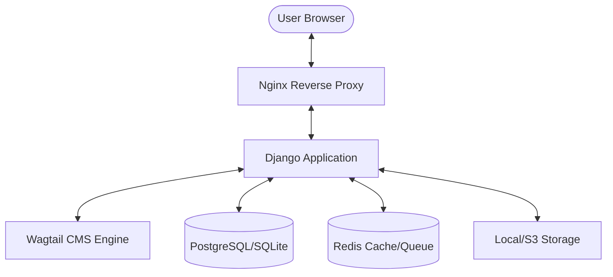

# System Architecture

## Overview

This section outlines the core architecture, technology stack, and directory structure of VResume. Understanding this structure is essential for developers looking to extend or customize the platform.


## 🎯 Project Goals


VResume is a modern, self-hosted portfolio and resume website that allows professionals to:
- Showcase their work and projects
- Share blog posts and insights
- Collect contact form submissions
- Build an email subscriber list
- Manage all content through an intuitive CMS

## 🏗️ Architecture

VResume is designed with modularity and scalability in mind. The system is divided into several logical layers, each with its own documentation:

- **[Project Structure](project_structure.md)**: A high-level view of the directory tree and how files are organized.
- **[Configuration System](configuration.md)**: Detailed explanation of how settings are loaded via Pydantic, Dynaconf, and YAML.
- **[Core Utilities](core_utils.md)**: The foundation of the app, including base page models and shared snippets.
- **[Data Models](models.md)**: Documentation of the Wagtail page models and database relationships.
- **[Request & Render Flow](request_flow.md)**: How requests are processed and how HTMX interacts with Django views.
- **[Templates & HTMX](templates_flow.md)**: The centralized template architecture and dynamic component loading.

### Technology Stack

VResume is built on a robust and modern stack designed for performance, scalability, and ease of maintenance.

#### Backend
- **Django 5.0**: The "framework for perfectionists with deadlines."
- **Wagtail 6.0**: A professional, flexible CMS.
- **PostgreSQL**: Robust relational database (SQLite supported for local dev).
- **Redis**: For caching and task queues.

#### Frontend
- **Bootstrap 5.3**: Responsive CSS framework with custom theming via CSS custom properties.
- **SCSS**: Preprocessor with BEM methodology for component styling.
- **HTMX**: High-power tools for HTML (dynamic interactions).
- **Alpine.js**: Lightweight JavaScript framework for reactive UI components.
- **ES6+ JavaScript**: Modular, modern JS structure with Webpack bundling.
- **Remix Icons / Bootstrap Icons**: Icon libraries.

### 📊 System Architecture

The following diagram illustrates the high-level architecture of VResume:



## Application Structure

The project is organized into a clean, modular structure within the `v1/` directory:

```text
/VResume/v1/
├── configs/            # Settings management (Pydantic + Dynaconf)
├── core/               # Shared base models, blocks, and snippets
├── pages/              # Primary site modules
│   ├── home/           # Homepage components
│   ├── about/          # Bio and experience
│   ├── portfolio/      # Project showcase
│   ├── blog/           # Articles and categories
│   ├── cv/             # Resume data
│   ├── connect/        # Contacts and newsletter
│   └── templates/      # Centralized HTML templates
├── assets/             # SCSS, JS, and static files
└── webpack/            # Frontend build configurations
```

---

---

## Page Models - Separated Files

### 1. **home.py** - HomePage
- Slider section with SnippetChooserBlock
- Team section with SnippetChooserBlock
- Services section with SnippetChooserBlock
- Skills section with SkillBlock
- Newsletter subscription toggle
- Blog posts context
- VResume settings integration

### 2. **about.py** - AboutPage
- Bio section with RichTextBlock
- Testimonials section with TestimonialBlock
- Clients section with ClientBlock

### 3. **contact.py** - ContactPage
- Map embed URL field
- Form settings (inherited from BaseFormPage)
- Contact form functionality

### 4. **portfolio.py** - PortfolioPage
- Projects section with ProjectBlock
- Featured tags selection (ManyToMany)
- Project categories extraction
- TabbedInterface admin layout

### 5. **resume.py** - ResumePage
- Education section with TimelineItemBlock
- Experience section with TimelineItemBlock
- Skills section with SkillBlock

---


