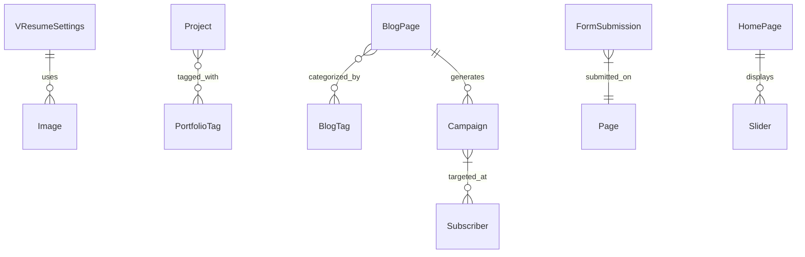

# Data Models

This section provides a detailed reference for the core data models in VResume, organized by application.

## 📱 Connect App (Communications & Newsletters)

### Subscriber
**Purpose:** Manages newsletter subscriptions.
- `email`: Unique subscriber email.
- `status`: Subscription status (pending, confirmed, unsubscribed, bounced).
- `subscribed_at`: Timestamp of subscription.

### Campaign
**Purpose:** Manages email marketing and automated newsletters.
- `name`, `subject`, `preview_text`, `body`: Email content fields.
- `status`: Campaign state (draft, scheduled, sending, sent, paused, failed).
- `blog_post`: Associated blog post for automated newsletters.
- `Analytics`: total_sent, total_opened, total_clicked, total_bounced properties.
- **Integration:** Triggered automatically via Celery tasks when BlogPage or Project is published with the `send_newsletter_on_publish` flag enabled.

### FormSubmission
**Purpose:** Records contact form interactions.
- `form_id`: Identifier for the specific form.
- `data`: JSON field containing all form inputs.
- `ip_address`: Submitter's IP.
- `is_read`: Admin tracking status.
- **Integration:** Automatically queues notification emails via `FormSubmissionService`.

---

## 📝 Blog App

### BlogPage
**Purpose:** Individual blog posts with rich content and metadata.

- `body`: Wagtail StreamField for flexible content blocks.
- `featured_image`: Main post image.
- `published_date`: Date the post is visible.
- `tags`: Many-to-many relationship with `BlogTag`.
- `send_newsletter_on_publish`: Boolean flag that, when true, triggers an automated `Campaign` email to all active subscribers via Celery.

### BlogTag
**Purpose:** Categorization for blog posts. Actively queried dynamically rather than statically selected.

---

## 🎨 Portfolio App

### Project
**Purpose:** Showcases individual portfolio items.

| Field | Description |
|-------|-------------|
| `title` | Name of the project. |
| `category` | High-level category (e.g., "Web", "Mobile"). |
| `tools` | Technologies used (e.g., "Django, React"). |
| `image` | Main project thumbnail. |
| `project_url` | Link to live project or repository. |
| `send_newsletter_on_publish` | Triggers a newsletter campaign when saved. |

---

## 🏗️ Home App

### HomePage
**Purpose:** The central landing page.
- Utilizes `SnippetChooserBlock` for sliders, team members, and services.
- Integrates `SkillBlock` for proficiency displays.

### VResumeSettings
**Purpose:** Global site configuration, branding, and contact information. Managed via Wagtail Settings.

---

## 🔗 Relationships Overview

