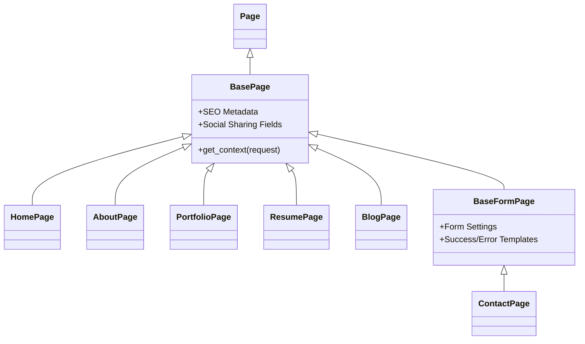

# Request to Render Flow: Deep Dive

This document provides a technical deep dive into the request-to-render lifecycle within the VResume ecosystem. It covers the interaction between Wagtail, Django, and the frontend layer (HTMX/Tailwind).

---

## 🏗️ Architecture Hierarchy

All pages in VResume inherit from a core set of base classes to ensure consistent behavior, SEO, and context availability.

### 1. Model Inheritance


---

## 📂 App & Model Detailed Registry

Each app serves a distinct purpose. Below is a breakdown of the models, their key data fields, and their role in the render flow.

### 🏠 Home App
- **Model**: `HomePage`
- **Key Fields**: 
    - `hero_sliders`: List of `Slider` snippets.
    - `featured_projects`: Selection of `Project` snippets.
    - `featured_posts`: Selection of `BlogPage` instances.
- **Context Logic**: Automatically fetches `latest_posts` if not explicitly selected.

### 👤 About App
- **Model**: `AboutPage`
- **Key Fields**: 
    - `bio_content`: Rich text field for the main biography.
    - `testimonials`: StreamField of `Testimonial` blocks.
    - `clients`: List of `Client` snippets.

### 📊 Portfolio App
- **Model**: `PortfolioPage`
- **Key Fields**: 
    - `intro`: Header text.
    - `projects`: StreamField or QuerySet of `Project` items.
- **Context Logic**: Reads `?tag=` from GET parameters to filter the `projects` QuerySet.

### ✍️ Blog App
- **Model**: `BlogPage` (Routable)
- **Key Fields**: 
    - `body`: Main content (StreamField).
    - `tags`: M2M with `BlogTag`.
- **Flow**: Uses `RoutablePageMixin` to handle sub-URLs like `/blog/tag/python/`.

### 📄 CV App
- **Model**: `ResumePage`
- **Key Fields**: 
    - `education`: Timeline blocks.
    - `experience`: Timeline blocks.
    - `skills`: Grouped skills with proficiency sliders.

---

## 🔄 The Full Request Lifecycle

### Step 1: Entry & Routing
1. **Request**: `GET /portfolio/?tag=web`
2. **Middleware**: Django common middlewares + Wagtail site middleware.
3. **Wagtail Router**: Resolves the path to a specific `PortfolioPage` instance.

### Step 2: Context Gathering (`get_context`)
The `get_context` method is the data orchestrator.

```python
def get_context(self, request):
    context = super().get_context(request)
    
    # 1. Gather active projects
    projects = Project.objects.filter(is_active=True)
    
    # 2. Apply filtering logic
    selected_tag = request.GET.get('tag')
    if selected_tag:
        projects = projects.filter(tags__slug=selected_tag)
        
    # 3. Inject into context
    context['projects'] = projects
    context['active_tag'] = selected_tag
    return context
```

### Step 3: Global Context Injection
Via `core.context_processors` (or similar), global data is added:
- **`settings`**: `VResumeSettings` (Logo, Social Links, Bio).
- **`request`**: The current request object.
- **`user`**: The authenticated user (if any).

### Step 4: Template Resolution & Rendering
VResume uses a **Conditional Fragment Pattern**.

1. **Base Template**: `v1/pages/templates/skeleton.html` (Head, Scripts, Navigation).
2. **Page Template**: `v1/pages/portfolio/templates/pages/portfolio/index.html`.
3. **Logic**:
    - If **Normal Request**: Render `skeleton.html` which `` the page content.
    - If **HTMX Request**: Render *only* the specific partial (e.g., `_project_list.html`).

---

## ⚡ HTMX: Partial Rendering Flow

VResume is optimized for "Fragment Swapping" to reduce bandwidth and improve perceived speed.

### Interaction Sequence:
1. **User Action**: Clicks a filter tag.
2. **HTMX Call**: 
   ```html
   <a hx-get="/portfolio/?tag=web" hx-target="#project-grid" hx-push-url="true">
   ```
3. **Server Header Check**:
   ```python
   if request.htmx:
       return render(request, 'portfolio/partials/_project_list.html', context)
   ```
4. **Browser Swap**: HTMX receives the raw HTML for the grid and replaces the content of `#project-grid`.

---

## ⏳ Background Tasks Flow (Celery)

VResume utilizes Celery (via `django_celery_beat` and `django_celery_results`) to handle long-running processes asynchronously, primarily for email marketing and form tracking.

### Newsletter Triggers:
1. **Author Action**: Editor creates/updates a `BlogPage` or `Project` and checks `send_newsletter_on_publish = True`.
2. **Save Override**: In `models/page.py` or `models/snippets/project.py`, the `save` method detects this flag, resets it to `False`, and queues a Celery task.
   ```python
   trigger_blog_newsletter.delay(self.pk)
   ```
3. **Celery Worker**: The `trigger_blog_newsletter` task runs:
   - Fetches the published content.
   - Generates a beautified HTML email template.
   - Creates a `Campaign` record.
   - Enqueues `send_campaign_to_all.delay(campaign.id)`.
4. **Email Delivery**: The system iterates over confirmed `Subscribers` and dispatches emails via `send_campaign_email` task, embedding tracking pixels and redirect URLs for analytics.

### Form Submission Flow:
1. **User Action**: Submits contact form.
2. **View Logic**: `contact_submit` in `form_views.py` processes the POST request.
3. **Service Layer**: Passes data to `FormSubmissionService.save_submission` to record it in the DB.
4. **Notification**: `FormSubmissionService.send_notification_email` sends an async-style confirmation/notification.

---

## 🎨 Styling Flow (Tailwind v4 / Custom SCSS)
1. **Request**: Template is served.
2. **Resolution**: Browser reads CSS variables defined in `_variables.scss`.
3. **Theme Application**: The `data-theme` attribute on `<html>` determines which variable set is used (Classic or Ocean).
