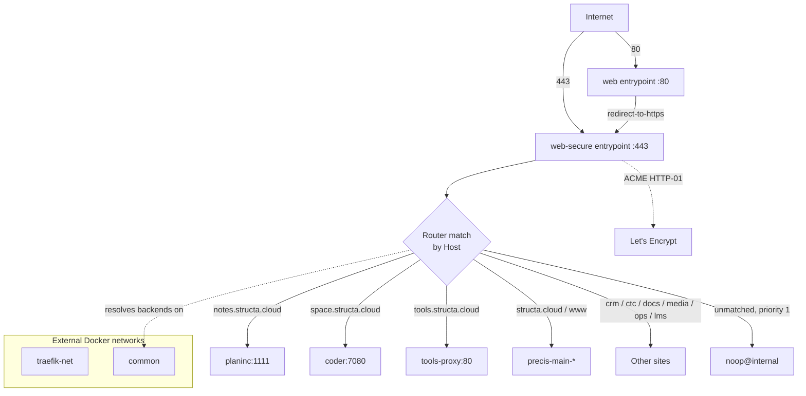

# Architecture (PX-002)

> Part of **Structa proxy** — Traefik edge and TLS termination for `*.structa.cloud`

Traefik is the production edge. Caddy is an optional alternative that can run
alongside it (it binds 8081/8443) but is **not enabled** by default.



## Static vs dynamic configuration

This split is the thing to internalise before editing anything, because it
determines whether your change needs a restart or a recreate.

| Kind | File | Mounted at | Applied by |
| --- | --- | --- | --- |
| **Static** | `configs/traefik/dynamic.yml` | `/etc/traefik/dynamic.yml` | process start only |
| **Dynamic** | `configs/traefik/dynamic/*.yml` | `/etc/traefik/dynamic` | file watcher, live |

Static holds what cannot change at runtime: entrypoints, the file provider, the
API/ping endpoint and the `letsencrypt-http` ACME resolver. Dynamic holds what
can: routers, services, middlewares, TLS stores.

⚠️ `configs/traefik/dynamic.yml` is the **static** file despite the name. The
dynamic configs are the files inside `dynamic/`.

## Networks

The stack declares two **external** networks:

- `traefik-net` — the proxy's own network.
- `common` — the shared network every routable backend must join.

Traefik resolves a backend by **container name** on `common`. A container that is
not attached to `common` produces a 502 even when the router config is perfect.
Create the networks once:

```bash
docker network create traefik-net
docker network create common
```

## TLS

Production certificates come from Let's Encrypt over **HTTP-01** — no DNS
provider token exists anywhere in this stack. Traefik stores the account key and
issued certificates in `configs/acme.json` (gitignored, mounted read-write).

`.localhost` hosts cannot pass public ACME validation, so they are served by a
static self-signed certificate from `configs/traefik/dynamic/certs.yml`. See
[`PX-004`](./03-certificates.md).

## Health

Traefik's own health check curls `http://localhost:8080/ping`. Downstream sites
are checked by `scripts/check-site-health.py`, which is deliberately stricter —
it also inspects the certificate each host actually presents.

## Related

- [`PX-003`](./02-routing.md) — the router table
- [`PX-004`](./03-certificates.md) — certificates
- [`PX-006`](./05-validation-and-health-checks.md) — the checks
