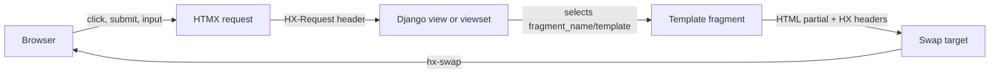
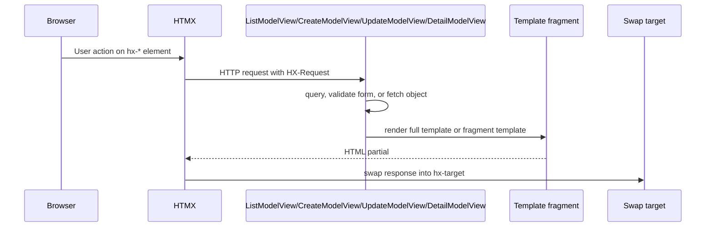

# django-fusion model views, Wagtail snippets, and HTMX fragments

This guide shows the canonical import paths and the common wiring patterns for
Django model views, Wagtail snippet viewsets, and HTMX fragment responses in
`django-fusion`.

## Canonical imports

Use these canonical import paths in new code:

```python
from django_fusion.site import ComponentViews, FragmentHandlerMixin, viewprop
from django_fusion.comp.generic import (
    CreateModelView,
    DetailModelView,
    ListModelView,
    UpdateModelView,
)
from django_fusion.wagtail.viewsets import BaseSnippetViewSet
```

## Request flow

The usual HTMX fragment lifecycle is:



For model CRUD views:



## Generic model view examples

The model views are Django class-based views, so you can use them directly in
`urls.py` with `as_view()`. Set `model`, `fields`, templates, and success URLs as
needed for your app.

```python
# urls.py
from django.urls import path, reverse_lazy

from django_fusion.comp.generic import (
    CreateModelView,
    DetailModelView,
    ListModelView,
    UpdateModelView,
)

from .models import Article

urlpatterns = [
    path(
        "articles/",
        ListModelView.as_view(
            model=Article,
            paginate_by=25,
            template_name="articles/article_list.html",
        ),
        name="article-list",
    ),
    path(
        "articles/<int:pk>/",
        DetailModelView.as_view(
            model=Article,
            template_name="articles/article_detail.html",
        ),
        name="article-detail",
    ),
    path(
        "articles/create/",
        CreateModelView.as_view(
            model=Article,
            fields=["title", "summary", "body", "is_published"],
            template_name="articles/article_form.html",
            success_url=reverse_lazy("article-list"),
        ),
        name="article-create",
    ),
    path(
        "articles/<int:pk>/edit/",
        UpdateModelView.as_view(
            model=Article,
            fields=["title", "summary", "body", "is_published"],
            template_name="articles/article_form.html",
            success_url=reverse_lazy("article-list"),
        ),
        name="article-update",
    ),
]
```

### HTMX-enabled list fragment

Pair a normal list view with an HTMX trigger. The view can render the same list
page for normal requests and a smaller fragment for HTMX requests.

```python
# views.py
from django_fusion.site import FragmentHandlerMixin
from django_fusion.comp.generic import ListModelView

from .models import Article


class ArticleListView(FragmentHandlerMixin, ListModelView):
    model = Article
    paginate_by = 25
    template_name = "articles/article_list.html"
    fragment_name = "articles.fragments.article_rows"
    fragment_target = "#article-results"

    def get_queryset(self):
        queryset = super().get_queryset()
        query = self.request.GET.get("q")
        if query:
            queryset = queryset.filter(title__icontains=query)
        return queryset
```

```html
<form hx-get=""
      hx-target="#article-results"
      hx-swap="innerHTML">
  <input type="search" name="q" placeholder="Search articles">
</form>

<div id="article-results">
  
</div>
```

```html
{# templates/articles/fragments/article_rows.html #}

  <article class="article-card">
    <h2>{{ article.title }}</h2>
    <p>{{ article.summary }}</p>
  </article>

  <p>No articles found.</p>

```

### HTMX create/update form fragment

Create and update forms can use the same fragment target. On validation errors,
return the form fragment; on success, redirect, retarget, or return a refreshed
list fragment depending on the UX you want.

```python
# views.py
from django.urls import reverse_lazy

from django_fusion.comp.generic import CreateModelView, UpdateModelView

from .models import Article


class ArticleCreateView(CreateModelView):
    model = Article
    fields = ["title", "summary", "body", "is_published"]
    template_name = "articles/article_form.html"
    success_url = reverse_lazy("article-list")


class ArticleUpdateView(UpdateModelView):
    model = Article
    fields = ["title", "summary", "body", "is_published"]
    template_name = "articles/article_form.html"
    success_url = reverse_lazy("article-list")
```

```html
<div id="article-form-panel">
  <form method="post"
        hx-post="{{ request.path }}"
        hx-target="#article-form-panel"
        hx-swap="outerHTML">
    
    {{ form.as_p }}
    <button type="submit">Save</button>
  </form>
</div>
```

## Viewset-oriented model wiring

When a project uses django-fusion routing/viewset classes, keep custom view
classes imported from `django_fusion.comp.generic` and assign them on the viewset.
The viewset passes `model`, `queryset`, and `viewset` into the view kwargs.

```python
from django_fusion.comp.generic import (
    CreateModelView,
    DetailModelView,
    ListModelView,
    UpdateModelView,
)
from django_fusion.comp.routes.other import ModelViewset

from .models import Article


class ArticleListView(ListModelView):
    template_name = "articles/article_list.html"


class ArticleDetailView(DetailModelView):
    template_name = "articles/article_detail.html"


class ArticleCreateView(CreateModelView):
    fields = ["title", "summary", "body", "is_published"]


class ArticleUpdateView(UpdateModelView):
    fields = ["title", "summary", "body", "is_published"]


class ArticleViewSet(ModelViewset):
    model = Article
    list_view_class = ArticleListView
    detail_view_class = ArticleDetailView
    create_view_class = ArticleCreateView
    update_view_class = ArticleUpdateView
    list_columns = ("title", "is_published", "updated_at")
```

## `BaseSnippetViewSet` for Wagtail snippets

`BaseSnippetViewSet` lives in
`applications/libs/django-fusion/src/django_fusion/wagtail/viewsets.py` and extends
Wagtail's `SnippetViewSet`. It adds reusable list actions for duplication and CSV
export, plus helper display methods for booleans, links, and image presence.

```python
# wagtail_hooks.py
from wagtail.snippets.models import register_snippet

from django_fusion.wagtail.viewsets import BaseSnippetViewSet

from .models import Sponsor


class SponsorSnippetViewSet(BaseSnippetViewSet):
    model = Sponsor
    icon = "group"
    menu_label = "Sponsors"
    menu_name = "sponsors"
    list_display = ("name", "website_link", "is_active_icon", "logo_icon")
    list_export = ("name", "website", "is_active")
    csv_filename = "sponsors.csv"

    def website_link(self, obj):
        return self.link_display(obj.website)

    def is_active_icon(self, obj):
        return self.icon_boolean(obj.is_active)

    def logo_icon(self, obj):
        return self.image_display(obj.logo)


register_snippet(SponsorSnippetViewSet)
```

Use `list_export` to choose fields for CSV output. If an exported attribute is
callable, the export action calls it; otherwise it writes the attribute value.
The duplicate action copies selected snippets with a new primary key and, when an
`is_active` attribute exists, disables the duplicate before saving it.

## Import checklist

- New site, context, fragment, and helper imports: `django_fusion.site`.
- Generic CRUD view imports: `django_fusion.comp.generic`.
- Wagtail snippet helpers: `django_fusion.wagtail.viewsets`.

