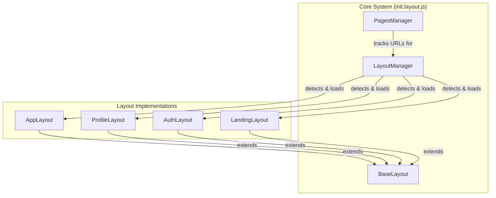
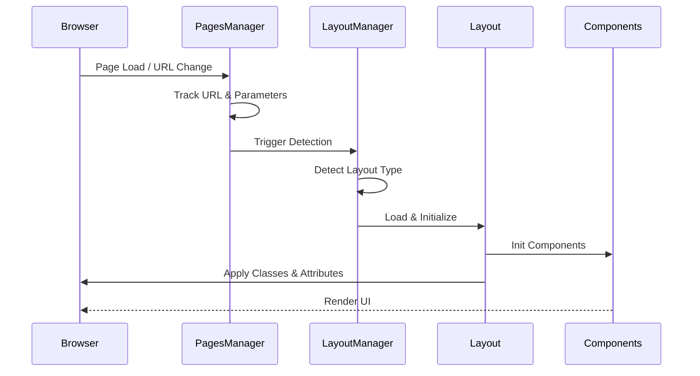

# Pages Layout System

Comprehensive documentation for the unified page and layout management system.

## Overview

The layout system provides a modular architecture for managing different page types with consistent behavior, navigation, and state management.



---

## Data Flow



---

## File Structure

| File | Size | Description |
|------|------|-------------|
| [init.layout.js](file:///root/xellent/assets/static/js/pages/init.layout.js) | 59KB | Core: PagesManager, BaseLayout, LayoutManager |
| [app.layout.js](file:///root/xellent/assets/static/js/pages/app.layout.js) | 38KB | Dashboard/App layout with widgets, panels, tabs |
| [profile.layout.js](file:///root/xellent/assets/static/js/pages/profile.layout.js) | 15KB | User profile with navigation state management |
| [auth.layout.js](file:///root/xellent/assets/static/js/pages/auth.layout.js) | 26KB | Authentication with forms, OAuth, 2FA |
| [landing.layout.js](file:///root/xellent/assets/static/js/pages/landing.layout.js) | 37KB | Public pages with animations, sections |
| [notifications.layout.js](file:///root/xellent/assets/static/js/pages/notifications.layout.js) | 4KB | Notification display layout |

---

## Core Classes

### PagesManager

URL tracking, parameter management, and page information extraction.

```javascript
import { pagesManager } from './init.layout.js';

// URL Parameters
pagesManager.getParameter('tab', 'default');
pagesManager.setParameter('page', '2');
pagesManager.deleteParameter('filter');
pagesManager.getAllParameters();

// Navigation
pagesManager.navigateTo('/profile/settings');
pagesManager.goBack();

// Page Info
pagesManager.getCurrentPage();
pagesManager.getPageHistory(5);

// Events
pagesManager.on('pages:url-changed', (data) => {
    console.log('URL changed:', data.currentUrl);
});
```

**Key Methods:**

| Method | Description |
|--------|-------------|
| `initialize()` | Start URL tracking and parameter sync |
| `getParameter(key, default)` | Get URL parameter value |
| `setParameter(key, value)` | Set URL parameter |
| `navigateTo(url, options)` | Programmatic navigation |
| `extractPageInfo()` | Extract metadata from current page |
| `on(event, callback)` | Listen to page events |

**Events:**

- `pages:url-changed` - URL has changed
- `pages:parameters-changed` - URL parameters updated
- `pages:page-info-extracted` - Page metadata extracted
- `pages:hash-changed` - Hash fragment changed

---

### BaseLayout

Foundation class for all layouts with notifications, components, and lifecycle management.

```javascript
import { BaseLayout } from './init.layout.js';

class MyLayout extends BaseLayout {
    constructor(options = {}) {
        super({
            layoutId: 'my-layout',
            layoutType: 'custom',
            ...options
        });
    }

    async initComponents() {
        this.registerComponent('sidebar', new MySidebar());
    }

    async applyContent() {
        // Apply layout-specific content
    }
}
```

**Key Methods:**

| Method | Description |
|--------|-------------|
| `init()` | Initialize layout and components |
| `apply(type, data)` | Apply layout with data |
| `destroy()` | Cleanup layout resources |
| `registerComponent(name, instance)` | Register a component |
| `showNotification(msg, type)` | Display notification |
| `on(event, handler)` | Listen to layout events |
| `dispatchEvent(name, detail)` | Dispatch custom event |

**Lifecycle:**

1. `constructor()` - Configure options
2. `init()` - Initialize core systems
3. `initComponents()` - Setup components (override)
4. `apply()` - Apply layout to page
5. `applyContent()` - Apply content (override)
6. `destroy()` - Cleanup

---

### LayoutManager

Auto-detection and initialization of layouts based on URL and DOM.

```javascript
import { layoutManager } from './init.layout.js';

// Get current layout
const layout = layoutManager.getLayoutInstance();

// Switch layouts
await layoutManager.switchLayout('profile', { userId: 123 });

// Register custom layout
layoutManager.registerLayout('custom', CustomLayout);

// Get layout status
layoutManager.getCurrentLayout(); // 'profile'
layoutManager.hasLayout('app'); // true
```

**Detection Priority:**

1. `data-layout` attribute on `<body>`
2. URL path patterns (`/profile`, `/dashboard`, etc.)
3. Body CSS classes (`layout-*`)
4. Default layout fallback

---

## Layout Implementations

### AppLayout

Dashboard and application pages with sidebar, panels, widgets, and tabs.

```javascript
const appLayout = window.appLayout;

// Sidebar
appLayout.toggleSidebar();

// Panels
appLayout.openPanel('notifications');
appLayout.closePanel('notifications');

// Modals
appLayout.openModal('settings-modal');
appLayout.closeModal('settings-modal');

// Tabs
appLayout.switchTab(container, 'tab-2');

// Widgets
appLayout.refreshAllWidgets();
```

**Sub-Types:** `dashboard`, `profile`, `profile-settings`, `profile-dashboard`, `settings`, `reports`, `analytics`

---

### ProfileLayout

User profile pages with HTMX navigation and active state management.

```javascript
const profileLayout = window.profileLayout;

// Navigation
profileLayout.setActive('/profile/settings');
profileLayout.refresh();

// Current state
profileLayout.getCurrentSubType(); // 'settings'
profileLayout.getCurrentPath(); // '/profile/settings'

// Modals
profileLayout.openModal('edit-profile');
```

**Sub-Types:** `overview`, `settings`, `security`, `activity`, `dashboard`

---

### AuthLayout

Authentication pages with form handling, OAuth, and session management.

```javascript
const authLayout = window.authLayout;

// Session
authLayout.isLoggedIn();
authLayout.getSession();
authLayout.logout();

// OAuth
authLayout.initiateSocialLogin('google');

// Require auth
authLayout.requireAuth('/auth/login');
```

**Auth States:** `login`, `register`, `forgot-password`, `verify-email`, `2fa`, `callback`

---

### LandingLayout

Public marketing pages with animations, sections, and scroll effects.

```javascript
const landingLayout = window.landingLayout;

// Page type
landingLayout.getCurrentPageType(); // 'home'
landingLayout.getPageTypeHistory(5);

// Sections
landingLayout.scrollToSection('features');
landingLayout.getSectionState('hero');

// Animations
landingLayout.refreshAnimations();
```

**Page Types:** `home`, `about`, `features`, `pricing`, `contact`, `blog`, `faq`

---

## Global Instances

```javascript
// Available on window after initialization
window.pagesManager      // PagesManager singleton
window.layoutManager     // LayoutManager singleton
window.currentLayout     // Current active layout instance
window.profileLayout     // ProfileLayout (when active)
window.appLayout         // AppLayout (when active)
```

---

## Events Reference

| Event | Source | Description |
|-------|--------|-------------|
| `layout:initialized` | BaseLayout | Layout initialization complete |
| `layout:applied` | BaseLayout | Layout applied to page |
| `layout:destroyed` | BaseLayout | Layout destroyed |
| `layout:changed` | LayoutManager | Active layout switched |
| `pages:url-changed` | PagesManager | URL changed |
| `pages:parameters-changed` | PagesManager | URL params changed |
| `pages:page-info-extracted` | PagesManager | Page metadata extracted |

---

## Configuration

### BaseLayout Options

```javascript
{
    layoutId: 'my-layout',
    layoutType: 'custom',
    pageId: 'page-name',
    debug: false,
    autoInit: true,
    enableNotifications: true,
    trackNavigation: true,
    emitEvents: true
}
```

### PagesManager Options

```javascript
{
    trackHash: true,
    trackPageInfo: true,
    maxHistory: 50,
    persistState: true,
    excludeParams: ['utm_', 'fbclid'],
    autoUpdateForms: true,
    autoSyncLinks: true
}
```
