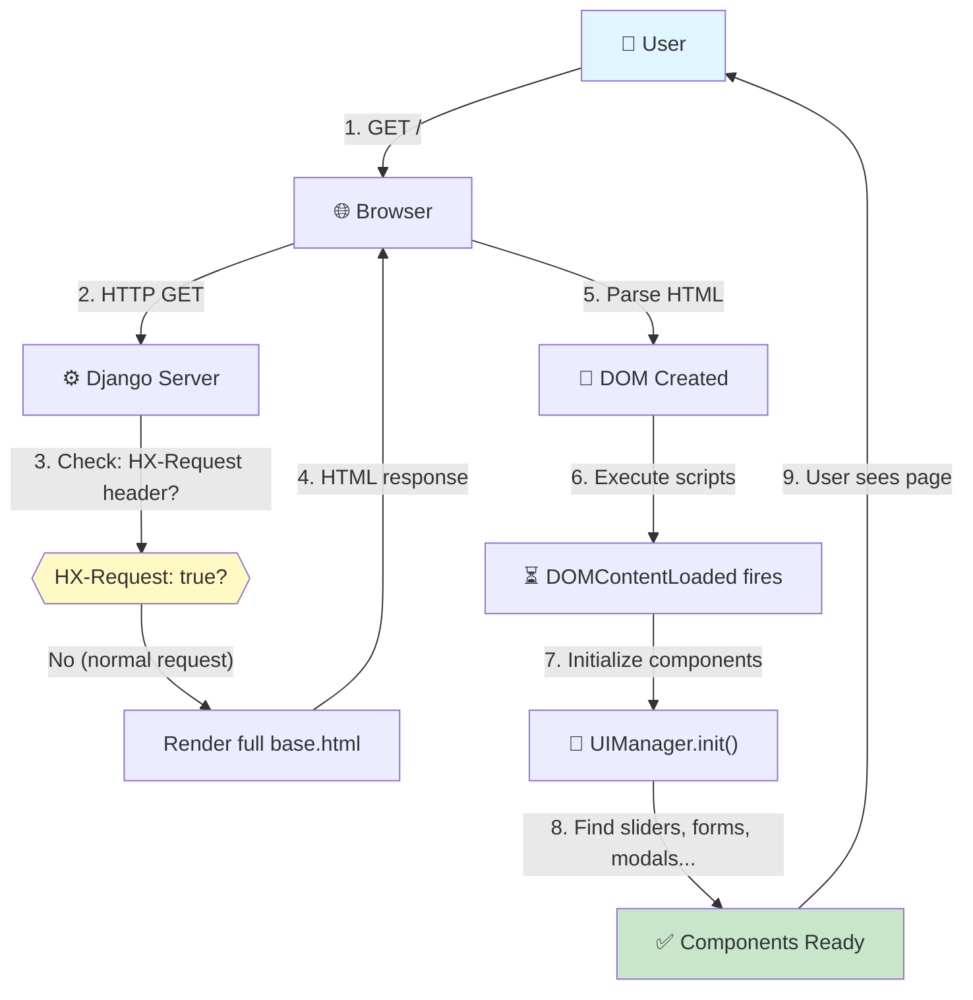
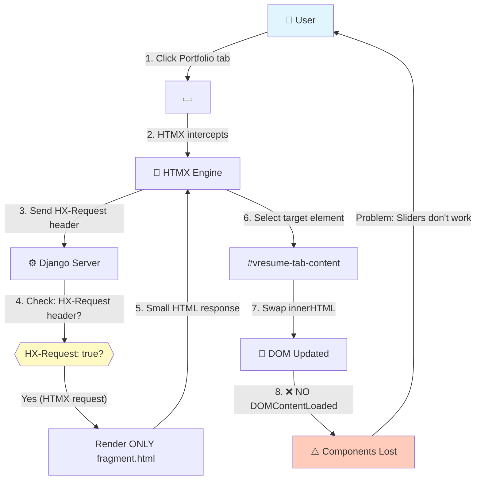
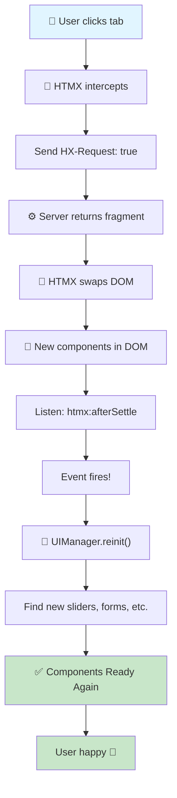

# HTMX Request & Component Lifecycle Flow

Visual guide to understanding how HTMX powers VResume's dynamic interactions and component initialization.

---

## Normal vs HTMX Request Flow

### Normal Page Load (Initial Visit)



**Result**: Full page reload, all components initialized ✅

---

### HTMX Tab Click (Subsequent Navigation)



**Problem**: Components lost after HTMX swap ❌

---

## Solution: HTMX Event Listeners

### Fixed Flow with Component Re-initialization



**Implementation**:
```javascript
// In v1/assets/static/js/projects/main.js
document.addEventListener('htmx:afterSettle', async () => {
    console.log('HTMX swap complete — re-initializing components');
    await UIManager.initializeComponents();
});
```

---

## Detailed Request Lifecycle

### Request Path: From Click to Rendered Page

```
┌─────────────────────────────────────────────────────────────┐
│ PHASE 1: USER INTERACTION                                   │
└─────────────────────────────────────────────────────────────┘

1️⃣  User clicks "Portfolio" button
    ├─ Button has: hx-get=""
    ├─ HTMX intercepts click event
    └─ Prevents normal navigation


┌─────────────────────────────────────────────────────────────┐
│ PHASE 2: HTTP REQUEST                                       │
└─────────────────────────────────────────────────────────────┘

2️⃣  HTMX sends HTTP request
    ├─ Method: GET /pages/tab/portfolio/
    ├─ Headers include: HX-Request: true ← KEY!
    ├─ HX-Target: #vresume-tab-content
    └─ HX-Current-URL: http://localhost:8000/


┌─────────────────────────────────────────────────────────────┐
│ PHASE 3: SERVER PROCESSING                                  │
└─────────────────────────────────────────────────────────────┘

3️⃣  Django URL router matches
    ├─ Pattern: pages/urls.py
    └─ Handler: views.tab(request, tab_name='portfolio')

4️⃣  View executes
    ├─ Get PortfolioPage instance
    ├─ Build context: projects, tags, pagination
    ├─ Check request.headers.get('HX-Request')
    └─ Result: True ✓

5️⃣  Server responds
    ├─ Since HX-Request=true:
    │  └─ Render: portfolio/fragment.html (small response)
    ├─ NOT: base.html (would be large)
    └─ Response headers: Content-Type: text/html


┌─────────────────────────────────────────────────────────────┐
│ PHASE 4: RESPONSE & DOM SWAP                                │
└─────────────────────────────────────────────────────────────┘

6️⃣  HTMX receives HTML
    ├─ Size: ~8KB (fragment only)
    ├─ Contains: Filter form + project grid
    └─ No: <head>, scripts, sidebar

7️⃣  HTMX finds target element
    ├─ Selector: #vresume-tab-content
    ├─ Current content: about/fragment.html (old)
    └─ Swaps: innerHTML with new HTML

8️⃣  CSS transition applied
    ├─ hx-swap="innerHTML transition:true"
    ├─ Fade animation plays
    └─ Duration: ~300ms (browser CSS)

9️⃣  URL updated (if hx-push-url="true")
    ├─ Browser history: /portfolio added
    ├─ Back button now works
    └─ URL bar updates: shows /portfolio


┌─────────────────────────────────────────────────────────────┐
│ PHASE 5: COMPONENT INITIALIZATION                           │
└─────────────────────────────────────────────────────────────┘

🔟  Listen for: htmx:afterSettle event
    ├─ Fires after DOM swap completes
    ├─ Fires when all content settled
    └─ ✓ Safe to initialize components

1️⃣1️⃣  UIManager.initializeComponents() runs
    ├─ Loop through registered components
    ├─ Check: Do DOM selectors match?
    ├─ Example: Find [data-slider]
    └─ New slider elements found!

1️⃣2️⃣  Component initialization begins
    ├─ Load Swiper JS from CDN
    ├─ Create Swiper instance
    ├─ Attach event listeners
    └─ Ready to interact!

1️⃣3️⃣  User sees interactive page
    ├─ Slider works ✓
    ├─ Forms work ✓
    ├─ Modals work ✓
    └─ All components initialized!
```

---

## Component Lifecycle: Birth to Death

```mermaid
graph TD
    A["Page Load<br/>or<br/>HTMX Swap"] -->|"1. DOM Ready"| B["UIManager detects<br/>selectors"]
    B -->|"2. Check: [data-slider]?"| C{{"Element<br/>found?"}}
    C -->|"Yes"| D["Lazy load component<br/>import('./sliders.js')"]
    C -->|"No"| E["Skip this component"]
    D -->|"3. Component loaded"| F["new SlidersComponent<br/>{ element }"]]
    F -->|"4. Call .init()"| G["Setup:<br/>- Find child elements<br/>- Load dependencies<br/>- Attach events"]
    G -->|"5. Ready"| H["Component working<br/>User can interact"]
    H -->|"User clicks tab"| I["HTMX swap<br/>New DOM"]
    I -->|"Old element<br/>no longer<br/>in DOM"| J["Component dies<br/>No .destroy()"]
    J -->|"Memory?<br/>Listeners?"| K["⚠️ Potential leaks"]
    K -->|"htmx:afterSettle<br/>fires again"| A
    
    style A fill:#e1f5ff
    style H fill:#c8e6c9
    style K fill:#ffccbc
```

---

## Pre-loader Timing

### Initial Page Load Preloader

```
Page starts loading
  ↓
<body data-preloader="3">  ← Attribute found
  ↓
Preloader.checkPreloaderType()  ← Runs immediately
  ↓
Create preloader div  ← Type 3 (dots animation)
  ↓
Append to <body>  ← Show full-screen loader
  ↓
... other scripts load ...
  ↓
DOMContentLoaded fires  ← Preloader hides (line 168-172)
  ↓
Components initialize  ← Sliders, etc. start loading from CDN
  ↓
⚠️ TIMING ISSUE: User sees blank area while Swiper loads!
```

### HTMX Request Preloader

```
User clicks tab
  ↓
hx-get triggers  ← data-htmx-preloader attribute
  ↓
htmx:beforeRequest fires
  ↓
Preloader.showHTMXPreloader()  ← Show spinner on target
  ↓
Request sent to server
  ↓
Response received
  ↓
Content swapped
  ↓
htmx:afterSettle fires
  ↓
Preloader.hideHTMXPreloader()  ← Hide spinner
  ✓ Timing: Good! Spinner shown during request
```

---

## Event Flow: HTMX to Components

```
User Action
  │
  ├─ Click button with hx-get
  │   └─ HTMX.js intercepts
  │
  ├─ htmx:beforeRequest
  │   └─ Show preloader
  │
  ├─ HTTP request sent
  │   └─ Server processes
  │
  ├─ HTTP response received
  │   └─ HTML fragment ready
  │
  ├─ htmx:beforeSwap
  │   └─ Last chance to modify HTML
  │
  ├─ htmx:afterSwap
  │   └─ Content swapped into DOM
  │   └─ Animation plays
  │
  ├─ htmx:afterSettle
  │   └─ DOM settle complete
  │   └─ ⭐ INITIALIZE COMPONENTS HERE
  │   └─ UIManager.initializeComponents()
  │
  ├─ Component init starts
  │   ├─ Load dependencies (CDN)
  │   ├─ Attach event listeners
  │   └─ Configure with data attributes
  │
  ├─ Components ready
  │   └─ User can interact
  │
  └─ htmx:afterSettle event lifecycle ends
```

---

## Memory & Cleanup Concerns

### Current Issue: Memory Leaks

```javascript
// In preloader.js
this.htmxPreloaders = new Map();

showHTMXPreloader(targetId) {
    const preloader = this.createHTMXPreloader(targetId);
    this.htmxPreloaders.set(targetId, preloader);  // ← Stores forever!
}

hideHTMXPreloader(targetId) {
    const preloader = this.htmxPreloaders.get(targetId);
    preloader.remove();
    // ❌ NOT removed from Map
    // Result: Map grows indefinitely
}
```

**Fix**:
```javascript
hideHTMXPreloader(targetId) {
    const preloader = this.htmxPreloaders.get(targetId);
    if (preloader) {
        preloader.remove();
        this.htmxPreloaders.delete(targetId);  // ✅ Clean up!
    }
}
```

### Event Listener Cleanup

```javascript
// Problem: Form handler
form.addEventListener('htmx:beforeRequest', () => this.showLoading());

// After many HTMX swaps:
// ❌ Old listeners still attached (though elements removed from DOM)
// ✅ Solution: Use event delegation or cleanup on destroy()
```

---

## Debugging Tips

### Enable HTMX Debug

```javascript
// In browser console or base.html
htmx.config.historyCacheSize = 0;  // Don't cache responses
htmx.logAll();                     // Log all events
```

### Trace Component Initialization

```javascript
// In browser console
window.UIManager.components  // See all initialized components
UIManager.definitions  // See all registered definitions
```

### Monitor HTMX Events

```javascript
// In browser console
document.addEventListener('htmx:beforeRequest', () => console.log('Request starting'));
document.addEventListener('htmx:afterSettle', () => console.log('Swap complete — components should re-init'));
document.addEventListener('htmx:responseError', (e) => console.error('Error:', e.detail));
```

---

## Summary

| Phase | Action | Time | Issue |
|-------|--------|------|-------|
| 1 | User clicks | ~0ms | — |
| 2 | HTMX sends request | ~10ms | — |
| 3 | Server processes | ~100-500ms | ⏳ Slow DB query? |
| 4 | Response received | ~550ms | ⏳ Large HTML? |
| 5 | DOM swap | ~1ms | — |
| 6 | Animation plays | ~300ms | ✓ Good UX |
| 7 | Components init | ~200-1000ms | ⚠️ CDN load? |
| **Total** | **Full transition** | **~1-2s** | ✓ Usually good |

---

## Next Steps

- [Component Development Guide](../../guides/development/COMPONENT_GUIDE.md) — How to build components
- [HTMX Integration Guide](../../guides/development/HTMX_INTEGRATION.md) — Practical examples
- [Architecture Overview](./index.md) — Full system design
