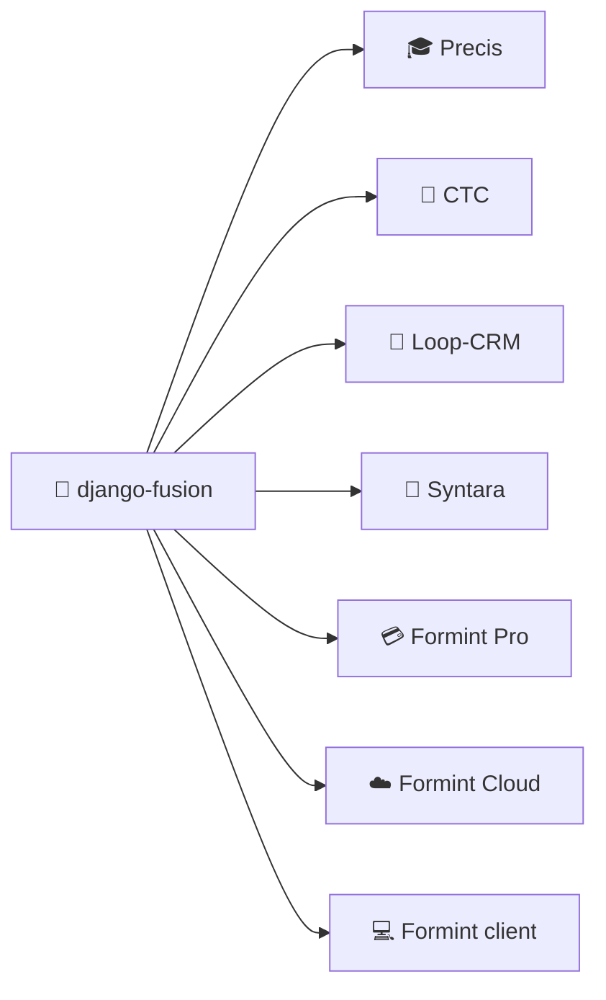

# DF-000 — django-fusion Package Guide

> The complete package guide: what this library is, how it is structured, how it
> is used across the Structa Cloud monorepo, and how to work with it.
> ID: **DF-000** (the entry point for this docs set).

---

## 1. What This Package Is

`django-fusion` is a Django + Wagtail helper library that provides:

- **Component system** — `` template tag with props, slots, variables,
  HTMX scoping (`fragment_name=`), and component tracking/analysis.
- **Declarative routing** — `Site`, `Application`, `Viewset`, `ModelViewset`,
  `RoutableComponent`, `FragmentComponent`.
- **Forms & tables** — `FormMixin`, `TableMixin`, `FormTableMixin` with a
  template-resolution cascade.
- **Auth layer** — django-allauth adapters, mixins, social signup helpers.
- **Wagtail integration** — StreamField blocks, snippets, viewsets, menus.
- **Health checks** — `/health/`, `/health/db/`, `/health/assets/`.
- **Configuration** — Dynaconf multi-environment YAML settings + model/template
  registries.
- **Background tasks** — Dramatiq worker + APScheduler cron runners.
- **Optional plugins** — django-bolt API bridge, tables adapter, auth extras.

It is the **canonical `django_fusion` package**; import symbols from
`django_fusion.*` directly. Re-export shims were removed — never add new ones.

## 2. Repository Layout

```text
libs/django-fusion/
├── src/django_fusion/
│   ├── comp/            # Components, routes, generic views, template tags
│   │   ├── routes/      #   Site, Application, Viewset, RoutableComponent…
│   │   ├── generic/     #   List/Create/Update/Delete/Detail model views
│   │   └── templatetags/ #   components, routable_components
│   ├── core/            # handlers (PageHandler), services, middlewares, cache
│   ├── health/          # /health/ endpoints
│   ├── config/          # Dynaconf loader, ModelsRegistry, TemplateRegistry
│   ├── tasks/           # Dramatiq worker + APScheduler scheduler
│   ├── plugins/         # optional integrations (apis/bolt, tables, auth)
│   └── assets/          # SCSS/JS entry points for the webpack bundle
├── docs/                # This documentation set (DF-0NN)
├── js/fusion-js/        # TypeScript fusion client (nx project `fusion-js`)
├── static/              # compiled webpack output (bundles, webpack-stats.json)
├── tests/               # pytest suite (63+ tests + hypothesis property tests)
├── Makefile             # asset build targets
└── pyproject.toml       # package metadata + extras (bolt, tables, auth, webpack)
```

## 3. How It Is Used Across Structa Cloud

django-fusion is the shared framework layer for every web product in the
monorepo. Consumers and their intensity:

| Project | Backend | Usage |
|---------|---------|-------|
| Precis (main) | `projects/precis/precis-main/backend/` | Reference consumer: components, viewsets, fragments |
| CTC Research | `projects/precis/precis-ctc/backend/` | Heaviest consumer (194 files): health, scheduler, config |
| Loop-CRM | `projects/loop-crm/backend/` | Pages, seed commands (`seed_demo`, `seed_pages`) |
| Syntara | `projects/syntara/` | `django_fusion.config.loader` registries |
| Formint Pro | `projects/formints/formint-pro/server/` | Ninja API + fusion viewsets |
| Formint Cloud | `projects/formints/formint-cloud/backend/` | Unfold admin + fusion contract |
| Formint client | `projects/formints/formint-client/backend/` | Purchase app backend |



## 4. Quick Start

### In a Structa Cloud project

The workspace `projects/pyproject.toml` resolves django-fusion as a path source
(`libs/django-fusion`), so `uv sync` in the workspace installs it. Backend
Makefiles that want an explicit editable install:

```bash
cd libs/django-fusion
uv pip install -e .
```

### In a standalone project

```bash
pip install django-fusion
```

```python
INSTALLED_APPS = [
    # ...
    "django_fusion.comp",
    "django_fusion.core",
    "django_fusion.health",          # optional
    "django_fusion.analyzer",        # optional
    "django_fusion.config",
]
```

Render your first component:

```django

```

> Full walkthrough: [DF-001 Getting Started](01-getting-started.md).

## 5. Docs Map

| ID | Topic | File |
|----|-------|------|
| DF-000 | **This package guide** | `00-package-guide.md` |
| DF-001 | Getting started | `01-getting-started.md` |
| DF-002 | Architecture overview | `02-architecture.md` |
| DF-003 | Component system (Python) | `03-component-system.md` |
| DF-004 | `` template tag | `04-component-tag.md` |
| DF-005 | Routing & viewsets | `05-routing.md` |
| DF-006 | Forms & tables | `06-forms-and-tables.md` |
| DF-007 | Settings & configuration | `07-configuration.md` |
| DF-008 | API reference | `08-api-reference.md` |
| DF-009 | Health checks | `09-health.md` |
| DF-010 | Wagtail integration | `10-wagtail-integration.md` |
| DF-011 | Best practices | `11-best-practices.md` |
| DF-012 | Integration examples | `12-integration-examples.md` |
| DF-013 | Troubleshooting | `13-troubleshooting.md` |
| DF-014 | FAQ | `14-faq.md` |
| DF-015 | Viewflow mapping | `15-viewflow-mapping.md` |
| DF-016 | Asset pipeline | `16-assets.md` |
| DF-017 | Integration modes | `17-integration-modes.md` |
| DF-018 | Render contract | `18-render-contract.md` |
| DF-019 | OpenAPI & filtering | `19-openapi-and-filtering.md` |

## 6. Development Workflow

- **Edit** `src/django_fusion/**`, **never** `static/` or `webpack-stats.json` (generated).
- **Assets:** `make build | dev | watch | clean` in the package root (webpack).
- **Tests:** `uv run pytest` in the package root (Django 4.2/5.0, Python 3.11/3.12).
- **Docs:** keep DF-0NN numbers stable; add new numbers only for new topics.
- **Release:** the lib is a git submodule with its own repo
  (`github.com/mammhoud/django-fusion`, branch `generic`); bump via the root
  `make push-lib LIB=django-fusion`.

## Remarks & Notes

- This guide is DF-000 and intentionally references the rest of the set; keep
  IDs stable so `INDEX.md` and consumer docs don't rot.
- The Structa Cloud main docs mirror this guide at
  `docs/libs/django-fusion.md` — update both when the framework surface changes.
- `customization_level: not-customizable` — product code consumes the public API
  and never patches internals.
