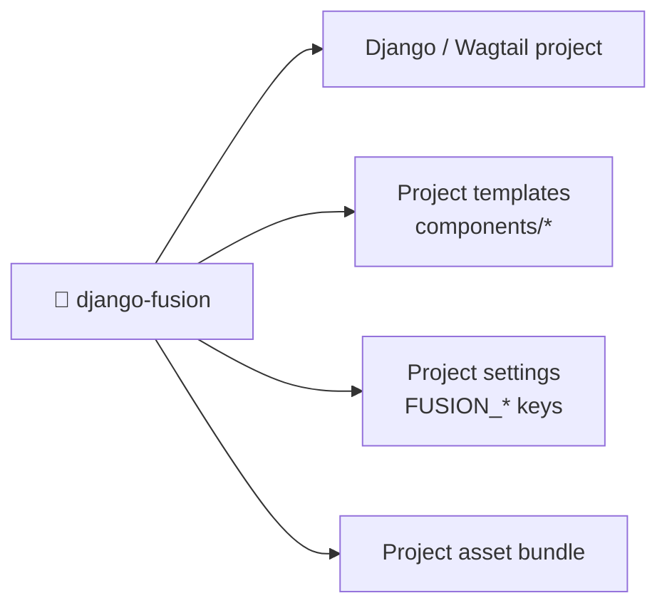

# DF-000 — django-fusion Package Guide

> The human-facing entry point to the package: what it is, how it is laid out,
> how it is consumed, and where to look next. The numbered index in
> [`INDEX.md`](./INDEX.md) remains the source of truth for the doc set.

---

## 1. What this package is

`django-fusion` is a Django + Wagtail helper library:

- **Component system** — `` with props, slots, variables, HTMX scoping
  (`fragment_name=`), and component usage analysis.
- **Declarative routing** — `Site`, `Application`, `Viewset`, `ModelViewset`,
  `RoutableComponent`, `FragmentComponent`.
- **Fragment rendering** — fetch any template fragment by dotted name over HTTP,
  HTMX, Unpoly, or SSE.
- **Forms & tables** — `FormMixin`, `TableMixin`, `FormTableMixin` with a
  template-resolution cascade.
- **Render contract** — render-first HTML, fragments, or a data API from one
  view, resolved through `FUSION_RENDER_MODE`.
- **Health checks** — `/health/`, `/health/db/`, `/health/assets/`.
- **Asset pipeline** — webpack source for component SCSS/JS plus a
  backend-controlled asset manifest.
- **Background tasks** — broker-agnostic registration (Dramatiq or in-process).
- **Configuration** — Dynaconf multi-environment YAML loader and typed `FUSION_*`
  settings.
- **Optional integrations** — django-bolt API bridge, django-tables2, allauth,
  django-webpack-loader, an interactive designer, and MCP routers.

It is the canonical `django_fusion` package. Import symbols from `django_fusion.*`
directly; re-export shims are not supported.

## 2. Repository layout

```text
django-fusion/
├── src/django_fusion/
│   ├── comp/              # Component registry,  tags, cache, loader
│   ├── routes/            # Sites, applications, viewsets, components, renderers
│   ├── fragments/         # Fragment views, forms, tables, generic CBVs, analyzer
│   ├── core/              # Middleware, context, rendering, assets, health, encoder
│   ├── config/            # Typed conf, Dynaconf loader, asset manifest
│   ├── models/            # Base models, mixins, email, interaction, datatoken
│   ├── services/          # Base/model services, jobs, token, crud
│   ├── management/        # Commands, handlers, filters, managers, utils
│   ├── tasks/             # Broker-agnostic task registry and backends
│   ├── site/              # Site-level authentication mixins
│   ├── plugins/           # Optional: apis (bolt), designer, htmx, unpoly, webpack
│   ├── builder/           # Landing builder: page assembly, themes, styles
│   ├── template_fields/   # Sandboxed dynamic template field engine
│   ├── mcp/               # MCP routers (requires the bolt extra)
│   ├── contrib/           # Admin, cache, privacy, utility extensions
│   ├── assets/            # SCSS/JS source for the webpack bundle
│   └── templates/         # Framework templates and components
├── tests/                 # Self-contained pytest suite + support fixtures
├── docs/                  # This documentation set (DF-0NN)
├── .github/workflows/     # Library CI (tests, package check, lint)
├── webpack.config.js      # Webpack 5 bundle config
├── MANIFEST.in            # sdist contents
├── Makefile               # Asset build + release targets
└── pyproject.toml         # Metadata, extras, tool config
```

## 3. How it is consumed

`django-fusion` is a standalone published package. It is installed into a Django
or Wagtail project, which supplies its own settings, models, templates, and URL
mounts:

```bash
pip install django-fusion
```

```python
INSTALLED_APPS = [
<<<<<<< HEAD
    # ...
    "django_fusion",                 # app config: task wiring + sub-app discovery
    "django_fusion.comp",            # component system, registry, 
    "django_fusion.core",            # handlers, managers, services, cache, middlewares
    "django_fusion.config",          # Dynaconf settings loader
    "django_fusion.core.health",     # optional — /health/ endpoints
    "django_fusion.fragments.analyzer",  # optional —  usage scanner
=======
    "django_fusion",                     # base models, migrations, task bootstrap
    "django_fusion.comp",                # component registry (required)
    # "django_fusion.fragments.analyzer",  # optional
    # "django_fusion.builder",             # optional
>>>>>>> refs/remotes/origin/generic
]
```


```mermaid
graph LR
    F[🧩 django-fusion] --> P[Django / Wagtail project]
    F --> T[Project templates<br/>components/*]
    F --> S[Project settings<br/>FUSION_* keys]
    F --> A[Project asset bundle]
```

The library owns framework behavior. The project owns product behavior. See
[DF-017](./17-integration-modes.md) for the full boundary rules and
[README § Base vs. customization](../README.md#base-vs-customization) for the
short version.

`django-fusion` is also used inside a larger workspace as a git submodule. That
workspace relationship is not part of the library: the package has no knowledge
of a surrounding repository, and no code path in `src/` references one.

## 4. Quick start

```bash
pip install django-fusion
```

```django

```

Full walkthrough, including middleware ordering and template-tag builtins:
[DF-001 Getting Started](./01-getting-started.md).

## 5. Docs map

The numbered set lives in [`INDEX.md`](./INDEX.md). Summary:

| Range | Topic |
|---|---|
| DF-001 – DF-002 | Getting started, architecture |
| DF-003 – DF-006 | Components, ``, routing, forms & tables |
| DF-007 – DF-009 | Configuration, API reference, health checks |
| DF-010 – DF-015 | Wagtail integration, best practices, examples, troubleshooting, FAQ, mapping |
| DF-016 – DF-019 | Assets, integration modes, render contract, OpenAPI & filtering |
| DF-020 – DF-022 | Language contract, landing builder, template fields |
| DF-023 | Build and publish to PyPI |

Auxiliary references: [`00-package-guide.md`](./00-package-guide.md) (this file),
[`COMPONENT_CASE_STUDIES.md`](./COMPONENT_CASE_STUDIES.md),
[`COMPONENT_FORMS_TABLES.md`](./COMPONENT_FORMS_TABLES.md),
[`DESIGNER_MCP.md`](./DESIGNER_MCP.md), [`WEBSITE_MCP.md`](./WEBSITE_MCP.md),
[`../QUICKSTART.md`](../QUICKSTART.md), [`../PROMPTS.md`](../PROMPTS.md).

## 6. Development workflow

- **Edit** `src/django_fusion/**`. Never edit `static/bundles/*` or
  `webpack-stats.json` — those are generated.
- **Assets:** `make build | dev | watch | clean`.
- **Tests:** `uv run --extra test pytest` (no services or network required).
- **Lint:** `uv run --with ruff ruff check src tests`.
- **Docs:** keep `DF-0NN` numbers stable; add new numbers only for new topics, and
  register documented import paths in `tests/test_documented_import_paths.py`.
- **Release:** bump the version in `pyproject.toml` **and**
  `src/django_fusion/__init__.py`, update `CHANGELOG.md`, then follow
  [DF-023](./23-publishing.md).

## 7. Version and compatibility

| | |
|---|---|
| Current version | see `pyproject.toml` / `src/django_fusion/__init__.py` |
| Python | 3.11, 3.12, 3.13 |
| Django | 4.2, 5.0, 5.1, 5.2 |
| License | MIT — Structa Cloud / Mahmoud Ezzat Moustafa |

Optional integrations are gated behind extras; importing the base package never
requires them. `django_fusion.mcp` and `django_fusion.plugins.apis` need
`django-fusion[bolt]`.
