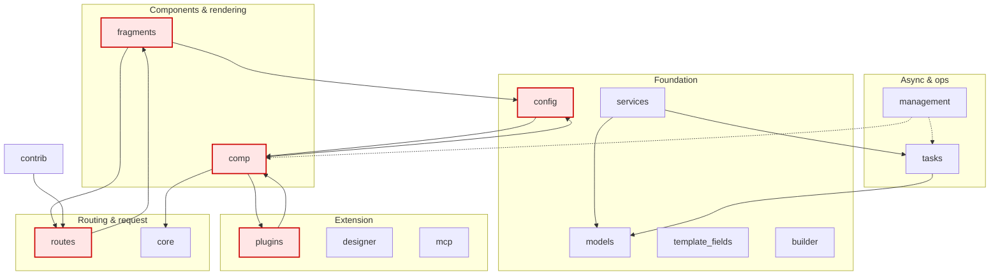
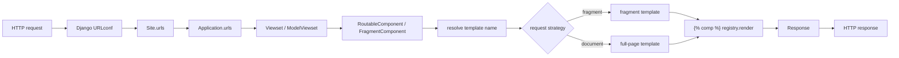
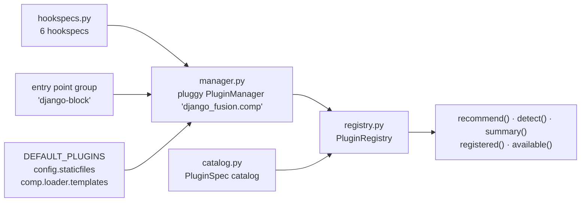

# Architecture Overview — DF-002

> Source of truth: the tree itself under `src/django_fusion/` (16 top-level
> packages, 390 Python files), `plugins/hookspecs.py`, `plugins/catalog.py`,
> `plugins/manager.py`, `plugins/registry.py`, and `src/django_fusion/__init__.py`.
>
> `src/django_fusion/` also holds one **namespace subpackage** (`site/`, no
> `__init__.py`) and two resource directories (`assets/` SCSS, `templates/`
> framework templates) — see §1.1.
>
> **Verified 2026-09-22** against the checkout — every module path, class name,
> edge, and count below was read or computed from the tree, not carried over.
> Supersedes the previous revision, which still described `analyzer/`, `site/`,
> `infrastructure/`, and `wagtail/` as top-level packages; none of those exist.

<!-- AI-generated: review needed — full rewrite of this page, verified against the tree -->

## 1. Module map

```text
src/django_fusion/
├── comp/              # Component system: , registry, slots/props/vars
│   ├── loader/        #   template discovery, HTMX-safe template loader
│   ├── tags/          #   tag implementations
│   └── templatetags/  #   25 template-tag modules (see §6)
├── fragments/         # URL-driven fragment rendering + generic CRUD views
│   ├── analyzer/      #   static analysis of  usage
│   ├── forms/         #   FormMixin, create/update/delete/search views
│   ├── generic/       #   list/detail/action base views
│   ├── skeleton/      #   skeleton-manifest generation (loading states)
│   └── tables/        #   TableMixin, TableView
├── routes/            # Routing: Site → Application → Viewset → Component
│   ├── core/          #   Viewset, BaseViewset, Route, Site, Application
│   ├── components/    #   RoutableComponent, FragmentComponent
│   ├── http/          #   FragmentDetector, request detection
│   ├── models/        #   ModelViewset, CRUD mixins
│   ├── pages/         #   page handlers
│   ├── rendering/     #   template resolution / render strategies
│   ├── schemas/       #   API schemas (incl. users/)
│   └── views/         #   shared views (notifications, tags)
├── core/              # Request infrastructure
│   ├── middlewares/   #   access, errors, site, freeze, language, service, setup
│   ├── context/       #   context processors
│   ├── assets/        #   asset registry/pipeline
│   └── health/        #   /health/, /health/database/, /health/assets/
├── plugins/           # Extension layer (the framework's plugin system — §5)
│   ├── apis/          #   typed API helpers (schemas, bolt)
│   ├── debug_tools/   #   debug toolbar, Silk, livereload, monitoring, errors
│   ├── designer/      #   component catalog, field/form/table scaffolds
│   ├── htmx/          #   HtmxDetails, fragment/SSE helpers
│   ├── robyn/         #   async-server adapter
│   ├── unpoly/        #   progressive-enhancement adapter
│   └── webpack/       #   bundle-tracker compatibility
├── models/            # Shared model infrastructure
│   ├── mixins/        #   reusable model mixins
│   └── tasks/         #   task persistence models
├── tasks/             # Background tasks: broker-agnostic registry + backends
│   └── backends/      #   base, dramatiq, inprocess
├── config/            # Settings cascade, conf utilities, constants, loader
├── services/          # Service + token APIs
├── management/        # Shared management layer
│   ├── commands/      #   10 reusable site commands
│   ├── filters/  handlers/  managers/  scripts/  utils/
├── contrib/           # Opt-in integrations
│   ├── admin/  branding/  privacy/  utils/
├── designer/          # Standalone designer package
├── mcp/               # MCP (agent tooling) surface
├── builder/           # Build helpers
├── template_fields/   # Custom template field types
└── migrations/        # Framework-level migrations
```

### 1.1 Non-package directories

Three directories under `src/django_fusion/` are not regular packages. They are
listed because each is a live surface, and because their absence from the
package map is what made earlier revisions of this page misdescribe the tree.

| Path | Kind | What it is | Caveat |
|---|---|---|---|
| `site/` | **Namespace subpackage** (no `__init__.py`) | Generic auth mixins: `site/auth/mixins.py` (`AuthConfig`, `AuthBaseMixin`) | Importable as `django_fusion.site.auth`, but only via implicit namespace packages. `mcp/fusion_router.py` probes it (`_find_spec("django_fusion.site.auth")`) to report capability, so it is load-bearing — do not delete it as a stray. A stale `__pycache__/…/site.cpython-311.pyc` shows it once had an `__init__.py`. |
| `assets/` | Resource dir | 15 SCSS sources (navigation, utilities, card, tokens) | Not Python; consumed by the asset pipeline, not imported |
| `templates/` | Resource dir | 46 framework templates (`django_fusion/plugins/debug_tools/introspection.html`, `django_fusion/tasks/task_center.html`, `fusion/skeletons/`, `fusion/navigation/`, …) | Discovered through Django's app-directories template loader |

Two further namespace packages exist *inside* regular packages —
`core/encoder/` and `core/encoder/exceptions/`, plus `models/interaction/` — which
likewise have no `__init__.py` but are importable. The doc generator resolves
them explicitly; a path checker that only looks for `__init__.py` will report
them as missing.

## 2. Layered design

| Layer | Packages | Responsibility |
|-------|----------|----------------|
| **Foundation** | `models` (+`mixins`, `tasks`), `config`, `services`, `template_fields`, `builder` | Shared model/base infrastructure, settings cascade, service + token APIs |
| **Components & rendering** | `comp` (+`loader`, `tags`, `templatetags`), `fragments` (+`generic`, `forms`, `tables`, `skeleton`, `analyzer`) | The component registry, `` and its tags, fragment endpoints, generic CRUD views, tables and forms |
| **Routing & request** | `routes` (+`core`, `components`, `http`, `models`, `pages`, `rendering`, `schemas`, `views`), `core` (+`middlewares`, `context`, `assets`, `health`) | `Site`/`Application`/`Viewset`, HTMX-aware components, middleware chain, asset pipeline, health endpoints |
| **Extension** | `plugins` (+7 shipped), `designer`, `mcp` | Pluggy hooks, plugin catalog/registry, opt-in tooling, agent/MCP surface |
| **Async & ops** | `tasks` (+`backends`), `management` (+`commands`, `filters`, `handlers`, `managers`, `scripts`, `utils`) | Broker-agnostic background work, shared site commands |
| **Contrib** | `contrib` (+`admin`, `branding`, `privacy`, `utils`) | Opt-in admin theming, branding, consent/privacy tooling |

## 3. Dependency reality

Edges below are **module-level imports between top-level packages** (import-time),
not lazy references.



**Read this before trusting the layer diagram.** The layers are a *convention*,
not an enforced rule: three pairs of top-level packages import each other at
module level, so a naive layering claim would be false.

| Mutual module-level edges | Consequence |
|---|---|
| `comp` ↔ `config` | Component registration and the settings cascade resolve each other |
| `comp` ↔ `plugins` | The plugin manager registers component-level plugins; components consult the plugin registry |
| `fragments` ↔ `routes` | Routing resolves fragments; fragments render through routing components |

These work today because the mutual edges sit on different modules inside each
package, but they are fragile: a new module-level import across any pair can turn
a latent cycle into an import error that only shows up on cold start. Most other
cross-package references are **deferred** (imported inside functions/classes) —
`routes → plugins`, `comp → plugins`, `management → tasks` — which is the pattern
to copy for any new cross-layer reference.

## 4. Request lifecycle



Middleware runs before the URLconf — `core/middlewares/`:

| Module | Role |
|---|---|
| `access.py` | Access control |
| `errors.py` | Error capture/reporting |
| `site.py` | Site resolution |
| `freeze.py` | Freeze/maintenance mode |
| `language.py` | Locale activation |
| `service.py` | Service wiring |
| `setup.py` | Middleware ordering/installation helpers |

Fragment detection lives in `routes/http/` (`FragmentDetector`,
`FragmentDetectionMixin`) and drives the `fragment` vs `document` split in the
diagram above. The two rendering roads are described in DF-003 (Component
System) and DF-017 (Integration Modes); both must keep working when a view is
changed.

## 5. Extension architecture — the plugin layer

`plugins/` is the framework's extension system, built on **pluggy**. It is the
only plugin mechanism in django-fusion; new integrations extend it rather than
adding a second registry.



| Piece | File | Role |
|---|---|---|
| Hook specs | `plugins/hookspecs.py` | `collect_component_assets`, `get_template_directories`, `pre_ready`, `ready`, `register_asset_types`, `register_plugin_specs` |
| Manager | `plugins/manager.py` | `Pluggy` `PluginManager` (`"django_fusion.comp"`); loads the `django-block` entry-point group; auto-registers `DEFAULT_PLUGINS` |
| Catalog | `plugins/catalog.py` | `PluginSpec(name, capabilities, description, signals, core)`; ships 10 specs across `config`, `comp.loader`, `plugins.{htmx,unpoly,apis,webpack,debug_tools,designer,robyn}`, `tasks` |
| Registry | `plugins/registry.py` | Live service: `recommend(capability)`, `detect(request)`, `summary()`, `registered()`, `available()`; request signals `htmx-request`, `fragment-request`, `unpoly-request`, `sse` |
| Tracker | `plugins/tracker.py` | Template/component render tracking |

### Known inconsistencies in this layer

Both are recorded here so they are not mistaken for documentation errors:

1. **`core=True` and `CORE_PLUGINS` disagree.** `catalog.py` flags four specs
   `core=True` (`config.staticfiles`, `comp.loader.templates`, `plugins.designer`,
   `tasks`) but only two are auto-registered (`CORE_PLUGINS` /
   `manager.DEFAULT_PLUGINS`).
2. **The `django-block` entry-point group is loaded but never declared.** No
   `[project.entry-points]` section exists in `pyproject.toml`, so third-party
   plugins cannot actually attach by entry point yet.

## 6. Entry-point inventory

| Surface | Count | Location |
|---|---|---|
| Template-tag modules | 25 | `comp/templatetags/` (+ `tags/{prop,slot,block,var,asset}`, `components/{modal,pagination,calendar,price,search,field,form,notification,table,breadcrumbs}`) |
| Management commands | 10 | `management/commands/` — `analyze_components_to_webpack`, `generate_asset_manifest`, `generate_skeleton_manifest`, `populate_content`, `populate_courses`, `populate_homepage`, `send_bulk_emails`, `sync_task_history`, `verify_content`, `webpack_validate` |
| Middleware modules | 7 | `core/middlewares/` (§4) |
| Background-task backends | 3 | `tasks/backends/` — `base`, `dramatiq`, `inprocess` |
| Shipped plugins | 7 | `plugins/{apis,debug_tools,designer,htmx,robyn,unpoly,webpack}` |
| Hook specs | 6 | `plugins/hookspecs.py` |
| Health endpoints | 3 | `core/health/` — `/health/`, `/health/database/`, `/health/assets/` |

## 7. Where does my change belong?

| If you are… | Put it in |
|---|---|
| Adding shared model/base behaviour | `models/` or `models/mixins/` |
| Adding a component tag, registry behaviour, or template loader feature | `comp/` (`tags/`, `loader/`, `templatetags/`) |
| Adding a generic list/detail/form/table view | `fragments/` (`generic/`, `forms/`, `tables/`) |
| Adding routing, a viewset, a page handler, or a render strategy | `routes/` (`core/`, `models/`, `pages/`, `rendering/`) |
| Adding middleware, context processors, assets, health checks | `core/` |
| Adding a hook, a plugin capability, or a shipped integration | `plugins/` — extend `hookspecs.py` and declare a `PluginSpec` |
| Adding background work | `tasks/` (register the task; do not call a broker directly) |
| Adding a reusable site command | `management/commands/` |
| Adding opt-in admin/privacy/branding tooling | `contrib/` |
| Adding settings plumbing | `config/` |

## 8. Public surface (canonical imports)

Verified 2026-09-22 — all 17 module paths below resolve in this checkout.

```python
from django_fusion.routes.core.base import (
    Viewset,
    BaseViewset,
    ViewsetMeta,
    Route,
    route,
    menu_path,
    IndexViewMixin,
)
from django_fusion.core.utils import viewprop
from django_fusion.routes.models.base import BaseModelViewset
from django_fusion.routes.models.crud import (
    ModelViewset,
    ReadonlyModelViewset,
    ListBulkActionsMixin,
    CreateViewMixin,
    UpdateViewMixin,
    DeleteViewMixin,
    DetailViewMixin,
)
from django_fusion.routes.core.sites import (
    Application,
    AppMenuMixin,
    Site,
)
from django_fusion.routes.components.routable import RoutableComponent
from django_fusion.routes.components.fragments import FragmentComponent
from django_fusion.routes.http.detection import (
    FragmentDetector,
    FragmentDetectionMixin,
)
from django_fusion.fragments.generic.base import Action
from django_fusion.fragments.generic.list import BaseListModelView, ListModelView
from django_fusion.fragments.generic.detail import DetailModelView
from django_fusion.fragments.generic.actions import BaseBulkActionView, DeleteBulkActionView
from django_fusion.fragments.forms.create import CreateModelView
from django_fusion.fragments.forms.update import UpdateModelView
from django_fusion.fragments.forms.delete import DeleteModelView
from django_fusion.fragments.forms.search import SearchableViewMixin
from django_fusion.fragments.tables.table import TableView
```

Per `AGENTS.md`: import the real symbol from its owning module. **No re-export
shims, alias modules, or forwarding `__init__.py` re-exports.**

See DF-008 (API Reference) for the per-module reference, and the per-package
`design.md` files for each package's generated ERD, class diagram, and usage
example.

## 9. Validation

```bash
cd libs/django-fusion
uv run pytest                       # framework tests (see Remarks)
python manage.py check              # from a consuming product

# Package docs (design.md + namespace README.md) are generated:
python scripts/generate_design_docs.py --check          # fail on drift
python scripts/generate_design_docs.py --only django_fusion.plugins
```

## 10. Versioning & stability

`__version__ = "0.5.0"`. Below 1.0, minor versions may reorganise the public
surface. After 1.0, the canonical import paths in §8 are considered stable.

---

## Remarks & Notes

- **The layer table is a convention, not a constraint.** §3 lists the three
  mutual-import pairs; check them before adding a module-level cross-package
  import. Prefer a deferred import inside the function (the `routes → plugins`
  pattern) when crossing layers.
- **`plugins/` is the single extension mechanism.** Adding a second registry,
  hook protocol, or catalog is a regression — extend `hookspecs.py` +
  `PluginSpec` instead.
- **Generated docs must be regenerated, never hand-edited.** `design.md` files and
  the namespace `README.md` files under `src/django_fusion/` are outputs of
  `scripts/generate_design_docs.py`; the provenance footer on each generated
  README names that script. Hand-edits are overwritten by the next run.
- **`uv run pytest` currently has two pre-existing problems** unrelated to the
  framework code: ~105 collection errors from test files that import product
  modules (`plugins.workers.*`, from the monorepo), and 6 order-dependent
  failures (`tests/analyzer/test_scanner.py`, `tests/test_form_components.py`,
  `tests/test_component_tags.py`) that reproduce with a clean worktree. Verify a
  change with the targeted files, not the whole tree.
- **Counts in this page are checkable, not aspirational.** §6's numbers were
  produced from the tree on 2026-09-22; if a package moves, re-run the generator
  and re-verify §1/§3/§6 rather than editing them from memory.
- **Tested with:** Django 5.2.15, Python 3.11/3.12, pytest 9.1.1, pluggy 1.6.0.
  Mermaid blocks are plain text in this repo — they are not rendered or validated
  by any check target, so review them by eye.
