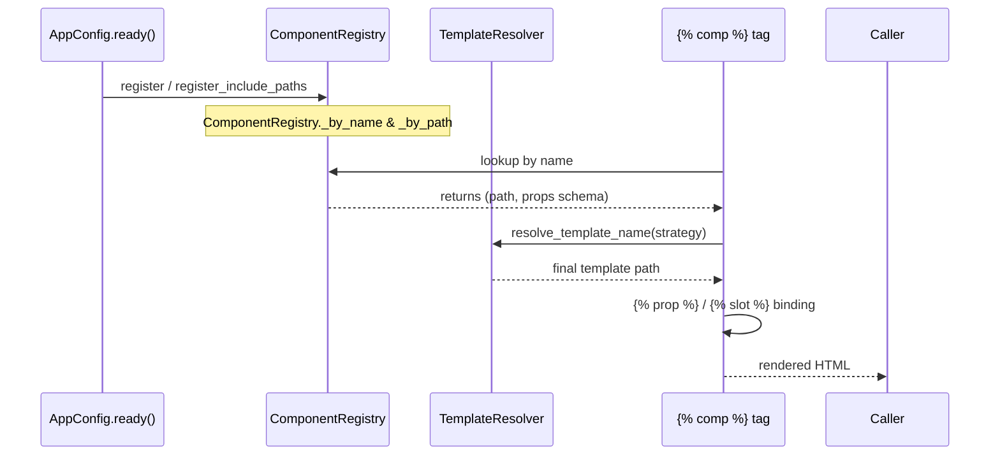

# Component System (Python side) — DF-003

> Companion to [DF-004 `` template tag](./04-component-tag.md).
> This doc covers the Python API.
> Source of truth: `src/django_fusion/comp/registry.py`,
> `src/django_fusion/comp/routes/components.py`,
> `src/django_fusion/comp/routes/fragments.py`,
> `src/django_fusion/comp/routes/detection.py`.

## What "component" means here

A *component* is the pair of:

1. A **template** at a stable path (e.g. `components/button.html`)
2. Either a **string is enough** (use `` from
   any Django template), or a **Python class** that gives it routes, props
   binding, fragment identity, or pagination.

`django-fusion` favours the string-only approach for simple UI, and a
Python class for anything that needs routing, `model` binding, or
HTMX fragment scoping.

## Class hierarchy

```
RoutableComponent        — full Django view + template fragment
└── FragmentComponent    — same, but stripped to a fragment when HTMX calls
ModelViewset             — CRUD scaffold; can be wrapped into a RoutableComponent
```

`FragmentComponent` differs from `RoutableComponent` only in render:
it returns the fragment template only when `HX-Request: true` is set.

## `RoutableComponent` — full example

```python
# myapp/components/pricing_rows.py
from django_fusion.routes import RoutableComponent

class PricingRows(RoutableComponent):
    route_name = "pricing_rows"
    route_path = "pricing/rows/"
    template_name = "pricing/rows.html"
    paginate_by = 10
    fragment_name = "components.pricing_rows"   # dotted HTMX identity
```

Hook into a parent `Application`:

```python
# myapp/apps.py
from django.apps import AppConfig

class MyAppConfig(AppConfig):
    name = "myapp"

    def ready(self):
        from django_fusion.comp.registry import register_include_paths
        register_include_paths([
            "components/button.html",
            "components/card.html",
            "pricing/rows.html",
        ])
```

## `fragment_name` derivation

If you don't set `fragment_name`, it is derived by
`get_fragment_name()` in this order:

1. Explicit `fragment_name` (routed strings, return-as-is)
2. `route_name` (e.g. `dashboard` → `components.dashboard` → `components/dashboard.html`)
3. `items_template` (e.g. `components/items/list.html` → `components.items.list`)
4. `model._meta` for `PaginatedListView` (e.g. `app_label=blog`, `model_name=article` → `components.blog.article_list`)
5. `None`

> Remark: Setting `fragment_name = None` *explicitly* opts you into
> model-based derivation. Read the priority rule carefully in
> `tests/test_routable_components.py:TestLegacyPaginatorsFragmentName`.

## `FragmentComponent` — HTMX fragment scope

```python
from django_fusion.routes import FragmentComponent

class PostPreviewFragment(FragmentComponent):
    route_path = "blog/<slug:slug>/preview/"
    fragment_name = "blog.fragments.post_preview"
    template_name = "blog/fragments/post_preview.html"
```

When called with `HX-Request: true`, the fragment template is rendered
*without* any layout wrapper. From a list page:

```django
<a hx-get=""
   hx-target="#post-detail">…</a>
```

## `FragmentDetector` / `FragmentDetectionMixin`

For ad-hoc views that need to switch between fragment and full-page
output without inheriting from `RoutableComponent`:

```python
from django_fusion.routes import FragmentDetectionMixin
from django.views.generic import TemplateView

class PricingPage(FragmentDetectionMixin, TemplateView):
    template_name = "pricing/page.html"
    fragment_template_name = "pricing/_rows.html"

    def get_context_data(self, **kwargs):
        return {"plans": Plan.objects.all()}
```

`FragmentDetectionMixin` reads the `HX-Request` header and sets
`self.strategy = "fragment"` or `"document"`. The default rendering
pickup lives in `comp.routes.template_resolver.resolve_template_name`.

## Component template resolution

`comp/routes/template_resolver.py` defines the cascade:

1. Site-specific override: `<site>/templates/<name>.html`
2. Shared assets: `assets/templates/<name>.html`
3. Generic fallback: `django_fusion/comp/templates/<name>.html`
4. Final fallback: `django_fusion/comp/routes/templates/routable_components/<name>.html`

Use `register_include_paths(["myapp/templates/foo.html"])` in
`AppConfig.ready()` to add an extra template root.

## `RegisterIncludePath` & `IncludePathComponent`

For non-class templates, use `register_include_paths([...])` to map
plain `*.html` files to component names verbatim. This is what powers
the "string = enough" path: you do not need a Python class to render
``. Just register the path once at
startup.

## Lifecycle



## FAQ

See DF-014 for the most common questions. The most common gotchas:

1. **AppConfig.ready() ordering.** `register_include_paths()` must run
   before the first template render. For django-fusion's bundled
   components, `CoreExtAppConfig.ready()` runs last so it overwrites
   any conflicting registration.
2. **`fragment_name = None` is meaningful.** Setting it to `None`
   *opts in* to model/strategy derivation. Setting it to `"something"`
   pins the value; *not setting* it falls back to `route_name`.
3. **`` and ``** aren't
   interchangeable. `` initialises props / slots / vars
   scopes; `` doesn't.

## Cross-references

- [DF-004 `` template tag](./04-component-tag.md) — every
  template-side feature (props, slots, vars, attrs, fragment_name).
- [DF-005 Routing](./05-routing.md) — how components plug into URLs.
- [DF-011 Best practices](./11-best-practices.md) — when to use a
  class-routed component versus a string-only component.
