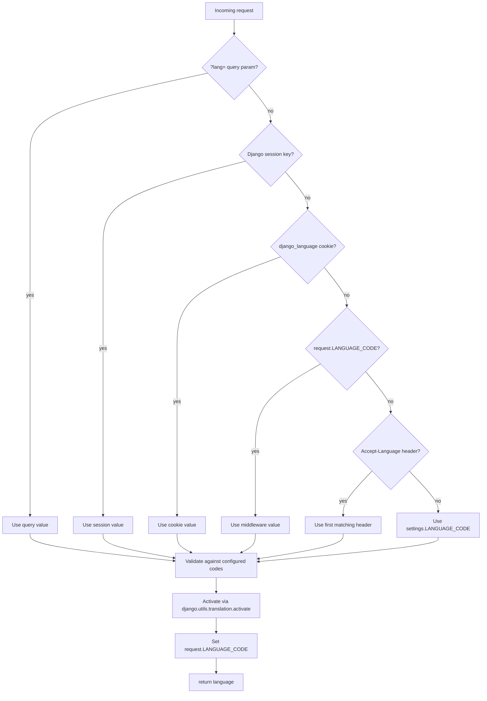
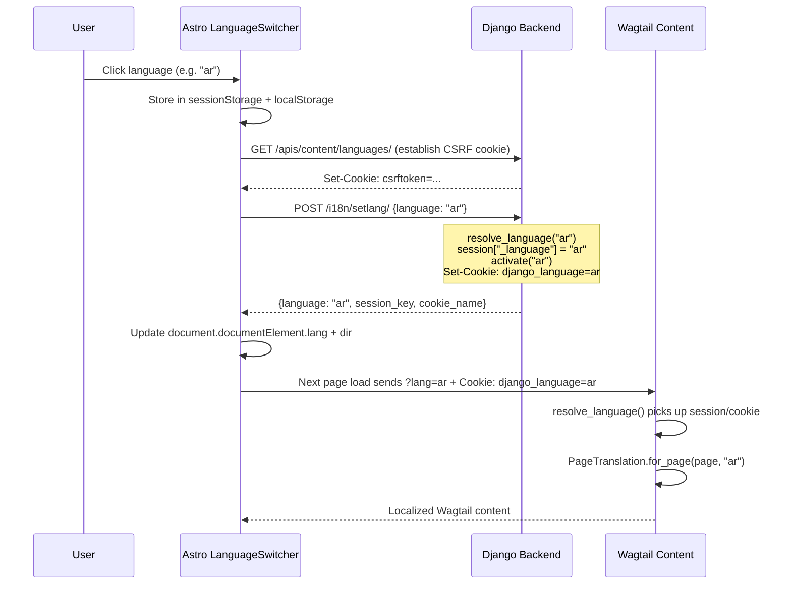

# Language & Locale Contract — DF-020

> Source of truth: `src/django_fusion/core/middlewares/language.py`,
> `src/django_fusion/core/context/languages.py`.

Every Structa Cloud Wagtail site shares one language resolution, persistence, and API contract
implemented in django-fusion. Product-specific Wagtail ``SiteLanguage`` rows and editorial
``PageTranslation`` overlays sit on top of this shared settings-level base.

## Contract summary

| Layer | Responsibility | Source |
|-------|---------------|--------|
| **Django settings** | Validate language codes, configure cookie/session attributes | `LANGUAGES`, `FUSION_LANGUAGES`, `LANGUAGE_COOKIE_*`, `LANGUAGE_SESSION_KEY` |
| **django-fusion middleware** | Resolve, activate, and persist language per request | `DefaultLanguageMiddleware` |
| **django-fusion API** | POST endpoint for switchers, language metadata endpoint | `set_language_api`, `language_context` |
| **Wagtail snippets** | Editor-managed catalog + per-page translation overlays | `SiteLanguage`, `PageTranslation` |
| **Astro frontend** | Client-side persistence, backend catalog hydration, DOM update | `LanguageSwitcher.astro`, `api.ts` |

## Request language resolution

The shared resolver follows one priority chain, used by all middleware, APIs, and content selection:



## Language switcher flow

When a user selects a language in the Astro dropdown, the frontend persists it server-side and client-side:



## Persistence stores

| Store | Key | Lifetime | Written by | Read by |
|-------|-----|----------|-----------|---------|
| **Django session** | `LANGUAGE_SESSION_KEY` (default `_language`) | Session | `set_language_api`, `DefaultLanguageMiddleware` | `resolve_language`, APIs |
| **Cookie** | `LANGUAGE_COOKIE_NAME` (default `django_language`) | `LANGUAGE_COOKIE_AGE` (default 1 year) | `set_language_api`, `DefaultLanguageMiddleware` | `resolve_language`, `LocaleMiddleware` |
| **sessionStorage** | `fusion-lang` (Precis) / `ctc_lang` (CTC) | Tab | Astro switcher | Astro switcher init |
| **localStorage** | `fusion-lang` / `ctc_lang` | Persistent | Astro switcher | Astro switcher init |

## Middleware configuration

```python
MIDDLEWARE = [
    ...
    "django.middleware.locale.LocaleMiddleware",           # Django's built-in cookie/header resolver
    "django_fusion.core.middlewares.language.DefaultLanguageMiddleware",  # Fusion contract
    ...
]
```

The Fusion middleware runs **after** `LocaleMiddleware`. It overrides `request.LANGUAGE_CODE`
so that APIs and serializers see the same resolved language, and writes back to the session
and cookie when an explicit choice was made.

## Settings

```python
# Shared language catalog — the settings-level validation source
FUSION_LANGUAGES = [
    ("en", "English"),
    ("ar", "Arabic"),
    ("sv", "Swedish"),
    ...
]

LANGUAGES = FUSION_LANGUAGES  # Django standard
WAGTAIL_CONTENT_LANGUAGES = LANGUAGES  # Wagtail i18n

# Session persistence
LANGUAGE_SESSION_KEY = "_language"
LANGUAGE_COOKIE_NAME = "django_language"
LANGUAGE_COOKIE_AGE = 60 * 60 * 24 * 365  # 1 year
LANGUAGE_COOKIE_SAMESITE = "Lax"
LANGUAGE_COOKIE_SECURE = True  # production
```

## API endpoints

| Method | Path | Purpose |
|--------|------|---------|
| `POST` | `/i18n/setlang/` | Persist language in session + cookie, activate it |
| `GET` | `/apis/content/languages/` | Return seeded language catalog + CSRF cookie + current language |
| `GET` | `/apis/content/languages/` | Content languages API (also establishes CSRF for the POST) |

### POST /i18n/setlang/

```json
// Request
POST /i18n/setlang/
Content-Type: application/x-www-form-urlencoded
X-CSRFToken: <csrftoken>

language=ar

// Response
{
  "language": "ar",
  "default_language": "en",
  "session_key": "_language",
  "cookie_name": "django_language",
  "available_languages": ["en", "ar", "sv", "fr", "de", "es", "pt"]
}
```

### GET /apis/content/languages/

```json
{
  "languages": [
    {"code": "en", "name": "English", "native": "English", "dir": "ltr", "flag": "🇬🇧"},
    {"code": "ar", "name": "Arabic", "native": "العربية", "dir": "rtl", "flag": "🇸🇦"}
  ],
  "coverage": {"en": 12, "ar": 8, "sv": 0},
  "ui_languages": ["en", "ar", "sv"],
  "language": "ar",
  "default_language": "en",
  "session_key": "_language",
  "cookie_name": "django_language"
}
```

## Wagtail content selection

Product APIs select localized Wagtail pages via the shared resolved language:

```python
from django_fusion.core.middlewares.language import resolve_language

def page_data_api(request, slug):
    language = resolve_language(request)
    # 1. Try localized page: Page.objects.filter(slug=slug, locale__language_code=language)
    # 2. Fall back to English locale
    # 3. Fall back to any available locale
```

Translation overlays are applied via the ``PageTranslation`` snippet:

```python
translation = PageTranslation.for_page(page, language)
if translation is not None:
    data = deep_merge(data, translation.as_overrides())
```

## Cross-site comparison

| Aspect | Precis Main | Precis Landing | CTC Research |
|--------|------------|----------------|--------------|
| Middleware stack | `LocaleMiddleware` + `DefaultLanguageMiddleware` | `LocaleMiddleware` + `DefaultLanguageMiddleware` | Shared `configs.default` middleware |
| `set_language_api` | `django_fusion.core.middlewares.language.set_language_api` | `django_fusion.core.middlewares.language.set_language_api` | `apps.pages.pages.landing_api.set_language_api` (delegates to shared) |
| Language catalog | `SiteLanguage` snippet + settings fallback | `SiteLanguage` snippet + settings fallback | `SiteLanguage` snippet + settings fallback |
| Storage key | `fusion-lang` | `fusion-lang` | `ctc_lang` |
| Cookie contract | `django_language` | `django_language` | `django_language` |
| Session key | `_language` | `_language` | `_language` |
| Content resolution | `resolve_language()` | `resolve_language()` | `resolve_language()` |

## Adding a new language

1. Add `(code, name)` to `FUSION_LANGUAGES` in the site's Django settings.
2. Run `makemigrations` and `migrate` if the new code is not in the existing `SiteLanguage` choices.
3. Seed the `SiteLanguage` snippet (or add via Wagtail admin).
4. Add the code to the Astro `LANG_META` table in `translations.ts`.
5. Add translation keys to the `T` table.

## Cross-references

- [DF-007 Configuration](./07-configuration.md) — middleware ordering and settings
- [DF-008 API Reference](./08-api-reference.md) — `DefaultLanguageMiddleware`, `language_context`
- [DF-010 Wagtail Integration](./10-wagtail-integration.md) — `SiteLanguage`, `PageTranslation`
