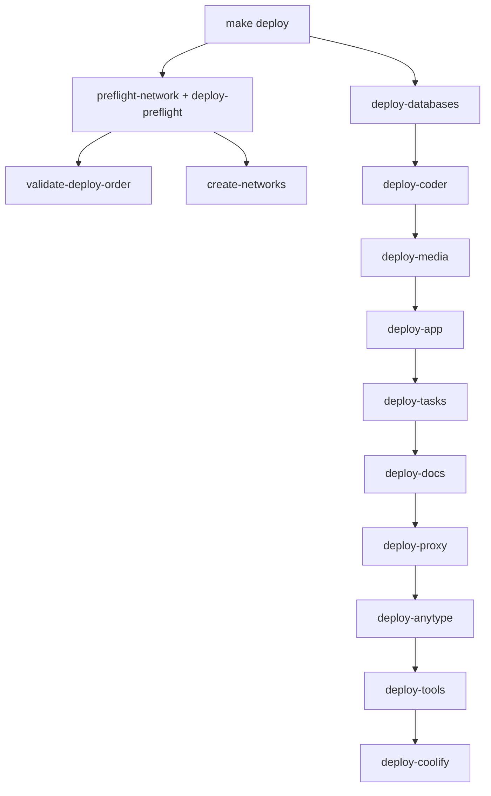

# 🛠️ Commands & Delegation Reference

> The single source of truth for every `make` command in the monorepo: the
> unified verb naming, the delegation chain, and the cascade (`deploy` →
> `deploy-all` → per-service `deploy-*`) that brings the whole stack up in a
> deterministic order.

<!-- AI-generated: review needed -->

## 1. Unified verb naming

Every component Makefile under `application/`, `docs/`, `projects/`, and
`libs/` exposes the same lifecycle verbs so delegation is predictable:

| Verb | Meaning | Root dispatch example |
|------|---------|-----------------------|
| `up` | Start the service (idempotent) | `make -C application/tools/affine up` |
| `deploy` | Build + start (validate first where applicable) | `make deploy-docs` |
| `down` | Stop and remove the service | `make -C application/tools/ollama down` |
| `build` | Build image(s) only, no start | `make -C docs build` |
| `status` | Show container/compose status | `make status` |
| `logs` | Tail logs | `make logs` |
| `restart` | `down` + `up` | `make restart` |
| `ps` | Alias of `status` | `make -C application/proxy ps` |
| `check` | Validate configuration / system checks | `make check` |
| `help` | Print that Makefile's commands | `make -C application/proxy help` |

The `up` ↔ `deploy` split is consistent: **`up` starts, `deploy` builds then
starts.** Tools (`adminer`, `affine`, `mailpit`, `monitoring`, `ollama`),
`application/` (Coder), `application/databases`, `application/proxy`, and
`docs/` all follow this matrix (verified — every one has `up deploy down build
status logs restart ps`).

## 2. Delegation map (root → component)

The root `Makefile` is a **dispatcher**. Most top-level verbs delegate to a
component Makefile via `$(MAKE) -C <dir> <verb>`:

| Root target | Delegates to | Component command |
|-------------|--------------|-------------------|
| `deploy-proxy` | `application/proxy` | `deploy` (validate → `proxy-up`) |
| `deploy-databases` | `application/databases` | `deploy-db` (`build` + `up`) |
| `deploy-coder` | `application/` | `up-coder` |
| `deploy-docs` | `docs/docker-compose.yml` | `docker compose up -d --build` |
| `deploy-app` | `projects/` | `docker-up` |
| `deploy-tools` | `application/tools/<name>` | each tool's `up` |
| `status` / `logs` / `stop` / `restart` | `application/proxy` | `status` / `logs` / `stop` / `restart` |

```text
root Makefile
 ├─ deploy-databases ──► application/databases  (deploy-db → build + up)
 ├─ deploy-coder     ──► application/           (up-coder)
 ├─ deploy-media     ──► application/proxy      (nginx compose)
 ├─ deploy-app       ──► projects/              (docker-up)
 ├─ deploy-tasks     ──► projects/docker-compose.tasks.yml
 ├─ deploy-docs      ──► docs/docker-compose.yml
 ├─ deploy-proxy     ──► application/proxy      (deploy → validate + up)
 └─ deploy-tools     ──► application/tools/*    (up per tool)
```

## 3. Cascade element (`deploy` → `deploy-all`)

The cascade element is the ordered fan-out that a single `make deploy` runs:



**Default order is `postgres-first`** (set via `DEPLOY_ORDER`):

```
databases → coder → media → app → tasks → docs → proxy → anytype → tools → coolify
```

`DEPLOY_ORDER=legacy` is kept for back-compat but **warns** — it boots
proxy/app/media before databases, so Django apps crash on first boot. Prefer
the default.

### Preflight gates (run before any docker mutation)

- `preflight-network` — lints network names + probes the Docker daemon.
- `deploy-preflight` — validates `DEPLOY_ORDER` + parses `PREFLIGHT_COMPOSE_FILES`.
- `validate-deploy-order` — ensures `DEPLOY_ORDER` is in the allow-list.
- `create-networks` — creates `common`, `traefik-net`, etc. (idempotent).

## 4. Per-project dispatcher (`projects/Makefile`)

```bash
cd projects
make check WEBSITE=precis-ctc     # backend check for the selected site
make test  WEBSITE=structa.cloud    # backend test
make run-dev WEBSITE=precis-ctc   # dev servers
make migrate WEBSITE=loop-crm
```

`WEBSITE=` resolves the site (`precis-main`, `precis-ctc`, `loop-crm`,
`syntara`, plus legacy aliases `structa`/`lms`/`core` → `precis-main`). See
`projects/Makefile.md` for the full alias table.

## 5. Config cascade & static-files commands

Projects with a `configs/` dir (Precis Main first) expose cascade commands that
render the merged YAML + `.env` + env configuration and the static-files plan
(read → output → deploy). See [`guides/config-cascade.md`](guides/config-cascade.md).

```bash
cd projects/structa.cloud
make config-show     # merged cascade + static-files plan (read/output/deploy)
make config-check    # validate required identity keys resolve
make css             # compile Tailwind design system → assets/static/css/fusion.css
make collectstatic   # copy STATICFILES_DIRS → STATIC_ROOT (backend target)
```

| Command | Reads | Writes / effect | Validates |
|---------|-------|-----------------|-----------|
| `make config-show` | cascade YAML + `.env` + env | prints merged config + static plan | — |
| `make config-check` | cascade | — | required identity keys resolve |
| `make css` | `frontend/src/styles/globals.css` | `assets/static/css/fusion.css` | Tailwind compile |
| `make build-assets` | webpack config + fusion SCSS | `backend/assets/static/bundles/` | bundle manifest |
| `make collectstatic` | `STATICFILES_DIRS` | `STATIC_ROOT` | file copy |
| `docker compose config -q` | compose files + `.env` | — | compose validity |

### Static-files flow (action by action)

`make css` → `assets/static/css/fusion.css` → `collectstatic` copies
`STATICFILES_DIRS` (`backend/assets/static`, `assets/static`, `frontend/public`)
into `STATIC_ROOT` (`backend/assets/staticfiles`) → the named volume
(`precis-main-static`) → whitenoise serves `/static/` behind Traefik; `/media/`
serves via shared-proxy nginx. The container startup command runs
`migrate → collectstatic → seed_pages → seed_learning → gunicorn` on every boot.

## 6. nx aggregate targets

```bash
make check-all    # npx nx run-many -t check --all
make test-all     # npx nx run-many -t test --all
make nx-build-all # npx nx run-many -t build --all
make nx-run T=<target>
```

## Remarks & Notes

- The root `%:` catch-all forwards unknown targets to `projects/Makefile`
  (e.g. `make community-test`), but explicit root targets (like `check-all`)
  take precedence.
- `docker compose down --volumes`, `docker system prune`, database restores,
  and `make deploy*` are effectful — they require explicit intent and are not
  part of read-only validation.
- Component Makefiles under `application/` and `docs/` resolve the repo-root
  `.env` via `ENV_FILE ?= ../../.env` (two levels up) — keep that consistent
  when adding a new tool.
- The `application/` directory was renamed from `applications/` (singular);
  all referenced paths, compose files, docs, and scripts are synchronized.