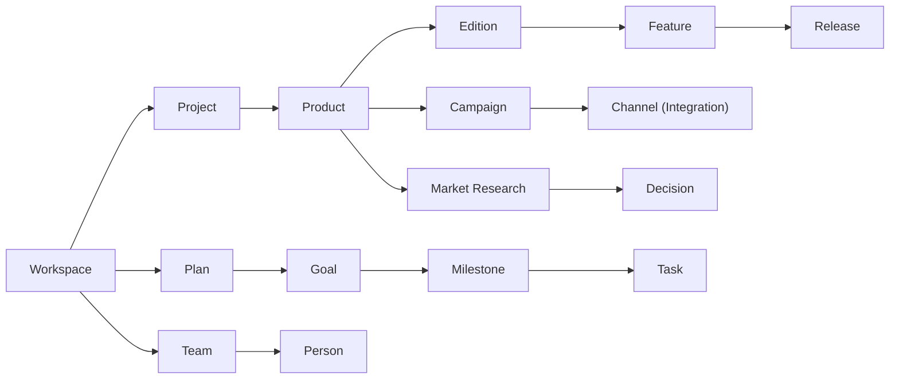

# Object Types — Core Definitions

> Core object types for the Structa Cloud **Channel** (Anytype container), product portfolio, delivery system, and go-to-market graph.
> **Container:** see [`../guides/channel-structure.md`](../guides/channel-structure.md) for the Vault → Channel model; types below are created in that Channel's Content Model.

## Quick reference

| Layer | Types |
|---|---|
| Workspace | Workspace → Project → Team → Person |
| Strategy | Goal → Plan → Milestone → Task |
| Product | Product → Edition → Feature → Release |
| Delivery | Sprint → Task → Component → API → Guide |
| Evidence | Market Research → Decision → Goal → Product |
| Go-to-market | Product → Marketing Campaign → Channel → Sales → Commerce |
| Foundation | Architecture → Reference → Integration → Style |
| Story & knowledge | Story → Goal → Achievement / Plan → Product |
| Cross-cutting | Page, Note, Bookmark, Configuration |

## Canonical flow

- **Workspace** → Project → Product → Edition → Feature → Release
- **Workspace** → Plan → Goal → Milestone → Task → Sprint
- **Workspace** → Product → Campaign → Channel → Sales → Commerce
- **Workspace** → Product → Market Research → Decision
- **Workspace** → Team → Person → Owner / Lead / Contributor

Campaign, sales, commerce, social, team, and product development objects use `Object type: Plan` with the appropriate `Type` value. This keeps the graph small and makes all operational work discoverable through one Plan relation.

## Import workflow

1. Create types and properties from `_object-types.md`
2. Create shared tags from `_tags.md`
3. Create canonical relations from `_relations.md`
4. Import content objects and assign their exact `Object type`
5. Link each active object to its parent workspace, project, product, plan, team, edition, or evidence
6. Use Graph View to follow a customer problem from research to product, campaign, sale, delivery, and learning

## People & Teams

| Team | Members | Lead |
|---|---|---|
| Product | Moustafa, Mammhoud | Mammhoud |
| Engineering | Yahia, Asmaa, Mahmoud | Mammhoud |
| Support | Dariia | Mammhoud |

Each person is an object in `people/`. Link a person to their Team, Owned Plans, Assigned Tasks, Owned Products, Authored Posts, and Made Decisions.

## Periodic task management

Each object type supports periodic review and task cycles:

| Object Type | Periodic Task | Cadence | Owner |
|---|---|---|---|
| Workspace | Portfolio health check | Monthly | Product |
| Project | Sprint review and backlog grooming | Weekly | Engineering |
| Product | Roadmap update and prioritization | Bi-weekly | Product |
| Plan | Progress review and evidence check | Bi-weekly | Plan owner |
| Team | Capacity and skill gap review | Monthly | Team lead |
| Person | Goal alignment and task review | Bi-weekly | Person |
| Edition | Feature completeness audit | Per release | Engineering |
| Market Research | Evidence freshness review | Quarterly | Data Analyst |

## Per-type files

Every object type has a definition file in this directory. Core set:

| Type | File | | Type | File |
|---|---|---|---|---|
| Workspace | `workspace.md` | | Project | `project.md` |
| Plan | `plan.md` | | Goal | `goal.md` |
| Milestone | `milestone.md` | | Task | `task.md` |
| Sprint | `sprint.md` | | Product | `product.md` |
| Edition | `edition.md` | | Team | `team.md` |
| Person | `people.md` + `people/` | | Market Research | `market-research.md` |
| Tool | `tool.md` | | Integration | `integration.md` |
| Component | `component.md` | | API | `api.md` |
| Release | `release.md` | | Decision | `decision.md` |
| Pipeline | `pipeline.md` | | Style | `style.md` |
| Blog Post | `blog-post.md` | | Page | `page.md` |
| Note | `note.md` | | Bookmark | `bookmark.md` |
| Configuration | `configuration.md` | | Story | `story.md` |
| Architecture | `architecture.md` | | Guide | `guide.md` |
| Reference | `reference.md` | | Changelog | `changelog.md` |
| Diagram | `diagram.md` | | Report | `report.md` |
| Dashboard | `dashboard.md` | | Data Pipeline | `data-pipeline.md` |
| Methodology | `methodology.md` | | Insight | `insight.md` |
| Recommendation | `recommendation.md` | | Repository | `repository.md` |
| Module | `module.md` | | Documentation | `documentation.md` |
| Market Research | `market-research.md` | | Plan | `plan.md` |

> Schema validation: frontmatter of definition files validates against
> [`../schemas/`](../schemas/_index.md) JSON schemas via the
> `# yaml-language-server` directive.

## Related

- → `_object-types.md` — Full type definitions
- → `_relations.md` — Relations and cardinality
- → `_tags.md` — Shared tag definitions
- → `_templates.md` — Object templates
- → `workspace.md` — Workspace object
- → `product.md` — Product object
- → `team.md` — Team object
- → `people.md` — Person object
- → `integration.md` — Channel and integration object
- → `edition.md` — Edition object
- → `story.md` — Story object (founder narratives)
- → `project.md` — Project object (bounded initiatives)
- → `diagram.md` — Diagram object (rendered visualizations)
- → `../stories/_index.md` — Stories directory
- → `../projects/_index.md` — Projects directory
- → `../editions/_index.md` — Editions directory
- → `../plans/project-workspace.md` — Workspace operating map
- → `../README.md` — Master index
