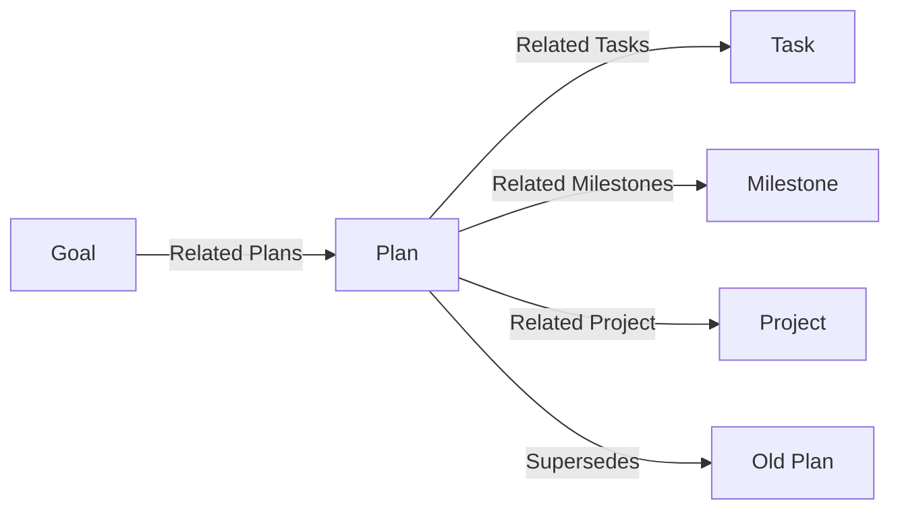

# Plan — Agreed Methods & Time-Bound Delivery

> **Type:** Plan 📝
> **Layout:** Page
> **Description:** What the team agreed to build, how, and why — time-bound or operational methods that turn goals into milestones and tasks. Plans are the **forward half** of the agenda's reference contract: finished plans are deleted (git history is the archive) and recorded as ✅ Shipped milestones.

---

## Properties

| Property | Type | Options | Description |
|----------|------|---------|-------------|
| `Status` | Select | Draft, Planned, Active, Completed, Superseded | Lifecycle state |
| `Category` | Select | Delivery, Marketing Campaign, Sales, Commerce, Operating, Migration | Plan family |
| `Priority` | Select | P0, P1, P2, P3 | Execution order |
| `Start Date` | Date | — | When execution begins |
| `Target Date` | Date | — | Completion gate |
| `Owner` | Relation → Person | — | Accountable individual |
| `Related Project` | Relation → Project | one | Bounded initiative served |
| `Related Products` | Relation → Product | many | Offerings affected |
| `Related Goals` | Relation → Goal | many | Strategic outcomes addressed |
| `Related Milestones` | Relation → Milestone | many | Delivery checkpoints |
| `Related Tasks` | Relation → Task | many | Actionable work items |
| `Related Teams` | Relation → Team | many | Executing teams |
| `Supersedes` | Relation → Plan | many | Replaced plans |
| `Tags` | Multi-select | — | Scope labels |

## Use

- One plan = one agreed method or time-bound effort; do not duplicate delivery detail into features or workspaces — link.
- **Lifecycle contract (with the agenda):** when every task is done and verification passes, record a ✅ Shipped milestone in the owning product's file under `docs/agenda/feature-tracking/`, note the closeout decision in `team-notes.md`, then **delete this plan file** — git history is the archive.
- Marketing Campaign, Sales, and Commerce plans feed the go-to-market graph (`Related Campaigns`, `Related Sales`, `Related Commerce`).

## Views (suggested defaults for the type)

| View | Layout | Filter | Sort |
|---|---|---|---|
| Active board | Board (gallery) | `Status` = Active | `Priority` |
| Quarter timeline | Calendar | `Status` ≠ Completed | `Target Date` |
| Superseded archive | Table | `Status` = Superseded | `Target Date` |

## Graph

## Related

- → [`goal.md`](./goal.md) — the strategic outcomes plans serve
- → [`task.md`](./task.md) — the work items plans break into
- → [`milestone.md`](./milestone.md) — the checkpoints plans pass
- → [`_relations.md`](./_relations.md) — canonical relation names
- → [`../../feature-tracking.md`](../../feature-tracking.md) — hub; the ✅ Shipped milestone logs are per product under `../../feature-tracking/`
