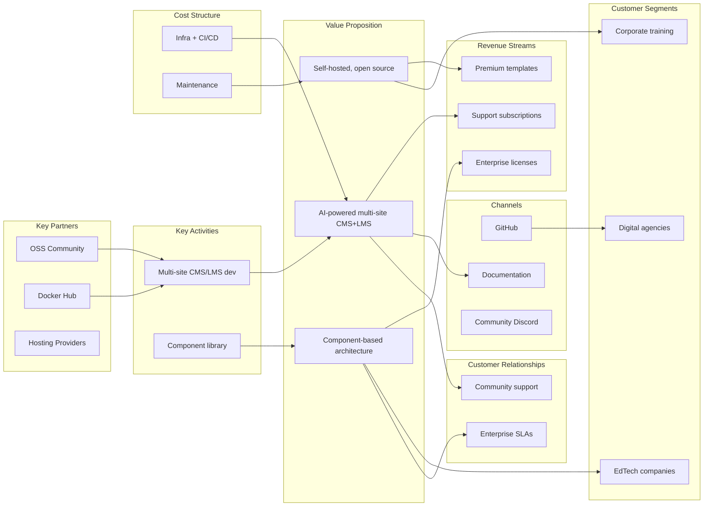

# Business Model — Structa Cloud Canvas

> **Type:** Workspace 🏢
> **Emoji:** 💼
> **Description:** Business Model Canvas mapping key partners, activities, resources, value proposition, customer relationships, channels, customer segments, cost structure, and revenue streams.

---

## Business Model Canvas

> **Gap fixed (2026-09-05):** the local `files/business-model-canvas-png_h.webp`
> and the external Windmill Digital image were both dangling. Replaced with a
> rendered canvas diagram (see [`docs/agenda/diagrams/`](../../diagrams/README.md)).

---

## Key Building Blocks

| Block | Description |
|-------|-------------|
| **Value Proposition** | AI-powered multi-site CMS + LMS platform with component-based architecture. Self-hosted open source with enterprise support options. |
| **Customer Segments** | EdTech companies, professional services, corporate training, digital agencies, individual professionals |
| **Channels** | GitHub (open source), Docker Hub, documentation site, community Discord |
| **Revenue Streams** | Professional support subscriptions, enterprise licenses, premium templates, educational pricing |
| **Key Partners** | Cloud providers, payment processors, EdTech integrators, hosting partners |
| **Cost Structure** | Development, infrastructure (CI/CD, hosting), community management, legal/compliance |

---

## Project Context

| Aspect | Description |
|--------|-------------|
| **Color** | Indigo (#6366f1) — representing business value, strategic planning |
| **Tiers** | Community (Free), Professional (Subscription), Enterprise (Custom), Educational (Discounted) |
| **License** | MIT — open source core with proprietary premium features |

---

## Pricing Tiers

| Tier | Price | Features | Audience |
|------|-------|----------|----------|
| **Community** | Free | Self-hosted, full source, community support | Developers, small orgs |
| **Professional** | Subscription | Premium templates, priority support | Agencies, growing orgs |
| **Enterprise** | Custom | Dedicated support, SLA, custom dev | Large enterprises |
| **Educational** | Discounted | All features, institutional pricing | Schools, universities |

---

## Related Docs

- → `market-research.md` — Market analysis and competitor comparison
- → `operational-plan.md` — Operations and delivery
- → `product-development.md` — Product development lifecycle
- → `_legacy/free-version.md` — Free version scope
- → `_legacy/full-version.md` — Full enterprise version
- → `../README.md` — Master index
