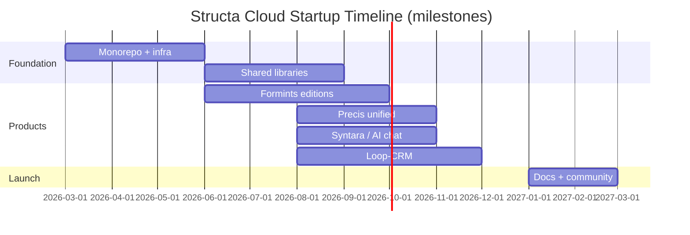

# Timeline   
Develop a timeline or roadmap outlining the major milestones and deadlines for your startup.   

> **Gap fixed (2026-09-05):** the local `files/timeline-dev.png` reference was
> dangling (no such file). Replaced with a rendered gantt timeline; rendered
> diagram assets live under [`docs/agenda/diagrams/`](../../diagrams/README.md).

$$

$$

## Related Docs
- → `../plans/product-development.md` — Development lifecycle
- → `../milestones/_index.md` — Key milestones
- → `../tasks/tasks-and-backlog.md` — Implementation tasks
- → `../README.md` — Master index
