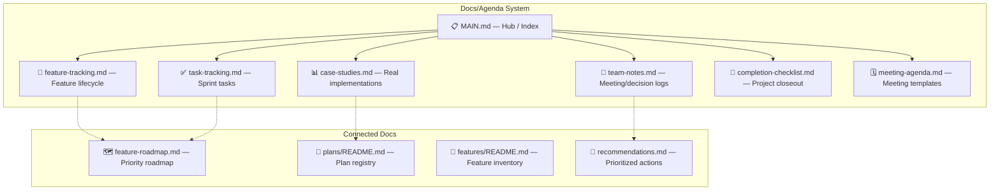
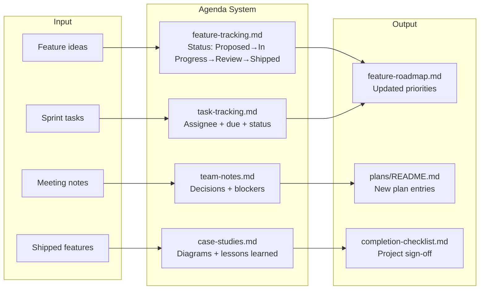
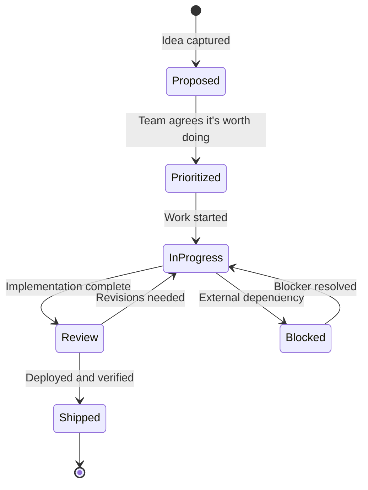

# 📋 Project Agenda — Team Tracking, Case Studies & Completion System

> **Purpose:** Complete project agenda system for tracking features, recording team notes, managing tasks, documenting case studies with diagrams, and driving projects to completion across Structa Cloud products.
> **Created:** 2026-08-31
> **Status:** Active — team working reference

---

## 🎯 What This System Covers

This agenda system is your team's command center for:

| Area | Purpose | Key File |
|------|---------|----------|
| **Project tracking** | Track features from idea → shipped | [`feature-tracking.md`](./feature-tracking.md) |
| **Case studies** | Document real implementations with diagrams | [`case-studies.md`](./case-studies.md) |
| **Diagrams** | Architecture, data flow, ERD mermaid diagrams | Inline in case studies + plans |
| **Team notes** | Meeting notes, decisions, blockers | [`team-notes.md`](./team-notes.md) |
| **Task management** | Sprint tasks, completion checklist | [`task-tracking.md`](./task-tracking.md) |
| **Project completion** | Definition of done, closeout checklist | [`completion-checklist.md`](./completion-checklist.md) |
| **Agenda meetings** | Sprint planning, review, retrospective | [`meeting-agenda.md`](./meeting-agenda.md) |

---

## 🧭 How to Use This Agenda

```
Team member needs to...
├── Track a feature → feature-tracking.md
├── Document a case study → case-studies.md (add entry + mermaid diagram)
├── Run a meeting → meeting-agenda.md (pick the template)
├── Record team notes → team-notes.md (date-stamped entry)
├── Track sprint tasks → task-tracking.md
└── Close out a project → completion-checklist.md
```

### Quick start

1. **New feature?** Add it to `feature-tracking.md` with status `Proposed`
2. **Working on something?** Create a task entry in `task-tracking.md`
3. **Finished something notable?** Write a case study entry with a mermaid diagram
4. **Have a meeting?** Copy the template from `meeting-agenda.md`
5. **Project done?** Run through `completion-checklist.md`

---

## 🏗️ Architecture: How Docs Connect





---

## 📊 Feature Tracking Lifecycle

See [`feature-tracking.md`](./feature-tracking.md) for the full system.



---

## 📈 Case Study Template Structure

Every case study entry includes:

1. **Context** — What was the problem/situation?
2. **Architecture diagram** — Mermaid graph of the solution
3. **Implementation** — What was built, key decisions
4. **Results** — Metrics, outcomes, what worked
5. **Lessons** — What you'd do differently

See [`case-studies.md`](./case-studies.md) for examples and the full template.

---

## 🏁 Project Completion Checklist

See [`completion-checklist.md`](./completion-checklist.md) for the full checklist.

**Definition of Done:**

- [ ] All features in `feature-tracking.md` marked `Shipped`
- [ ] Case study written with architecture diagram
- [ ] Plans registry updated (`plans/README.md`)
- [ ] Feature roadmap updated (`features/feature-roadmap.md`)
- [ ] Team notes record the completion decision
- [ ] Tests passing, checks green
- [ ] Documentation validated (`npm run validate-content`)
- [ ] Stakeholders notified

---

## 🗓️ Meeting Agenda Templates

See [`meeting-agenda.md`](./meeting-agenda.md) for ready-to-use templates:

| Meeting Type | Template | Frequency |
|--------------|----------|-----------|
| **Sprint Planning** | Sprint planning template | Every sprint start |
| **Daily Standup** | Standup template | Daily |
| **Sprint Review** | Review template | Every sprint end |
| **Retrospective** | Retro template | Every sprint end |
| **Feature Review** | Feature review template | Per feature completion |
| **Project Closeout** | Closeout template | Per project completion |

---

## 🔗 Related Documentation

| Topic | Path |
|-------|------|
| Feature roadmap (priorities) | [`features/feature-roadmap.md`](../features/feature-roadmap.md) |
| Feature inventory | [`features/README.md`](../features/README.md) |
| Plans registry (canonical) | [`plans/README.md`](../plans/README.md) |
| Recommendations (work order) | [`recommendations.md`](../recommendations.md) |
| Architecture overview | [`ARCHITECTURE.md`](../ARCHITECTURE.md) |
| Document lifecycle | [`plans/document-lifecycle.md`](../plans/document-lifecycle.md) |
| Marketing claims | [`plans/marketing-claims.md`](../plans/marketing-claims.md) |

---

## 🔄 Maintenance

- **Owner:** Workspace / Product leads
- **Review cadence:** Per sprint + major release gates
- **Update triggers:** New feature, shipped feature, case study completed, project closed
- **Archive policy:** Follow `docs/plans/document-lifecycle.md`

---

## Remarks & Notes

- This agenda system is a **working tool**, not a replacement for the canonical plans registry at `docs/plans/README.md`
- Case studies with mermaid diagrams are the most valuable output — invest in them when features ship
- Feature tracking should mirror the priority roadmap; keep them in sync
- Team notes are the memory of the project — write them even when things are going well
- The completion checklist is the gate between "done coding" and "project closed"

<!-- AI-generated: review needed -->
