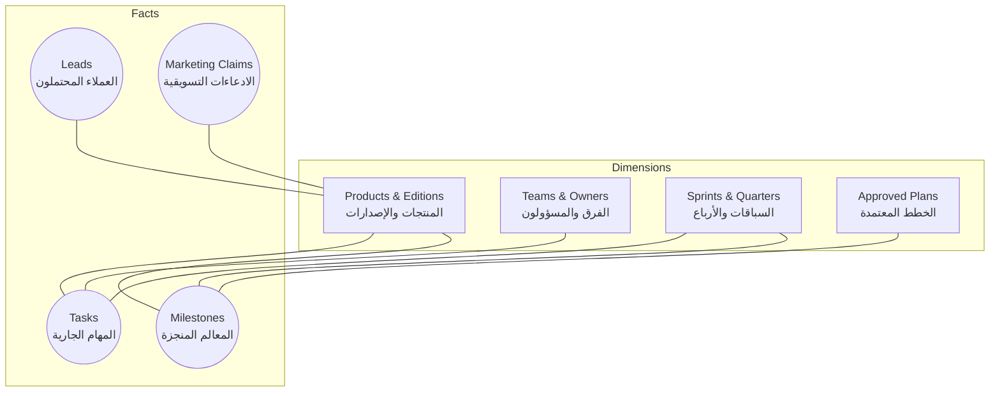
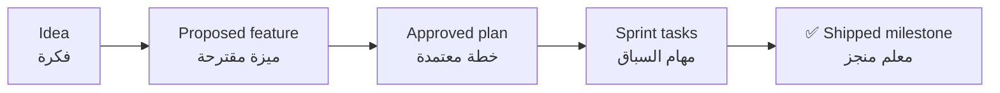

# 📋 Project Agenda — Business Command Center

> **English:** This agenda is the team's single map of the business: what we
> ship, what we are building now, who might buy, what we may say publicly, and
> what we decided along the way. It tracks outcomes and money — not code.
>
> **العربية:** هذه الأجندة هي الخريطة الواحدة لأعمال الفريق: ما أنجزناه، وما
> نبنيه الآن، ومن قد يشتري، وما يُسمح قولُه علناً، وما قررناه في الطريق. هي
> تتبّع النتائج والإيرادات — لا التفاصيل التقنية.
>
> **Last updated:** 2026-09-10 · **Owner:** Workspace / Product leads

---

## 1. The shape: a business star schema

**English.** The hub is organized like a star schema — the shape analysts use
for reporting. The **facts** are the things that change and get counted:
milestones shipped, tasks in flight, leads in the pipeline, claims allowed in
marketing. The **dimensions** are the stable lenses you slice them by:
products, teams, sprints, and approved plans. Every tracking file below is
either a fact table or a dimension.

**العربية.** نظّمنا هذا المركز على شكل **المخطط النجمي** — نفس الشكل الذي
يستخدمه المحللون للتقارير. **الحقائق** هي ما يتغيّر ويُحتسب: المعالم المنجزة،
والمهام الجارية، والعملاء المحتملون في قائمة البيع، والادعاءات المسموح بها
تسويقياً. **الأبعاد** هي العدسات الثابتة التي نقطّع بها الأرقام: المنتجات،
والفرق، والسباقات، والخطط المعتمدة. كل ملف تتبّع أدناه هو إما جدول حقائق أو
بُعد.




**English.** Work flows one way: an idea becomes a proposed feature, a plan
makes it official, tasks deliver it, and at the end only a **milestone**
remains — the plan file is deleted and the achievement is recorded forever.

**العربية.** يسير العمل في اتجاه واحد: الفكرة تصبح ميزة مقترحة، ثم تجعلها خطة
معتمدة رسمياً، ثم تُنجزها المهام، وفي النهاية لا يبقى سوى **معلم منجز** — يُحذف
ملف الخطة ويُسجَّل الإنجاز للأبد.




---

## 2. Navigate by business question

**English.** Start from the question, open the one file that answers it.

| The question | The file |
|---|---|
| What are we actually shipping? | [`feature-tracking.md`](./feature-tracking.md) § ✅ Shipped |
| What is everyone doing this sprint? | [`task-tracking.md`](./task-tracking.md) |
| Who might buy, and where does each deal stand? | [`sales-pipeline.md`](./sales-pipeline.md) |
| Why did we decide X? | [`team-notes.md`](./team-notes.md) |
| What does the dev team build next? | [`dev-team-plans.md`](./dev-team-plans.md) |
| What do we charge? | [`pricing-plans.md`](./pricing-plans.md) |
| What may we say publicly, and what needs evidence? | [`marketing-plans.md`](./marketing-plans.md) + [`data-analyst-plans.md`](./data-analyst-plans.md) |
| How do we run meetings and close projects? | [`meeting-agenda.md`](./meeting-agenda.md) + [`completion-checklist.md`](./completion-checklist.md) |
| How did the whole venture start? | [`startup-story.md`](./startup-story.md) |

**العربية.** ابدأ من السؤال، وافتح الملف الواحد الذي يجيب عنه.

| السؤال | الملف |
|---|---|
| ما الذي ننفّذه فعلاً؟ | [`feature-tracking.md`](./feature-tracking.md) § ✅ المعالم المنجزة |
| ماذا يعمل كل فرد في هذا السباق؟ | [`task-tracking.md`](./task-tracking.md) |
| من قد يشتري، وأين تقف كل صفقة؟ | [`sales-pipeline.md`](./sales-pipeline.md) |
| لماذا قررنا كذا؟ | [`team-notes.md`](./team-notes.md) |
| ماذا يبني فريق التطوير تالياً؟ | [`dev-team-plans.md`](./dev-team-plans.md) |
| كم نتقاضى؟ | [`pricing-plans.md`](./pricing-plans.md) |
| ماذا يُسمح قولُه علناً، وما يحتاج أدلة؟ | [`marketing-plans.md`](./marketing-plans.md) + [`data-analyst-plans.md`](./data-analyst-plans.md) |
| كيف ندير الاجتماعات ونغلق المشاريع؟ | [`meeting-agenda.md`](./meeting-agenda.md) + [`completion-checklist.md`](./completion-checklist.md) |
| كيف بدأت المشروع كلها؟ | [`startup-story.md`](./startup-story.md) |

---

## 3. Complete file inventory

**English.** Every file in the agenda, grouped by its business role. One file
= one object; indexes link, they never restate.

**العربية.** كل ملف في الأجندة، مجمّعاً حسب دوره في العمل. ملف واحد = كائن
واحد؛ الفهارس تربط ولا تُعيد الصياغة.

### 3.1 Start here — definition & hubs

| File | Role (EN) | الدور (عربي) |
|---|---|---|
| [`CONTENT_MODEL.md`](./CONTENT_MODEL.md) | ⭐ The contract: packaging + plans→milestones rule | ⭐ العقد: التقسيم وقاعدة الخطط→المعالم |
| [`MAIN.md`](./MAIN.md) | This hub — the star-schema map | هذا المركز — خريطة المخطط النجمي |
| [`README.md`](./README.md) | Overview + quick start | نظرة عامة + بداية سريعة |
| [`SUMMARY.md`](./SUMMARY.md) | Change log of the agenda itself | سجل تغييرات الأجندة نفسها |
| [`INDEX.md`](./INDEX.md) | Legacy Blinko-style pointer index | فهرس مؤشرات قديم (طريقة Blinko) |

### 3.2 Fact tables — delivery tracking

| File | Fact it counts | الحقيقة التي تُحتسب |
|---|---|---|
| [`feature-tracking.md`](./feature-tracking.md) | Milestones shipped & features in flight | المعالم المنجزة والميزات الجارية |
| [`task-tracking.md`](./task-tracking.md) | Sprint tasks: assignee, status, due | مهام السباق: المسؤول والحالة والموعد |
| [`sales-pipeline.md`](./sales-pipeline.md) | Leads & deals: stage, source, next step | العملاء المحتملون والصفقات: المرحلة والمصدر والخطوة التالية |
| [`team-notes.md`](./team-notes.md) | Decisions, blockers, meeting outcomes | القرارات والمعوّقات ونتائج الاجتماعات |

### 3.3 Business dimensions — plans family

| File | Lens | العدسة |
|---|---|---|
| [`dev-team-plans.md`](./dev-team-plans.md) | What engineering builds, per product | ما يبنيه فريق التطوير لكل منتج |
| [`pricing-plans.md`](./pricing-plans.md) | Revenue targets & price points | أهداف الإيرادات ونقاط التسعير |
| [`marketing-plans.md`](./marketing-plans.md) | Positioning, campaigns, claims | التموضع والحملات والادعاءات |
| [`data-analyst-plans.md`](./data-analyst-plans.md) | Metrics, evidence levels, pilots | المقاييس ومستويات الأدلة والتجارب |
| [`startup-story.md`](./startup-story.md) | Founder journey & achievement board | رحلة المؤسس ولوحة الإنجازات |
| [`backend-plans.md`](./backend-plans.md) | Merged pointer → dev-team-plans | مؤشر بعد الدمج → خطط فريق التطوير |

### 3.4 Rhythm & quality gates

| File | Used for | يُستخدم في |
|---|---|---|
| [`meeting-agenda.md`](./meeting-agenda.md) | 6 meeting templates | ٦ قوالب اجتماعات |
| [`completion-checklist.md`](./completion-checklist.md) | Definition of done + sign-off | تعريف الاكتمال والتوقيع النهائي |

### 3.5 Evidence & memory

| File / folder | Content | المحتوى |
|---|---|---|
| [`case-studies.md`](./case-studies.md) + [`case-studies/`](./case-studies/INDEX.md) | Implementation stories with diagrams | قصص التنفيذ مع المخططات |
| [`diagrams/`](./diagrams/README.md) | Rendered diagram package (SVGs) | حزمة المخططات المصيّرة (SVG) |
| [`anytype-extensibility.md`](./anytype-extensibility.md) | Knowledge-graph research proposal | مقترح بحثي لنموذج الرسم البياني المعرفي |
| [`tools-auth-dashboard.md`](./tools-auth-dashboard.md) | Internal tools portal guide | دليل بوابة الأدوات الداخلية |

### 3.6 Package B — knowledge graph

| Folder | Content | المحتوى |
|---|---|---|
| [`mono-repo/`](./.mono-repo/README.md) | Object types + per-type business objects (products, editions, projects, goals…) | أنواع الكائنات وكائنات العمل لكل نوع (المنتجات، الإصدارات، المشاريع، الأهداف…) |

> **English.** `task_plan.md` is a completed housekeeping plan kept for
> reference — an archive candidate at the next closeout.
>
> **العربية.** ملف `task_plan.md` خطة تنظيف مكتملة أُبقيت للمرجعية — مرشّحة
> للأرشفة في الإغلاق القادم.

---

## 4. Business rhythms

**English.** The cadence that keeps the facts truthful:

1. **Every two weeks — sprint planning & review.** Pick tasks from the
   backlog, then demo what shipped.
2. **At every completion — record the milestone.** Plan file is deleted, a ✅
   entry lands in `feature-tracking.md`, the decision is noted in
   `team-notes.md`.
3. **Quarterly — claims review.** Every public claim gets its evidence
   re-checked in `marketing-plans.md`.
4. **Weekly — leads & pricing check.** Pipeline and price points reviewed
   against the targets in `pricing-plans.md` — see
   [`sales-pipeline.md`](./sales-pipeline.md) § 6.

**العربية.** الإيقاع الذي يُبقي الحقائق صادقة:

1. **كل أسبوعين — تخطيط السباق ومراجعته.** نختار المهام من القائمة المعلّقة،
   ثم نعرض ما اكتمل.
2. **عند كل إتمام — سجّل المعلم.** يُحذف ملف الخطة، ويُسجَّل إنجاز ✅ في
   `feature-tracking.md`، ويُدوَّن القرار في `team-notes.md`.
3. **كل ربع سنة — مراجعة الادعاءات.** يُعاد التحقق من دليل كل ادعاء علني في
   `marketing-plans.md`.
4. **كل أسبوع — مراجعة العملاء المحتملين والتسعير.** تُراجع قائمة البيع
   ونقاط السعر مقابل الأهداف في `pricing-plans.md` — انظر
   [`sales-pipeline.md`](./sales-pipeline.md) § 6.

---

## 5. How this connects to the rest of docs

```text
docs/agenda/MAIN.md  (this hub — المركز)
├── feature-tracking.md ──→ docs/features/feature-roadmap.md   (priorities)
├── case-studies.md ──────→ docs/plans/README.md               (plan registry)
├── team-notes.md ────────→ docs/plans/README.md               (major decisions)
├── dev-team-plans.md ────→ docs/plans/editions|django-fusion  (engineering plans)
├── marketing-plans.md ───→ docs/plans/marketing-claims.md     (evidence register)
└── completion-checklist.md → feature-tracking → case-studies  (closeout chain)
```

**English.** The agenda references canonical sources; it never invents plan
status or prices. Plans live in `docs/plans/`, priorities in
`docs/features/feature-roadmap.md`, evidence rules in
`docs/plans/marketing-claims.md`.

**العربية.** الأجندة تحيل إلى المصادر الرسمية ولا تخترع حالة الخطة أو الأسعار.
الخطط في `docs/plans/`، والأولويات في `docs/features/feature-roadmap.md`،
وقواعد الأدلة في `docs/plans/marketing-claims.md`.

---

## 6. Language policy

**English.** Agenda hub and plans-family files carry English content followed
by Arabic summary blocks in the same file. Case studies stay English-only by
design (deep technical content). Product documentation parity is maintained
separately in `docs/ar-content/`.

**العربية.** تحمل ملفات المركز وعائلة الخطط محتوى إنجليزياً يتبعاه ملخّصات
عربية داخل الملف نفسه. تُكتب دراسات الحالة بالإنجليزية فقط عمداً (محتوى تقني
عميق). تُدار موازاة وثائق المنتجات على حدة في `docs/ar-content/`.

---

## Maintenance

- **Owner:** Workspace / Product leads · **Cadence:** per sprint + release gates
- **Update when:** a feature ships, a task closes, a meeting happens, a decision is made
- **Archive per:** `docs/plans/document-lifecycle.md`

---

## Remarks & Notes

- The star-schema framing is a thinking tool, not a database — the tables are markdown on purpose
- If a tracking table stops being read, shrink it; stale tracking is worse than none
- Milestones are the only durable record of finished plans — keep them rich
- Every lead, claim, and price should trace back to a product and a plan

<!-- AI-generated: review needed -->
