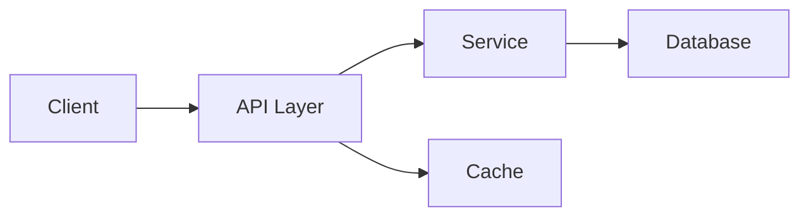
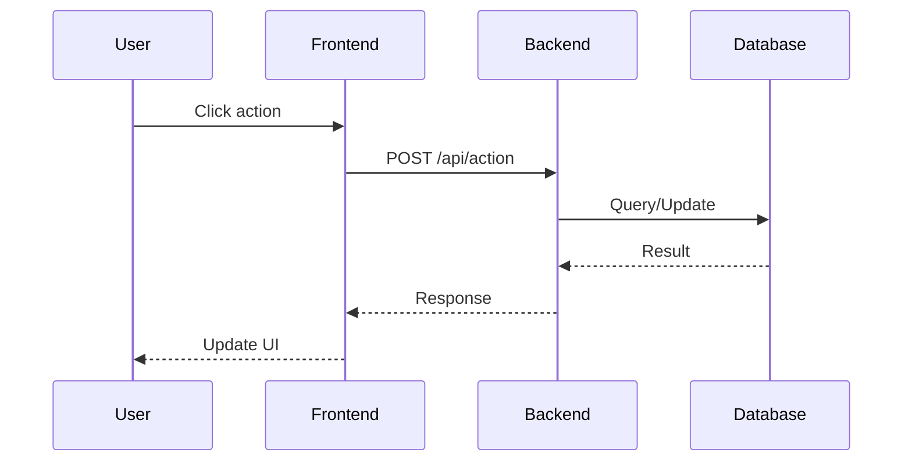
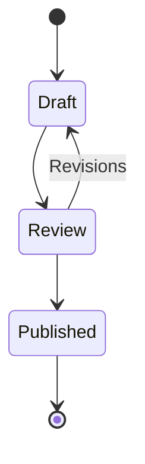
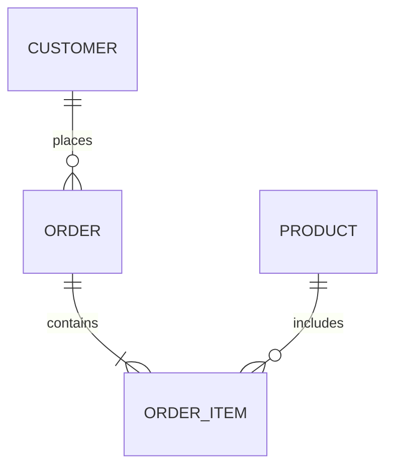
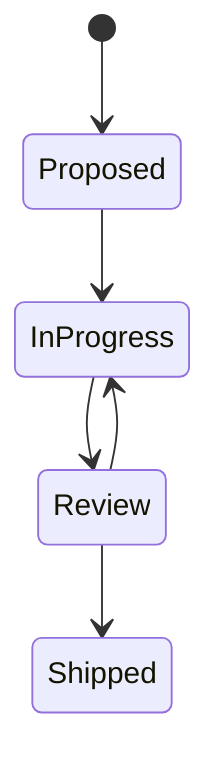

# 📊 Case Studies — Real Implementations with Diagrams

> **Purpose:** Document notable implementations as case studies with architecture diagrams (mermaid), key decisions, results, and lessons learned. These become the team's institutional memory and are referenced from plans and the feature roadmap.
> **Last updated:** 2026-08-31

---

## 📖 How to Write a Case Study

Every case study follows this structure:

```markdown
# [Short Title] — [Product/Project]

> **Date:** YYYY-MM-DD | **Status:** Active / Archived
> **Scope:** What this case study covers

---

## 1. Context

What was the situation? What problem were we solving? What constraints existed?

- Constraint 1
- Constraint 2
- Stakeholder expectations

## 2. Architecture

```mermaid
[graph/diagram showing the solution architecture]
```

Key components:
- Component A: responsibility
- Component B: responsibility

## 3. Implementation

What was built, in what order, with what key decisions?

### 3.1 Decision: X vs Y

Why we chose X over Y.

### 3.2 Key implementation detail

Code snippet or config showing the critical pattern.

## 4. Results

What happened? Metrics if available.

- Outcome 1
- Outcome 2
- Before → After comparison

## 5. Lessons Learned

What would we do differently? What surprised us?

- Lesson 1
- Lesson 2

---

## Remarks & Notes

- Caveats, edge cases, things to watch out for
- Links to related plans, docs, or code

<!-- AI-generated: review needed -->
```

---

## 🏗️ Mermaid Diagram Patterns

### Architecture / Flow Diagram



### Sequence Diagram



### State Diagram



### ER Diagram



### Task/State Tracking



---

## 📚 Existing Case Studies

### Django-Bolt & django-fusion Integration (Historical)

**Path:** [`case-studies/django-bolt-fusion.md`](./django-bolt-fusion.md)

| Field | Value |
|-------|-------|
| **Date** | 2026-07-26 (updated 2026-08-31) |
| **Status** | Active — historical record with current relevance |
| **Scope** | django-bolt API patterns across Structa Cloud + POS editions |

**Diagrams:** 4 (architecture map, deployment modes, fragment pipeline, state diagram)

**What it covers:**
- Real BoltAPI usage in POS Full and LMS CMS
- `bolt_view` adapter pattern in CTC Research
- Former proposed `django_fusion.bolt` integration (retired)
- Frontend integration strategy with Next.js + Fusion decoder
- Migration checklist with completion status

> **Note:** The shared `django_fusion.plugins.bolt` package was removed. Keep Bolt integrations in consuming projects.

---

### Multi-terminal Sync (POS)

**Path:** [`case-studies/pos-multi-terminal-sync.md`](./pos-multi-terminal-sync.md)

| Field | Value |
|-------|-------|
| **Date** | 2026-08-31 |
| **Status** | Active |
| **Scope** | Real-time WebSocket broadcast + pull changeset across POS terminals |
| **Feature tracking:** | [`feature-tracking.md`](./feature-tracking.md) § Multi-terminal Management |

**Diagrams:** 4 (sync flow, changeset protocol, polling fallback, conflict resolution)

**What it covers:**
- WebSocket broadcast for real-time change notification
- Pull changeset API for offline/polling fallback
- Conflict detection and resolution UI
- Branch transfer sync

---

### Offline Queue (POS)

**Path:** [`case-studies/pos-offline-queue.md`](./pos-offline-queue.md)

| Field | Value |
|-------|-------|
| **Date** | 2026-08-31 |
| **Status** | Active |
| **Scope** | Durable OutboxQueue + retry/backoff/dead-letter flush |
| **Feature tracking:** | [`feature-tracking.md`](./feature-tracking.md) § Multi-terminal Management |

**Diagrams:** 4 (offline flow, queue state, backoff strategy, dead letter handling)

**What it covers:**
- OutboxQueue durable storage in SQLite
- Exponential backoff retry scheduling
- Dead letter queue for failed transactions
- Idempotent sync

---

### QR Menu (POS)

**Path:** [`case-studies/pos-qr-menu.md`](./pos-qr-menu.md)

| Field | Value |
|-------|-------|
| **Date** | 2026-08-31 |
| **Status** | Active |
| **Scope** | Versioned localized menu, preview/publish, branch/table QR codes |
| **Feature tracking:** | [`feature-tracking.md`](./feature-tracking.md) § QR Menu |

**Diagrams:** 4 (menu authoring flow, versioned URL strategy, preview/publish state, branch QR generation)

**What it covers:**
- Menu versioning with versioned QR URLs
- Multi-language localization (Arabic, English, Spanish, French)
- Preview endpoint (pixel-exact published output)
- SVG QR code generation per branch/table

---

### DataToken Sync Tagging (django-fusion)

**Path:** [`case-studies/data-token-sync-tagging.md`](./data-token-sync-tagging.md)

| Field | Value |
|-------|-------|
| **Date** | 2026-08-31 |
| **Status** | Active |
| **Scope** | GenericForeignKey sync row tagging with parent/child tree, progress tracking, auto-untag |
| **Feature tracking:** | [`feature-tracking.md`](./feature-tracking.md) § django-fusion |

**Diagrams:** 3 (model ERD, sync tagging flow, parent/child tree)

**What it covers:**
- GenericForeignKey-based tagging for any Django model
- Parent/child tag tree for related rows
- Progress tracking (progress_total + progress_done)
- Auto-untag on completion
- UUID PK support for distributed ID generation

---

### Ceptor-AI Package (AI + MCP)

**Path:** [`case-studies/ceptor-ai.md`](./ceptor-ai.md)

| Field | Value |
|-------|-------|
| **Date** | 2026-08-31 |
| **Status** | Active |
| **Scope** | AI chat client, MCP server, BEM converter, agent generation |
| **Consumer:** | Syntara/Cypercloud (primary), django-fusion (MCP metadata), shared worker |

**Diagrams:** 5 (package structure, AI backend architecture, MCP tool architecture, Syntara integration, template discovery sequence)

**What it covers:**
- Multi-backend AI chat (Ollama, OpenAI, Claude, Gemini)
- MCP tools: theme_analyzer, component_mapper, config_inspector
- In-project implementations replacing external ceptor_ai dependencies
- Template discovery across multiple sites
- Shared worker AI tasks

---

## ✍️ New Case Study Entry Template

Copy this template when adding a new case study:

```markdown
# [Feature/Project Name] — [Product]

> **Date:** YYYY-MM-DD | **Status:** Active
> **Scope:** [One-line scope]
> **Related plan:** [`path/to/plan.md`](../path/to/plan.md)
> **Feature tracking:** [./feature-tracking.md](./feature-tracking.md) § [Feature Name]

---

## 1. Context

[What was the situation? What problem? What constraints?]

## 2. Architecture

```mermaid
graph [LR/TB]
    [nodes and edges showing the solution]
```

Key components:
- **[Component A]:** [responsibility]
- **[Component B]:** [responsibility]

## 3. Implementation

[What was built, key decisions, code snippets if valuable]

### [Decision name]

[Why this decision was made]

## 4. Results

[Outcomes, metrics, before→after]

## 5. Lessons Learned

[What would we do differently? Surprises?]

---

## Remarks & Notes

- [Caveats, edge cases, watch-outs]
- Related: [`link`](../path)

<!-- AI-generated: review needed -->
```

---

## 🔗 Cross-references

Case studies should link FROM and TO:

| From | To |
|------|-----|
| Feature entry in `feature-tracking.md` | Case study entry here |
| Plan in `plans/README.md` | Case study entry here |
| Completion checklist | Case study entry here |
| Meeting notes in `team-notes.md` | Case study entry here (when feature ships) |

---

## 🔄 Maintenance

- **Add a case study when:** A feature ships, a major decision is made, an incident is resolved, a migration completes
- **Update a case study when:** Facts change, new lessons emerge, status changes to Archived
- **Archive a case study when:** The technology or approach is superseded (keep for history, mark Archived)

---

## Remarks & Notes

- Mermaid diagrams must render in the Docus pipeline — test with `npm run validate-content`
- Keep diagrams focused: one clear message per diagram, not every possible path
- Code snippets are optional — include only when they illustrate a non-obvious pattern
- The "Lessons Learned" section is the most valuable part for the team — don't skip it

<!-- AI-generated: review needed -->
