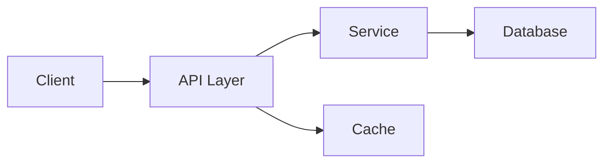
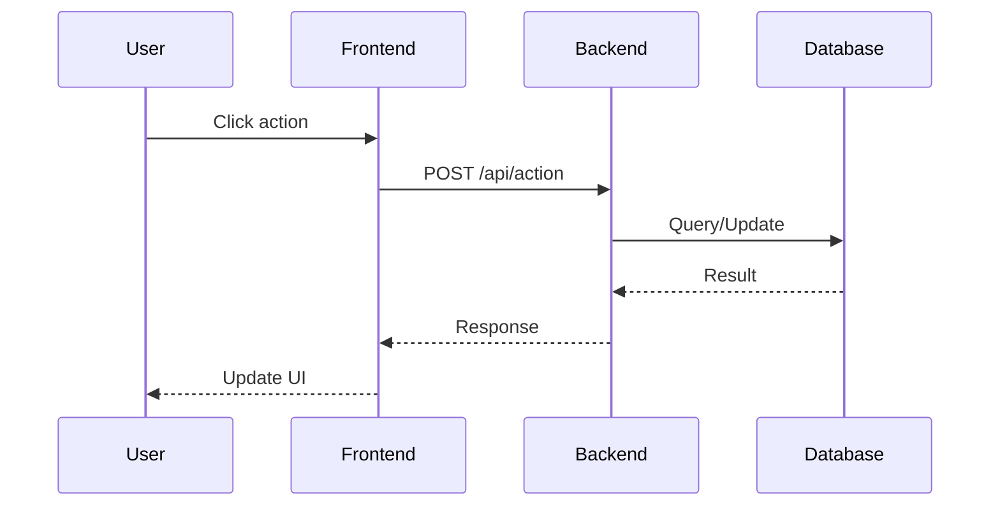
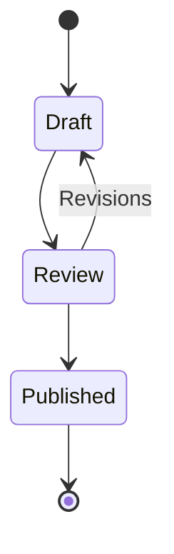
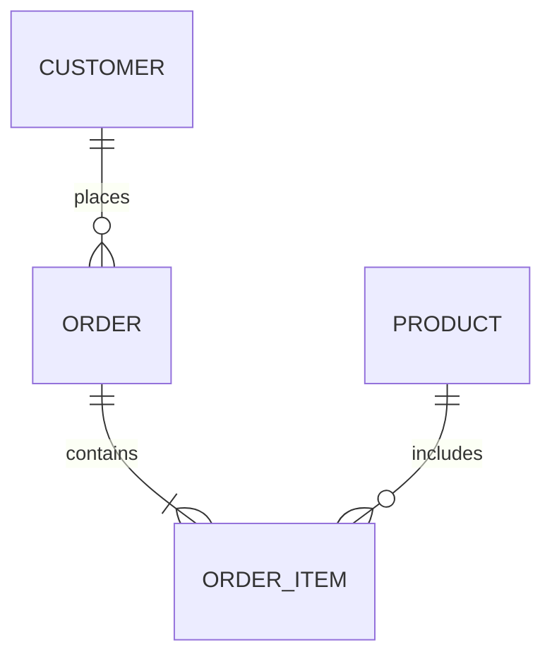
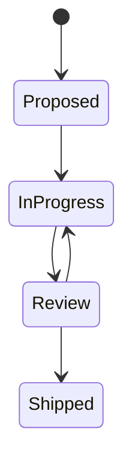

# 📊 Case Studies — Real Implementations with Diagrams

> **Purpose:** Document notable implementations as case studies with architecture diagrams (mermaid), key decisions, results, and lessons learned. These become the team's institutional memory and are referenced from plans and the feature roadmap.
> **Last updated:** 2026-08-31

---

## 📖 How to Write a Case Study

Every case study follows this structure:

```markdown
# [Short Title] — [Product/Project]

> **Date:** YYYY-MM-DD | **Status:** Active / Archived
> **Scope:** What this case study covers

---

## 1. Context

What was the situation? What problem were we solving? What constraints existed?

- Constraint 1
- Constraint 2
- Stakeholder expectations

## 2. Architecture

```mermaid
[graph/diagram showing the solution architecture]
```

Key components:
- Component A: responsibility
- Component B: responsibility

## 3. Implementation

What was built, in what order, with what key decisions?

### 3.1 Decision: X vs Y

Why we chose X over Y.

### 3.2 Key implementation detail

Code snippet or config showing the critical pattern.

## 4. Results

What happened? Metrics if available.

- Outcome 1
- Outcome 2
- Before → After comparison

## 5. Lessons Learned

What would we do differently? What surprised us?

- Lesson 1
- Lesson 2

---

## Remarks & Notes

- Caveats, edge cases, things to watch out for
- Links to related plans, docs, or code

<!-- AI-generated: review needed -->
```

---

## 🏗️ Mermaid Diagram Patterns

### Architecture / Flow Diagram




### Sequence Diagram




### State Diagram




### ER Diagram




### Task/State Tracking




---

## 📚 Existing Case Studies

The canonical index with status, priority, diagram counts, and descriptions for every case study lives in
[`case-studies/INDEX.md`](./case-studies/INDEX.md). Each case study is a full document under [`case-studies/`](./case-studies/):

| Case Study | Path | Diagrams |
|------------|------|:--------:|
| Multi-terminal Sync (POS) | [`case-studies/pos-multi-terminal-sync.md`](./case-studies/pos-multi-terminal-sync.md) | 4 |
| Offline Queue (POS) | [`case-studies/pos-offline-queue.md`](./case-studies/pos-offline-queue.md) | 4 |
| QR Menu (POS) | [`case-studies/pos-qr-menu.md`](./case-studies/pos-qr-menu.md) | 4 |
| DataToken Sync Tagging (django-fusion) | [`case-studies/data-token-sync-tagging.md`](./case-studies/data-token-sync-tagging.md) | 3 |
| Django-Bolt & django-fusion Integration | [`case-studies/django-bolt-fusion.md`](./case-studies/django-bolt-fusion.md) | 4 |
| Ceptor-AI Package (AI + MCP) | [`case-studies/ceptor-ai.md`](./case-studies/ceptor-ai.md) | 5 |
| Stripe Billing | [`case-studies/stripe-billing.md`](./case-studies/stripe-billing.md) | 3 |
| API Token Management | [`case-studies/api-token-management.md`](./case-studies/api-token-management.md) | 3 |

> The per-case-study summary tables below were removed as duplicates — `case-studies/INDEX.md` and the
> individual files are the single source of truth.

---

## ✍️ New Case Study Entry Template

Copy this template when adding a new case study:

```markdown
# [Feature/Project Name] — [Product]

> **Date:** YYYY-MM-DD | **Status:** Active
> **Scope:** [One-line scope]
> **Related plan:** [`path/to/plan.md`](../path/to/plan.md)
> **Feature tracking:** [./feature-tracking.md](./feature-tracking.md) § [Feature Name]

---

## 1. Context

[What was the situation? What problem? What constraints?]

## 2. Architecture

```mermaid
graph [LR/TB]
    [nodes and edges showing the solution]
```

Key components:
- **[Component A]:** [responsibility]
- **[Component B]:** [responsibility]

## 3. Implementation

[What was built, key decisions, code snippets if valuable]

### [Decision name]

[Why this decision was made]

## 4. Results

[Outcomes, metrics, before→after]

## 5. Lessons Learned

[What would we do differently? Surprises?]

---

## Remarks & Notes

- [Caveats, edge cases, watch-outs]
- Related: [`link`](../path)

<!-- AI-generated: review needed -->
```

---

## 🔗 Cross-references

Case studies should link FROM and TO:

| From | To |
|------|-----|
| Feature entry in `feature-tracking.md` | Case study entry here |
| Plan in `plans/README.md` | Case study entry here |
| Completion checklist | Case study entry here |
| Meeting notes in `team-notes.md` | Case study entry here (when feature ships) |

---

## 🔄 Maintenance

- **Add a case study when:** A feature ships, a major decision is made, an incident is resolved, a migration completes
- **Update a case study when:** Facts change, new lessons emerge, status changes to Archived
- **Archive a case study when:** The technology or approach is superseded (keep for history, mark Archived)

---

## Remarks & Notes

- Mermaid diagrams must render in the Docus pipeline — test with `npm run validate-content`
- Keep diagrams focused: one clear message per diagram, not every possible path
- Code snippets are optional — include only when they illustrate a non-obvious pattern
- The "Lessons Learned" section is the most valuable part for the team — don't skip it

<!-- AI-generated: review needed -->
