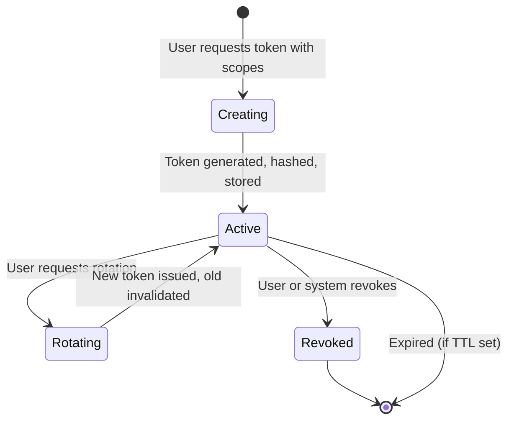
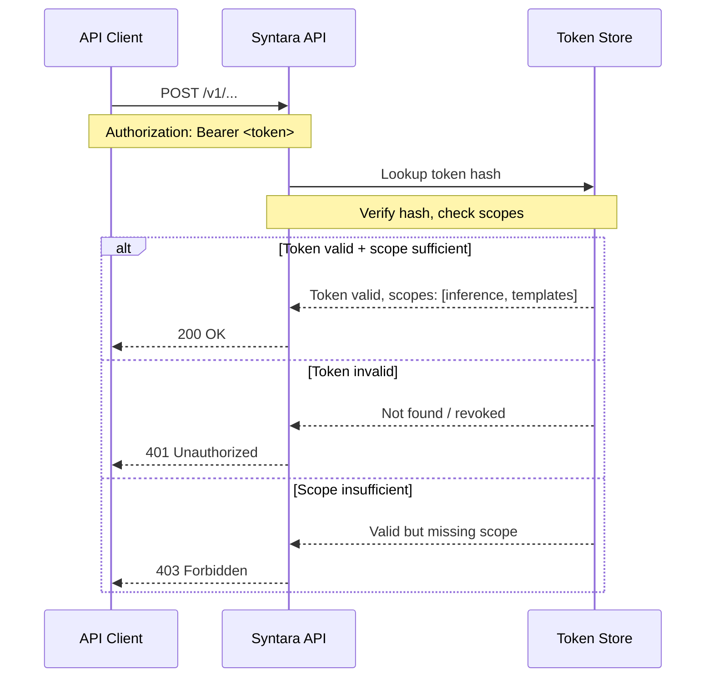
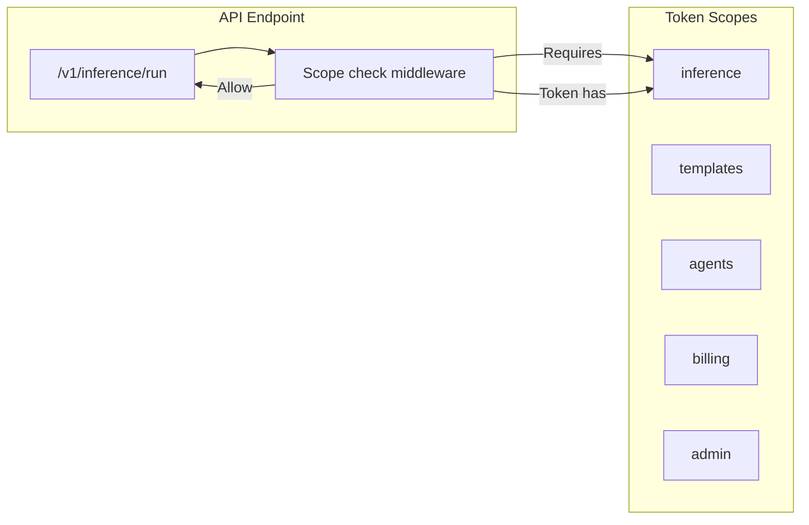

# API Token Management — Cypercloud/Syntara Case Study

> **Date:** 2026-08-31 | **Status:** Active | **Priority:** P0
> **Scope:** Token model with scopes, generate/rotate/revoke actions, token list UI, scoped permission enforcement
> **Feature tracking:** [`feature-tracking.md`](../feature-tracking.md) § API Token Management

---

## 1. Context

The Syntara platform exposes a REST API for AI inference, template management, and agent execution. External integrators and power users need API tokens to authenticate programmatic access. Tokens must be scoped to specific capabilities, rotatable without downtime, and revocable when compromised.

**Constraints:**
- Tokens are the primary auth mechanism for API access (not OAuth — tracked separately)
- Scopes must be granular: inference, templates, agents, billing, admin
- Rotation must invalidate the old token and issue a new one atomically
- Revocation must take effect immediately
- Token list UI in customer dashboard

---

## 2. Architecture

### 2.1 Token Lifecycle




### 2.2 Token Authentication Flow




### 2.3 Scope Enforcement




---

## 3. Implementation

### 3.1 Token Model

| Field | Type | Purpose |
|-------|------|---------|
| `id` | UUID | Primary key |
| `name` | String | User-given label (e.g., "Production API") |
| `hash` | String | Hashed token value (stored, never plaintext) |
| `scopes` | JSON/Array | Granted scopes: ["inference", "templates"] |
| `created_at` | DateTime | Creation timestamp |
| `last_used_at` | DateTime | Last API usage (for inactive detection) |
| `status` | Enum | active / revoked |
| `created_by` | FK | User who created the token |

**Important:** The plaintext token is returned to the user exactly once at creation time. It is never stored in plaintext.

### 3.2 Token Creation

```python
# POST /api/v1/tokens/create
{
    "name": "Production API",
    "scopes": ["inference", "templates", "agents"]
}

# Response (plaintext token returned ONCE):
{
    "token": "synt-...",
    # Store this securely, shown only once
    "name": "Production API",
    "scopes": ["inference", "templates", "agents"],
    "created_at": "2026-08-31T12:00:00Z"
}
```

### 3.3 Token Rotation

```python
# POST /api/v1/tokens/{id}/rotate

# Process:
# 1. Invalidate current token (set status = revoked)
# 2. Generate new token with same scopes
# 3. Store new token hash
# 4. Return new plaintext token ONCE

# Response:
{
    "old_token_id": "uuid-1",
    "new_token": "synt-...",
    # New plaintext, shown once
    "scopes": ["inference", "templates", "agents"],
    "rotated_at": "2026-08-31T13:00:00Z"
}
```

### 3.4 Token Revocation

```python
# POST /api/v1/tokens/{id}/revoke

# Process:
# 1. Set token status = revoked
# 2. Immediate effect — next API call with this token fails

# Response:
{
    "token_id": "uuid-1",
    "status": "revoked",
    "revoked_at": "2026-08-31T14:00:00Z"
}
```

### 3.5 Scope Enforcement Middleware

```python
# Per-endpoint scope requirements:
ENDPOINT_SCOPES = {
    "/v1/inference/run": ["inference"],
    "/v1/templates/*": ["templates"],
    "/v1/agents/*": ["agents"],
    "/v1/billing/*": ["billing"],
    "/v1/admin/*": ["admin"],
}

# Middleware checks:
# 1. Extract token from Authorization header
# 2. Lookup token hash, verify not revoked
# 3. Check required scope present in token scopes
# 4. 401 if invalid, 403 if scope insufficient
```

---

## 4. Results

### 4.1 What Works

| Outcome | Evidence |
|---------|----------|
| Token creation with scopes | User selects scopes at creation time |
| Token rotation | Old invalidated, new issued atomically |
| Token revocation | Immediate effect on next API call |
| Scope enforcement | Middleware enforces per-endpoint scopes |
| Token list UI | Dashboard shows active/revoked tokens |

### 4.2 Security Properties

| Property | Implementation |
|----------|----------------|
| Plaintext never stored | Hash stored, plaintext returned once |
| Rotation is atomic | Old revoked + new created in same transaction |
| Revocation is immediate | Status check on every API call |
| Scope granularity | Per-endpoint scope requirements |
| Audit trail | `created_by`, `last_used_at` tracked |

---

## 5. Lessons Learned

### 5.1 Never store plaintext tokens

Storing plaintext tokens means a database breach exposes all API tokens. Hash tokens (like passwords) and return plaintext only once.

**Lesson:** Treat API tokens like passwords — hash them, never store plaintext.

### 5.2 Rotation must be atomic

If rotation invalidates the old token but fails to create the new one, the user is locked out. Both steps must be in the same transaction.

**Lesson:** Rotate in a transaction — invalidate old + create new together.

### 5.3 Scope check is per-endpoint, not per-token

Tokens carry scopes. Endpoints declare required scopes. The middleware matches them. This keeps scope logic centralized and testable.

**Lesson:** Endpoints declare their scope needs; tokens carry their grants; middleware enforces.

---

## 6. Related Documentation

| Document | Path |
|----------|------|
| Feature tracking — API Token Management | [`../feature-tracking.md`](../feature-tracking.md) § API Token Management |
| Case study — Stripe Billing | [./stripe-billing.md](./stripe-billing.md) |
| Feature roadmap — Syntara | [`../../features/feature-roadmap.md`](../../features/feature-roadmap.md) |
| Syntara product docs | [`../../projects/syntara/`](../../projects/syntara/) |

---

## Remarks & Notes

- API Token Management is P0 for Syntara — blocks Webhook Integrations and API-first integrations
- Token rotation and revocation are critical security features
- Scopes are designed to be extensible — new scopes added as new API surface grows
- Plaintext token shown once only; user responsible for secure storage

<!-- AI-generated: review needed -->
