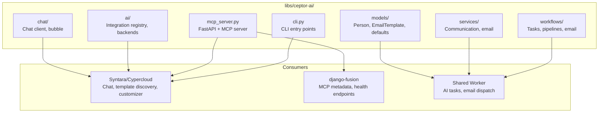
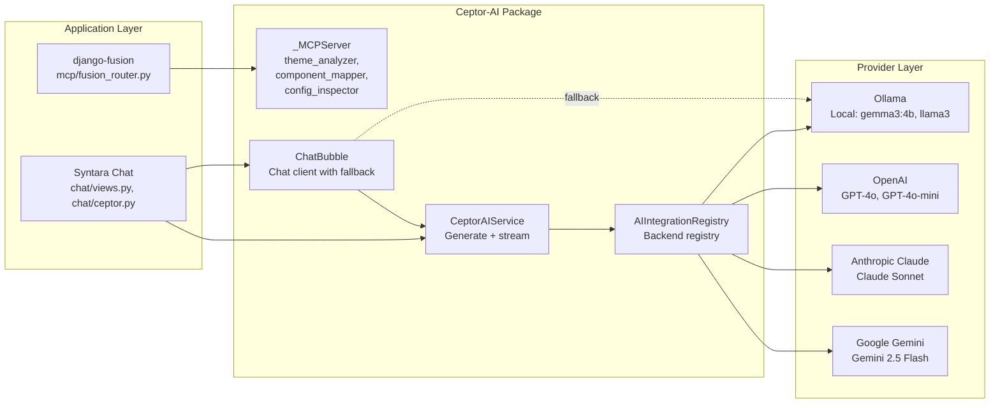
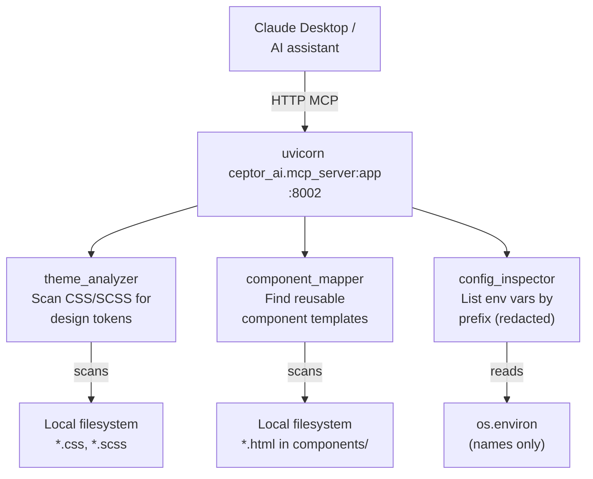
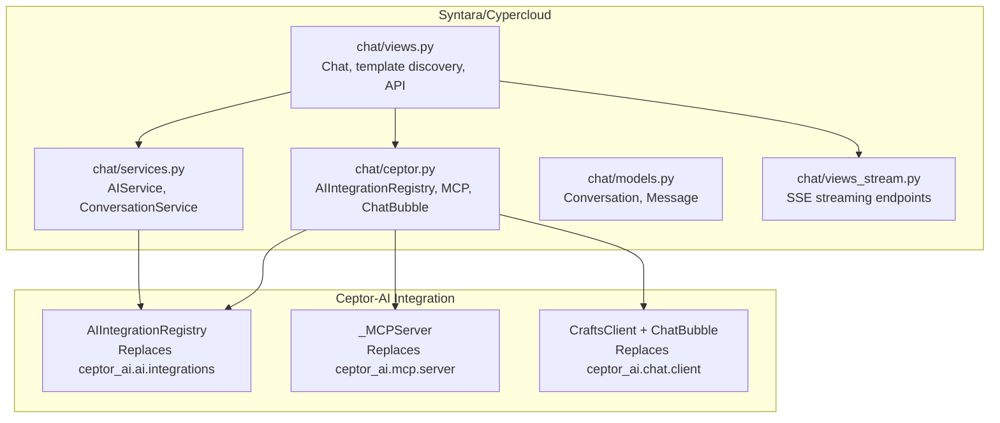
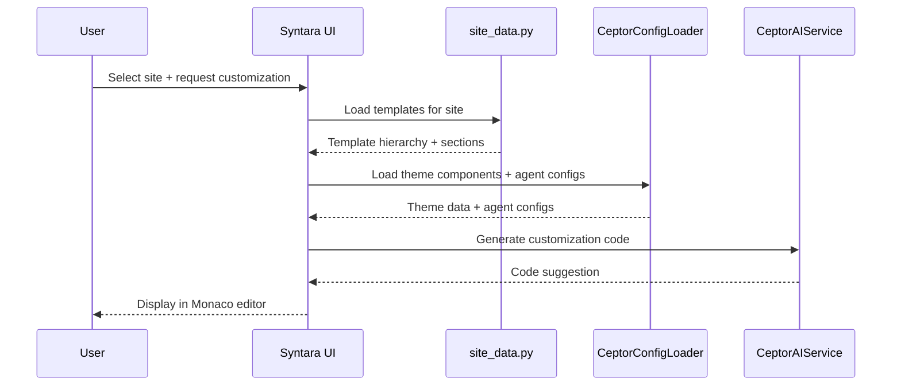

# Ceptor-AI — Package Use Cases & Case Study

> **Date:** 2026-08-31 | **Status:** Active
> **Scope:** Ceptor-AI package (`libs/ceptor-ai/`) — AI chat client, MCP server, BEM converter, agent generation — use cases across the Structa Cloud monorepo with architecture diagrams and implementation details.
> **Repo:** [github.com/mammhoud/ceptor-ai](https://github.com/mammhoud/ceptor-ai)
> **Consumers:** Syntara/Cypercloud (primary), django-fusion (MCP metadata), Structa shared worker

---

## 1. Context

Ceptor-AI is a standalone Python package that provides:

| Capability | Purpose |
|------------|---------|
| **AI Chat Client** | Multi-model chat with streaming (Ollama, OpenAI, Claude, Gemini) |
| **MCP Server** | Model Context Protocol server for AI tool integration |
| **BEM Converter** | Prompt-to-component CSS generation |
| **Agent Generation** | Scaffold AI agents from templates |
| **Config Loader** | YAML/JSON config preloading for models, agents, themes |

The package is maintained as a separate repo ([mammhoud/ceptor-ai](https://github.com/mammhoud/ceptor-ai)) and consumed as a git submodule at `libs/ceptor-ai/`.

**Why it matters:** Syntara/Cypercloud is the primary consumer — it uses Ceptor-AI for AI chat, template discovery, and code customization. django-fusion uses it for MCP metadata. The shared worker stack uses it for AI model tasks and email dispatch.

**Constraints:**
- Must be importable without Django settings (standalone Python)
- Must support multiple AI backends (local Ollama, cloud providers)
- MCP tools must be read-only and operate on local filesystem/environment
- Must not require Django in the MCP server path

---

## 2. Architecture

### 2.1 Package Structure



### 2.2 AI Backend Architecture



### 2.3 MCP Tool Architecture



### 2.4 Syntara Integration Points



---

## 3. Use Cases

### Use Case 1: AI Chat with Multi-Backend Support

**Consumer:** Syntara/Cypercloud (`projects/syntara/`)

**Problem:** Users need to chat with AI using different backends (local Ollama, OpenAI, Claude, Gemini) with streaming responses.

**Solution:** Ceptor-AI's `AIIntegrationRegistry` + `CeptorAIService` provide a unified interface:

```python
# projects/syntara/chat/ceptor.py
svc = CeptorAIService()
reply = svc.generate("openai", "Explain Django class-based views")
for chunk in svc.stream("claude", "Summarize this code"):
    print(chunk, end="")
```

**Key features:**
- Backend resolution from `configs/models.yml`
- Streaming token-by-token for real-time UI
- Local Ollama fallback when cloud providers unavailable
- Model IDs resolved from YAML config

**API endpoints in Syntara:**

| Endpoint | Method | Purpose |
|----------|--------|---------|
| `/api/ceptor/ai/complete/` | POST | AI completion (stream or non-stream) |
| `/chat/{id}/ceptor-stream/` | GET | SSE stream for Ceptor AI responses |
| `/api/ceptor/health/` | GET | Check Ceptor AI status |
| `/api/ceptor/config/preload/` | GET | Get AI configs (agents, models) |

**Streaming request example:**

```bash
curl -X POST http://localhost:5073/api/ceptor/ai/complete/?stream=1 \
  -H "Content-Type: application/json" \
  -d '{
    "backend": "openai",
    "model": "gpt-4o",
    "prompt": "Generate a React component for..."
  }'
```

---

### Use Case 2: MCP Tool Execution

**Consumer:** Syntara/Cypercloud + Claude Desktop

**Problem:** AI assistants need read-only access to project filesystem and environment to analyze themes, find components, and inspect config.

**Solution:** Ceptor-AI's `_MCPServer` provides three read-only MCP tools:

| Tool | Purpose | What it reads |
|------|---------|---------------|
| `theme_analyzer` | Scan CSS/SCSS for design tokens (`--color-*`, `--spacing-*`) | Local `*.css`, `*.scss` files |
| `component_mapper` | Find reusable component templates | `*.html` in `components/` or `fragments/` |
| `config_inspector` | List env vars by prefix (values redacted) | `os.environ` names only |

**Usage from Syntara:**

```python
# projects/syntara/chat/ceptor.py
mcp = CeptorMCPService()
result = mcp.run_tool("theme_analyzer", root="/path/to/project")
config = mcp.run_tool("config_inspector", prefix="DJANGO")
```

**MCP server deployment:**

```bash
# Start MCP server for AI assistant integration
PYTHONPATH=libs/ceptor-ai/src \
  uvicorn ceptor_ai.mcp_server:app \
  --host 127.0.0.1 --port 8002
```

**Tool execution from API:**

```bash
# Execute MCP tool via Syntara API
curl "http://localhost:5073/api/ceptor/mcp/theme_analyzer/?root=/home/project"
```

---

### Use Case 3: Template Discovery + AI Customization

**Consumer:** Syntara/Cypercloud TemplateTinker

**Problem:** Users need to discover templates across multiple sites (CTC Research, LMS Demo, VResume) and use AI to customize them.

**Solution:** Syntara's `site_data.py` + `customizer.py` + Ceptor-AI's config loader:



**Configured sites for template discovery:**

```python
# projects/syntara/settings.py
CUSTOMIZER_APPS = [
    {"slug": "precis-ctc", "name": "CTC Research", "template_root": "..."},
    {"slug": "lms", "name": "LMS Demo", "template_root": "..."},
    {"slug": "VResume", "name": "VResume", "template_root": "..."},
]
```

---

### Use Case 4: Shared Worker AI Tasks

**Consumer:** Shared worker stack (`projects/www/`)

**Problem:** AI model tasks, workflow automation, and email dispatch need to run across all sites from a single worker.

**Solution:** Ceptor-AI modules registered in the shared task registry:

```python
# projects/www/worker/modules.py
TASK_MODULES = [
    "ceptor_ai.tasks",                      # AI model tasks
    "ceptor_ai.workflows.tasks",            # Workflow automation
    "ceptor_ai.services.communication.tasks",  # Email/notifications
]
```

**What runs:**
- AI content generation with site-specific model config
- Email templates from `ceptor_ai.workflows.models.settings.templates.EmailTemplate`
- Workflow automation tasks

---

### Use Case 5: django-fusion MCP Metadata

**Consumer:** django-fusion (`libs/django-fusion/`)

**Problem:** django-fusion needs to expose MCP metadata without importing Django into the ceptor-ai MCP server.

**Solution:** django-fusion serves its own MCP endpoint at `/fusion/mcp/` within the Django application. Ceptor-AI's MCP server is used only for read-only filesystem/environment tools.

```python
# libs/django-fusion/src/django_fusion/mcp/fusion_router.py
# Checks if ceptor_ai is importable for metadata
"ceptor_ai": _find_spec("ceptor_ai") is not None,
```

**Boundary:** django-fusion MCP tools must NOT be registered into ceptor-ai's MCP server. Ceptor-AI explicitly avoids Django imports.

---

## 4. Implementation Details

### 4.1 AIIntegrationRegistry (Replaces ceptor_ai.ai.integrations)

```python
# libs/ceptor-ai equivalent — in-project implementation at projects/syntara/chat/ceptor.py
class AIIntegrationRegistry:
    """Registry for AI provider integrations.

    Replaces ``ceptor_ai.ai.integrations.AIIntegrationRegistry``.
    Backends are resolved to real model configs from ``configs/models.yml``
    and executed through the in-project AI service.
    """

    _backends: set[str] = set(BACKEND_MODEL_MAP.keys())

    @classmethod
    def register(cls, name: str) -> None:
        cls._backends.add(name)

    @classmethod
    def get(cls, backend: str, **inst_kwargs: Any) -> _AIProviderBackend:
        model_id = _resolve_model_id(backend, inst_kwargs.pop("model", None))
        return _AIProviderBackend(backend, model_id, **inst_kwargs)

    @classmethod
    def list_integrations(cls) -> list[str]:
        return sorted(cls._backends)
```

**Backend model map:**

```python
BACKEND_MODEL_MAP: dict[str, str] = {
    "ollama": "gemma3-4b",
    "openai": "gpt4o",
    "claude": "claude-sonnet",
    "gemini": "gemini-2.5-flash",
    "openai_compatible": "gpt4o",
}
```

### 4.2 ChatBubble with Local Fallback

```python
# projects/syntara/chat/ceptor.py
class ChatBubble:
    """Real chat bubble with server + local AI fallback.

    Sends messages to the configured chat server. When the server is
    unreachable it falls back to the local AI service (Ollama by default).
    """

    def send(self, message: str, **kwargs: Any) -> _ChatReply:
        try:
            # Try chat server first
            with httpx.Client(timeout=self.timeout) as client:
                response = client.post(f"{self.server_url}/chat", ...)
                return _ChatReply(...)
        except Exception as exc:
            # Fall back to local Ollama
            logger.warning("Chat server unreachable; falling back to local AI")
            reply = AIService.chat(_resolve_model_id("ollama", None), ...)
            return _ChatReply(text=str(reply), ...)
```

### 4.3 MCP Tools (Read-Only)

```python
# projects/syntara/chat/ceptor.py — _MCPServer
class _MCPServer:
    """Real in-project MCP tool server — read-only tools."""

    def list_tools(self) -> list[str]:
        return ["theme_analyzer", "component_mapper", "config_inspector"]

    def call_tool(self, tool_name: str, **kwargs: Any) -> Any:
        if tool_name == "theme_analyzer":
            return _theme_analyzer(kwargs.get("root", "."))
        if tool_name == "component_mapper":
            return _component_mapper(kwargs.get("root", "."), ...)
        if tool_name == "config_inspector":
            return _config_inspector(kwargs.get("prefix"))
```

### 4.4 Config Loader

```python
# projects/syntara/chat/ceptor.py — CeptorConfigLoader
class CeptorConfigLoader:
    """Preload and cache AI configuration from YAML/JSON files."""

    def load_agent_configs(self) -> dict[str, Any]:
        """Load application/kilo/agent/*.json configs (cached)."""

    def load_models_config(self) -> dict[str, Any]:
        """Load models.yml from customizer configs directory."""

    def load_website_templates(self, website_slug: str) -> list[dict[str, Any]]:
        """Discover template files for a website from AI config."""
```

---

## 5. Results

### 5.1 What Works

| Outcome | Evidence |
|---------|----------|
| **Multi-backend AI chat** | Ollama, OpenAI, Claude, Gemini all accessible through unified interface |
| **Streaming responses** | SSE + token streaming for real-time chat UI |
| **MCP tool execution** | Three read-only tools (theme_analyzer, component_mapper, config_inspector) |
| **Local fallback** | ChatBubble falls back to Ollama when server unreachable |
| **Template discovery** | Syntara discovers templates from 3 configured sites |
| **Standalone import** | `ceptor_ai` importable without Django settings |

### 5.2 Current State

| Component | Status | Location |
|-----------|--------|----------|
| AIIntegrationRegistry | In-project (Syntara) | `projects/syntara/chat/ceptor.py` |
| _MCPServer | In-project (Syntara) | `projects/syntara/chat/ceptor.py` |
| ChatBubble + CraftsClient | In-project (Syntara) | `projects/syntara/chat/ceptor.py` |
| CeptorAIService | In-project (Syntara) | `projects/syntara/chat/ceptor.py` |
| CeptorConfigLoader | In-project (Syntara) | `projects/syntara/chat/ceptor.py` |
| AIService (Ollama + OpenAI) | In-project (Syntara) | `projects/syntara/chat/services.py` |
| libs/ceptor-ai submodule | Pending | `git submodule add mammhoud/ceptor-ai` |
| Shared worker tasks | Active | `projects/www/worker/modules.py` |
| django-fusion MCP metadata | Active | `libs/django-fusion/src/django_fusion/mcp/fusion_router.py` |

---

## 6. Lessons Learned

### 6.1 In-project implementations replaced external dependencies

The original `ceptor_ai.ai.integrations.AIIntegrationRegistry`, `ceptor_ai.mcp.server.server`, and `ceptor_ai.chat.client.ChatBubble` were replaced with in-project implementations in `projects/syntara/chat/ceptor.py`. This:

- Eliminates the need for the external `ceptor-ai` package at runtime
- Keeps all provider logic in one place
- Makes testing easier (no external package dependency)

**Lesson:** When a package provides interfaces but the project needs custom behavior, in-project implementations can be simpler than fighting the package's abstraction.

### 6.2 Read-only MCP tools are the right boundary

The MCP tools (`theme_analyzer`, `component_mapper`, `config_inspector`) are intentionally read-only. They operate on local filesystem and environment variables (names only, values redacted). This:

- Makes them safe to expose to AI assistants
- Avoids write operations that could corrupt projects
- Keeps the MCP server stateless and testable

**Lesson:** MCP tools should be read-only by default. Write operations need explicit user confirmation and should go through the application's own API, not directly through MCP.

### 6.3 Local fallback is essential for UX

ChatBubble's fallback to local Ollama when the chat server is unreachable means users always get a response. This is critical for a chat UI — showing "server unavailable" is a poor experience.

**Lesson:** AI features should degrade gracefully. Local models (even smaller ones) are better than no response.

---

## 7. Related Documentation

| Document | Path |
|----------|------|
| Syntara/Cypercloud README | [`projects/syntara/README.md`](https://github.com/mammhoud/structa.cloud/tree/generic/projects/syntara) |
| Syntara AGENTS.md | [`projects/syntara/AGENTS.md`](https://github.com/mammhoud/structa.cloud/tree/generic/projects/syntara) |
| Ceptor-AI external repo | [github.com/mammhoud/ceptor-ai](https://github.com/mammhoud/ceptor-ai) |
| Libraries README | [`libs/README.md`](../../libs/README.md) |
| Django-Bolt case study | [`case-studies/django-bolt-fusion.md`](./django-bolt-fusion.md) |
| Shared use cases | [`../../shared/use-cases.md`](../../shared/use-cases.md) |
| Shared methods | [`../../shared/shared-methods.md`](../../shared/shared-methods.md) |
| CTC Research ceptor-ai migration | [`../../plans/repository/ctc-research-ceptor-ai-migration.md`](../../plans/repository/ctc-research-ceptor-ai-migration.md) |

---

## Remarks & Notes

- The `libs/ceptor-ai/` submodule is pending initialization — the package is referenced but not yet checked out
- Syntara's in-project implementations in `chat/ceptor.py` and `chat/services.py` are the current production code
- The original `ceptor_ai` package interfaces are documented here for reference, but the in-project code is what runs
- django-fusion's MCP tools are served from `/fusion/mcp/`, NOT from ceptor-ai's MCP server
- The shared worker uses `ceptor_ai.tasks` and `ceptor_ai.workflows.tasks` — these need the full project environment

<!-- AI-generated: review needed -->
