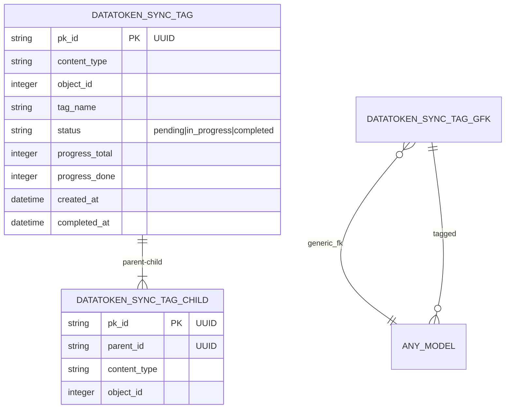
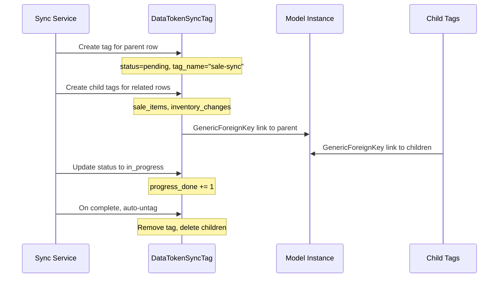
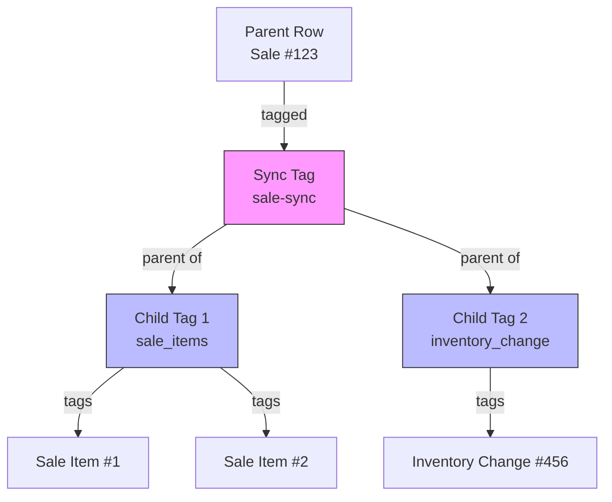

# DataToken Sync Tagging — django-fusion Case Study

> **Date:** 2026-08-31 | **Status:** Active
> **Scope:** GenericForeignKey-based sync row tagging with parent/child tree, progress tracking, and auto-untag, UUID PK support
> **Feature tracking:** [`feature-tracking/django-fusion.md`](../feature-tracking/django-fusion.md) § django-fusion
> **Related:** [`case-studies/django-bolt-fusion.md`](./django-bolt-fusion.md), [`case-studies/pos-multi-terminal-sync.md`](./pos-multi-terminal-sync.md)

---

## 1. Context

POS sync operations need to track which rows have been synced, which are in progress, and which have children that depend on them. A sale has sale items. An inventory transfer has source and destination entries. When syncing, you need to:

- Tag rows that are being synced (prevent duplicate sync)
- Track progress (how many rows synced out of total)
- Handle parent/child relationships (sync parent first, then children)
- Auto-untag rows when sync completes (clean up)
- Support UUID primary keys (POS terminals use UUIDs for distributed ID generation)

**Constraints:**
- Must work with any Django model (GenericForeignKey)
- Must support UUID and integer PKs
- Must be efficient — sync operations can involve thousands of rows
- Must clean up after itself — no orphaned tags

---

## 2. Architecture

### 2.1 Sync Tagging Model




### 2.2 Sync Tagging Flow




### 2.3 Parent/Child Tree




---

## 3. Implementation

### 3.1 DataTokenSyncTag Model

```python
# libs/django-fusion — simplified representation
class DataTokenSyncTag(models.Model):
    id = models.UUIDField(primary_key=True, default=uuid.uuid4)
    content_type = models.ForeignKey(ContentType, ...)
    object_id = models.PositiveIntegerField(...)
    content_object = GenericForeignKey("content_type", "object_id")

    tag_name = models.CharField(max_length=100)
    status = models.CharField(
        choices=[
            ("pending", "Pending"),
            ("in_progress", "In Progress"),
            ("completed", "Completed"),
        ]
    )
    progress_total = models.PositiveIntegerField(default=0)
    progress_done = models.PositiveIntegerField(default=0)
    created_at = models.DateTimeField(auto_now_add=True)
    completed_at = models.DateTimeField(null=True, blank=True)

    class Meta:
        indexes = [
            models.Index(fields=["content_type", "object_id"]),
            models.Index(fields=["tag_name", "status"]),
        ]
```

### 3.2 Child Tags (Parent/Child Tree)

```python
class DataTokenSyncTagChild(models.Model):
    parent = models.ForeignKey(
        DataTokenSyncTag,
        on_delete=models.CASCADE,
        related_name="children",
    )
    content_type = models.ForeignKey(ContentType, ...)
    object_id = models.PositiveIntegerField(...)
    content_object = GenericForeignKey("content_type", "object_id")
```

### 3.3 Sync Tagging Service

```python
class SyncTaggingService:
    def tag_for_sync(self, obj, tag_name: str, total_children: int = 0):
        """Create a sync tag for a row and its children."""
        parent_tag = DataTokenSyncTag.objects.create(
            content_object=obj,
            tag_name=tag_name,
            status="pending",
            progress_total=total_children + 1,  # +1 for parent itself
        )

        # Create child tags for related rows
        for child_obj in self.get_children(obj):
            DataTokenSyncTagChild.objects.create(
                parent=parent_tag,
                content_object=child_obj,
            )

        return parent_tag

    def mark_progress(self, tag_id: UUID, done: int = 1):
        """Update progress on a sync tag."""
        tag = DataTokenSyncTag.objects.get(pk=tag_id)
        tag.status = "in_progress"
        tag.progress_done += done
        tag.save()

        if tag.progress_done >= tag.progress_total:
            tag.status = "completed"
            tag.completed_at = now()
            tag.save()
            self.auto_untag(tag)

    def auto_untag(self, tag: DataTokenSyncTag):
        """Remove tag and child tags when sync completes."""
        tag.children.all().delete()  # Delete child tags
        tag.delete()  # Delete parent tag
```

### 3.4 UUID Primary Key Support

The model uses UUID primary keys, making it compatible with POS terminals that generate UUIDs for distributed ID creation. The `object_id` field is an integer (for the GenericForeignKey) but the tag itself has a UUID PK.

```python
# POS terminal creates a sale with UUID PK
sale = Sale.objects.create(id=uuid.uuid4(), ...)

# Sync tagging works regardless of PK type
tag = SyncTaggingService().tag_for_sync(sale, "sale-sync")
# tag.pk is a UUID, tag.content_object references the sale
```

---

## 4. Results

### 4.1 What Works

| Outcome | Evidence |
|---------|----------|
| GenericForeignKey tagging | Works with any Django model |
| Parent/child tree | Sync tags can have child tags for related rows |
| Progress tracking | progress_total + progress_done tracks sync progress |
| Auto-untag | Tags cleaned up automatically on completion |
| UUID PK support | Compatible with UUID primary keys from POS terminals |
| Efficient queries | Indexed on content_type + object_id, tag_name + status |

### 4.2 Sync Operations Using DataToken

| Operation | Tag Usage |
|-----------|-----------|
| Sale sync | Tag sale row + child tags for sale items |
| Inventory sync | Tag inventory row + child tags for changes |
| Transfer sync | Tag transfer row + child tags for source/destination |
| Branch sync | Tag branch row + child tags for all changes |

---

## 5. Lessons Learned

### 5.1 GenericForeignKey is the right abstraction

Sync tagging needs to work with any model — sales, inventory, transfers, branches. A concrete foreign key to a specific model would limit the utility. GenericForeignKey provides the flexibility needed.

**Lesson:** Use GenericForeignKey when the tagged entity type is unknown at design time.

### 5.2 Progress tracking enables UX and monitoring

Knowing that a sync is "37 of 50 rows complete" is useful for UI progress bars and for monitoring sync operations. Without progress tracking, you only know "started" and "done" — no visibility into long-running syncs.

**Lesson:** Track progress on sync operations. It enables better UX and operational visibility.

### 5.3 Auto-untag prevents tag accumulation

Without auto-untag, completed sync tags would accumulate indefinitely, cluttering the database and slowing queries. Auto-untag on completion keeps the tag table small.

**Lesson:** Always clean up after sync operations. Orphaned tags are technical debt.

---

## 6. Related Documentation

| Document | Path |
|----------|------|
| Feature tracking — django-fusion | [`../feature-tracking/django-fusion.md`](../feature-tracking/django-fusion.md) § django-fusion |
| Case study — Django-Bolt fusion | [./django-bolt-fusion.md](./django-bolt-fusion.md) |
| Case study — Multi-terminal Sync | [./pos-multi-terminal-sync.md](./pos-multi-terminal-sync.md) |
| Feature roadmap | [`../../features/feature-roadmap.md`](../../features/feature-roadmap.md) |
| django-fusion docs | [`../../libs/django-fusion/`](../../libs/django-fusion/) |

---

## Remarks & Notes

- DataToken Sync Tagging is P1, Shipped in django-fusion library (🔧)
- The model uses UUID PKs — compatible with distributed ID generation
- Auto-untag deletes both parent and child tags
- Progress tracking is optional — set progress_total=0 for simple sync

<!-- AI-generated: review needed -->
