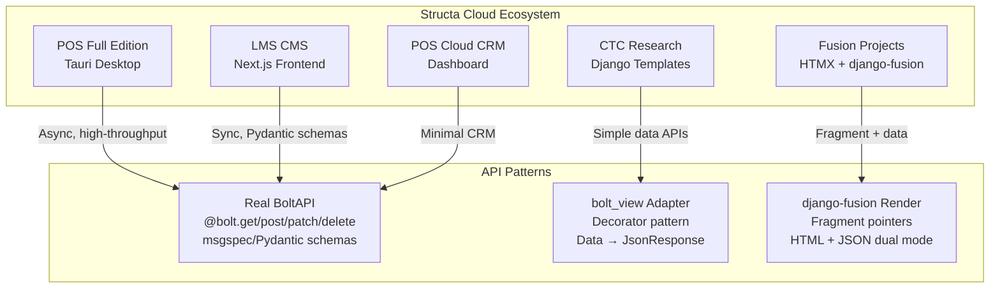
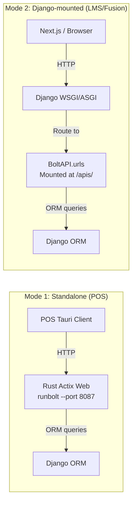
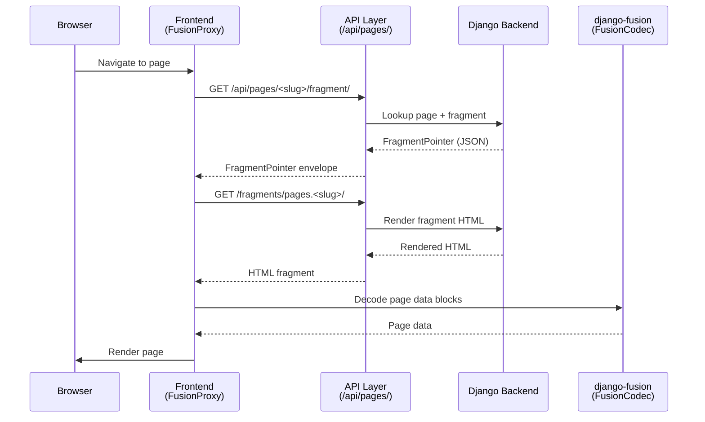
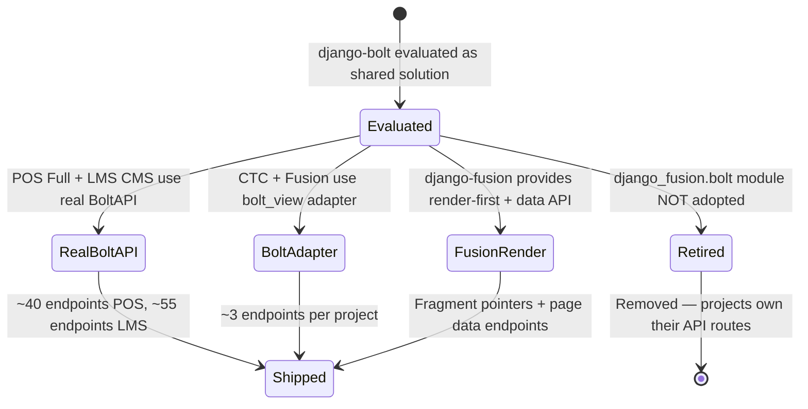

# Django-Bolt & django-fusion Integration — Case Study

> **Date:** 2026-07-26 | **Updated:** 2026-08-31
> **Status:** Active — historical record with current relevance
> **Scope:** Analysis of django-bolt API patterns across Structa Cloud websites and POS editions
> **Related feature:** API Access (Formint POS), feature-tracking.md § API Access

---

## 1. Context

The Structa Cloud ecosystem needed high-performance API endpoints for multiple products:

- **POS Full Edition** — Real-time product, sales, inventory APIs for Tauri desktop clients
- **LMS CMS** — Course, auth, content APIs for Next.js frontends
- **CTC Research / Fusion projects** — Lightweight data APIs for page content
- **POS Cloud CRM** — Minimal CRM API for cloud dashboard

The challenge: different projects had different needs. Some needed high-throughput async endpoints. Others needed simple data-to-JSON wrapping. django-bolt was evaluated as a potential shared solution, but the reality was more nuanced.

**Constraints:**
- Django ORM is the data layer across all products
- Frontends range from Tauri (Rust) to Next.js to plain HTML
- Some projects need async, others work fine with sync
- Authentication needs vary: JWT, API keys, session-based

---

## 2. Architecture

### 2.1 Overall Pattern Map




### 2.2 Deployment Modes




### 2.3 Fragment Rendering Pipeline (django-fusion)




### 2.4 What Was Considered vs. What Was Built




---

## 3. Implementation

### 3.1 Decision: Real BoltAPI vs. bolt_view Adapter

**The decision:** Use real BoltAPI where high-throughput async endpoints are needed. Use the simpler `bolt_view` adapter where projects just need data-to-JSON wrapping.

**Why this decision:**

- POS Full needs async endpoints backed by Django ORM `aget/acreate` — real BoltAPI with msgspec schemas fits
- LMS CMS has ~55 endpoints with Pydantic schemas — real BoltAPI fits, but sync handlers work fine
- CTC Research and Fusion projects only need ~3 endpoints each — the `bolt_view` adapter is simpler and has fewer dependencies
- POS Cloud CRM is a proof-of-concept — minimal BoltAPI instance

**What we'd do differently:** If starting fresh, we'd standardize on one pattern per product rather than mixing. The `bolt_view` adapter is essentially a simplified BoltAPI — choosing one would reduce complexity.

### 3.2 Key Implementation: POS Full bolt_api.py

```python
# projects/pos/pos-full/sidecar/bolt_api.py
from django_bolt import BoltAPI, Request
from django_bolt.auth import JWTAuthentication, APIKeyAuthentication, IsAuthenticated

bolt = BoltAPI(prefix="/bolt", namespace="pos-bolt")

@bolt.get("/products", response_model=list[ProductResponse], 
          guards=[IsAuthenticated()])
async def list_products(request: Request) -> list[ProductResponse]:
    return [...]
```

**Scale:** ~40 endpoints across 7 resource groups (categories, products, customers, sales, inventory, employees, auth)

**Key patterns:**
- Async endpoints with Django ORM `aget/acreate`
- `response_model` for OpenAPI schema generation
- Dual auth: JWT + X-API-Key
- `msgspec.Struct` for request/response schemas (high performance)
- OpenAPI docs at `/bolt/docs`

### 3.3 Key Implementation: bolt_view Adapter

```python
# www/api/data_adapter.py — CTC Research / Fusion projects
def bolt_view(view_func):
    """Decorator that converts data-returning views into Django JsonResponse."""
    def wrapper(request, *args, **kwargs):
        result = view_func(request, *args, **kwargs)
        if isinstance(result, tuple):
            data, status = result
            return JsonResponse(data, status=status)
        return JsonResponse(result, status=200)
    return wrapper

@bolt_view
def page_detail(request, slug):
    return STATIC_PAGES.get(normalized)
```

**Scale:** ~3 endpoints per project (health, page detail, page fragment, page data)

**Key patterns:**
- Pure Django views — no django-bolt dependency
- Simple data-to-JSON wrapping
- Works alongside `FusionCodec`, `FusionSessionChecker`, `fusion_response`
- Coexists with django-fusion fragment rendering

### 3.4 Former Proposal: django_fusion.bolt (Retired)

The original proposal was to create a `django_fusion.bolt` module that would auto-expose every `RoutableComponent` as a BoltAPI endpoint:

```python
# RETIRED — do not import this removed package
# django_fusion/bolt/api.py (former)
class FusionBoltAPI(BoltAPI):
    def register_component(self, component_class: type[RoutableComponent]):
        """Auto-generate bolt endpoints for a RoutableComponent."""
        ...
```

**Why it was retired:** Consuming projects are better positioned to own their API routes, serializers, authentication, and framework adapters. A shared package would have created coupling and abstraction leakage.

**Current approach:** Each project owns its API layer. django-fusion provides rendered HTML and data-response primitives. Any Bolt-style JSON API remains owned by the consuming project.

---

## 4. Results

### 4.1 What Worked

| Outcome | Evidence |
|---------|----------|
| **POS Full has production API** | 32 endpoints, ~30 struct types, dual auth, 60k+ RPS via Rust Actix Web |
| **LMS CMS has data APIs** | ~55 endpoints across 10+ resource groups with Pydantic schemas |
| **CTC/Fusion have lightweight APIs** | ~3 endpoints per project with zero django-bolt dependency |
| **django-fusion provides dual rendering** | Fragment pointers + page data endpoints work with both HTML and JSON clients |
| **Frontend integration works** | FusionDecoder TypeScript counterpart decodes FusionCodec envelopes |

### 4.2 Performance

| Metric | Value | Source |
|--------|-------|--------|
| POS BoltAPI throughput | 60k+ RPS | Rust Actix Web via `runbolt` |
| Serialization | Zero-copy JSON | `msgspec.Struct` |
| Test overhead | None | In-process `TestClient` (no TCP) |

### 4.3 Before → After

**Before:** Each project had ad-hoc API patterns — some with raw Django views returning JSON, some with custom serializers, no consistency.

**After:** Three clear patterns emerged:
1. Real BoltAPI for high-throughput needs (POS, LMS)
2. bolt_view adapter for simple data APIs (CTC, Fusion)
3. django-fusion render-first + data API for fragment-based pages

The patterns aren't unified under one package, but they're documented and understood.

---

## 5. Lessons Learned

### 5.1 Shared packages can be the wrong abstraction

The `django_fusion.bolt` proposal assumed that exposing components as Bolt endpoints was universally valuable. In practice:
- Different projects have different API needs
- Authentication requirements vary
- Some projects don't need async at all
- A shared package would have forced abstractions that didn't fit all consumers

**Lesson:** Let consuming projects own their API layer. Provide primitives (like `FusionCodec`, fragment rendering) rather than prescriptive frameworks.

### 5.2 Document patterns even when they're not unified

The three patterns (Real BoltAPI, bolt_view adapter, django-fusion render) coexist. They're not unified under one package, but they're:
- Documented in this case study
- Referenced from the feature roadmap
- Understood by the team

**Lesson:** Documentation is valuable even without unification. Knowing *why* different patterns exist is better than pretending there's one way.

### 5.3 The frontend integration was the real value

The `FusionDecoder` TypeScript counterpart, `FusionProxy` component, and the dual-rendering pattern (HTML fragment OR JSON data) ended up being more broadly useful than the BoltAPI integration itself. These work across all django-fusion projects regardless of their API layer.

**Lesson:** Invest in the primitives that every project can use. The BoltAPI-specific parts are project-owned; the fusion decoding/rendering parts are shared value.

---

## 6. Related Documentation

| Document | Path |
|----------|------|
| Feature tracking — API Access (Formint POS) | [`../feature-tracking.md`](../feature-tracking.md) § API Access |
| Feature roadmap — Syntara platform | [`../../features/feature-roadmap.md](../../features/feature-roadmap.md) |
| Plans registry — canonical plans | [`../../plans/README.md`](../../plans/README.md) |
| Original Django-Bolt case study (historical) | [`../../plans/DJANGO_BOLT_FUSION_CASE_STUDY.md`](../../plans/DJANGO_BOLT_FUSION_CASE_STUDY.md) |
| django-fusion Tasks & MCP plan | [`../../plans/django-fusion/django-fusion-tasks-mcp-plan.md`](../../plans/django-fusion/django-fusion-tasks-mcp-plan.md) |

---

## Remarks & Notes

- This case study extracts and enhances the original `DJANGO_BOLT_FUSION_CASE_STUDY.md` with mermaid diagrams and clearer structure
- The original document remains as a historical reference with full code examples and the migration checklist
- The `django_fusion.plugins.bolt` package was removed — do not import it from django-fusion
- Keep Bolt integrations in consuming projects; project-owned API routes are the current pattern
- The fragment rendering pipeline (sequence diagram above) is the most broadly applicable pattern — it works for any django-fusion project

<!-- AI-generated: review needed -->
