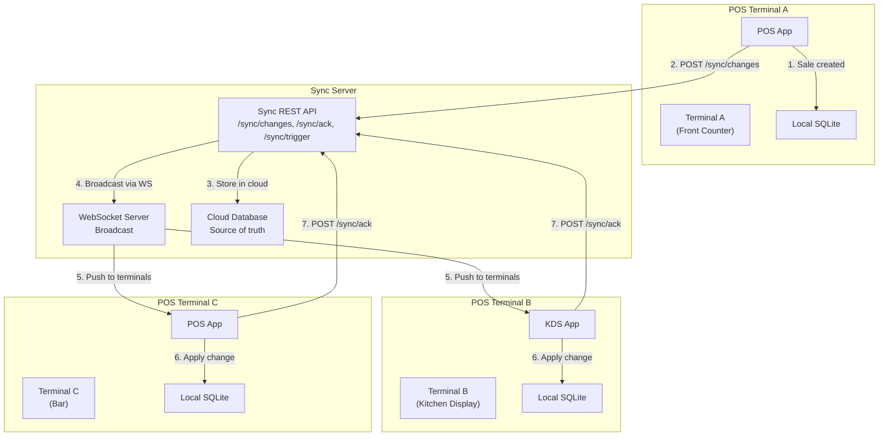
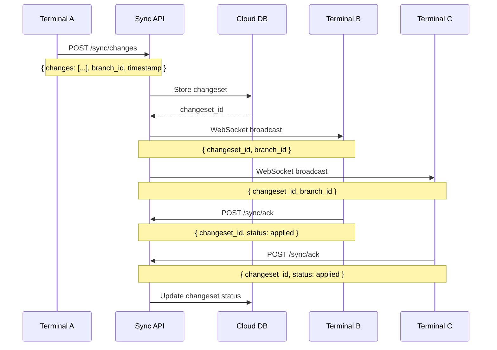
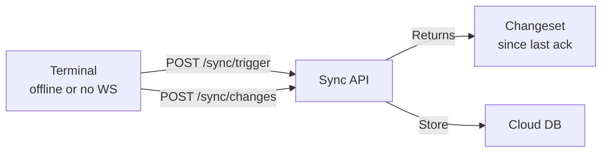
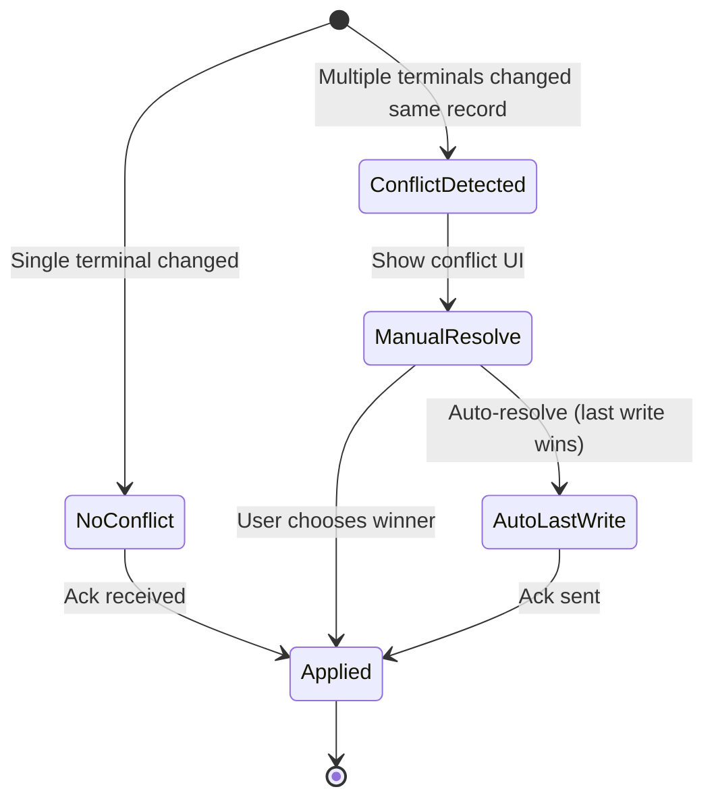
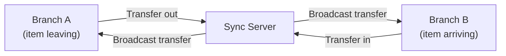

# Multi-terminal Sync — POS Case Study

> **Date:** 2026-08-31 | **Status:** Active
> **Scope:** Real-time WebSocket broadcast + pull changeset (`/sync/changes`, `/sync/ack`, `/sync/trigger`) across POS terminals
> **Feature tracking:** [`feature-tracking/formint-pos.md`](../feature-tracking/formint-pos.md) § Multi-terminal Management
> **Related:** [`pos-offline-queue.md`](./pos-offline-queue.md), [`pos-qr-menu.md`](./pos-qr-menu.md)

---

## 1. Context

A restaurant POS needs multiple terminals (front counter, kitchen, bar, takeout) to stay in sync. When a sale is created at one terminal, others need to see it immediately — kitchen tickets appear, inventory updates, and branch transfers reflect across all terminals.

**Constraints:**
- Terminals may be on different networks (LAN, Wi-Fi, cellular)
- Some terminals operate offline (see [Offline Queue case study](./pos-offline-queue.md))
- Real-time is preferred but not required — eventual consistency acceptable
- Must handle terminal crashes and reconnects gracefully

---

## 2. Architecture

### 2.1 Sync Flow Overview




### 2.2 Changeset Protocol




### 2.3 Pull Changeset (Polling Fallback)




### 2.4 Conflict Resolution




---

## 3. Implementation

### 3.1 WebSocket Broadcast

**Endpoint:** WebSocket connection for real-time change notification.

**What it broadcasts:**
- `changeset_id` — unique identifier for the change batch
- `branch_id` — which branch the change originated from
- `change_type` — sale, inventory, transfer, etc.

**Reconnect behavior:** Terminals re-subscribe on reconnect and pull any changesets they missed since their last ack.

### 3.2 Pull Changeset API

```python
# POST /sync/changes — submit changes from terminal
{
    "branch_id": "branch-1",
    "timestamp": "2026-08-31T12:00:00Z",
    "changes": [
        {"type": "sale", "sale_id": "sale-123", "data": {...}},
        {"type": "inventory", "product_id": "prod-456", "delta": -1},
    ]
}

# POST /sync/ack — acknowledge changeset applied
{
    "changeset_id": "cs-789",
    "status": "applied",  # or "conflict"
    "conflict_info": {...}  # if status is conflict
}

# POST /sync/trigger — request pending changesets
{
    "branch_id": "branch-1",
    "since": "2026-08-31T11:00:00Z"  # last ack timestamp
}
```

### 3.3 Idempotent Sync

Changesets are idempotent — applying the same changeset twice doesn't duplicate data. Each change carries a unique identifier, and the terminal tracks which changesets it has already applied.

### 3.4 Branch Transfers




---

## 4. Results

### 4.1 What Works

| Outcome | Evidence |
|---------|----------|
| Real-time sync across terminals | WebSocket broadcast delivers changes in <100ms on LAN |
| Idempotent changesets | Re-applying same changeset is safe |
| Conflict detection | Multiple terminals editing same record triggers conflict UI |
| Offline resilience | Terminals queue changes when offline (see Offline Queue case study) |
| Branch transfers | Items transfer between branches with sync |

### 4.2 Performance

| Metric | Value |
|--------|-------|
| WebSocket broadcast latency (LAN) | <100ms |
| Changeset pull (polling fallback) | On-demand, ~100-500ms |
| Max changeset size | Configurable per branch |

---

## 5. Lessons Learned

### 5.1 WebSocket + polling hybrid is more robust than WebSocket alone

Pure WebSocket sync fails when terminals go offline or have flaky connections. The hybrid approach (WebSocket for push, polling `/sync/trigger` as fallback) means terminals always converge.

**Lesson:** Always have a pull fallback for real-time sync. Networks are unreliable.

### 5.2 Idempotency is non-negotiable

Without idempotent changesets, retrying a sync after a network error would duplicate sales, double-count inventory, etc. Every change must carry a unique ID and the terminal must track what it has applied.

**Lesson:** Design sync to be safe to retry. Idempotency keys on every change.

### 5.3 Conflict resolution needs UI, not just logic

When two terminals modify the same record, the system can detect the conflict but the resolution is a business decision. Showing the conflict to the user with both versions is more useful than silently picking a winner.

**Lesson:** Detect conflicts automatically, resolve them with user input.

---

## 6. Related Documentation

| Document | Path |
|----------|------|
| Feature tracking — Multi-branch Management | [`../feature-tracking/formint-pos.md`](../feature-tracking/formint-pos.md) § Multi-branch Management |
| Case study — Offline Queue | [./pos-offline-queue.md](./pos-offline-queue.md) |
| Case study — QR Menu | [./pos-qr-menu.md](./pos-qr-menu.md) |
| Case study — DataToken Sync Tagging | [./data-token-sync-tagging.md](./data-token-sync-tagging.md) |
| Feature roadmap | [`../../features/feature-roadmap.md`](../../features/feature-roadmap.md) |
| POS product docs | [`../../projects/formints/`](../../projects/formints/) |

---

## Remarks & Notes

- Multi-terminal sync is part of the Multi-branch Management feature (P0, Shipped)
- The sync protocol uses REST + WebSocket — no custom protocol
- Terminals are responsible for tracking their last ack timestamp
- Conflict UI is per-product — the sync layer detects, product layer resolves

<!-- AI-generated: review needed -->
