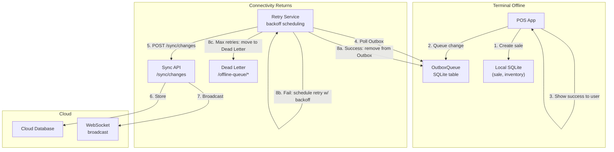
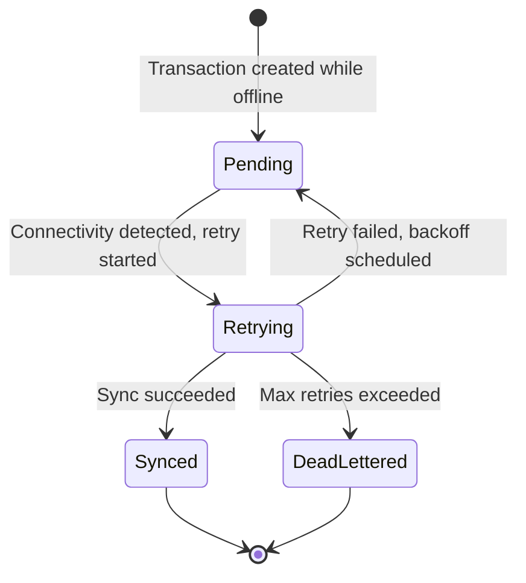
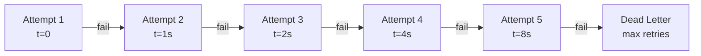
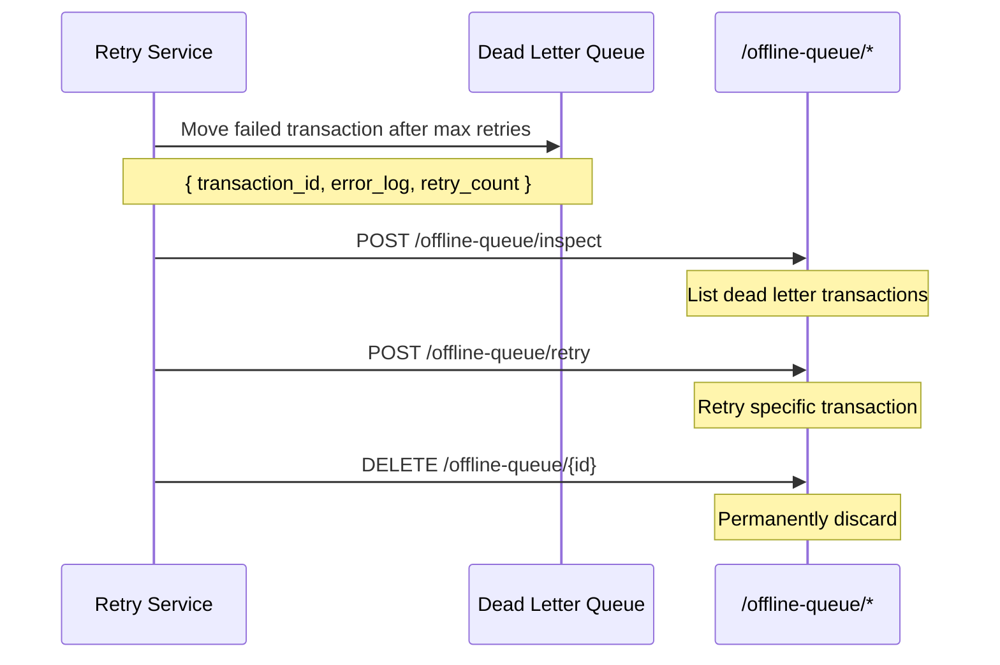

# Offline Queue — POS Case Study

> **Date:** 2026-08-31 | **Status:** Active
> **Scope:** Durable `OutboxQueue` + retry/backoff/dead-letter flush (`/offline-queue/*`) — queue transactions offline, sync when back online
> **Feature tracking:** [`feature-tracking/formint-pos.md`](../feature-tracking/formint-pos.md) § Multi-terminal Management
> **Related:** [`pos-multi-terminal-sync.md`](./pos-multi-terminal-sync.md), [`pos-qr-menu.md`](./pos-qr-menu.md)

---

## 1. Context

A POS terminal in a restaurant may lose network connectivity — Wi-Fi drops, cellular signal fades, router reboots. Sales must continue to work offline. When connectivity returns, queued transactions must sync reliably without duplicates or data loss.

**Constraints:**
- Sales must be created and stored locally while offline
- No data loss — every transaction must eventually sync
- No duplicates — retrying must be idempotent
- Retry with backoff — don't hammer the server on reconnect
- Dead-letter handling — some transactions may permanently fail (e.g., invalid data)

---

## 2. Architecture

### 2.1 Offline Transaction Flow




### 2.2 Outbox Queue Design




### 2.3 Retry with Exponential Backoff




### 2.4 Dead Letter Handling




---

## 3. Implementation

### 3.1 OutboxQueue Model

```python
# Simplified representation
class OutboxQueue(models.Model):
    transaction_type = models.CharField(...)  # sale, inventory, transfer
    payload = models.JSONField(...)            # The change data
    retry_count = models.IntegerField(default=0)
    next_retry_at = models.DateTimeField(...)  # Exponential backoff
    status = models.CharField(choices=[
        "pending", "retrying", "synced", "dead_lettered"
    ])
    created_at = models.DateTimeField(auto_now_add=True)
    error_log = models.JSONField(default=list)  # Last errors
```

### 3.2 Retry Service

```python
# Pseudocode — retry loop with exponential backoff
def retry_outbox():
    pending = OutboxQueue.objects.filter(
        status__in=["pending", "retrying"],
        next_retry_at__lte=now()
    )

    for txn in pending:
        try:
            response = post_sync_changes(txn.payload)
            if response.success:
                txn.status = "synced"
                txn.save()
            else:
                txn.retry_count += 1
                txn.next_retry_at = now() + exponential_backoff(txn.retry_count)
                txn.error_log.append(response.error)
                txn.save()
        except Exception as e:
            txn.retry_count += 1
            txn.next_retry_at = now() + exponential_backoff(txn.retry_count)
            txn.error_log.append(str(e))
            txn.save()

        if txn.retry_count >= MAX_RETRIES:
            txn.status = "dead_lettered"
            txn.save()
```

### 3.3 Dead Letter API

```python
# /offline-queue/inspect — list dead letter transactions
GET /offline-queue/inspect

# /offline-queue/retry — retry a specific dead letter
POST /offline-queue/retry
{ "transaction_id": "txn-123" }

# /offline-queue/{id} — discard permanently
DELETE /offline-queue/{id}
```

---

## 4. Results

### 4.1 What Works

| Outcome | Evidence |
|---------|----------|
| Offline sales creation | Sales created and stored locally while offline |
| Durable queue | OutboxQueue persists in SQLite, survives terminal restart |
| Automatic retry | Retry service polls and syncs when connectivity returns |
| Exponential backoff | Retry attempts space out to avoid server overload |
| Dead letter handling | Failed transactions surfaced for manual review |
| No data loss | Every transaction either syncs or goes to dead letter |

### 4.2 Reliability

| Scenario | Outcome |
|----------|---------|
| Terminal offline for 5 minutes | All transactions sync on reconnect |
| Terminal offline for 24 hours | Transactions queue, sync in batches on reconnect |
| Server unreachable during retry | Backoff increases, no log flooding |
| Invalid transaction data | Moves to dead letter after max retries |

---

## 5. Lessons Learned

### 5.1 Queue everything, not just sales

Inventory changes, transfers, and KDS ticket updates also need to queue offline. The OutboxQueue handles all transaction types uniformly.

**Lesson:** Define a single outbox for all syncable changes, not per-feature queues.

### 5.2 Exponential backoff prevents retry storms

Without backoff, reconnecting 10 terminals would send 10 simultaneous sync requests, potentially overwhelming the server. Exponential backoff spaces retries naturally.

**Lesson:** Always use exponential backoff for retry. Linear or constant retry is a DoS risk.

### 5.3 Dead letters are features, not bugs

Some transactions will permanently fail — invalid data, schema mismatches, corrupted payloads. Pushing these to a dead letter queue with full error logging lets operators inspect and retry them manually rather than losing them silently.

**Lesson:** Dead letter queue is essential for production reliability. Log everything.

---

## 6. Related Documentation

| Document | Path |
|----------|------|
| Feature tracking — Multi-branch Management | [`../feature-tracking/formint-pos.md`](../feature-tracking/formint-pos.md) § Multi-branch Management |
| Case study — Multi-terminal Sync | [./pos-multi-terminal-sync.md](./pos-multi-terminal-sync.md) |
| Case study — QR Menu | [./pos-qr-menu.md](./pos-qr-menu.md) |
| Case study — DataToken Sync Tagging | [./data-token-sync-tagging.md](./data-token-sync-tagging.md) |
| Feature roadmap | [`../../features/feature-roadmap.md`](../../features/feature-roadmap.md) |

---

## Remarks & Notes

- Offline Queue is part of Multi-branch Management (P0, Shipped)
- Community+ editions have durable OutboxQueue
- Retry service runs as a background task on the terminal
- Dead letter API is for operational use — not user-facing

<!-- AI-generated: review needed -->
