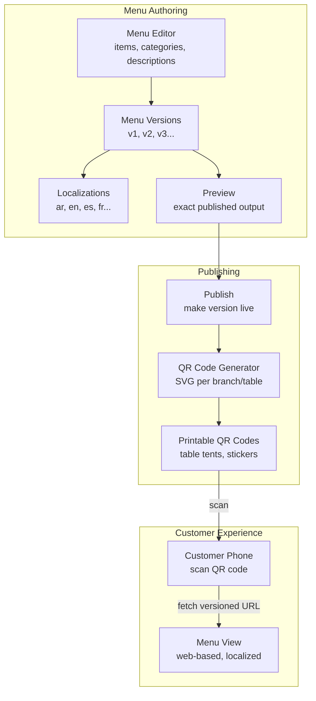
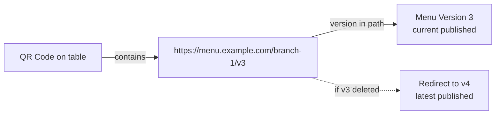
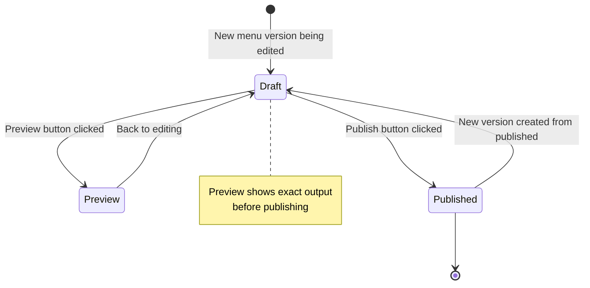
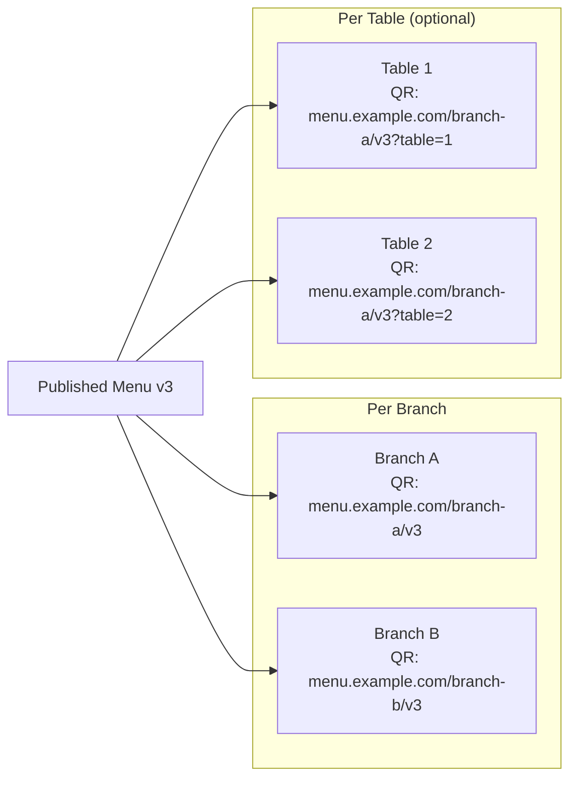

# QR Menu — POS Case Study

> **Date:** 2026-08-31 | **Status:** Active
> **Scope:** Versioned localized menu, preview/publish workflow, branch/table QR code generation
> **Feature tracking:** [`feature-tracking.md`](../feature-tracking.md) § QR Menu
> **Related:** [`pos-multi-terminal-sync.md`](./pos-multi-terminal-sync.md), [`pos-offline-queue.md`](./pos-offline-queue.md)

---

## 1. Context

Modern restaurants want customers to view menus via QR code — scan a code on the table, see the menu on their phone. The menu needs to be:

- **Localized** — multiple languages (Arabic, English, etc.)
- **Versioned** — update the menu without breaking active QR scans
- **Previewable** — see how it looks before publishing
- **Branch/table-specific** — different branches or tables may have different menus

**Constraints:**
- QR codes must be printable (table tents, stickers)
- Menu updates should not require re-printing QR codes (use versioned URLs)
- Preview must match published output exactly
- Localization must be manageable — not every dish needs every language

---

## 2. Architecture

### 2.1 Menu Versioning + QR Code Flow




### 2.2 Versioned URL Strategy




**Key insight:** QR codes contain versioned URLs. When the menu updates from v3 to v4, old QR codes still work — they redirect to the latest version. New QR codes are generated for v4.

### 2.3 Preview / Publish Workflow




### 2.4 Branch/Table QR Code Generation




---

## 3. Implementation

### 3.1 Menu Version Model

```python
# Simplified representation
class MenuVersion(models.Model):
    branch = models.ForeignKey(Branch, ...)
    version_number = models.IntegerField(...)
    status = models.CharField(choices=["draft", "published"])
    published_at = models.DateTimeField(null=True)

class MenuItem(models.Model):
    menu_version = models.ForeignKey(MenuVersion, ...)
    category = models.ForeignKey(MenuCategory, ...)
    name = models.JSONField(...)  # {"en": "Burger", "ar": "برجر"}
    description = models.JSONField(null=True)
    price = models.DecimalField(...)
    images = models.JSONField(default=list)  # image URLs
```

### 3.2 QR Code Generation

```python
# GET /qr/<branch_id>/<label> — generate QR SVG
# QR encodes: https://menu.example.com/{branch_slug}/v{version}

def generate_qr_svg(branch_slug: str, version: int, label: str = "") -> SVG:
    menu_url = f"https://menu.example.com/{branch_slug}/v{version}"
    qr = QRCode(menu_url)
    return qr.to_svg(label=label)  # SVG with optional text label
```

**Output:** SVG QR code suitable for printing. Optionally includes a text label below the QR (e.g., "Scan to view menu").

### 3.3 Preview Endpoint

```python
# GET /menu/preview/<menu_version_id>
# Returns exact HTML that will be served when published
# Same rendering pipeline as published menu
```

### 3.4 Localization Strategy

```python
# Menu item with localized fields
{
    "name": {"en": "Grilled Salmon", "ar": "سمك سالم مشوي", "es": "Salmón a la Plancha"},
    "description": {"en": "Fresh Atlantic salmon with lemon butter", "ar": "سمك سالم طازج مع زبدة الليمون"},
    "price": 24.99,
    "category": "main_course"
}
```

**Language detection:** The menu web view detects the customer's browser language and serves the appropriate localization. Falls back to English if the language is not available.

---

## 4. Results

### 4.1 What Works

| Outcome | Evidence |
|---------|----------|
| Multi-language menus | Arabic, English, Spanish, French supported |
| Versioned QR codes | QR codes contain versioned URLs — old codes work after updates |
| Preview before publish | Exact published output shown before going live |
| Per-branch QR codes | Each branch gets its own QR code |
| Per-table QR codes (optional) | Tables can have unique QR codes with table parameter |
| Printable SVG | QR codes generated as SVG for high-quality printing |

### 4.2 Menu Update Workflow

| Step | Action |
|------|--------|
| 1 | Edit menu items in admin |
| 2 | Create new version (v4) |
| 3 | Preview v4 — verify layout and localization |
| 4 | Publish v4 |
| 5 | Generate new QR codes for v4 |
| 6 | Old QR codes (v3) redirect to v4 automatically |

---

## 5. Lessons Learned

### 5.1 Versioned URLs > Re-printing QR codes

If QR codes contained a generic URL (no version), updating the menu would break active QR scans until new codes were printed and distributed. Versioned URLs mean:

- Old QR codes continue working (redirect to latest)
- New QR codes can be printed for the updated version
- No rush to replace table tents when menu changes

**Lesson:** Always version URLs in QR codes. The cost of printing new codes is less than the cost of breaking customer experience.

### 5.2 Preview must be pixel-exact

If the preview doesn't match what customers see after publishing, the preview is useless. The preview endpoint uses the same rendering pipeline as the published menu — there's no separate preview template.

**Lesson:** Preview = published output. No separate preview rendering path.

### 5.3 Localization is partial, not total

Translating every menu item into every language is expensive and often unnecessary. The system supports partial localization — show the available language, fall back to English (or another default) for missing translations.

**Lesson:** Support partial localization. Fall back gracefully rather than require full translation.

---

## 6. Related Documentation

| Document | Path |
|----------|------|
| Feature tracking — QR Menu | [`../feature-tracking.md`](../feature-tracking.md) § QR Menu |
| Case study — Multi-terminal Sync | [./pos-multi-terminal-sync.md](./pos-multi-terminal-sync.md) |
| Case study — Offline Queue | [./pos-offline-queue.md](./pos-offline-queue.md) |
| Case study — DataToken Sync Tagging | [./data-token-sync-tagging.md](./data-token-sync-tagging.md) |
| Feature roadmap | [`../../features/feature-roadmap.md`](../../features/feature-roadmap.md) |

---

## Remarks & Notes

- QR Menu is P0, Shipped in Professional edition
- QR codes are generated as SVG — print-ready
- Menu web view is responsive — works on phones
- Localization is JSON-based — easy to add languages

<!-- AI-generated: review needed -->
