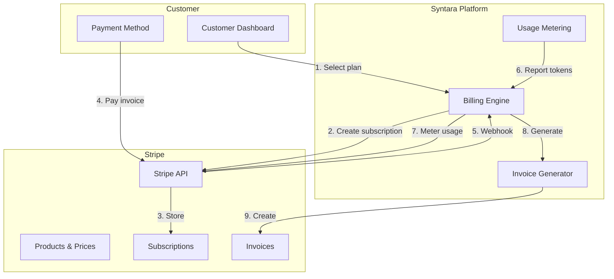
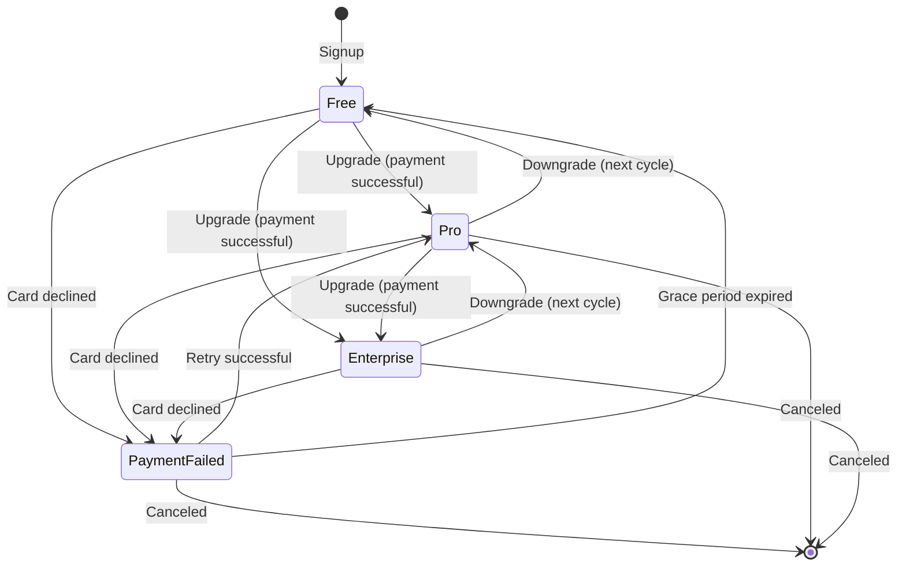
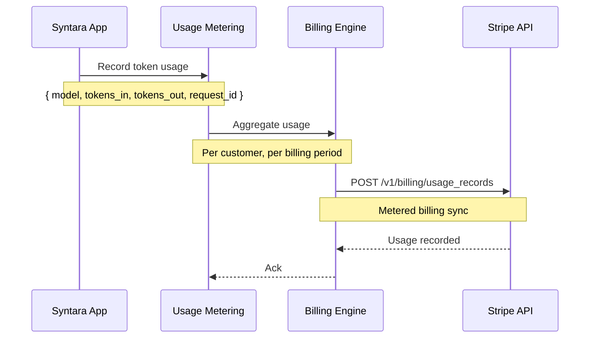

# Stripe Billing — Cypercloud/Syntara Case Study

> **Date:** 2026-08-31 | **Status:** Active | **Priority:** P0
> **Scope:** Subscription plan model (Free/Pro/Enterprise), Stripe integration, usage metering, invoice generation
> **Feature tracking:** [`feature-tracking.md`](../feature-tracking.md) § Stripe Billing

---

## 1. Context

The Syntara platform needs a monetization layer before it can sell anything. Without billing, there are no subscription tiers, no usage tracking for cost calculation, and no invoices for customers.

**Constraints:**
- Must support Free, Pro, and Enterprise plan tiers
- Usage-based billing for AI token consumption (metered billing)
- Invoices generated per billing cycle
- Stripe webhooks must handle plan changes, payment failures, and subscription lifecycle events

---

## 2. Architecture

### 2.1 Billing Flow Overview




### 2.2 Subscription Lifecycle




### 2.3 Usage Metering




---

## 3. Implementation

### 3.1 Plan Model

| Plan | Price | Features |
|------|-------|----------|
| Free | $0/mo | Limited requests, no custom templates |
| Pro | $X/mo | Higher limits, custom templates, basic support |
| Enterprise | Custom | Unlimited, dedicated support, SLA, white-label |

### 3.2 Stripe Integration Points

1. **Products & Prices** — Stripe product catalog mirrors plan tiers
2. **Subscription creation** — Customer selects plan, platform creates Stripe subscription
3. **Usage metering** — Token usage reported to Stripe metered billing
4. **Webhooks** — Handle `customer.subscription.updated`, `invoice.payment_succeeded`, `invoice.payment_failed`

### 3.3 Webhook Handling

```python
# Stripe webhook events handled:
WEBHOOK_EVENTS = [
    "customer.subscription.created",
    "customer.subscription.updated",
    "customer.subscription.deleted",
    "invoice.payment_succeeded",
    "invoice.payment_failed",
    "invoice.upcoming",
]

# Each event updates local subscription state
# Idempotency keys prevent double-processing
```

### 3.4 Invoice Generation

- Stripe generates invoices per billing cycle
- Platform downloads invoice PDFs from Stripe
- Invoice history available in customer dashboard

---

## 4. Results

### 4.1 What Works

| Outcome | Evidence |
|---------|----------|
| Plan tiers configurable | Free/Pro/Enterprise defined in Stripe |
| Usage-based billing | Token usage metered per customer |
| Invoice generation | Stripe invoices + platform PDF download |
| Webhook reliability | Idempotent handlers, retry on failure |

### 4.2 Integration Points

| Integration | Direction | Purpose |
|-------------|-----------|--------|
| Stripe Products API | Platform → Stripe | Create/update plan catalog |
| Stripe Subscription API | Platform → Stripe | Create/manage subscriptions |
| Stripe Metered Billing | Platform → Stripe | Report usage |
| Stripe Webhooks | Stripe → Platform | Event notifications |
| Stripe Invoice API | Platform → Stripe | Download invoices |

---

## 5. Lessons Learned

### 5.1 Webhook idempotency is critical

Stripe may deliver the same webhook multiple times. Handlers must be idempotent — use event IDs to deduplicate.

**Lesson:** Store processed webhook event IDs, skip duplicates.

### 5.2 Usage metering must be eventually consistent

Token usage happens continuously. Syncing to Stripe every request would be too slow. Batch usage and sync periodically.

**Lesson:** Aggregate usage locally, sync to Stripe in batches.

### 5.3 Plan changes affect billing mid-cycle

Upgrades/downgrades may prorate. The platform must handle prorated charges correctly and reflect them in invoices.

**Lesson:** Let Stripe handle proration, sync the result to local state.

---

## 6. Related Documentation

| Document | Path |
|----------|------|
| Feature tracking — Stripe Billing | [`../feature-tracking.md`](../feature-tracking.md) § Stripe Billing |
| Case study — API Token Management | [./api-token-management.md](./api-token-management.md) |
| Feature roadmap — Syntara | [`../../features/feature-roadmap.md`](../../features/feature-roadmap.md) |
| Syntara product docs | [`../../projects/syntara/`](../../projects/syntara/) |

---

## Remarks & Notes

- Stripe Billing is P0 for Syntara — blocks Customer Dashboard and System Templates
- Usage metering is tied to AI token consumption
- Webhook handlers must be idempotent
- Invoice PDF download from Stripe

<!-- AI-generated: review needed -->
