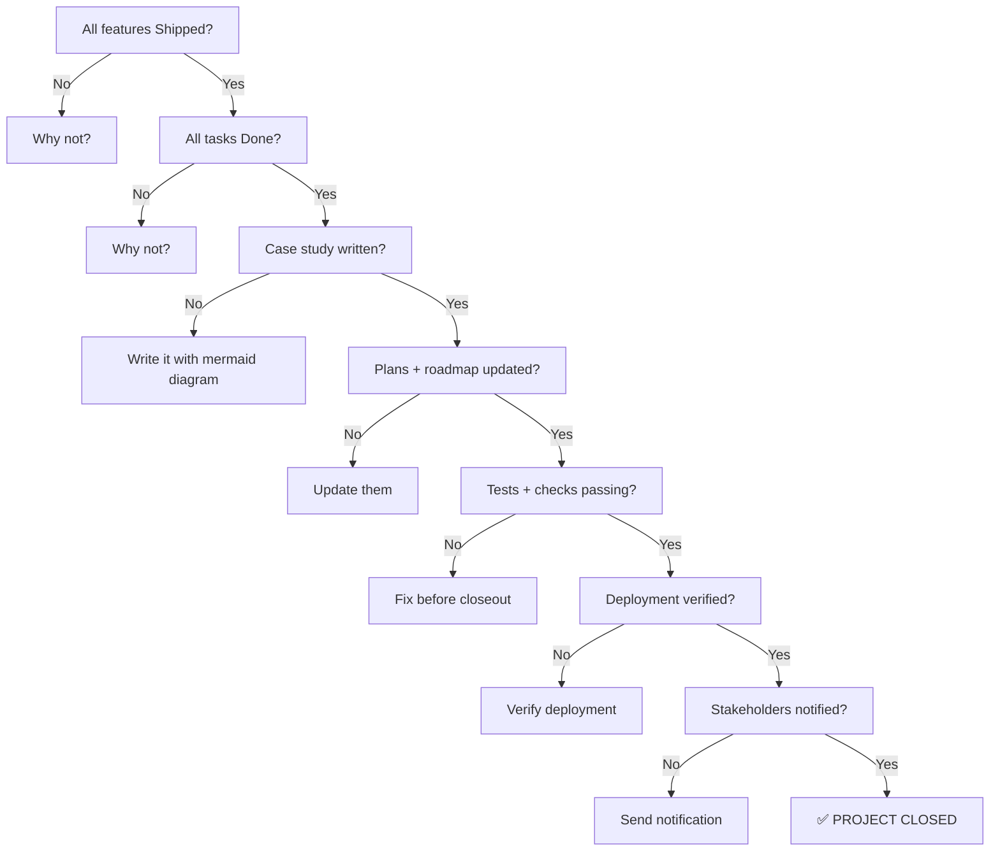

# 🏁 Completion Checklist — Project Closeout & Definition of Done

> **Purpose:** The gate between "we finished coding" and "the project is officially complete." Run through every item before closing a project or marking a major feature set as Shipped.
> **Last updated:** 2026-08-31

---

## ✅ Definition of Done

A project or feature set is **Done** when:

1. All planned features are marked **Shipped** in `feature-tracking.md`
2. All tasks are marked **Done** in `task-tracking.md`
3. A case study exists in `case-studies.md` with at least one mermaid diagram
4. The plans registry (`plans/README.md`) is updated with the outcome
5. The feature roadmap (`features/feature-roadmap.md`) reflects the shipped state
6. Documentation has been validated
7. Stakeholders have been notified

---

## 📋 Closeout Checklist

### 1. Feature Status

| Check | Status | Notes |
|-------|:------:|-------|
| All features marked **Shipped** in `feature-tracking.md` | ⬜ / ✅ | |
| No features left in **In Progress** or **Review** | ⬜ / ✅ | If any remain, why? |
| Feature roadmap updated to reflect shipped state | ⬜ / ✅ | |
| Priority rankings still accurate | ⬜ / ✅ | |

### 2. Task Status

| Check | Status | Notes |
|-------|:------:|-------|
| All tasks marked **Done** in `task-tracking.md` | ⬜ / ✅ | |
| No tasks left in **In Progress** or **Review** | ⬜ / ✅ | If any remain, why? |
| Blocked tasks resolved or explicitly deferred | ⬜ / ✅ | |
| Action items from retrospectives addressed | ⬜ / ✅ | |

### 3. Documentation

| Check | Status | Notes |
|-------|:------:|-------|
| Case study written in `case-studies.md` | ⬜ / ✅ | |
| Case study includes at least one mermaid diagram | ⬜ / ✅ | Architecture, flow, or state diagram |
| Case study covers: context, implementation, results, lessons | ⬜ / ✅ | |
| Plans registry updated (`plans/README.md`) | ⬜ / ✅ | Add entry or update status |
| Related plan documents updated | ⬜ / ✅ | |
| Team notes record the completion decision | ⬜ / ✅ | Entry in `team-notes.md` |
| Frontmatter valid on all new/updated docs | ⬜ / ✅ | Run `npm run validate-content` |

### 4. Quality Verification

| Check | Status | Notes |
|-------|:------:|-------|
| Tests passing (pytest / cargo test / playwright as applicable) | ⬜ / ✅ | |
| Linting clean (ruff / cargo clippy / eslint as applicable) | ⬜ / ✅ | |
| Type checks clean (if applicable) | ⬜ / ✅ | |
| Deployment verified (staging or production) | ⬜ / ✅ | |
| No known critical bugs | ⬜ / ✅ | |

### 5. Stakeholder Communication

| Check | Status | Notes |
|-------|:------:|-------|
| Team notified of completion | ⬜ / ✅ | |
| Stakeholders notified (if applicable) | ⬜ / ✅ | |
| User-facing docs updated (if applicable) | ⬜ / ✅ | |
| Release notes written (if applicable) | ⬜ / ✅ | |

### 6. Post-Completion

| Check | Status | Notes |
|-------|:------:|-------|
| Ongoing maintenance owner assigned | ⬜ / ✅ | |
| Monitoring/alerts configured (if applicable) | ⬜ / ✅ | |
| Follow-on features noted in roadmap | ⬜ / ✅ | |
| Project files archived or left in place per lifecycle policy | ⬜ / ✅ | |

---

## 🏆 Sign-off

```
Project: [Project / Feature Set Name]
Completed by: @person
Date: YYYY-MM-DD
Sprint: [Sprint number or "standalone"]

All checklist items above are confirmed:
- [ ] Features Shipped
- [ ] Tasks Done
- [ ] Case study written with diagrams
- [ ] Plans + roadmap updated
- [ ] Documentation validated
- [ ] Tests + checks passing
- [ ] Deployment verified
- [ ] Stakeholders notified
- [ ] Ongoing owner assigned

Sign-off: _________________  Date: _________
```

---

## 🔄 Using This Checklist

### Before a project closeout meeting

1. **Pre-fill the checklist** — Go through each item and mark ⬜ or ✅
2. **Note gaps** — Any item that's not ✅ needs a plan
3. **Bring the checklist to the closeout meeting** — Use it as the agenda

### During the closeout meeting

1. **Review each section** — Confirm or dispute each checkbox
2. **Resolve gaps** — Create tasks for anything not done
3. **Make the sign-off decision** — All ✅ means you can close

### After closeout

1. **Record the decision** in `team-notes.md`
2. **Archive or update tracking files** per lifecycle policy
3. **Celebrate** — you shipped something

---

## 📊 Completion Checklist Flow




---

## 🔗 Related

| Topic | Path |
|-------|------|
| Feature tracking (verify all Shipped) | [./feature-tracking.md](./feature-tracking.md) |
| Case studies (write one per shipped feature) | [./case-studies.md](./case-studies.md) |
| Task tracking (verify all Done) | [./task-tracking.md](./task-tracking.md) |
| Meeting agenda (project closeout template) | [./meeting-agenda.md](./meeting-agenda.md) |
| Team notes (record the decision) | [./team-notes.md](./team-notes.md) |
| Plans registry (update with outcome) | [`../plans/README.md`](../plans/README.md) |
| Document lifecycle (archive policy) | [`../plans/document-lifecycle.md`](../plans/document-lifecycle.md) |

---

## Remarks & Notes

- The checklist is a minimum bar — add project-specific items as needed
- "Shipped" means deployed AND verified, not just merged to main
- A case study without a mermaid diagram is incomplete — the diagram is what makes it useful for the team
- If you can't check an item, don't close the project — create a task and resolve it first
- The sign-off is not just a formality — it's the team's agreement that the project is complete

<!-- AI-generated: review needed -->
