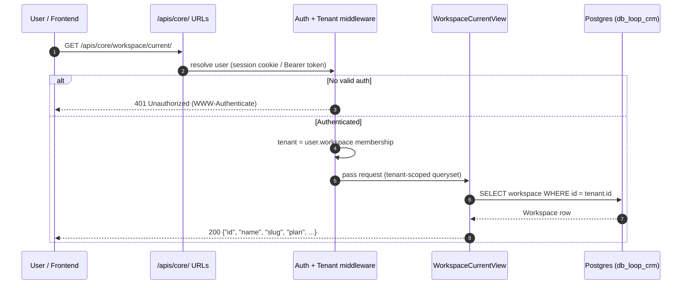
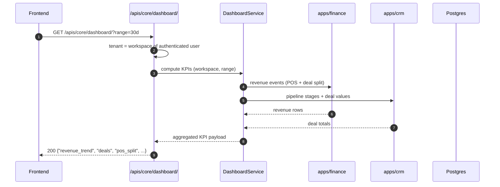
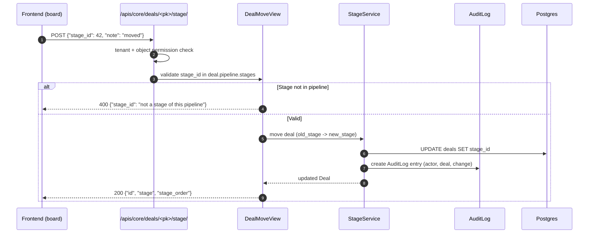
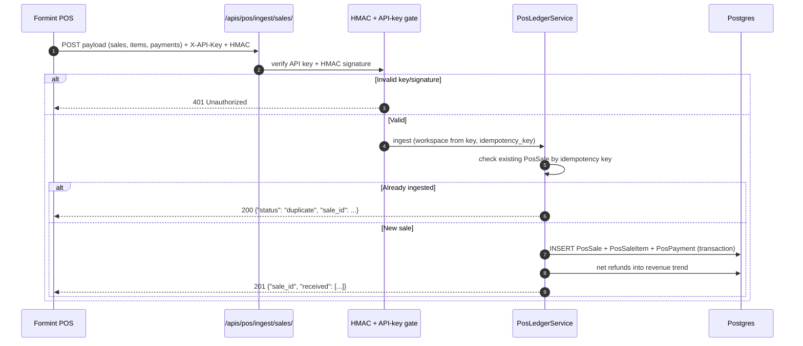
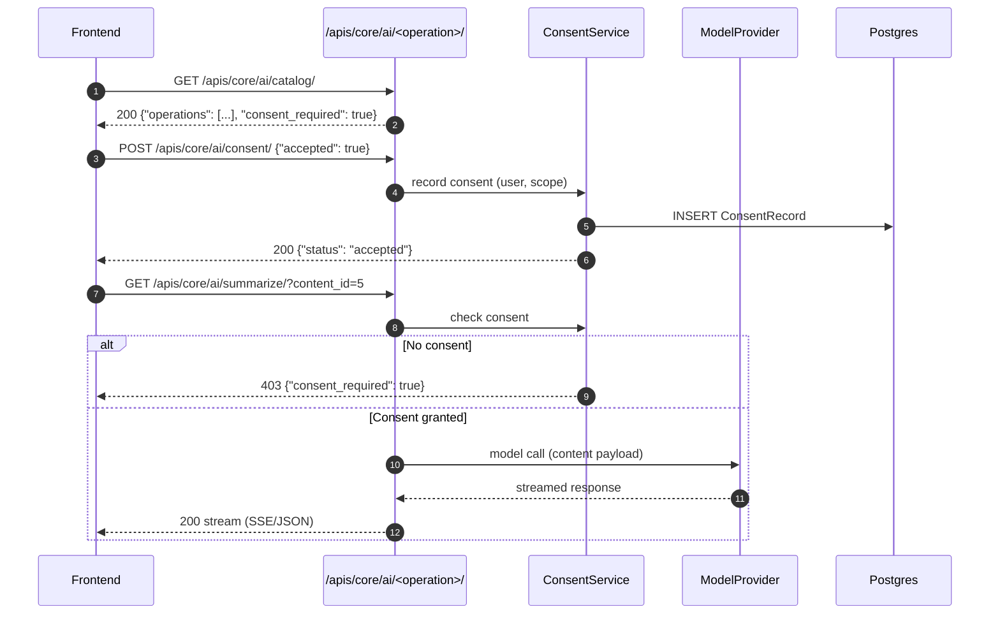
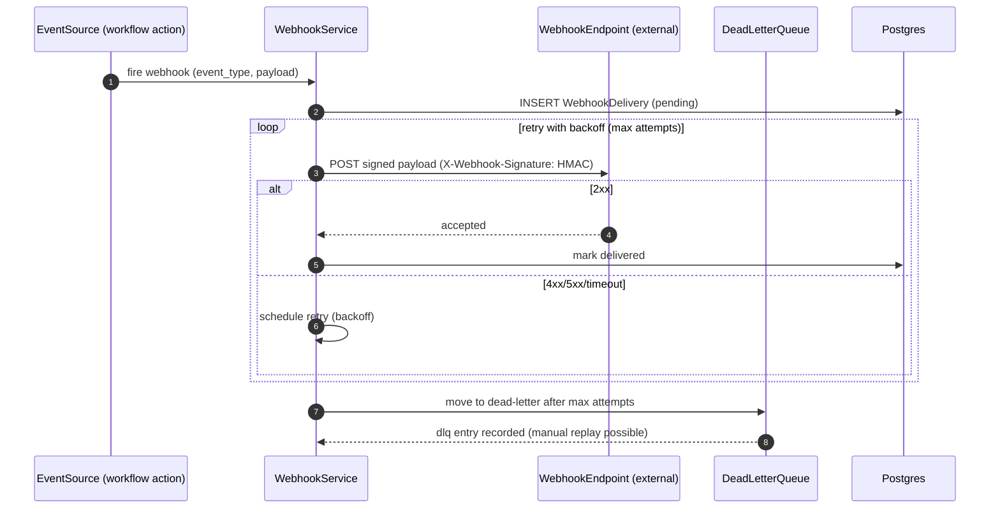

# 🔄 Loop-CRM API Request Flows — UML Sequence Diagrams

> **Purpose:** Define the request/response lifecycle of the Loop-CRM data API
> surface (`/apis/core/`, `/apis/pos/`, `/apis/finance/`, `/apis/billing/`),
> including auth, tenant resolution, and error paths.
> **Status:** Active · **Owner:** Loop-CRM backend

---

## 1. Workspace discovery — `GET /apis/core/workspace/current/`

The WebSocket island and every tenant-scoped call first resolve the caller's
workspace. Auth via session cookie or `Authorization: Bearer`; the tenant is
derived from the authenticated user's membership — never from the client.

**Request contract**

| Field | Value |
|-------|-------|
| **Method + path** | `GET /apis/core/workspace/current/` |
| **Auth** | Session cookie or `Authorization: Bearer <token>` |
| **Tenant source** | Server-derived from the authenticated user |
| **Success** | `200` — workspace JSON (id, name, slug, plan, settings) |
| **Failure** | `401` unauthenticated · `403` no workspace membership |
| **Headers** | Optional `Accept: application/json`; never trusts client tenant headers |

---

## 2. Dashboard KPIs — `GET /apis/core/dashboard/`

RevOps KPIs: revenue trend, deal pipeline totals, POS + deal split. Uses the
tenant-scoped workspace from request 1.

---

## 3. Deal stage move — `POST /apis/core/deals/<pk>/stage/`

Kanban drag-and-drop. Validates the target stage belongs to the deal's pipeline
and records the change in the audit log.

---

## 4. POS sale ingestion — `POST /apis/pos/ingest/sales/`

Idempotent ingestion from Formints POS. Protected by `X-API-Key` (server secret)
and HMAC-signed payloads; retries use the same idempotency key.

---

## 5. AI operation — `GET /apis/core/ai/<operation>/`

AI endpoints (catalog, consent, per-operation) require explicit user consent.
The consent gate runs before any model call; responses stream when the
operation supports it.

---

## 6. Webhook delivery — outbound `apps/core` webhooks

Webhooks are signed with HMAC and retried with exponential backoff into a
dead-letter queue after max attempts.

---

## Endpoint map

| Road | Endpoint | Method | Auth | Notes |
|------|----------|--------|------|-------|
| `/apis/core/` | `workspace/current/` | GET | session/bearer | tenant discovery |
| `/apis/core/` | `dashboard/` | GET | session/bearer | RevOps KPIs |
| `/apis/core/` | `reports/` | GET | session/bearer | report catalog |
| `/apis/core/` | `ai/` · `ai/consent/` · `ai/<op>/` | GET/POST | session/bearer + consent | AI gate |
| `/apis/core/` | `employees/` · `employees/<pk>/report/` | GET | session/bearer | HR surface |
| `/apis/core/` | `search/` | GET | session/bearer | global search |
| `/apis/core/` | `badges/` | GET | session/bearer | sidebar counters |
| `/apis/core/` | `locale/` | GET | session/bearer | i18n |
| `/apis/core/` | `board/` | GET | session/bearer | kanban payload |
| `/apis/core/` | `deals/<pk>/stage/` | POST | session/bearer | move deal |
| `/apis/pos/` | `ingest/sales/` | POST | API key + HMAC | idempotent POS ingestion |
| `/apis/billing/` | plan/account/seat surface | GET/POST | session/bearer | billing road |

> The legacy `/api/v1/` copies remain readable but carry
> `Deprecation/Sunset` headers via `APIV1DeprecationMiddleware` — new callers
> must use the `/apis/*` roads.

<!-- AI-generated: review needed -->