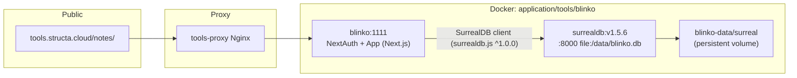
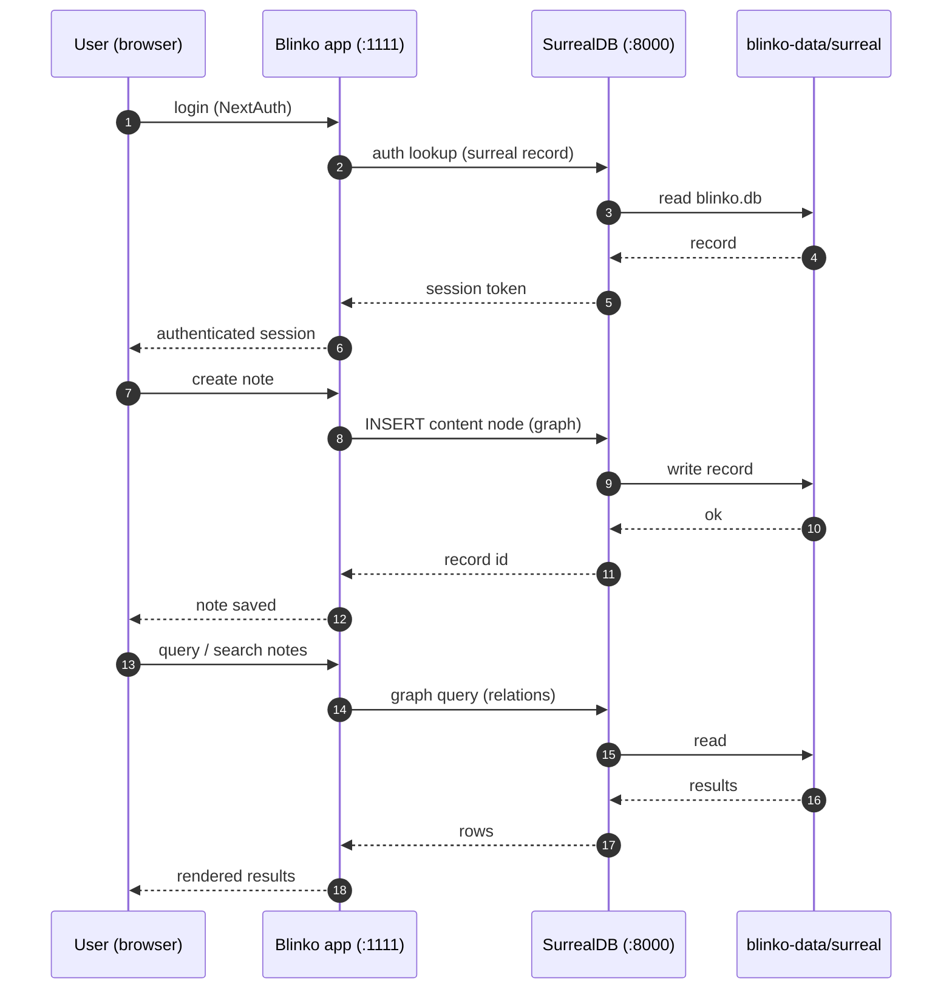

# 🗒️ Blinko — SurrealDB Topology & Data Flow

> **Purpose:** Document the self-hosted Blinko AI-notes service
> (`application/tools/blinko/`) — service topology, the SurrealDB storage
> layer, and how auth/content/query flow through it.
> **Status:** Active · **Owner:** Infrastructure

---

## 1. Service topology

## 2. Data flow — auth, content graph, queries

## 3. SurrealDB migration (M1–M4)

Per the Compose header, Blinko migrated off Prisma + PostgreSQL onto SurrealDB:

| Migration | What changed |
|-----------|--------------|
| **M1** | Auth moved to SurrealDB records |
| **M2** | Content graph (notes, links, tags) moved to SurrealDB |
| **M3** | Query engine moved to SurrealDB |
| **M4** | PostgreSQL no longer required at runtime |

**Constraints to respect:**
- **Pin SurrealDB to the 1.x line** — the bundled server pins
  `surrealdb.js@^1.0.0`, which rejects v2/v3 engines
  (`UnsupportedVersion`).
- `server/lib/scheduler.ts` uses v1-compatible upsert semantics
  (`UPDATE ... MERGE` on an explicit record ID).
- The `surrealdb` image is shell-less (scratch) — readiness uses the binary's
  built-in `/surreal isready` probe, not `wget`/`curl`.
- Credentials come from `.env` (`SURREALDB_PASS`, `BLINKO_NEXTAUTH_SECRET`, …).

## 4. Related

- Compose + Makefile: `application/tools/blinko/`
- Database registry: `application/databases/README.md` (`blinko` database row)
- Docs quickstart: `docs/guides/01-quickstart.md` (Blinko Notes service)

<!-- AI-generated: review needed -->