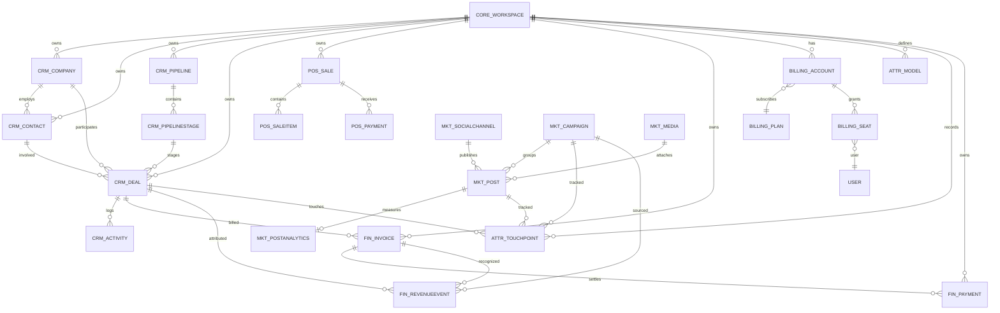

# 🐍 Django Model ERD — Loop-CRM

> **Purpose:** Canonical ERD of the Loop-CRM Django models
> (`projects/loop-crm/backend/apps/`), showing every app's models and their
> relations. Rendered from the model source (django-extensions-style output).
> **Status:** Active · **Owner:** Loop-CRM backend

---

## 1. Rendered ERD

## 2. Apps, models, and relations

### `apps/core` — workspace + platform primitives

| Model | Key relations |
|-------|---------------|
| `Workspace` | root tenant — every domain model FKs here |
| `UserProfile` | 1—1 `auth.User` (profile fields) |
| `AuditLog` | actor + target (generic) |
| `WorkflowDefinition` / `WorkflowRun` / `TaskExecution` | workflow engine |
| `SavedView`, `Webhook`, `WebhookDelivery` | UI + outbound webhooks |
| `EmailAccount`, `EmailMessage` | email sync |

### `apps/crm` — core CRM domain

| Model | Key relations |
|-------|---------------|
| `Company` | `workspace`, `owner`(User) |
| `Contact` | `workspace`, `company`, `owner` |
| `Pipeline` | `workspace` |
| `PipelineStage` | `pipeline` |
| `Deal` | `workspace`, `company`, `contact`, `pipeline`, `stage`, `campaign`, `owner` |
| `Activity` | `workspace`, `deal`, `contact`, `created_by` |
| `CustomFieldDefinition`, `CustomObjectDefinition` | `workspace` |

### `apps/pos` — POS ledger

| Model | Key relations |
|-------|---------------|
| `PosSale` | `workspace`, `contact` |
| `PosSaleItem` | `pos_sale` |
| `PosPayment` | `pos_sale` |

### `apps/finance` — invoicing + revenue

| Model | Key relations |
|-------|---------------|
| `Invoice` | `workspace`, `company`(PROTECT), `contact`, `deal`, `created_by` |
| `Payment` | `workspace`, `invoice`(PROTECT), `created_by` |
| `RevenueEvent` | `workspace`, `deal`, `campaign`, `invoice` |

### `apps/billing` — SaaS billing

| Model | Key relations |
|-------|---------------|
| `Plan` | standalone (Free/Pro/Enterprise) |
| `BillingAccount` | 1—1 `workspace`, `plan` |
| `Seat` | `workspace`, `user` |

### `apps/attribution` — marketing attribution

| Model | Key relations |
|-------|---------------|
| `AttributionModel` | `workspace` |
| `AttributionTouchpoint` | `workspace`, `deal`(CASCADE), `post`, `campaign` |

### `apps/marketing` — social publishing

| Model | Key relations |
|-------|---------------|
| `SocialChannel` | `workspace` |
| `Campaign` | `workspace`, `owner` |
| `Media` | `workspace` |
| `Post` | `workspace`, `campaign`, `channel`, `media`, `created_by` |
| `PostAnalytics` | 1—1 `post` |

## 3. Tenant isolation rule

Every domain model carries a `workspace` FK; all service/queryset reads filter
by the authenticated user's workspace — the same rule the API sequence diagrams
assume (`/apis/core/workspace/current/` is the tenant discovery call).

## 4. How this was produced

The ERD above mirrors what `django-extensions` `graph_models` would emit from
the model source. The mermaid block is the editable source; the rendered SVG
(`/agenda/diagrams/diagrams-django-loop-crm-er-1.svg`) is what gets embedded elsewhere.

<!-- AI-generated: review needed -->