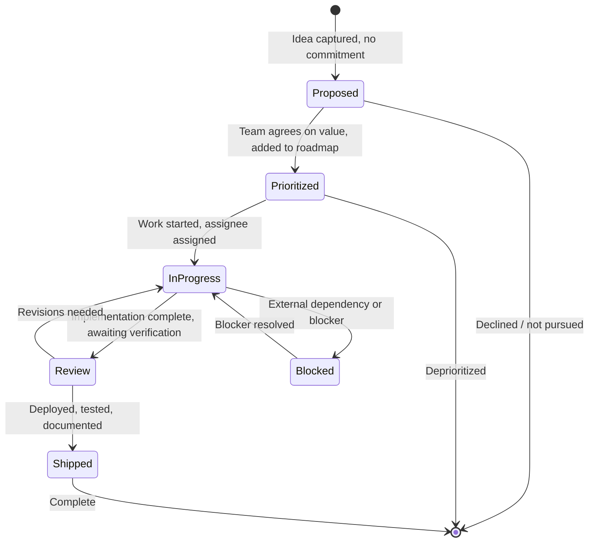

# 🎯 Feature Tracking — Lifecycle from Idea to Shipped

> **Purpose:** Track every feature through its full lifecycle: Proposed → Prioritized → In Progress → Review → Shipped. Aligns with the priority roadmap and plans registry.
> **Structure:** This is the hub — lifecycle, status definitions, and the entry template. Each product's features live in its own file under [`feature-tracking/`](./feature-tracking/).
> **Last updated:** 2026-09-12

---

## 🔄 Feature Status Lifecycle




### Status definitions

| Status | Meaning | Owner action |
|--------|---------|--------------|
| **Proposed** | Idea captured, not yet committed | Write a short description + why it matters |
| **Prioritized** | Team agreed it's worth doing, on roadmap | Assign priority (P0/P1/P2/P3), rough scope |
| **In Progress** | Active development | Assignee, estimate, target sprint |
| **Review** | Implementation done, needs verification | QA/testing, doc review, stakeholder sign-off |
| **Shipped** | Deployed and verified | Update roadmap, write case study, close task |
| **Blocked** | Cannot proceed due to external factor | Document blocker,owner, workaround if any |

---

## 📝 Feature Entry Template

Copy this into the product file under `feature-tracking/` — not into this hub.

```markdown
### Feature Name

| Field | Value |
|-------|-------|
| **Status** | Proposed / Prioritized / In Progress / Review / Shipped / Blocked |
| **Priority** | P0 / P1 / P2 / P3 |
| **Product** | Precis / POS / Syntara / CTC / django-fusion / Infra |
| **Owner** | @team-member |
| **Target** | Sprint X / Quarter X / Backlog |
| **Blocked by** | (if any) |
| **Depends on** | (if any) |

**Why it matters:** One sentence on the value.

**Scope:** What's in scope for this feature version.

**Out of scope:** What's explicitly not included.

**Acceptance criteria:**
- [ ] Criterion 1
- [ ] Criterion 2
- [ ] Criterion 3

**Notes:** Lessons, decisions, links to plans, case study reference.
```

---

## 📋 Active Feature Tracking

Features are split per product. Each section below is a pointer to that product's file — nothing is tracked in this hub.

### Cypercloud / Syntara Platform

[`feature-tracking/syntara.md`](./feature-tracking/syntara.md) — billing, API tokens, customer dashboard, templates, and AI capabilities.

### Formint POS

[`feature-tracking/formint-pos.md`](./feature-tracking/formint-pos.md) — launch scope shipped across the POS editions; no P2 planned.

### Precis (precis-main) — LMS

[`feature-tracking/precis-main.md`](./feature-tracking/precis-main.md) — unified LMS + landing platform, core shipped; course features queued.

### Precis Landing

[`feature-tracking/precis-landing.md`](./feature-tracking/precis-landing.md) — legacy marketing/catalog site, live.

### CTC Research Center

[`feature-tracking/ctc-research.md`](./feature-tracking/ctc-research.md) — live publication site; publish gates pending.

### Portfolio (Resume Builder) — Legacy

[`feature-tracking/portfolio.md`](./feature-tracking/portfolio.md) — legacy planning entries, kept for reference. Do not add new features.

### Infrastructure

[`feature-tracking/infrastructure.md`](./feature-tracking/infrastructure.md) — security, backups, observability, and deployment reliability.

### django-fusion (Component Framework)

[`feature-tracking/django-fusion.md`](./feature-tracking/django-fusion.md) — sync tagging shipped; MCP integration and component tooling in flight.

### Loop-CRM

[`feature-tracking/loop-crm.md`](./feature-tracking/loop-crm.md) — finished milestones across finance, demo state, research, and the AI hub.

---

## ✅ Shipped — Milestone Roll-up

Every completed plan is recorded as a ✅ Shipped milestone in its product file. Those files are the finished-milestone log:

| Product | Milestones |
|---------|------------|
| Formint POS | [`formint-pos.md`](./feature-tracking/formint-pos.md) — launch scope (multi-branch, KDS, QR menu, loyalty, API access, mobile waiter, gaming, gift cards, tables, delivery, forecasting, scheduling, customer display, kiosk, cloud dashboard, sync tagging) |
| Precis (precis-main) | [`precis-main.md`](./feature-tracking/precis-main.md) § ✅ Shipped — unified Precis platform |
| Precis Landing | [`precis-landing.md`](./feature-tracking/precis-landing.md) § ✅ Shipped — live site |
| CTC Research Center | [`ctc-research.md`](./feature-tracking/ctc-research.md) § ✅ Shipped — live site |
| django-fusion | [`django-fusion.md`](./feature-tracking/django-fusion.md) § ✅ Shipped — DataToken sync tagging |
| Loop-CRM | [`loop-crm.md`](./feature-tracking/loop-crm.md) § ✅ Shipped — finance integration, demo state, Twenty/Postiz research, AI hub |

> **Recording a finished plan:** add the milestone to the product file, note the closeout decision in [`team-notes.md`](./team-notes.md), then delete the plan file — git history is the archive. See [`CONTENT_MODEL.md`](./CONTENT_MODEL.md) § lifecycle contract.

---

## 🔄 Keeping This in Sync

1. **When a feature moves to Shipped:**
   - Update status in the product's file under `feature-tracking/`
   - Add entry to `case-studies.md` with architecture diagram
   - Update `features/feature-roadmap.md` priority table
   - Create or update plan entry in `plans/README.md`
   - Mark related task in `task-tracking.md` as complete

2. **When a new feature is proposed:**
   - Add entry to the product's file with status `Proposed`
   - Add to `features/feature-roadmap.md` under appropriate priority
   - Discuss in next sprint planning

3. **When priorities shift:**
   - Update both the product file and `features/feature-roadmap.md`
   - Note the reason in `team-notes.md`

4. **When a new product appears:**
   - Add a file under `feature-tracking/` and a pointer section in this hub

---

## 🔗 Related

| Topic | Path |
|-------|------|
| Priority roadmap | [`../features/feature-roadmap.md`](../features/feature-roadmap.md) |
| Feature inventory | [`../features/README.md`](../features/README.md) |
| Plans registry | [`../plans/README.md`](../plans/README.md) |
| Task tracking | [./task-tracking.md](./task-tracking.md) |
| Case studies | [./case-studies.md](./case-studies.md) |
| Completion checklist | [./completion-checklist.md](./completion-checklist.md) |

---

## Remarks & Notes

- Features are split per product — this hub holds the lifecycle contract and the index only
- Status values are lowercase in the template but emoji-prefixed in tables for readability
- Priority alignment with `feature-roadmap.md` is mandatory — drift causes confusion
- "Shipped" means deployed AND verified, not just merged
- Blocked features should have a documented blocker and owner in the Notes column

<!-- AI-generated: review needed -->
