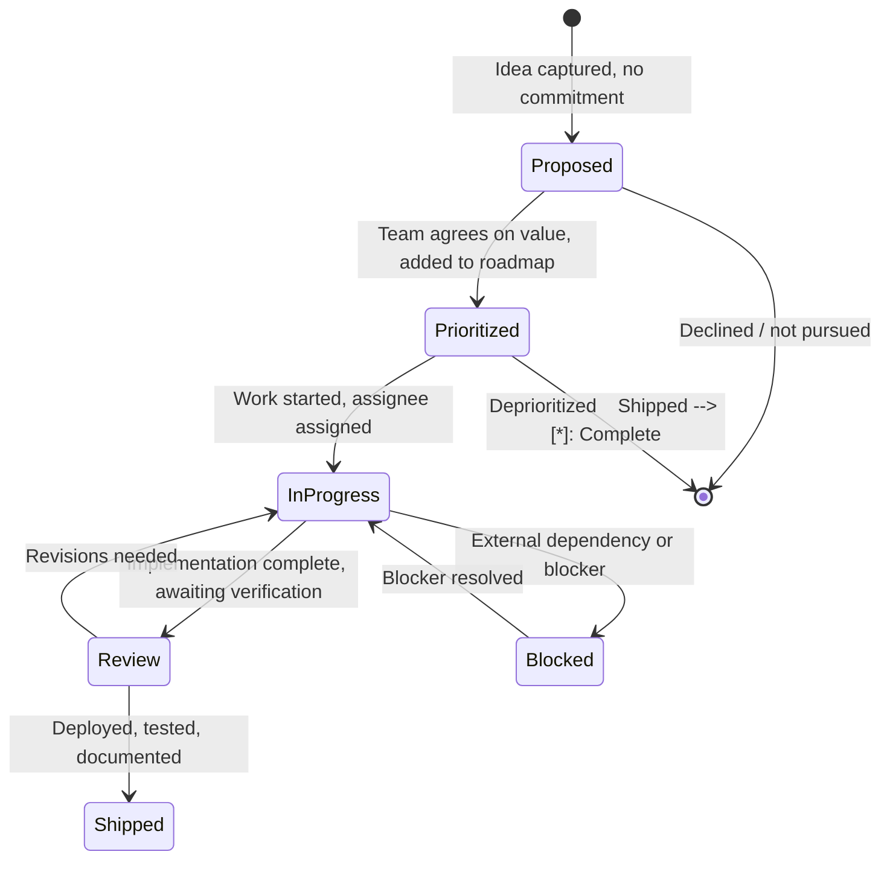

# 🎯 Feature Tracking — Lifecycle from Idea to Shipped

> **Purpose:** Track every feature through its full lifecycle: Proposed → Prioritized → In Progress → Review → Shipped. Aligns with the priority roadmap and plans registry.
> **Last updated:** 2026-09-01

---

## 🔄 Feature Status Lifecycle




### Status definitions

| Status | Meaning | Owner action |
|--------|---------|--------------|
| **Proposed** | Idea captured, not yet committed | Write a short description + why it matters |
| **Prioritized** | Team agreed it's worth doing, on roadmap | Assign priority (P0/P1/P2/P3), rough scope |
| **In Progress** | Active development | Assignee, estimate, target sprint |
| **Review** | Implementation done, needs verification | QA/testing, doc review, stakeholder sign-off |
| **Shipped** | Deployed and verified | Update roadmap, write case study, close task |
| **Blocked** | Cannot proceed due to external factor | Document blocker,owner, workaround if any |

---

## 📝 Feature Entry Template

```markdown
### Feature Name

| Field | Value |
|-------|-------|
| **Status** | Proposed / Prioritized / In Progress / Review / Shipped / Blocked |
| **Priority** | P0 / P1 / P2 / P3 |
| **Product** | Precis / POS / Syntara / CTC / django-fusion / Infra |
| **Owner** | @team-member |
| **Target** | Sprint X / Quarter X / Backlog |
| **Blocked by** | (if any) |
| **Depends on** | (if any) |

**Why it matters:** One sentence on the value.

**Scope:** What's in scope for this feature version.

**Out of scope:** What's explicitly not included.

**Acceptance criteria:**
- [ ] Criterion 1
- [ ] Criterion 2
- [ ] Criterion 3

**Notes:** Lessons, decisions, links to plans, case study reference.```

---

## 📋 Active Feature Tracking

### Cypercloud / Syntara Platform

#### P0 — In Development (Q3 2026)

**Stripe Billing**

| Field | Value |
|-------|-------|
| **Status** | 🟡 In Progress |
| **Priority** | P0 |
| **Product** | Syntara |
| **Owner** | TBD |
| **Target** | Q3 2026 |
| **Depends on** | — |

**Why it matters:** Subscription plans (Free, Pro, Enterprise), usage-based billing, and invoices — this is the monetization foundation for the platform.

**Scope:** Subscription plan model, Stripe integration, usage metering, invoice generation.

**Out of scope:** Usage analytics dashboard (tracked separately), refund handling.

**Acceptance criteria:**
- [ ] Free/Pro/Enterprise plan tiers configurable
- [ ] Usage-based billing with metered billing
- [ ] Invoice generation and PDF download
- [ ] Webhook handling for Stripe events

**Notes:** Highest priority — blocks System Templates and Customer Dashboard.

**Case study:** [`case-studies/stripe-billing.md`](./case-studies/stripe-billing.md)

---

**API Token Management

| Field | Value |
|-------|-------|
| **Status** | 🟡 In Progress |
| **Priority** | P0 |
| **Product** | Syntara |
| **Owner** | TBD |
| **Target** | Q3 2026 |
| **Depends on** | — |

**Why it matters:** Generate, rotate, and revoke API tokens with scoped permissions — essential for developer access and integrations.

**Scope:** Token model with scopes, generate/rotate/revoke actions, token list UI.

**Out of scope:** OAuth provider integration, token usage analytics.

**Acceptance criteria:**
- [ ] Token creation with scope selection
- [ ] Token rotation with old token invalidation
- [ ] Token revocation
- [ ] Scoped permissions enforced on API endpoints

**Notes:** Blocks API-first integrations.

**Case study:** [`case-studies/api-token-management.md`](./case-studies/api-token-management.md)

---

**Customer Dashboard

| Field | Value |
|-------|-------|
| **Status** | 🟡 In Progress |
| **Priority** | P0 |
| **Product** | Syntara |
| **Owner** | TBD |
| **Target** | Q3 2026 |
| **Depends on** | Stripe Billing, API Token Management |

**Why it matters:** Self-service portal for billing, tokens, usage, and support tickets — reduces support load and improves user experience.

**Scope:** Billing section, token management section, usage overview, support ticket creation.

**Out of scope:** Full support ticket system, usage analytics deep-dive.

**Acceptance criteria:**
- [ ] User can view and manage billing
- [ ] User can create and manage API tokens
- [ ] User can view usage summary
- [ ] User can submit support tickets

**Notes:** Depends on Stripe Billing and API Token Management being in place.

---

#### P1 — Next Up (Q4 2026)

**System Templates**

| Field | Value |
|-------|-------|
| **Status** | ⚪ Proposed |
| **Priority** | P1 |
| **Product** | Syntara |
| **Owner** | TBD |
| **Target** | Q4 2026 |
| **Depends on** | Stripe Billing (P0) |

**Why it matters:** 1-click deploy for POS, CRM, LMS, Blog — makes the platform instantly useful for new customers.

**Scope:** Template definitions for POS, CRM, LMS, Blog; 1-click deploy flow.

**Out of scope:** Custom template creation UI, template marketplace.

**Acceptance criteria:**
- [ ] POS template deploys a working POS system
- [ ] CRM template deploys a working CRM
- [ ] LMS template deploys a working LMS
- [ ] Blog template deploys a working blog

**Notes:** Depends on billing being live so templates can be tied to subscriptions.

---

**AI Prompt Library**

| Field | Value |
|-------|-------|
| **Status** | ⚪ Proposed |
| **Priority** | P1 |
| **Product** | Syntara |
| **Owner** | TBD |
| **Target** | Q4 2026 |
| **Depends on** | — |

**Why it matters:** Shareable, reusable prompt templates with variables — makes AI capabilities accessible to non-technical users.

**Scope:** Prompt template model, variable system, share/import/export, library UI.

**Out of scope:** AI agent execution (tracked separately), prompt analytics.

**Acceptance criteria:**
- [ ] Create prompt templates with named variables
- [ ] Import/export prompt templates
- [ ] Browse and search prompt library
- [ ] Execute prompt with variable substitution

**Notes:** Foundational for Agent Templates.

---

**Agent Templates**

| Field | Value |
|-------|-------|
| **Status** | ⚪ Proposed |
| **Priority** | P1 |
| **Product** | Syntara |
| **Owner** | TBD |
| **Target** | Q4 2026 |
| **Depends on** | AI Prompt Library |

**Why it matters:** Pre-built AI agents for common tasks (support, sales, onboarding) — delivers immediate value from the AI platform.

**Scope:** Agent definition model, pre-built agent templates, agent execution runtime.

**Out of scope:** Custom agent builder, agent marketplace.

**Acceptance criteria:**
- [ ] Support agent template ready to deploy
- [ ] Sales agent template ready to deploy
- [ ] Onboarding agent template ready to deploy
- [ ] Agents execute with proper context

**Notes:** Depends on AI Prompt Library for the prompt layer.

---

**Usage Analytics**

| Field | Value |
|-------|-------|
| **Status** | ⚪ Proposed |
| **Priority** | P1 |
| **Product** | Syntara |
| **Owner** | TBD |
| **Target** | Q4 2026 |
| **Depends on** | Stripe Billing (P0) |

**Why it matters:** Per-model token tracking, cost breakdowns, usage graphs — essential for customer visibility and billing accuracy.

**Scope:** Token usage tracking per model, cost calculation, usage graphs, billing correlation.

**Out of scope:** Real-time usage streaming, multi-tenant usage aggregation.

**Acceptance criteria:**
- [ ] Track token usage per API call
- [ ] Calculate cost per model
- [ ] Show usage graph in customer dashboard
- [ ] Correlate usage with invoices

**Notes:** Depends on billing for cost calculation foundation.

---

#### P2 — Planned (Q1 2027)

**App Marketplace**

| Field | Value |
|-------|-------|
| **Status** | ⚪ Proposed |
| **Priority** | P2 |
| **Product** | Syntara |
| **Owner** | TBD |
| **Target** | Q1 2027 |
| **Depends on** | System Templates, AI Prompt Library |

**Why it matters:** Community-contributed templates, agents, and integrations — ecosystem growth and network effects.

**Scope:** Marketplace UI, submission workflow, rating/review system, install flow.

**Out of scope:** Payment processing for marketplace, curation/moderation tools.

**Acceptance criteria:**
- [ ] Users can browse marketplace
- [ ] Users can submit templates/agents
- [ ] Users can install from marketplace
- [ ] Basic rating/review system

**Notes:** Depends on System Templates and AI Prompt Library as the underlying capability.

---

**Multi-tenant Isolation**

| Field | Value |
|-------|-------|
| **Status** | ⚪ Proposed |
| **Priority** | P2 |
| **Product** | Syntara |
| **Owner** | TBD |
| **Target** | Q1 2027 |
| **Depends on** | — |

**Why it matters:** Per-customer database isolation for enterprise plans — required for enterprise sales and security compliance.

**Scope:** Database per tenant option, tenant routing, migration per tenant.

**Out of scope:** Kubernetes-based isolation, cross-tenant analytics.

**Acceptance criteria:**
- [ ] Enterprise customers can have isolated databases
- [ ] Tenant routing works correctly
- [ ] Migrations run per tenant

**Notes:** Enterprise-tier feature.

---

**White-label Deploy**

| Field | Value |
|-------|-------|
| **Status** | ⚪ Proposed |
| **Priority** | P2 |
| **Product** | Syntara |
| **Owner** | TBD |
| **Target** | Q1 2027 |
| **Depends on** | — |

**Why it matters:** Custom domains + branding for Pro/Enterprise tiers — brand ownership for customers.

**Scope:** Custom domain configuration, logo/brand customization, white-label UI.

**Out of scope:** Full CSS customization, mobile app branding.

**Acceptance criteria:**
- [ ] Pro/Enterprise customers can set custom domain
- [ ] Customers can upload custom logo
- [ ] UI reflects customer branding

**Notes:** Pro/Enterprise tier feature.

---

**Webhook Integrations**

| Field | Value |
|-------|-------|
| **Status** | ⚪ Proposed |
| **Priority** | P2 |
| **Product** | Syntara |
| **Owner** | TBD |
| **Target** | Q1 2027 |
| **Depends on** | API Token Management |

**Why it matters:** Event-driven webhooks (order.created, user.registered, etc.) — enables integrations with external systems.

**Scope:** Webhook event definitions, webhook registration UI, delivery system, retry logic.

**Out of scope:** Webhook testing UI, webhook transformation/transcription.

**Acceptance criteria:**
- [ ] Define webhook events
- [ ] Users can register webhook URLs
- [ ] Webhooks delivered with retry
- [ ] Webhook delivery logging

**Notes:** Depends on API Token Management for authenticating webhook registrations.

---

#### P3 — Backlog

**Edge Inference**

| Field | Value |
|-------|-------|
| **Status** | ⚪ Proposed |
| **Priority** | P3 |
| **Product** | Syntara |
| **Owner** | TBD |
| **Target** | Backlog |
| **Depends on** | — |

**Why it matters:** Deploy AI models to CDN edge nodes for low-latency — performance optimization for global users.

**Scope:** Edge deployment infrastructure, model distribution, latency measurement.

**Out of scope:** Model training at edge, edge-specific model optimization.

**Acceptance criteria:**
- [ ] Models deployable to edge nodes
- [ ] Latency improvement measurable
- [ ] Fallback to central inference works

**Notes:** Advanced performance feature.

---

**Custom Model Fine-tuning**

| Field | Value |
|-------|-------|
| **Status** | ⚪ Proposed |
| **Priority** | P3 |
| **Product** | Syntara |
| **Owner** | TBD |
| **Target** | Backlog |
| **Depends on** | — |

**Why it matters:** Fine-tune open-source models on customer data — customized AI for specific use cases.

**Scope:** Fine-tuning pipeline, customer data upload, model registry, fine-tuned model serving.

**Out of scope:** Full training infrastructure, GPU management.

**Acceptance criteria:**
- [ ] Customers can upload training data
- [ ] Fine-tuning job runs successfully
- [ ] Fine-tuned model is served

**Notes:** Advanced AI feature, requires significant infrastructure.

---

**Workflow Automations**

| Field | Value |
|-------|-------|
| **Status** | ⚪ Proposed |
| **Priority** | P3 |
| **Product** | Syntara |
| **Owner** | TBD |
| **Target** | Backlog |
| **Depends on** | Webhook Integrations |

**Why it matters:** No-code automation builder (Zapier-style triggers + actions) — makes the platform extensible without code.

**Scope:** Trigger/action model, visual builder UI, workflow execution engine.

**Out of scope:** Conditional logic branches, multi-step workflows with loops.

**Acceptance criteria:**
- [ ] Users can create workflows with triggers and actions
- [ ] Visual builder for workflow construction
- [ ] Workflows execute when triggers fire

**Notes:** Depends on Webhook Integrations for the trigger mechanism.

### Formint POS

#### ✅ Shipped — Launch Scope

**Multi-branch Management**

| Field | Value |
|-------|-------|
| **Status** | ✅ Shipped |
| **Priority** | P0 |
| **Product** | Formint POS |
| **Owner** | — |
| **Target** | Done |
| **Depends on** | — |

**Why it matters:** Offline branch operation, idempotent sync, permissions, and transfers — foundation for multi-location POS.

**Scope:** Branch model, offline operation, sync protocol, permission system.

**Acceptance criteria:**
- [ ] Multiple branches supported
- [ ] Offline operation with sync on reconnect
- [ ] Idempotent sync operations
- [ ] Branch-level permissions
- [ ] Item transfers between branches

**Notes:** Core multi-branch feature, shipped in Professional edition.

**Case study:** [`case-studies/pos-multi-terminal-sync.md`](./case-studies/pos-multi-terminal-sync.md)

---

**Kitchen Display System**

| Field | Value |
|-------|-------|
| **Status** | ✅ Shipped |
| **Priority** | P0 |
| **Product** | Formint POS |
| **Owner** | — |
| **Target** | Done |
| **Depends on** | — |

**Why it matters:** Station routing, ticket lifecycle, timers, and metrics — improves kitchen efficiency and order tracking.

**Scope:** KDS UI, station routing, ticket lifecycle states, timer tracking, kitchen metrics.

**Acceptance criteria:**
- [ ] Orders route to correct kitchen station
- [ ] Ticket lifecycle: new → preparing → ready → served
- [ ] Timer tracking per ticket
- [ ] Kitchen metrics displayed

**Notes:** Shipped in Professional edition.

---

**QR Menu**

| Field | Value |
|-------|-------|
| **Status** | ✅ Shipped |
| **Priority** | P0 |
| **Product** | Formint POS |
| **Owner** | — |
| **Target** | Done |
| **Depends on** | — |

**Why it matters:** Versioned localized menu, preview/publish workflow, branch/table QR codes — modern menu delivery.

**Scope:** Menu versioning, localization, preview/publish, QR code generation per branch/table.

**Acceptance criteria:**
- [ ] Menu versions managed
- [ ] Multiple languages supported
- [ ] Preview before publish
- [ ] QR codes per branch and table

**Notes:** Shipped in Professional edition.

**Case study:** [`case-studies/pos-multi-terminal-sync.md`](./case-studies/pos-multi-terminal-sync.md)

---

**Loyalty System**

| Field | Value |
|-------|-------|
| **Status** | ✅ Shipped |
| **Priority** | P1 |
| **Product** | Formint POS |
| **Owner** | — |
| **Target** | Done |
| **Depends on** | — |

**Why it matters:** Immutable points ledger, rewards, consent management, and reversals — customer retention.

**Scope:** Points ledger, reward definitions, consent capture, points reversal.

**Acceptance criteria:**
- [ ] Points earned per transaction
- [ ] Rewards redeemable
- [ ] Consent captured per regulations
- [ ] Points reversals handled

**Notes:** Shipped in Professional edition.

---

**API Access**

| Field | Value |
|-------|-------|
| **Status** | ✅ Shipped |
| **Priority** | P1 |
| **Product** | Formint POS |
| **Owner** | — |
| **Target** | Done |
| **Depends on** | — |

**Why it matters:** Versioned `/api/v1/` schemas, scoped API keys, sliding-window rate limits, webhooks — external integration capability.

**Scope:** API versioning, scoped keys, rate limiting, webhook delivery.

**Acceptance criteria:**
- [ ] `/api/v1/` endpoints documented
- [ ] API keys with scopes
- [ ] Rate limiting with sliding window
- [ ] Webhook delivery for key events

**Notes:** Shipped in Professional edition.

---

**Mobile Waiter**

| Field | Value |
|-------|-------|
| **Status** | ✅ Shipped |
| **Priority** | P1 |
| **Product** | Formint POS |
| **Owner** | — |
| **Target** | Done |
| **Depends on** | — |

**Why it matters:** Tableside orders, kitchen handoff, split/merge (`SaleGroup`), offline retry — improves service speed.

**Scope:** Mobile order UI, kitchen handoff protocol, sale grouping for split/merge, offline retry.

**Acceptance criteria:**
- [ ] Orders placed from mobile device at table
- [ ] Orders handed off to kitchen
- [ ] Sales can be split and merged
- [ ] Offline orders retry on reconnect

**Notes:** Shipped in Professional edition.

---

**POS-KO Gaming Center**

| Field | Value |
|-------|-------|
| **Status** | ✅ Shipped |
| **Priority** | P1 |
| **Product** | Formint POS |
| **Owner** | — |
| **Target** | Done |
| **Depends on** | — |

**Why it matters:** Token-based gaming sessions with stations, time tokens, start/pause/resume/stop with duration×rate billing, and waitlist queue.

**Scope:** Gaming session model, token system, station management, billing integration, waitlist.

**Acceptance criteria:**
- [ ] Gaming sessions start/pause/resume/stop
- [ ] Time-based token billing
- [ ] Station routing for games
- [ ] Waitlist queue for popular stations

**Notes:** Shipped in Full edition.

---

**Gift Cards**

| Field | Value |
|-------|-------|
| **Status** | ✅ Shipped |
| **Priority** | P1 |
| **Product** | Formint POS |
| **Owner** | — |
| **Target** | Done |
| **Depends on** | — |

**Why it matters:** Digital gift cards with issue, balance check, redeem with `GiftCardTransaction` ledger, reload, and disable.

**Scope:** Gift card model, transaction ledger, balance tracking, reload, disable.

**Acceptance criteria:**
- [ ] Gift cards can be issued
- [ ] Balance check API
- [ ] Redemption with ledger entry
- [ ] Reload and disable supported

**Notes:** Shipped in Professional+ edition.

---

**Table Management**

| Field | Value |
|-------|-------|
| **Status** | ✅ Shipped |
| **Priority** | P1 |
| **Product** | Formint POS |
| **Owner** | — |
| **Target** | Done |
| **Depends on** | — |

**Why it matters:** Restaurant floor layouts, order tracking, table CRUD, status lifecycle, occupy/clear with live sale link, floor summary, and reservation booking/lifecycle.

**Scope:** Floor layout editor, table model, status lifecycle, reservation system.

**Acceptance criteria:**
- [ ] Floor layouts configurable
- [ ] Tables have status: available, occupied, reserved
- [ ] Orders linked to tables
- [ ] Reservations booking and lifecycle

**Notes:** Shipped in Professional+ edition.

---

**Delivery Integration**

| Field | Value |
|-------|-------|
| **Status** | ✅ Shipped |
| **Priority** | P1 |
| **Product** | Formint POS |
| **Owner** | — |
| **Target** | Done |
| **Depends on** | — |

**Why it matters:** Delivery platform connectors for Talabat/HungerStation with provider registry, outbound order dispatch with zone-based fee, status lifecycle, provider webhook ingestion, and delivery KPIs.

**Scope:** Provider registry, order dispatch, zone-based fees, status lifecycle, webhook ingestion, KPIs.

**Acceptance criteria:**
- [ ] Talabat integration working
- [ ] HungerStation integration working
- [ ] Zone-based fee calculation
- [ ] Delivery status lifecycle
- [ ] Provider webhooks ingested
- [ ] Delivery KPIs available

**Notes:** Shipped in Professional+ edition.

---

**AI Forecasting**

| Field | Value |
|-------|-------|
| **Status** | ✅ Shipped |
| **Priority** | P1 |
| **Product** | Formint POS |
| **Owner** | — |
| **Target** | Done |
| **Depends on** | — |

**Why it matters:** Read-only advisory analytics with per-product demand projection (moving average + trend), stock/reorder recommendations, waste aggregation with cost, and sales movers/growth insights with recommendation strings.

**Scope:** Demand projection, stock recommendations, waste analysis, sales insights.

**Acceptance criteria:**
- [ ] Per-product demand projection
- [ ] Stock/reorder recommendations
- [ ] Waste aggregation with cost
- [ ] Sales growth insights with recommendations

**Notes:** Shipped in Professional/SaaS edition.

---

**Employee Scheduling**

| Field | Value |
|-------|-------|
| **Status** | ✅ Shipped |
| **Priority** | P1 |
| **Product** | Formint POS |
| **Owner** | — |
| **Target** | Done |
| **Depends on** | — |

**Why it matters:** Shift planning + time clock with weekly shift upsert, concrete week roster, staffing coverage, clock in/out/break, worked-hours, overtime, and pay estimate.

**Scope:** Shift model, time clock, roster management, hours calculation, pay estimation.

**Acceptance criteria:**
- [ ] Weekly shifts planned
- [ ] Concrete week roster generated
- [ ] Clock in/out/break tracked
- [ ] Worked hours + overtime calculated
- [ ] Pay estimate generated

**Notes:** Shipped in Professional edition.

---

**Customer Display**

| Field | Value |
|-------|-------|
| **Status** | ✅ Shipped |
| **Priority** | P1 |
| **Product** | Formint POS |
| **Owner** | — |
| **Target** | Done |
| **Depends on** | — |

**Why it matters:** Read-only customer-facing order confirmation with per-order display envelope (items, totals, table, kitchen-ticket status + ETA) and active-orders board feed with polling wall-screen page.

**Scope:** Customer display UI, order envelope, kitchen-ticket status, active-orders feed.

**Acceptance criteria:**
- [ ] Customer sees order confirmation
- [ ] Items, totals, table displayed
- [ ] Kitchen-ticket status + ETA shown
- [ ] Active-orders board feed
- [ ] Wall-screen polling page

**Notes:** Shipped in Professional edition.

---

**Self-checkout Kiosk**

| Field | Value |
|-------|-------|
| **Status** | ✅ Shipped |
| **Priority** | P1 |
| **Product** | Formint POS |
| **Owner** | — |
| **Target** | Done |
| **Depends on** | — |

**Why it matters:** Self-service kiosk mode with `KioskSession` + cart, catalog feed, touchscreen UI; checkout reuses the canonical `sale_checkout` surface (Sale/SaleItem/KitchenTicket + stock deduction).

**Scope:** Kiosk session model, cart management, catalog feed, touchscreen UI, checkout integration.

**Acceptance criteria:**
- [ ] Kiosk mode startable
- [ ] Cart management works
- [ ] Catalog feed displayed
- [ ] Touchscreen UI functional
- [ ] Checkout reuses sale_checkout surface

**Notes:** Shipped in Professional/SaaS edition.

---

**Inventory Forecasting**

| Field | Value |
|-------|-------|
| **Status** | ✅ Shipped |
| **Priority** | P1 |
| **Product** | Formint POS |
| **Owner** | — |
| **Target** | Done |
| **Depends on** | — |

**Why it matters:** Reorder-point planning + auto-reorder with per-product safety stock, reorder point, projected stock-out date, and suggested order quantity; `POST /forecast/inventory/reorder` materializes the advisory into `PurchaseOrder` drafts.

**Scope:** Safety stock model, reorder point calculation, stock-out projection, auto-reorder.

**Acceptance criteria:**
- [ ] Per-product safety stock configured
- [ ] Reorder point calculated
- [ ] Stock-out date projected
- [ ] Suggested order quantity provided
- [ ] Auto-reorder creates PurchaseOrder drafts

**Notes:** Shipped in Professional/SaaS edition.

---

**Cloud Dashboard**

| Field | Value |
|-------|-------|
| **Status** | ✅ Shipped |
| **Priority** | P1 |
| **Product** | Formint POS |
| **Owner** | — |
| **Target** | Done |
| **Depends on** | Multi-branch Management |

**Why it matters:** Web-based multi-branch management dashboard with sync queue retry/cancel, conflict resolve/dismiss, and activity feed over `/api/dashboard/*`.

**Scope:** Dashboard UI, sync queue management, conflict resolution, activity feed.

**Acceptance criteria:**
- [ ] Multi-branch view
- [ ] Sync queue retry/cancel
- [ ] Conflict resolve/dismiss
- [ ] Activity feed

**Notes:** Shipped in Professional/SaaS edition.

---

**Bolt Analytics Dashboard**

| Field | Value |
|-------|-------|
| **Status** | ✅ Shipped |
| **Priority** | P1 |
| **Product** | Formint POS |
| **Owner** | — |
| **Target** | Done |
| **Depends on** | — |

**Why it matters:** Self-contained HTML dashboard at `/apis/data/` with 6 KPI cards, live WebSocket updates, and sync event log viewer.

**Scope:** KPI cards, WebSocket live updates, sync event log.

**Acceptance criteria:**
- [ ] 6 KPI cards displayed
- [ ] Live WebSocket updates
- [ ] Sync event log viewer

**Notes:** Shipped in pos-cloud server.

---

**Sync Event Log Viewer**

| Field | Value |
|-------|-------|
| **Status** | ✅ Shipped |
| **Priority** | P1 |
| **Product** | Formint POS |
| **Owner** | — |
| **Target** | Done |
| **Depends on** | — |

**Why it matters:** Fixed-position panel with 50-entry ring buffer, collapse, and reconnect indicator on bolt + admin dashboards.

**Scope:** Ring buffer log, collapse UI, reconnect indicator.

**Acceptance criteria:**
- [ ] 50-entry ring buffer
- [ ] Collapse/expand
- [ ] Reconnect indicator

**Notes:** Shipped in pos-cloud server.

---

**DataToken Sync Tagging**

| Field | Value |
|-------|-------|
| **Status** | ✅ Shipped |
| **Priority** | P1 |
| **Product** | Formint POS |
| **Owner** | — |
| **Target** | Done |
| **Depends on** | — |

**Why it matters:** django-fusion model for ordered sync row tagging with parent/child trees, progress tracking, and auto-untag.

**Scope:** Sync tagging model, parent/child tree, progress tracking, auto-untag.

**Acceptance criteria:**
- [ ] Rows tagged for sync
- [ ] Parent/child tree maintained
- [ ] Progress tracked
- [ ] Auto-untag on completion

**Notes:** Shipped in django-fusion library. 🔧

**Case study:** [`case-studies/data-token-sync-tagging.md`](./case-studies/data-token-sync-tagging.md)

---

#### P2 — Planned (Empty)

No P2 features currently planned for Formint POS. The launch scope is complete.

### LMS (Learning Management System)

#### P1 — Next Up (Q4 2026)

**Video Hosting**

| Field | Value |
|-------|-------|
| **Status** | ⚪ Proposed |
| **Priority** | P1 |
| **Product** | LMS |
| **Owner** | TBD |
| **Target** | Q4 2026 |
| **Depends on** | — |

**Why it matters:** Integrated video upload + streaming for course content — essential for modern e-learning.

**Scope:** Video upload, streaming playback, course-video linking, storage management.

**Out of scope:** Live streaming (tracked separately), video editing.

**Acceptance criteria:**
- [ ] Videos uploadable to courses
- [ ] Streaming playback in course player
- [ ] Video linked to course sections
- [ ] Storage quotas managed

**Notes:** Core LMS feature, enables rich course content.

---

**Quizzes & Assessments**

| Field | Value |
|-------|-------|
| **Status** | ⚪ Proposed |
| **Priority** | P1 |
| **Product** | LMS |
| **Owner** | TBD |
| **Target** | Q4 2026 |
| **Depends on** | — |

**Why it matters:** Multiple choice, coding challenges, auto-grading — assessment is fundamental to learning.

**Scope:** Quiz model, question types (multiple choice, coding), auto-grading engine, result tracking.

**Out of scope:** Peer grading, manual grading UI.

**Acceptance criteria:**
- [ ] Multiple choice questions supported
- [ ] Coding challenges with auto-grading
- [ ] Quiz results tracked per student
- [ ] Pass/fail thresholds configurable

**Notes:** Core LMS feature.

---

**Progress Tracking**

| Field | Value |
|-------|-------|
| **Status** | ⚪ Proposed |
| **Priority** | P1 |
| **Product** | LMS |
| **Owner** | TBD |
| **Target** | Q4 2026 |
| **Depends on** | — |

**Why it matters:** Per-student progress dashboard with completion % — students and instructors need visibility.

**Scope:** Progress model, completion tracking, student dashboard, instructor overview.

**Out of scope:** Detailed analytics, progress export.

**Acceptance criteria:**
- [ ] Per-student progress tracked
- [ ] Completion % calculated
- [ ] Student dashboard shows progress
- [ ] Instructor overview available

**Notes:** Core LMS feature.

---

**Certificate Designer**

| Field | Value |
|-------|-------|
| **Status** | ⚪ Proposed |
| **Priority** | P1 |
| **Product** | LMS |
| **Owner** | TBD |
| **Target** | Q4 2026 |
| **Depends on** | — |

**Why it matters:** Drag-and-drop certificate template builder — certificates are a key LMS deliverable.

**Scope:** Template designer, variable fields (name, course, date), PDF generation, awarding logic.

**Out of scope:** Certificate verification API, blockchain certificates.

**Acceptance criteria:**
- [ ] Drag-and-drop template designer
- [ ] Variable fields: name, course, date
- [ ] PDF generation from template
- [ ] Certificates awarded on course completion

**Notes:** Core LMS feature.

---

**Email Automation**

| Field | Value |
|-------|-------|
| **Status** | ⚪ Proposed |
| **Priority** | P1 |
| **Product** | LMS |
| **Owner** | TBD |
| **Target** | Q4 2026 |
| **Depends on** | — |

**Why it matters:** Drip email sequences for course enrollment — engagement and retention.

**Scope:** Email sequence model, trigger conditions, email templates, delivery tracking.

**Out of scope:** General newsletter system, A/B testing.

**Acceptance criteria:**
- [ ] Email sequences configurable
- [ ] Triggers: enrollment, course start, reminders
- [ ] Email templates editable
- [ ] Delivery tracking

**Notes:** Engagement feature.

---

#### P2 — Planned (Q1 2027)

**Live Classes**

| Field | Value |
|-------|-------|
| **Status** | ⚪ Proposed |
| **Priority** | P2 |
| **Product** | LMS |
| **Owner** | TBD |
| **Target** | Q1 2027 |
| **Depends on** | Video Hosting |

**Why it matters:** WebRTC-based live video sessions — real-time teaching capability.

**Scope:** WebRTC integration, session scheduling, participant management, recording.

**Out of scope:** Live chat (separate feature), breakout rooms.

**Acceptance criteria:**
- [ ] Live sessions schedulable
- [ ] WebRTC video/audio works
- [ ] Participants can join
- [ ] Sessions can be recorded

**Notes:** Depends on Video Hosting infrastructure.

---

**Discussion Forums**

| Field | Value |
|-------|-------|
| **Status** | ⚪ Proposed |
| **Priority** | P2 |
| **Product** | LMS |
| **Owner** | TBD |
| **Target** | Q1 2027 |
| **Depends on** | — |

**Why it matters:** Per-course discussion boards — peer learning and Q&A.

**Scope:** Forum model, thread/reply structure, course association, moderation.

**Out of scope:** Real-time chat, anonymous posting.

**Acceptance criteria:**
- [ ] Forums per course
- [ ] Threads and replies
- [ ] Instructor moderation
- [ ] Notifications for replies

**Notes:** Community feature.

---

**Peer Review**

| Field | Value |
|-------|-------|
| **Status** | ⚪ Proposed |
| **Priority** | P2 |
| **Product** | LMS |
| **Owner** | TBD |
| **Target** | Q1 2027 |
| **Depends on** | Quizzes & Assessments |

**Why it matters:** Student peer assessment workflows — scalable assessment for large courses.

**Scope:** Peer review assignment, rubric model, review submission, reviewer matching.

**Out of scope:** Automated peer review quality checks.

**Acceptance criteria:**
- [ ] Assignments can require peer review
- [ ] Rubrics configurable
- [ ] Reviews submitted by students
- [ ] Reviewers matched to submissions

**Notes:** Depends on Quizzes & Assessments for assessment infrastructure.

---

**Gamification**

| Field | Value |
|-------|-------|
| **Status** | ⚪ Proposed |
| **Priority** | P2 |
| **Product** | LMS |
| **Owner** | TBD |
| **Target** | Q1 2027 |
| **Depends on** | Progress Tracking |

**Why it matters:** Badges, leaderboards, XP points — motivation and engagement.

**Scope:** Badge model, points system, leaderboard, achievement triggers.

**Out of scope:** Team challenges, virtual currency.

**Acceptance criteria:**
- [ ] Badges definable and awardable
- [ ] XP points for activities
- [ ] Leaderboard per course
- [ ] Achievement triggers configured

**Notes:** Depends on Progress Tracking for activity data.

---

**API Integration**

| Field | Value |
|-------|-------|
| **Status** | ⚪ Proposed |
| **Priority** | P2 |
| **Product** | LMS |
| **Owner** | TBD |
| **Target** | Q1 2027 |
| **Depends on** | — |

**Why it matters:** LMS as API for embedding in other platforms — extensibility.

**Scope:** REST API for courses, enrollments, progress; API key management.

**Out of scope:** GraphQL, real-time API.

**Acceptance criteria:**
- [ ] Courses API
- [ ] Enrollments API
- [ ] Progress API
- [ ] API key authentication

**Notes:** Extensibility feature.

---

#### P3 — Backlog

**SCORM/xAPI**

| Field | Value |
|-------|-------|
| **Status** | ⚪ Proposed |
| **Priority** | P3 |
| **Product** | LMS |
| **Owner** | TBD |
| **Target** | Backlog |
| **Depends on** | — |

**Why it matters:** Industry-standard e-learning content interoperability — compatibility with existing content libraries.

**Scope:** SCORM package import, xAPI statement tracking, compliance reporting.

**Out of scope:** SCORM authoring tools.

**Acceptance criteria:**
- [ ] SCORM packages importable
- [ ] xAPI statements tracked
- [ ] Compliance reports available

**Notes:** Standards compliance feature.

---

**Multi-language Courses**

| Field | Value |
|-------|-------|
| **Status** | ⚪ Proposed |
| **Priority** | P3 |
| **Product** | LMS |
| **Owner** | TBD |
| **Target** | Backlog |
| **Depends on** | — |

**Why it matters:** Course content in multiple languages with translation management — global reach.

**Scope:** Multi-language content model, translation workflow, language switching.

**Out of scope:** Automated translation, voice-over.

**Acceptance criteria:**
- [ ] Courses have multiple language versions
- [ ] Translation workflow
- [ ] Language switching in course player

**Notes:** Internationalization feature.

---

**White-label**

| Field | Value |
|-------|-------|
| **Status** | ⚪ Proposed |
| **Priority** | P3 |
| **Product** | LMS |
| **Owner** | TBD |
| **Target** | Backlog |
| **Depends on** | — |

**Why it matters:** Custom branding per organization — B2B flexibility.

**Scope:** Organization branding, logo, colors, custom domain.

**Out of scope:** Full CSS customization, mobile app branding.

**Acceptance criteria:**
- [ ] Organization logo configurable
- [ ] Brand colors configurable
- [ ] Custom domain supported

**Notes:** B2B tier feature.

### Portfolio (Resume Builder)

#### P1 — Next Up (Q4 2026)

**ATS-Optimized Export**

| Field | Value |
|-------|-------|
| **Status** | ⚪ Proposed |
| **Priority** | P1 |
| **Product** | Portfolio |
| **Owner** | TBD |
| **Target** | Q4 2026 |
| **Depends on** | — |

**Why it matters:** Resume formats optimized for Applicant Tracking Systems — increases job application success.

**Scope:** ATS-compatible export formats (PDF, DOCX), formatting rules, section ordering.

**Out of scope:** ATS scoring/analysis, multiple resume versions.

**Acceptance criteria:**
- [ ] PDF export ATS-compatible
- [ ] DOCX export ATS-compatible
- [ ] Standard section ordering
- [ ] Keyword optimization hints

**Notes:** Core portfolio feature.

---

**Cover Letter Builder**

| Field | Value |
|-------|-------|
| **Status** | ⚪ Proposed |
| **Priority** | P1 |
| **Product** | Portfolio |
| **Owner** | TBD |
| **Target** | Q4 2026 |
| **Depends on** | — |

**Why it matters:** AI-assisted cover letter generation — paired with resume for complete application.

**Scope:** Cover letter template, AI generation from resume + job description, editing.

**Out of scope:** Multiple language cover letters, video cover letters.

**Acceptance criteria:**
- [ ] Cover letter templates
- [ ] AI generates from resume + job description
- [ ] Editable output
- [ ] Export to PDF

**Notes:** Paired with resume export.

---

**Portfolio Gallery**

| Field | Value |
|-------|-------|
| **Status** | ⚪ Proposed |
| **Priority** | P1 |
| **Product** | Portfolio |
| **Owner** | TBD |
| **Target** | Q4 2026 |
| **Depends on** | — |

**Why it matters:** Image/video portfolio sections — showcase work visually.

**Scope:** Gallery section type, image/video upload, cropping, lightbox.

**Out of scope:** Video transcoding, gallery analytics.

**Acceptance criteria:**
- [ ] Image upload to portfolio
- [ ] Video upload to portfolio
- [ ] Cropping/editing
- [ ] Lightbox display

**Notes:** Visual portfolio feature.

---

**Custom Domains**

| Field | Value |
|-------|-------|
| **Status** | ⚪ Proposed |
| **Priority** | P1 |
| **Product** | Portfolio |
| **Owner** | TBD |
| **Target** | Q4 2026 |
| **Depends on** | — |

**Why it matters:** Custom domain mapping for portfolio pages — professional presence.

**Scope:** Domain configuration, DNS setup guide, SSL provisioning, domain verification.

**Out of scope:** Multiple domains per portfolio, subdomain wildcard.

**Acceptance criteria:**
- [ ] Custom domain configurable
- [ ] DNS setup instructions
- [ ] SSL automatically provisioned
- [ ] Domain verification

**Notes:** Professional feature.

---

#### P2 — Planned (Q1 2027)

**Job Board Integration**

| Field | Value |
|-------|-------|
| **Status** | ⚪ Proposed |
| **Priority** | P2 |
| **Product** | Portfolio |
| **Owner** | TBD |
| **Target** | Q1 2027 |
| **Depends on** | ATS-Optimized Export |

**Why it matters:** Auto-apply with stored resume data — saves time on applications.

**Scope:** Job board API integration, auto-fill from resume, application tracking.

**Out of scope:** Multiple job board support, application analytics.

**Acceptance criteria:**
- [ ] Job listings displayed
- [ ] Auto-fill application from resume
- [ ] Application status tracked

**Notes:** Depends on ATS-Optimized Export for resume data.

---

**Analytics Dashboard**

| Field | Value |
|-------|-------|
| **Status** | ⚪ Proposed |
| **Priority** | P2 |
| **Product** | Portfolio |
| **Owner** | TBD |
| **Target** | Q1 2027 |
| **Depends on** | — |

**Why it matters:** Profile views, download counts — understand portfolio performance.

**Scope:** View tracking, download counting, analytics dashboard, time range filters.

**Out of scope:** geographic analytics, referral source tracking.

**Acceptance criteria:**
- [ ] Profile views counted
- [ ] Resume downloads counted
- [ ] Analytics dashboard
- [ ] Time range filters

**Notes:** Analytics feature.

---

**Multi-language Resumes**

| Field | Value |
|-------|-------|
| **Status** | ⚪ Proposed |
| **Priority** | P2 |
| **Product** | Portfolio |
| **Owner** | TBD |
| **Target** | Q1 2027 |
| **Depends on** | — |

**Why it matters:** Resume in multiple languages — international job applications.

**Scope:** Multi-language resume model, translation workflow, language switching.

**Out of scope:** Automated translation.

**Acceptance criteria:**
- [ ] Multiple language versions per resume
- [ ] Translation workflow
- [ ] Language switching on portfolio

**Notes:** Internationalization feature.

---

**LinkedIn Import**

| Field | Value |
|-------|-------|
| **Status** | ⚪ Proposed |
| **Priority** | P2 |
| **Product** | Portfolio |
| **Owner** | TBD |
| **Target** | Q1 2027 |
| **Depends on** | — |

**Why it matters:** Auto-populate from LinkedIn profile — reduces data entry friction.

**Scope:** LinkedIn OAuth, profile data import, field mapping, sync.

**Out of scope:** LinkedIn job applications, LinkedIn messaging.

**Acceptance criteria:**
- [ ] LinkedIn OAuth connection
- [ ] Profile data imported
- [ ] Fields mapped to resume sections
- [ ] Manual sync available

**Notes:** Import feature.

### Infrastructure

#### P1 — Next Up (Q4 2026)

**WebAuthn / Passkeys**

| Field | Value |
|-------|-------|
| **Status** | ⚪ Proposed |
| **Priority** | P1 |
| **Product** | Infrastructure |
| **Owner** | TBD |
| **Target** | Q4 2026 |
| **Depends on** | — |

**Why it matters:** Security keys + platform passkeys for all Django sites — modern authentication security.

**Scope:** WebAuthn integration, passkey registration/authentication, fallback to password.

**Out of scope:** Hardware security key management, biometric enrollment.

**Acceptance criteria:**
- [ ] Passkey registration on Django sites
- [ ] Passkey authentication works
- [ ] Fallback to password
- [ ] Works across all Django products

**Notes:** Cross-product security feature.

---

**Automated Backups**

| Field | Value |
|-------|-------|
| **Status** | ⚪ Proposed |
| **Priority** | P1 |
| **Product** | Infrastructure |
| **Owner** | TBD |
| **Target** | Q4 2026 |
| **Depends on** | — |

**Why it matters:** Scheduled PostgreSQL dumps + S3 upload — data protection and disaster recovery foundation.

**Scope:** Backup scheduling, PostgreSQL dump, S3 upload, retention policy, restore testing.

**Out of scope:** Point-in-time recovery, cross-region backups.

**Acceptance criteria:**
- [ ] Daily backups scheduled
- [ ] PostgreSQL dumps created
- [ ] Dumps uploaded to S3
- [ ] Retention policy configurable
- [ ] Restore tested

**Notes:** Foundational infrastructure feature.

---

**Health Dashboard**

| Field | Value |
|-------|-------|
| **Status** | ⚪ Proposed |
| **Priority** | P1 |
| **Product** | Infrastructure |
| **Owner** | TBD |
| **Target** | Q4 2026 |
| **Depends on** | — |

**Why it matters:** Grafana + Prometheus monitoring for all services — observability.

**Scope:** Prometheus metrics collection, Grafana dashboards, alert rules, service discovery.

**Out of scope:** Log aggregation, distributed tracing.

**Acceptance criteria:**
- [ ] Prometheus scraping all services
- [ ] Grafana dashboards for key metrics
- [ ] Alert rules configured
- [ ] Service discovery working

**Notes:** Observability feature.

---

#### P2 — Planned (Q1 2027)

**Multi-region Deploy**

| Field | Value |
|-------|-------|
| **Status** | ⚪ Proposed |
| **Priority** | P2 |
| **Product** | Infrastructure |
| **Owner** | TBD |
| **Target** | Q1 2027 |
| **Depends on** | — |

**Why it matters:** CloudFront CDN + regional DB replicas — latency and availability for global users.

**Scope:** Multi-region deployment, CDN configuration, DB replication, region routing.

**Out of scope:** Active-active databases, cross-region failover automation.

**Acceptance criteria:**
- [ ] Services deployable to multiple regions
- [ ] CloudFront CDN configured
- [ ] Regional DB replicas
- [ ] Region routing works

**Notes:** Scalability feature.

---

**Blue/Green Deploy**

| Field | Value |
|-------|-------|
| **Status** | ⚪ Proposed |
| **Priority** | P2 |
| **Product** | Infrastructure |
| **Owner** | TBD |
| **Target** | Q1 2027 |
| **Depends on** | — |

**Why it matters:** Zero-downtime deployment strategy — reliability and safety.

**Scope:** Blue/green environment setup, traffic switching, rollback, health checks.

**Out of scope:** Canary deployments, gradual rollout.

**Acceptance criteria:**
- [ ] Blue/green environments
- [ ] Traffic switchable
- [ ] Rollback works
- [ ] Health checks before switch

**Notes:** Deployment reliability feature.

---

**Secret Rotation**

| Field | Value |
|-------|-------|
| **Status** | ⚪ Proposed |
| **Priority** | P2 |
| **Product** | Infrastructure |
| **Owner** | TBD |
| **Target** | Q1 2027 |
| **Depends on** | — |

**Why it matters:** Automated API key + secret rotation — security best practice.

**Scope:** Secret storage, rotation scheduling, automated rotation, rollback.

**Out of scope:** Manual secret management UI, secret versioning.

**Acceptance criteria:**
- [ ] Secrets stored securely
- [ ] Rotation scheduled
- [ ] Automated rotation works
- [ ] Rollback available

**Notes:** Security feature.

---

**Rate Limiting**

| Field | Value |
|-------|-------|
| **Status** | ⚪ Proposed |
| **Priority** | P2 |
| **Product** | Infrastructure |
| **Owner** | TBD |
| **Target** | Q1 2027 |
| **Depends on** | — |

**Why it matters:** Per-endpoint rate limiting with Redis — protect services from abuse.

**Scope:** Rate limit definitions, Redis-based counting, per-endpoint configuration, response headers.

**Out of scope:** Global rate limiting, user-based rate limiting.

**Acceptance criteria:**
- [ ] Rate limits definable per endpoint
- [ ] Redis-based counting
- [ ] Rate limit headers in response
- [ ] 429 responses on limit exceeded

**Notes:** Protection feature.

---

#### P3 — Backlog

**Load Testing Suite**

| Field | Value |
|-------|-------|
| **Status** | ⚪ Proposed |
| **Priority** | P3 |
| **Product** | Infrastructure |
| **Owner** | TBD |
| **Target** | Backlog |
| **Depends on** | — |

**Why it matters:** Locust-based automated load testing — performance validation.

**Scope:** Locust test definitions, test execution, result reporting, CI integration.

**Out of scope:** Real-time load testing, stress testing.

**Acceptance criteria:**
- [ ] Locust tests defined
- [ ] Tests executable
- [ ] Results reported
- [ ] CI integration

**Notes:** Performance validation feature.

---

**Cost Optimization**

| Field | Value |
|-------|-------|
| **Status** | ⚪ Proposed |
| **Priority** | P3 |
| **Product** | Infrastructure |
| **Owner** | TBD |
| **Target** | Backlog |
| **Depends on** | — |

**Why it matters:** Resource right-sizing, spot instances — cost reduction.

**Scope:** Resource utilization analysis, right-sizing recommendations, spot instance usage.

**Out of scope:** Cost forecasting, budget alerts.

**Acceptance criteria:**
- [ ] Utilization analyzed
- [ ] Right-sizing recommendations
- [ ] Spot instances used where appropriate

**Notes:** Cost optimization feature.

---

**Disaster Recovery**

| Field | Value |
|-------|-------|
| **Status** | ⚪ Proposed |
| **Priority** | P3 |
| **Product** | Infrastructure |
| **Owner** | TBD |
| **Target** | Backlog |
| **Depends on** | Automated Backups, Multi-region Deploy |

**Why it matters:** Cross-region failover, RTO/RPO targets — business continuity.

**Scope:** Failover procedures, RTO/RPO definition, cross-region replication, DR testing.

**Out of scope:** Automated failover, multi-region active-active.

**Acceptance criteria:**
- [ ] RTO/RPO targets defined
- [ ] Cross-region replication
- [ ] Failover procedures documented
- [ ] DR test conducted

**Notes:** Depends on Automated Backups and Multi-region Deploy.

### django-fusion (Component Framework)

#### ✅ Shipped

**DataToken Sync Tagging**

| Field | Value |
|-------|-------|
| **Status** | ✅ Shipped |
| **Priority** | P1 |
| **Product** | django-fusion |
| **Owner** | — |
| **Target** | Done |
| **Depends on** | — |

**Why it matters:** GenericForeignKey-based sync row tagging with parent/child tree, progress tracking, and auto-untag, UUID PK support — enables reliable sync operations across POS editions.

**Scope:** Sync tag model, parent/child relationships, progress tracking, auto-untag behavior.

**Acceptance criteria:**
- [ ] Sync rows can be tagged
- [ ] Parent/child tree maintained
- [ ] Progress tracked
- [ ] Auto-untag on completion
- [ ] UUID PK supported

**Notes:** Shipped in django-fusion library. 🔧

---

#### P1 — Next Up (Q4 2026)

**MCP Integration**

| Field | Value |
|-------|-------|
| **Status** | 🟡 In Progress |
| **Priority** | P1 |
| **Product** | django-fusion |
| **Owner** | TBD |
| **Target** | Q4 2026 |
| **Depends on** | — |

**Why it matters:** Model Context Protocol for AI-assisted development — makes django-fusion components discoverable by AI tools.

**Scope:** MCP server integration, component schema exposure, tool definitions.

**Out of scope:** AI-powered component generation, natural language component queries.

**Acceptance criteria:**
- [ ] MCP server connects to django-fusion
- [ ] Component schemas exposed
- [ ] Tool definitions for component operations

**Notes:** AI integration feature.

---

**Component Storybook**

| Field | Value |
|-------|-------|
| **Status** | ⚪ Proposed |
| **Priority** | P1 |
| **Product** | django-fusion |
| **Owner** | TBD |
| **Target** | Q4 2026 |
| **Depends on** | — |

**Why it matters:** Isolated component preview + documentation — improves component development and discoverability.

**Scope:** Storybook configuration, component stories, documentation extraction.

**Out of scope:** Interactive component playground, visual regression testing.

**Acceptance criteria:**
- [ ] Storybook configured for django-fusion
- [ ] Component stories written
- [ ] Documentation extracted from components

**Notes:** Developer experience feature.

---

**Hot Reload**

| Field | Value |
|-------|-------|
| **Status** | ⚪ Proposed |
| **Priority** | P1 |
| **Product** | django-fusion |
| **Owner** | TBD |
| **Target** | Q4 2026 |
| **Depends on** | — |

**Why it matters:** Template hot reload in development — faster iteration.

**Scope:** File watching, template reload, component reload, dev server integration.

**Out of scope:** Production hot reload, stateful component preservation.

**Acceptance criteria:**
- [ ] Template changes reload automatically
- [ ] Component changes reload automatically
- [ ] Dev server integration

**Notes:** Developer experience feature.

---

#### P2 — Planned (Q1 2027)

**TypeScript Components**

| Field | Value |
|-------|-------|
| **Status** | ⚪ Proposed |
| **Priority** | P2 |
| **Product** | django-fusion |
| **Owner** | TBD |
| **Target** | Q1 2027 |
| **Depends on** | MCP Integration |

**Why it matters:** First-class TypeScript component support — better frontend integration.

**Scope:** TypeScript component definitions, type generation, frontend integration.

**Out of scope:** Full TypeScript rewrite of django-fusion.

**Acceptance criteria:**
- [ ] TypeScript types for components
- [ ] Type generation from component metadata
- [ ] Frontend TypeScript integration

**Notes:** Depends on MCP Integration for metadata exposure.

---

**Visual Builder**

| Field | Value |
|-------|-------|
| **Status** | ⚪ Proposed |
| **Priority** | P2 |
| **Product** | django-fusion |
| **Owner** | TBD |
| **Target** | Q1 2027 |
| **Depends on** | Component Storybook |

**Why it matters:** Drag-and-drop page builder using components — empowers non-developers to build pages.

**Scope:** Visual builder UI, component palette, page model, published page rendering.

**Out of scope:** Custom component creation in builder, responsive design controls.

**Acceptance criteria:**
- [ ] Component palette displayed
- [ ] Drag-and-drop page construction
- [ ] Pages saved and rendered

**Notes:** Depends on Component Storybook for component metadata.

---

**Component Analytics**

| Field | Value |
|-------|-------|
| **Status** | ⚪ Proposed |
| **Priority** | P2 |
| **Product** | django-fusion |
| **Owner** | TBD |
| **Target** | Q1 2027 |
| **Depends on** | — |

**Why it matters:** Usage tracking per component — understand which components are actually used.

**Scope:** Usage event tracking, component usage dashboard, adoption metrics.

**Out of scope:** Performance analytics, user behavior analytics.

**Acceptance criteria:**
- [ ] Component usage events tracked
- [ ] Usage dashboard
- [ ] Adoption metrics

**Notes:** Observability feature.

---

## 🔄 Keeping This in Sync

1. **When a feature moves to Shipped:**
   - Update status in this file
   - Add entry to `case-studies.md` with architecture diagram
   - Update `features/feature-roadmap.md` priority table
   - Create or update plan entry in `plans/README.md`
   - Mark related task in `task-tracking.md` as complete

2. **When a new feature is proposed:**
   - Add entry here with status `Proposed`
   - Add to `features/feature-roadmap.md` under appropriate priority
   - Discuss in next sprint planning

3. **When priorities shift:**
   - Update both this file and `features/feature-roadmap.md`
   - Note the reason in `team-notes.md`

---

## 🔗 Related

| Topic | Path |
|-------|------|
| Priority roadmap | [`../features/feature-roadmap.md`](../features/feature-roadmap.md) |
| Feature inventory | [`../features/README.md`](../features/README.md) |
| Plans registry | [`../plans/README.md`](../plans/README.md) |
| Task tracking | [./task-tracking.md](./task-tracking.md) |
| Case studies | [./case-studies.md](./case-studies.md) |
| Completion checklist | [./completion-checklist.md](./completion-checklist.md) |

---

## Remarks & Notes

- Status values are lowercase in the template but emoji-prefixed in tables for readability
- Priority alignment with `feature-roadmap.md` is mandatory — drift causes confusion
- "Shipped" means deployed AND verified, not just merged
- Blocked features should have a documented blocker and owner in the Notes column

<!-- AI-generated: review needed -->
