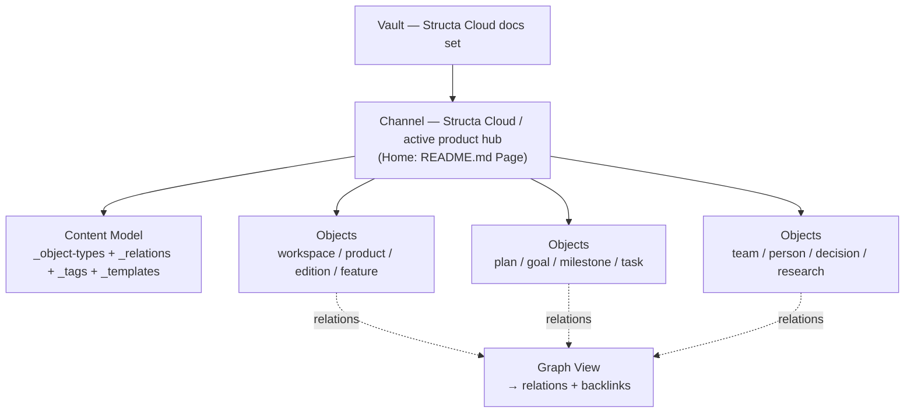

# Channel Structure — Vault → Channel → Objects

> **Description:** How the Structa Cloud Anytype knowledge graph maps onto Anytype's current container model — a **Vault** holding one or more **Channels** (a Channel is the workspace formerly called a Space), each with its own Objects, Sidebar, Members, and per-Channel Types and Properties under the **Content Model**.

## Why this exists

Anytype documentation (2026) organizes everything as **Vault → Channel → Object**:

- A **Vault** is the encrypted account container that holds every Channel.
- A **Channel** (also referred to as a Space) is one workspace inside the Vault — its own locked room with its own Objects, Sidebar, and Members.
- Every **Object** belongs to exactly one Channel. Types and Properties are scoped to the Channel they were created in; they do not leak into other Channels.

This repository's focused Anytype set (`docs/agenda/mono-repo/`) is imported as **one Channel** named after the workspace it serves (Structa Cloud / the active product hub). Each product group that needs isolation can be a separate Channel — Objects, Types, and Properties never cross Channel boundaries without an explicit export/import.

## Channel anatomy

| Anytype concept | Meaning | Where it maps in this repo |
|---|---|---|
| **Vault** | Account-level encrypted container of all Channels | The repository docs set (`docs/`) — one Vault for the company workspace |
| **Channel** | One isolated workspace (formerly "Space") | `docs/agenda/mono-repo/` import set — a single Structa Cloud Channel |
| **Home** | First Object members see on entry | `README.md` (Page Home) — the hub that links to every family |
| **Sidebar** | Channel-scoped navigation | `objects/_index.md`, `guides/_index.md`, and pinned hub objects |
| **Members** | People with roles in the Channel | `objects/people/*` linked from `objects/team.md` |
| **Content Model** | Channel Types + Properties | `objects/_object-types.md`, `objects/_relations.md`, `objects/_tags.md`, `objects/_templates.md` |
| **Graph** | Link-based view of the Channel's Objects | → relation links + Graph View connections in `objects/_relations.md` |

## Home types

Anytype lets a Channel choose what members see first. Pick by the Channel's job:

| Home | Best for | This repo's use |
|---|---|---|
| **Page** | Documentation, wikis, reference Channels | ✅ `README.md` — the Anytype hub entry point |
| **Collection** | Project Channels with mixed content | Optional per-product hubs that curate mixed feature/plan/task objects |
| **Chat** | Conversational Channels | Not used — no conversational Channel in this set |

## Structa Cloud Channel layout

## Roles and members

Anytype Channels have four roles; map repo teams to them so every object has a real owner:

| Anytype role | Privileges | Structa Cloud mapping |
|---|---|---|
| **Owner** | Everything + invite links + transfer ownership | Product/engineering lead (see `objects/team.md`) |
| **Admin** | Editor + manage Editors/Viewers | Product owner per hub |
| **Editor** | View + edit content | Engineers, designers, marketing owners |
| **Viewer** | Read-only | Stakeholders, advisors |

Keep `Person` objects minimal and private-safe: link `Person → Member Of → Team` and `Team → Lead → Person`; never store personal secrets in the knowledge graph.

## Importing this set as a Channel

1. Create the Channel (Channel name + icon; choose **Page** as Home).
2. Set `README.md` as the Homepage in **Channel Settings → General → Homepage**.
3. Build the Content Model from `objects/_object-types.md` (Types), `objects/_relations.md` (Relations), `objects/_tags.md` (Tags), and `objects/_templates.md` (Templates).
4. Invite members from `objects/people/*` and assign roles.
5. Import content Objects by family and assign their exact `Object type`.
6. Pin `objects/_index.md` and `guides/_index.md` to the Sidebar as Widgets/Links.

See `guides/pos-documentation-system.md` for the full import + writing method and the complete-document standard in `objects/_templates.md`.

## Flow compatibility (canonical paths in the Channel)

The repository's canonical flows are the Channel's relation backbone — follow them from evidence to delivery in Graph View:

- **Workspace** → Project → Product → Edition → Feature → Release
- **Workspace** → Plan → Goal → Milestone → Task → Sprint
- **Workspace** → Product → Campaign → Channel → Sales → Commerce
- **Workspace** → Product → Market Research → Decision
- **Workspace** → Team → Person → Owner / Lead / Contributor

Campaign, sales, commerce, social, team, and product-development work all use `Object type: Plan` with the right `Type` value so the graph stays small and discoverable.

## Related

- → `../README.md` — Anytype hub (Home page of the Channel)
- → `../objects/_object-types.md` — Content Model: Types and properties
- → `../objects/_relations.md` — Content Model: Relations and cardinality
- → `../objects/_templates.md` — Content Model: Object templates + complete-document design
- → `../objects/_status.md` — Content Model: Status view of the Channel
- → `pos-documentation-system.md` — Import and writing method
- → `../objects/team.md` — Members and roles
