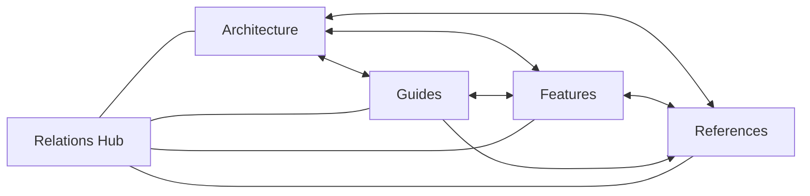

# Object Linking Guide

> Import Instruction: Use these relations in Anytype to link related documentation objects inside the Structa Cloud **Channel** (see `channel-structure.md`). Apply the "Object" property type with the specified relation name.

## Relation definitions

| Name | Type | Source → Target | Description |
|------|------|-----------------|-------------|
| Related Architecture | Object → Architecture | Any → Architecture | Links features/guides to architecture docs |
| Related Features | Object → Feature | Any → Feature | Links architectures/guides to feature docs |
| Related Guides | Object → Guide | Any → Guide | Links features/architectures to guides |
| Related References | Object → Reference | Any → Reference | Links features/guides to references |
| Depends On | Object → Task/Feature | Task → Task/Feature | Dependency chain for implementation |
| Implements | Object → Architecture | Guide → Architecture | A guide that implements an architecture |
| See Also | Object → Any | Any → Any | General cross-reference |

## Graph view connections

The relations hub (backlinks) connects the major object families:

| Element | Connected via |
|---------|---------------|
| Architecture | Related Features, Related Guides, Related References |
| Features | Related Architecture, Related References |
| Guides | Related Architecture, Related Features |
| References | Related Architecture, Related Guides |
| Relations Hub | Backlinks from all families |

## Usage in files

Each markdown file ends with a "Related Docs" section using → arrows to link related objects.

In Anytype, convert these → links to object relations by:

1. Opening the target document.
2. Adding a "Related Architecture" or "Related Features" property.
3. Linking it back to the source document.

## Related

- → `channel-structure.md` — Vault → Channel container model
- → `../objects/_relations.md` — Canonical relation names and cardinality
- → `../objects/_templates.md` — Complete-document design and templates
- → `../README.md` — Anytype hub
