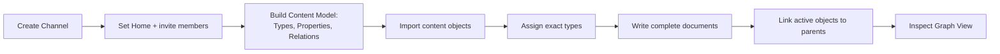

# Anytype Channel Documentation Method

> **Description:** Focused method for importing and maintaining a linked Structa Cloud **Channel** in Anytype (the container formerly called a Space). Repository plans remain the detailed engineering source; Anytype objects remain concise, navigable descriptions.
> **Container:** import into one Channel per active hub; every object below is created inside that Channel (see [`channel-structure.md`](./channel-structure.md)).

## Object model

| Type | Use for |
|---|---|
| Workspace | Portfolio or initiative hub |
| Project | Bounded initiative with an outcome and delivery boundary |
| Product | Customer-facing offering, positioning, editions, and proof |
| Edition | Current customer-facing tier and scope |
| Plan | Product, delivery, campaign, sales, commerce, social, team, or operating work |
| Team | Durable function or workstream with members and lead |
| Person | Individual owner, contributor, stakeholder, or author |
| Feature | Customer capability and outcome |
| Market Research | Evidence, assumptions, competitors, pricing, and validation |
| Integration | External service or marketing, sales, community, or partner channel |
| Tool | Named capability described by method and use case |
| Guide | Step-by-step operating or import method |

## Canonical workspace graph

- **Workspace** → Project → Product → Edition → Feature → Release
- **Workspace** → Project → Marketing Campaign → Channel
- **Workspace** → Project → Sales → Commerce
- **Workspace** → Project → Team → Person
- **Workspace** → Plan → Goal → Milestone → Task
- **Workspace** → Plan → Market Research → Decision

## Import method

1. Create the Structa Cloud **Channel** (Anytype container) and choose its Home — Page for docs hubs, Collection for mixed project hubs. See `channel-structure.md`.
2. Build the Channel's Content Model: create object types and properties from `../objects/_object-types.md`
3. Create shared tags from `../objects/_tags.md`
4. Create exact relation names from `../objects/_relations.md`
5. Import the focused hub, product, plan, team, and research objects
6. Assign each object its exact type; do not use a generic Workspace for every document
7. Write every imported file as a **complete document** (see `../objects/_templates.md` → Complete-document design): frontmatter, H1, one-line description, body, `## Related` links
8. Connect active content to its parent workspace, project, product, edition, plan, team, or evidence
9. Use Graph View to inspect the path from evidence to product decision, delivery, campaign, sale, and learning

## Writing method

- Every file is a **complete document**: frontmatter → H1 → one-line description → body → `Related` links (see `../objects/_templates.md`)
- Start with a one-sentence description
- Explain responsibility, method, boundary, and user/operator use case
- Prefer compact tables and acceptance outcomes
- Describe code only by its role; do not paste source implementations into Anytype objects
- Separate observed evidence from assumptions and validation questions
- Use minimal kebab-case names without `_c`, `_h`, `_r`, `copy`, or `untitled` duplicates
- End content objects with focused `Related` links
- Use plural relation names for multi-value properties: `Related Products`, `Related Plans`, `Related Teams`, `Related Channels`, and `Related Editions`
- Do not duplicate the Anytype container concept: a marketing/distribution "channel" is an `Integration` object; the Structa Cloud Channel is the container they all live in

## Go-to-market rules

- A campaign must identify audience, message, proof, offer, channel, KPI, owner, and status
- A sales plan must identify funnel stages, exit evidence, buyer context, handoff, and commercial terms
- An online-commerce plan must identify price or price hypothesis, tax, consent, fulfillment, refund, support, and renewal terms
- A social plan must give each channel a role, owner, moderation boundary, and success signal
- A product claim must link to research, a release, a pilot, or an approved repository claims-register entry

## Quality checklist

- Frontmatter includes `Object type`, `Tags`, and `Status`
- Every active object has an appropriate parent or owner relation
- Edition names match the canonical edition architecture
- Tool objects include a method and a use case
- Research identifies evidence and open validation questions
- Marketing and sales claims are labeled as evidence-backed or hypotheses
- Links resolve relative to the current file
- No implementation code is duplicated from repository plans
- No document duplicates an existing focused object

## Related

- → `../README.md` — Anytype documentation hub
- → `../objects/_object-types.md` — Object type definitions
- → `../objects/_relations.md` — Relation guide
- → `../objects/_tags.md` — Tag vocabulary
- → `../objects/_templates.md` — Object templates
- → `../architecture/editions.md` — Canonical edition boundaries
- → `../plans/project-workspace.md` — Workspace operating map
- → `../products/formint-pos.md` — Formint product description
