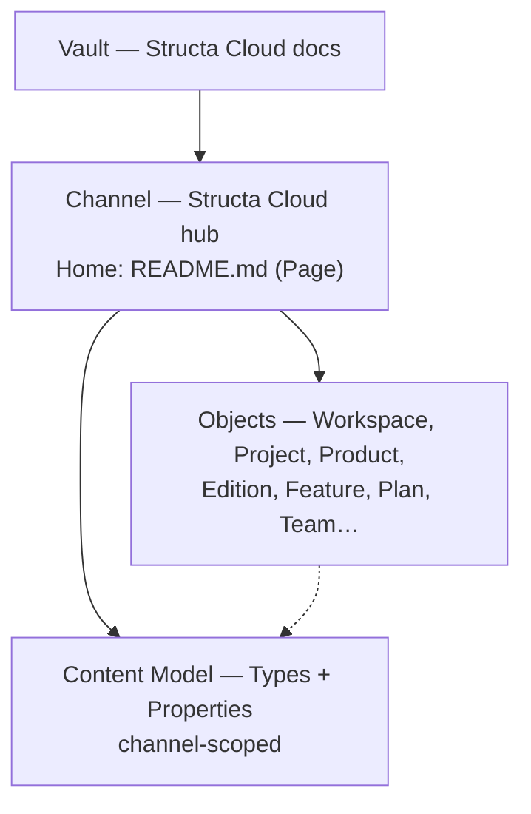

# Object Types — Knowledge Graph Schema

> **Import instruction:** Create these custom types in the Structa Cloud **Channel** (Anytype's container — formerly called a Space), then create the properties and relations described here. Every content object should have `Object type`, `Tags`, and `Status` frontmatter.

---

## 📂 Channel model (container)

Anytype (2026) organizes content as **Vault → Channels → Objects**:

- A **Vault** holds every Channel you own (the Structa Cloud docs set = one Vault).
- A **Channel** is an isolated workspace with its own Objects, Sidebar, Members, and its own **Types + Properties** under **Channel Settings → Content Model**. Objects, Types, and Properties never leak across Channels.
- A Channel picks a **Home** — Page (docs/wiki), Collection (project hub), or Chat.

This import set lives in one Channel named after the active hub (e.g. **Structa Cloud**). The `Workspace` object below is the hub object *inside* that Channel — it is not the container itself. Product groups that need isolation become separate Channels; do not duplicate shared Types there — create what the Channel needs.

See [`guides/channel-structure.md`](../guides/channel-structure.md) for the full container guide and role mapping.

---

## Core object types

### 🏗️ Architecture
**Description:** System architecture, data flow, and durable design decisions. Captures the technical foundation that guides all product development.

**Workflow:** Architecture decisions should be reviewed quarterly. Link to all affected features and guides. Use for ADRs (Architecture Decision Records).

**Tags:** `#architecture`, `#technical`, `#system-design`, `#adr`

**Properties:** `Status`, `Related Editions`, `Version`, `Related Features`, `Related Guides`, `Related Goals`, `Related Decisions`, `Tags`.

**Files:** `architecture/*.md`

---

### ✨ Feature
**Description:** Customer-facing capability with edition scope and delivery evidence. Each feature represents a specific value proposition for users.

**Workflow:** Features flow through: Planned → In Development → Testing → Complete. Link to goals for strategic alignment and milestones for delivery tracking.

**Tags:** `#feature`, `#capability`, `#user-value`, `#goal-[name]`, `#milestone-[name]`

**Properties:** `Status`, `Related Editions`, `Priority`, `Tags`, `Depends On`, `Implementation`, `Related Goals`, `Related Milestones`, `Related APIs`, `Related Products`.

**Files:** `features/*.md`

---

### 📖 Guide
**Description:** Step-by-step setup, development, deployment, customization, testing, migration, or troubleshooting method. Transforms knowledge into actionable instructions.

**Workflow:** Guides should be reviewed after each release. Link to architecture for context and features for scope. Target audience determines depth and prerequisites.

**Tags:** `#guide`, `#how-to`, `#tutorial`, `#setup`, `#documentation`

**Properties:** `Status`, `Category`, `Target Audience`, `Prerequisites`, `Related Architecture`, `Related Features`, `Part Of`.

**Files:** `guides/*.md`

---

### 📚 Reference
**Description:** API, CLI, database, configuration, i18n, schema, or SDK facts. Authoritative source for technical specifications.

**Workflow:** References are updated when APIs change. Link to architecture for context and features for usage examples. Version tracking ensures accuracy.

**Tags:** `#reference`, `#api`, `#specification`, `#technical`, `#documentation`

**Properties:** `Category`, `Related Editions`, `Version`, `Related Architecture`.

**Files:** `references/*.md`

---

### 📋 Changelog
**Description:** Version history, migration notes, breaking changes, and security updates. Maintains a clear record of product evolution.

**Workflow:** Changelogs are created for each release. Link to features for context and goals for strategic alignment. Migration notes help users upgrade.

**Tags:** `#changelog`, `#release`, `#version`, `#migration`, `#breaking-change`

**Properties:** `Version`, `Date`, `Related Editions`, `Type`, `Related Features`, `Related Goals`, `Related Milestones`, `Related Releases`.

**Files:** `changelogs/*.md`

---

### 📊 Diagram
**Description:** Flow, architecture, sequence, data model, or timeline visualization. Makes complex systems understandable through visual representation.

**Workflow:** Diagrams should be updated when architecture changes. Link to architecture for context and features for scope. Use for onboarding and documentation.

**Tags:** `#diagram`, `#visualization`, `#architecture`, `#flow`, `#documentation`

**Properties:** `Type`, `Related Editions`, `Related Docs`.

**Files:** `diagrams/*.md`

---

## Planning and workspace types

### 🏢 Workspace
**Description:** Portfolio or initiative hub object organizing projects, products, plans, research, channels, and teams. Lives **inside** the Structa Cloud Channel (the Anytype container — see [channel model](#-channel-model-container)). Import it as the Channel's Home Page when the workspace is the entry point.

**Workflow:** Workspaces are reviewed monthly. Link to all projects, products, and teams for visibility. Use for strategic planning and resource allocation.

**Tags:** `#workspace`, `#portfolio`, `#hub`, `#strategic`, `#organization`

**Properties:** `Status`, `Purpose`, `Emoji`, `Home Type` (Page/Collection/Chat when this object is the Channel Home), `Related Projects`, `Related Products`, `Related Plans`, `Related Research`, `Related Teams`, `Related Channels`, `Tags`.

**Files:** Hub and index pages.

---

### 🎯 Project
**Description:** Bounded initiative with an outcome, scope, milestones, delivery plans, and accountable owners. Projects have clear start and end dates.

**Workflow:** Projects follow: Planning → Active → Monitoring → Complete. Link to workspace for portfolio view and teams for accountability. Milestones track progress.

**Tags:** `#project`, `#initiative`, `#bounded`, `#outcome-driven`, `#milestone-[name]`

**Properties:** `Status`, `Start Date`, `End Date`, `Owner`, `Related Workspace`, `Related Products`, `Related Teams`, `Related Plans`, `Related Goals`, `Related Milestones`, `Related Features`, `Related Releases`, `Tags`.

**Files:** `projects/*.md` or project plans.

---

### 📝 Plan
**Description:** Product, roadmap, release, migration, development, marketing campaign, sales, commerce, social, team, or operating plan. Defines how work gets done.

**Workflow:** Plans are created for each initiative type. Link to goals for alignment and milestones for tracking. Progress updates keep teams informed.

**Tags:** `#plan`, `#strategy`, `#roadmap`, `#goal-[name]`, `#milestone-[name]`

**Properties:** `Status`, `Type`, `Start Date`, `End Date`, `Owner`, `Related Workspace`, `Related Project`, `Related Goals`, `Related Milestones`, `Related Tasks`, `Related Editions`, `Related Products`, `Related Campaigns`, `Related Channels`, `Related Teams`, `Tags`, `Progress`.

**Type options:** `Roadmap`, `Sprint`, `Release`, `Milestone`, `Quarterly`, `Annual`, `Migration`, `Technical`, `Architecture`, `Product`, `Marketing`, `Marketing Campaign`, `Sales`, `Commerce`, `Product Development`, `Social`, `Team`.

**Files:** `plans/*.md`.

---

### 🏆 Goal
**Description:** Strategic objective and measurable key results. Goals define what success looks like and guide all planning and execution.

**Workflow:** Goals are reviewed bi-weekly. Link to plans for execution and milestones for tracking. Key results provide measurable outcomes.

**Tags:** `#goal`, `#objective`, `#key-result`, `#strategic`, `#plan-[name]`, `#milestone-[name]`

**Properties:** `Status`, `Category`, `Priority`, `Target Date`, `Key Results`, `Related Editions`, `Related Features`, `Related Tasks`, `Related Milestones`, `Related Plans`, `Owner`, `Tags`.

---

### 🏁 Milestone
**Description:** Key checkpoint, release marker, or phase gate. Milestones represent significant achievements or decision points.

**Workflow:** Milestones are tracked weekly. Link to plans for context and goals for alignment. Tasks and features contribute to milestone completion.

**Tags:** `#milestone`, `#checkpoint`, `#phase-gate`, `#release-marker`, `#plan-[name]`, `#goal-[name]`

**Properties:** `Status`, `Due Date`, `Completed Date`, `Related Plans`, `Related Releases`, `Related Goals`, `Related Tasks`, `Related Features`, `Tags`.

---

### ✅ Task
**Description:** Actionable implementation or operating work. Tasks are the smallest units of work that contribute to milestones and goals.

**Workflow:** Tasks flow through: Backlog → In Progress → Done. Link to goals for purpose and milestones for context. Estimates help with capacity planning.

**Tags:** `#task`, `#action-item`, `#implementation`, `#goal-[name]`, `#milestone-[name]`

**Properties:** `Status`, `Priority`, `Related Editions`, `Assignee`, `Depends On`, `Related Goals`, `Related Milestones`, `Related Features`, `Related Sprints`, `Tags`, `Estimated Hours`, `Actual Hours`.

---

### 🔄 Sprint
**Description:** Time-boxed delivery cycle with goals, tasks, and retrospective. Sprints organize work into manageable iterations.

**Workflow:** Sprints run 1-2 weeks. Link to goals for focus and milestones for progress. Retrospectives improve team effectiveness.

**Tags:** `#sprint`, `#iteration`, `#time-boxed`, `#goal-[name]`, `#milestone-[name]`

**Properties:** `Status`, `Sprint Number`, `Start Date`, `End Date`, `Goals`, `Retrospective`, `Owner`, `Related Tasks`, `Related Goals`, `Related Milestones`, `Tags`.

---

## Product and organization types

### 📦 Product
**Description:** Customer-facing product description, positioning, pricing, editions, features, research, campaigns, and delivery ownership. The core offering.

**Workflow:** Products are reviewed monthly. Link to editions for scope and features for capabilities. Research validates positioning and pricing.

**Tags:** `#product`, `#offering`, `#positioning`, `#customer-facing`

**Properties:** `Status`, `Product Type`, `Positioning`, `Target Audience`, `Pricing`, `Related Editions`, `Related Features`, `Related Plans`, `Related Research`, `Related Campaigns`, `Related Teams`, `Owner`, `Related Project`, `Tags`.

---

### 🎚️ Edition
**Description:** Customer-facing tier with scope, audience, pricing tier, compatibility, and evidence. Editions define what customers get at each level.

**Workflow:** Editions are defined during product planning. Link to features for scope and research for validation. Excluded features set clear boundaries.

**Tags:** `#edition`, `#tier`, `#pricing`, `#scope`, `#customer-segment`

**Properties:** `Status`, `Version`, `Release Date`, `Related Features`, `Excluded Features`, `Target Audience`, `Pricing Tier`, `Compatibility`, `Related Goals`, `Related Research`, `Related Plans`, `Tags`.

---

### 👥 Team
**Description:** Durable product, engineering, marketing, sales, support, leadership, or partner group. Teams own delivery and operate on regular rhythms.

**Workflow:** Teams have weekly rhythms. Link to projects for accountability and products for ownership. Periodic tasks define operating cadence.

**Tags:** `#team`, `#group`, `#ownership`, `#delivery`, `#operating-rhythm`

**Properties:** `Status`, `Team Type`, `Mission`, `Members`, `Lead`, `Related Projects`, `Related Products`, `Related Plans`, `Related Campaigns`, `Periodic Tasks`, `Owner`, `Tags`.

**Each Team links recurring `Periodic Tasks`** (daily, weekly, bi-weekly, monthly, quarterly) that define the team's delivery, review, and operating rhythm.

---

### 👤 Person
**Description:** Individual owner, contributor, stakeholder, advisor, partner, or author. People are the human element of the knowledge graph.

**Workflow:** People are linked to teams, tasks, and decisions. Keep private personal data outside the knowledge graph. Use for accountability and collaboration.

**Tags:** `#person`, `#people`, `#individual`, `#contributor`, `#owner`

**Properties:** `Status`, `Role`, `Email`, `Member Of`, `Assigned Tasks`, `Owned Plans`, `Owned Products`, `Authored Posts`, `Made Decisions`, `Tags`.

---

## Evidence, delivery, and channel types

### 🔬 Market Research
**Description:** Evidence, assumptions, competitors, pricing hypotheses, and validation questions. Drives informed decision-making.

**Workflow:** Research is conducted before major decisions. Link to products for context and plans for application. Evidence supports or challenges assumptions.

**Tags:** `#market-research`, `#evidence`, `#validation`, `#competitor-analysis`, `#customer-insight`

**Properties:** `Status`, `Type`, `Related Editions`, `Related Products`, `Related Plans`, `Evidence`, `Validation Questions`, `Tags`.

---

### 🛠️ Tool
**Description:** Named product or platform tool described by responsibility, method, guardrails, and user use case. Tools enable capabilities.

**Workflow:** Tools are documented when introduced. Link to features for capability and plans for implementation. Methods define how tools are used.

**Tags:** `#tool`, `#utility`, `#method`, `#use-case`, `#capability`

**Properties:** `Status`, `Category`, `Related Editions`, `Related Features`, `Related Plans`, `Method`, `Use Case`, `Dependencies`, `Tags`.

---

### 🔗 Integration
**Description:** External service connector or social, community, commerce, partner, or delivery channel. Connects products to the outside world.

**Workflow:** Integrations are planned with features. Link to products for scope and teams for ownership. Auth types define security requirements.

**Tags:** `#integration`, `#connector`, `#external-service`, `#channel`, `#partner`

**Properties:** `Status`, `Category`, `Provider`, `Auth Type`, `Related Editions`, `Related Products`, `Related Features`, `Related Plans`, `Related Teams`, `Related APIs`, `Tags`.

**Category options:** `Payment`, `CRM`, `Email`, `SMS`, `Analytics`, `Auth`, `Storage`, `Social`, `Community`, `Commerce`, `Partner`, `Delivery`.

---

### 🧩 Component
**Description:** Reusable UI or business logic building block. Components are the atomic units of implementation.

**Workflow:** Components are created for reuse. Link to features for usage and styles for design. APIs expose component capabilities.

**Tags:** `#component`, `#reusable`, `#building-block`, `#ui`, `#logic`

---

### 📡 API
**Description:** REST endpoint, GraphQL query, WebSocket event, or webhook receiver. APIs define system interfaces.

**Workflow:** APIs are designed before implementation. Link to features for purpose and integrations for usage. Versioning ensures compatibility.

**Tags:** `#api`, `#endpoint`, `#interface`, `#contract`, `#integration`

---

### 🚀 Release
**Description:** Version release with features, fixes, deployment notes, and links to changelogs, milestones, and CI/CD pipelines.

**Workflow:** Releases follow: Planned → In Progress → Released. Link to features for scope and milestones for context. Changelogs document changes.

**Tags:** `#release`, `#version`, `#deployment`, `#milestone-[name]`

---

### 📜 Decision
**Description:** Architecture or product decision record (ADR). Captures the rationale behind choices.

**Workflow:** Decisions are recorded when made. Link to architecture for context and features for impact. Supersedes tracks decision evolution.

**Tags:** `#decision`, `#adr`, `#rationale`, `#choice`, `#architecture-decision`

---

### ⚙️ Pipeline
**Description:** CI/CD automation, deployment workflow, or build process. Enables consistent delivery.

**Workflow:** Pipelines are configured per project. Link to releases for deployment and components for build. Security scanning ensures quality.

**Tags:** `#pipeline`, `#ci-cd`, `#automation`, `#deployment`, `#build`

---

### 🎨 Style
**Description:** Design tokens, color palettes, typography scales, and brand guidelines. Defines visual identity.

**Workflow:** Styles are maintained centrally. Link to components for usage and themes for variants. Tokens ensure consistency.

**Tags:** `#style`, `#design-token`, `#brand`, `#visual-identity`, `#theme`

---

### 📝 Blog/Post
**Description:** Published content — tutorials, case studies, announcements, and technical articles. Communicates with the community.

**Workflow:** Posts follow: Draft → Review → Published. Link to features for context and goals for alignment. Authors take ownership.

**Tags:** `#blog`, `#post`, `#content`, `#tutorial`, `#announcement`

---

### 📄 Page
**Description:** General documentation page. Flexible container for structured content.

**Workflow:** Pages are organized by topic. Link to related objects for context. Use for documentation that doesn't fit other types.

**Tags:** `#page`, `#documentation`, `#content`, `#general`

---

### 💡 Note
**Description:** Quick thoughts, ideas, meeting minutes, and informal documentation. Lightweight captures for team communication.

**Workflow:** Notes are created as needed. Link to relevant objects for context. Convert to formal objects when they mature.

**Tags:** `#note`, `#thought`, `#idea`, `#meeting`, `#informal`

---

### 🔖 Bookmark
**Description:** External links and curated resources. Points to tools, libraries, and references outside the knowledge graph.

**Workflow:** Bookmarks are added when discovered. Link to features for relevance. Categories help with organization.

**Tags:** `#bookmark`, `#reference`, `#external`, `#resource`, `#link`

---

### ⚙️ Configuration
**Description:** Environment variables, build settings, database config, proxy setup, and deployment parameters. Defines system behavior.

**Workflow:** Configuration is documented per environment. Link to guides for setup and features for scope. Versioning tracks changes.

**Tags:** `#configuration`, `#config`, `#environment`, `#settings`, `#deployment`

---

## Story and knowledge types

### 📖 Story
**Description:** Founder journey and project narrative — chronological record of how a project started and evolved through technologies, experiments, products, packages, and platform decisions.

**Workflow:** Stories are updated as the journey progresses. Link to goals for achievements and plans for informed decisions. Phases mark major transitions.

**Tags:** `#story`, `#narrative`, `#journey`, `#founder`, `#history`

**Properties:** `Status`, `Author`, `Start Date`, `End Date`, `Phase`, `Related Goals`, `Related Plans`, `Related Products`, `Related Features`, `Related Decisions`, `Tags`.

**Phase options:** `Foundations`, `Experimentation`, `Platform`, `Suite`, `Enterprise`.

**Files:** `stories/*.md`.

---

## Data Analysis types

### 📈 Report
**Description:** Structured data analysis with methodology, findings, and recommendations. Provides actionable insights for decision-making.

**Workflow:** Reports follow: Data Collection → Analysis → Findings → Recommendations. Link to data sources for evidence and goals for alignment.

**Tags:** `#report`, `#analysis`, `#findings`, `#recommendations`, `#data-analysis`

**Properties:** `Status`, `Type`, `Methodology`, `Data Sources`, `Findings`, `Recommendations`, `Related Goals`, `Related Plans`, `Related Projects`, `Tags`.

**Type options:** `Sales`, `Marketing`, `Product`, `Financial`, `Operational`, `Technical`, `User Research`, `Market Analysis`.

---

### 📊 Dashboard
**Description:** Real-time or scheduled data visualization showing key metrics and performance indicators. Enables quick decision-making.

**Workflow:** Dashboards are updated automatically or manually. Link to data sources for accuracy and goals for context. Alerts notify of anomalies.

**Tags:** `#dashboard`, `#visualization`, `#real-time`, `#metrics`, `#kpis`

**Properties:** `Status`, `Type`, `Data Sources`, `Refresh Rate`, `Related Reports`, `Related Goals`, `Tags`.

**Type options:** `Executive`, `Operational`, `Analytical`, `Strategic`.

---

### 🔄 Data Pipeline
**Description:** Automated data movement and transformation from source to destination. Ensures data availability and quality.

**Workflow:** Pipelines are monitored for failures and performance. Link to data sources for lineage and reports for usage. Alerts notify of issues.

**Tags:** `#data-pipeline`, `#etl`, `#automation`, `#data-flow`, `#integration`

**Properties:** `Status`, `Type`, `Source`, `Destination`, `Transformations`, `Schedule`, `Related Reports`, `Related Dashboards`, `Tags`.

**Type options:** `Batch`, `Real-time`, `Streaming`, `Scheduled`, `Event-driven`.

---

### 📋 Methodology
**Description:** Analysis framework, approach, or standard used for data analysis. Ensures consistency and reproducibility.

**Workflow:** Methodologies are documented before analysis. Link to reports for application and training for team adoption. Reviews ensure effectiveness.

**Tags:** `#methodology`, `#framework`, `#standard`, `#best-practice`, `#analysis`

**Properties:** `Status`, `Category`, `Steps`, `Tools`, `Related Reports`, `Related Training`, `Tags`.

**Type options:** `Statistical`, `Qualitative`, `Quantitative`, `Mixed Methods`, `Agile`, `Lean`.

---

### 💡 Insight
**Description:** Discovered pattern, finding, or observation from data analysis. Drives recommendations and actions.

**Workflow:** Insights are validated before sharing. Link to reports for context and goals for impact. Actions track implementation.

**Tags:** `#insight`, `#finding`, `#pattern`, `#observation`, `#discovery`

**Properties:** `Status`, `Confidence`, `Impact`, `Related Reports`, `Related Goals`, `Related Actions`, `Tags`.

---

### 🎯 Recommendation
**Description:** Suggested action or improvement based on data analysis. Provides clear next steps for stakeholders.

**Workflow:** Recommendations are prioritized by impact and effort. Link to insights for rationale and goals for alignment. Actions track implementation.

**Tags:** `#recommendation`, `#action-item`, `#improvement`, `#priority`, `#next-steps`

**Properties:** `Status`, `Priority`, `Impact`, `Effort`, `Related Insights`, `Related Goals`, `Related Actions`, `Tags`.

---

## Monorepo Structure types

### 📁 Repository
**Description:** Single repository containing multiple projects, libraries, and shared code. Organizes code for collaboration and reuse.

**Workflow:** Repositories are organized by project type. Link to projects for ownership and documentation for onboarding. Branching strategies ensure quality.

**Tags:** `#monorepo`, `#repository`, `#codebase`, `#organization`, `#version-control`

**Properties:** `Status`, `Type`, `Structure`, `Related Projects`, `Related Libraries`, `Related Documentation`, `Tags`.

**Type options:** `Monorepo`, `Polyrepo`, `Multi-project`, `Shared Library`.

---

### 📦 Module
**Description:** Reusable code package or library within the repository. Enables code sharing and separation of concerns.

**Workflow:** Modules are versioned independently. Link to repositories for ownership and projects for usage. Documentation ensures adoption.

**Tags:** `#module`, `#library`, `#package`, `#reusable`, `#component`

**Properties:** `Status`, `Type`, `Version`, `Dependencies`, `Related Repositories`, `Related Projects`, `Related Documentation`, `Tags`.

**Type options:** `Library`, `Package`, `Plugin`, `Extension`, `Tool`.

---

### 🔧 Tool
**Description:** Development tool, utility, or script that enhances productivity. Automates repetitive tasks and enforces standards.

**Workflow:** Tools are documented with usage examples. Link to repositories for location and projects for adoption. Updates track improvements.

**Tags:** `#tool`, `#utility`, `#script`, `#automation`, `#productivity`

**Properties:** `Status`, `Type`, `Usage`, `Related Repositories`, `Related Projects`, `Related Documentation`, `Tags`.

**Type options:** `CLI`, `Script`, `Formatter`, `Linter`, `Generator`, `Tester`.

---

### 📚 Documentation
**Description:** Project documentation, guides, and reference materials. Enables onboarding and knowledge sharing.

**Workflow:** Documentation is updated with code changes. Link to repositories for location and projects for context. Reviews ensure accuracy.

**Tags:** `#documentation`, `#guides`, `#reference`, `#onboarding`, `#knowledge`

**Properties:** `Status`, `Type`, `Audience`, `Related Repositories`, `Related Projects`, `Related Guides`, `Tags`.

**Type options:** `README`, `Guide`, `API Reference`, `Tutorial`, `Architecture`, `Changelog`.

---

### ⚙️ Configuration
**Description:** Project configuration files, settings, and environment variables. Defines build, test, and deployment behavior.

**Workflow:** Configuration is version-controlled. Link to repositories for location and projects for scope. Changes are reviewed and tested.

**Tags:** `#configuration`, `#settings`, `#environment`, `#build`, `#deployment`

**Properties:** `Status`, `Type`, `Environment`, `Related Repositories`, `Related Projects`, `Related Documentation`, `Tags`.

**Type options:** `Build`, `Test`, `Deploy`, `Environment`, `IDE`, `CI/CD`.

---

## Lifecycle values

Use these lifecycle values consistently across all object types:

| Value | Meaning |
|-------|---------|
| `Draft` | Being prepared, not yet active |
| `Active` | Current and being used |
| `Planned` | Approved direction, not delivered |
| `In Development` | Actively being built |
| `Completed` | Finished historical work |
| `Published` | Released and available |
| `Archived` | Preserved but no longer active |
| `Deprecated` | Replaced; link the replacement |
| `Cancelled` | No longer planned |
| `Superseded` | Replaced by newer version |

---

## Import checklist

1. Create types and properties.
2. Create tags from `_tags.md`.
3. Create relations from `_relations.md`.
4. Import focused objects and assign exact types.
5. Link workspace → project → product → plan → team/person and evidence.
6. Validate links and use Graph View.

---

## Team collaboration workflow

### Daily rhythm
- **Tasks:** Check assigned tasks, update status, log blockers
- **Sprints:** Review sprint board, standup updates

### Weekly rhythm
- **Team sync:** Review progress, identify blockers, plan next week
- **Goal check:** Track key results, adjust priorities
- **Milestone review:** Assess progress toward phase gates

### Bi-weekly rhythm
- **Sprint review:** Demo completed work, gather feedback
- **Retrospective:** Identify improvements, adjust processes
- **Goal alignment:** Ensure team goals align with product strategy

### Monthly rhythm
- **Product review:** Assess product health, roadmap progress
- **Team capacity:** Evaluate workload, adjust assignments
- **Research review:** Validate assumptions, update evidence

### Quarterly rhythm
- **Strategic planning:** Set goals, define milestones
- **Architecture review:** Assess technical debt, plan improvements
- **Market research:** Validate positioning, update competitive landscape

---

## Product organization workflow

### Product definition
1. Create Product object with positioning and target audience
2. Define Editions with scope and pricing
3. Link Features to editions
4. Connect to Research for evidence

### Product planning
1. Create Goals with measurable key results
2. Define Plans for execution
3. Set Milestones for tracking
4. Break down into Tasks

### Product delivery
1. Organize work into Sprints
2. Track progress through Milestones
3. Release features incrementally
4. Document changes in Changelogs

### Product optimization
1. Gather Market Research
2. Analyze user feedback
3. Adjust positioning and pricing
4. Plan next iteration

---

## Data analysis workflow

### Data collection
1. Identify data sources
2. Define data requirements
3. Set up data pipelines
4. Validate data quality

### Data analysis
1. Choose methodology
2. Clean and transform data
3. Perform analysis
4. Document findings

### Insight generation
1. Identify patterns and trends
2. Validate findings
3. Quantify impact
4. Prioritize insights

### Recommendation development
1. Link insights to goals
2. Assess feasibility
3. Estimate impact
4. Define actions

### Reporting and communication
1. Create reports and dashboards
2. Present findings to stakeholders
3. Track implementation
4. Measure outcomes

---

## Monorepo organization workflow

### Repository structure
1. Define project boundaries
2. Organize by domain or feature
3. Set up shared libraries
4. Configure build and test

### Code management
1. Establish branching strategy
2. Implement code review
3. Enforce coding standards
4. Automate quality checks

### Documentation
1. Create README files
2. Write API documentation
3. Document architecture
4. Maintain changelogs

### Release management
1. Version modules independently
2. Coordinate cross-project releases
3. Automate publishing
4. Track dependencies

---

## Team collaboration patterns

### Cross-team coordination
- Use Workspace for portfolio visibility
- Link Projects to multiple Teams
- Share Plans across Teams
- Coordinate through Milestones

### Knowledge sharing
- Document decisions in Decision objects
- Create Guides for common processes
- Maintain References for technical specs
- Share Notes for informal communication

### Accountability
- Assign Owners to all objects
- Link Teams to Projects and Products
- Track Tasks to specific People
- Review progress through Milestones
