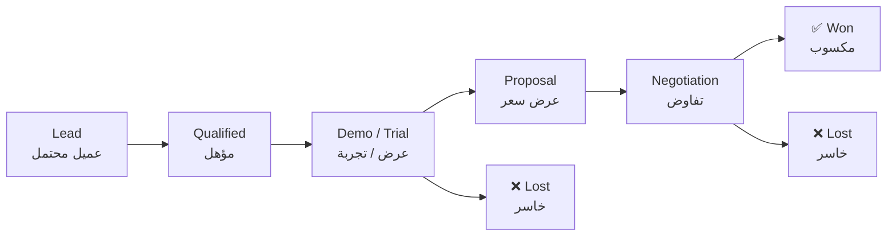

# 👥 Sales Pipeline — Leads & Deal Tracking

> **English:** The leads fact table of the agenda's star schema. Every
> potential customer is one object here, moving left-to-right through the
> pipeline. Targets come from [`pricing-plans.md`](./pricing-plans.md);
> what we may say to a lead comes from [`marketing-plans.md`](./marketing-plans.md).
>
> **العربية:** جدول العملاء المحتملين في المخطط النجمي للأجندة. كل عميل محتمل
> كائن واحد هنا يتحرك في خط البيع من اليسار إلى اليمين. الأهداف من
> [`pricing-plans.md`](./pricing-plans.md)؛ وما يُسمح قولُه للعميل من
> [`marketing-plans.md`](./marketing-plans.md).
>
> **Last updated:** 2026-09-10 · **Owner:** Sales / Founder

---

## 1. Pipeline stages

**English.** Six stages; a lead sits in exactly one at any time. The exit
columns record the outcome so lost deals teach us something.

**العربية.** ست مراحل؛ يقع العميل في واحدة منها في أي لحظة. أعمدة الخروج تسجّل
النتيجة حتى تعلّمنا من الصفقات الخاسرة.

| Stage | Meaning | Owner action |
|---|---|---|
| **Lead** | Contact captured, interest unconfirmed | Log source, add one-line need |
| **Qualified** | Need + budget + timing confirmed | Book demo or send trial |
| **Demo / Trial** | Seeing the product | Schedule follow-up before closing the call |
| **Proposal** | Price + scope sent | Confirm decision date |
| **Negotiation** | Terms being discussed | Get sign-off path in writing |
| **✅ Won** | Contract signed, account created | Add onboarding task to [`task-tracking.md`](./task-tracking.md) |
| **❌ Lost** | Chose no / no decision | Record reason — always |

---

## 2. Targets (12-month, from pricing-plans)

**English.** The pipeline is measured against these numbers only.

| Product / Edition | Target accounts | Current in pipeline | Gap |
|---|---:|---:|---:|
| Formint Standard | 60 | 0 | 60 |
| Formint Professional | 30 | 3 (pilot) | 27 |
| Formint Cloud | 5 | 0 | 5 |
| Precis LMS — Instructor Pro | — (awaiting launch gates) | 0 | — |
| Loop-CRM | — (deploy-gated) | 0 | — |

**العربية.** يقاس خط البيع بهذه الأرقام فقط: قياسي 60، احترافي 30، سحابي 5
(عملاء خلال 12 شهراً). خطط Precis وLoop-CRM تنتظر بوابات إطلاقها قبل البيع
النشط.

---

## 3. Active pipeline

**English.** Seeded 2026-09-10 from activity already recorded elsewhere in the
agenda (pilot, marketplace listing, landing-page leads). Update in place; never
delete a lead — move it to § 4.

**العربية.** بُذرت في 2026-09-10 من نشاط مسجَّل مسبقاً في الأجندة (التجربة،
وقائمة السوق، وعملاء صفحة الهبوط). حدّث في المكان؛ لا تحذف عميلاً أبداً —
انقله إلى § 4.

| Lead | Product / Edition | Stage | Source | Owner | Next step | Since |
|---|---|---|---|---|---|---|
| Pilot restaurant 1 (offline-first) | Formint Professional | Demo / Trial | Pilot (3 restaurants) | TBD | Convert pilot → paid on launch (2026-Q4) | 2026-09 |
| Pilot restaurant 2 (offline-first) | Formint Professional | Demo / Trial | Pilot (3 restaurants) | TBD | Convert pilot → paid on launch (2026-Q4) | 2026-09 |
| Pilot restaurant 3 (offline-first) | Formint Professional | Demo / Trial | Pilot (3 restaurants) | TBD | Convert pilot → paid on launch (2026-Q4) | 2026-09 |
| ThemeForest browsers | Formint Standard | Lead | Marketplace listing | TBD | Publish listing, capture inquiries | Q4 2026 |
| Precis Landing visitors | Precis LMS | Lead | Landing-page lead capture | TBD | Nurture until enrollment opens | ongoing |

> **English.** All three pilot restaurants are the single most valuable
> pipeline asset — they convert into the first paying Professional accounts and
> produce the evidence that unblocks the offline-first claim.
>
> **العربية.** مطاعم التجربة الثلاثة هي أثمن أصل في خط البيع — تتحول إلى أولى
> حسابات الاحترافي المدفوعة وتنتج الدليل الذي يفتح ادعاء «العمل دون اتصال
> أولاً».

---

## 4. Closed / lost log

**English.** Nothing closed or lost yet — the board is young. Every future
entry here must carry a **reason** (price, timing, competitor, no decision);
reasons are the raw material for pricing and positioning fixes.

**العربية.** لا شيء مكسوب أو خاسر بعد — اللوحة حديثة. كل مدخل مستقبلي هنا يجب
أن يحمل **سبب** (سعر، توقيت، منافس، لا قرار)؛ الأسباب هي المادة الخام لإصلاح
التسعير والتموضع.

| Date | Lead | Product | Outcome | Reason |
|---|---|---|---|---|
| — | — | — | — | — |

---

## 5. Lead sources & generation steps

**English.** Where leads may come from, and the next step to open each tap.
A source without a working capture path is a wish, not a channel.

**العربية.** من أين يأتي العملاء المحتملون، والخطوة التالية لفتح كل مصدر.
المصدر بلا مسار التقاط حقيقي أمنية لا قناة.

| Source | Feeds | Current state | Next step |
|---|---|---|---|
| Restaurant pilots (3) | Professional | Running | Conversion offer at launch gate |
| ThemeForest listing | Standard | Not live | Publish listing + support funnel |
| Precis Landing lead capture | LMS | Live | Nurture sequence after enrollment opens |
| `crm.structa.cloud` demo | Loop-CRM | Demo-ready, deploy-gated | Post-deploy demo outreach |
| GitHub / community (Formint Community) | Standard upsell | Live | Add "upgrade" path in README |
| Restaurant forums / MENA operator groups | All Formint | Untapped | Arabic-first content per marketing-plans |

---

## 6. Weekly rhythm

**English.** The pipeline review takes 15 minutes: update stages, update the
targets gap table, pick the single next action per open deal, and log any
decision in [`team-notes.md`](./team-notes.md).

**العربية.** تستغرق مراجعة خط البيع 15 دقيقة: حدّث المراحل، وحدّث جدول فجوة
الأهداف، واختر الخطوة التالية الواحدة لكل صفقة مفتوحة، وسجّل أي قرار في
[`team-notes.md`](./team-notes.md).

1. Stage changes → move rows, never duplicate
2. Gap table → recount "Current in pipeline"
3. One next action per open deal, with a date
4. Lost deals → § 4 with a reason

---

## Remarks & Notes

- One lead = one row; the pipeline is a fact table, not a diary — keep entries crisp
- Every lead carries an owner and a next step with a date; otherwise it is not in the pipeline, it is in a wish list
- Conversion targets always trace to [`pricing-plans.md`](./pricing-plans.md) — never invent numbers here
- When Formint Professional's launch gates close (marketing-plans), the three pilot rows become the first Won entries

<!-- AI-generated: review needed -->
